<h1>AWS Notes</h1>

<h3>Contents</h3>

1. [Related concepts](./_concepts/concepts.md)
1. [AWS Regions](./awsRegion/AWSRegion.md)
2. [Identity and Access Management - IAM](./iam/IAM.md)
3. [EC2](./ec2/EC2.md)
4. [Load balancing](./loadBalancing/loadBalancing.md)
5. [EC2 instance storage](./instanceStorage/instanceStorage.md)
6. [Relation database service - RDS](./rds/RDS.md)
7. [Route 53](./route53/route53.md)
7. [VPC](./vpc/VPC.md)
7. [S3](./s3/S3.md)
7. [CloudFront](./cloudfront/CloudFront.md)
7. [Docker container management (ECS, ECR & Fargate)](./dockerContainerManagement/dockerContainerManagement.md)
7. [Elastic beanstalk](./elasticBeanstalk/elasticBeanstalk.md)
7. [AWS CI/CD](./awsCICD/awsCICD.md)
7. [CloudFormation](./cloudFormation/cloudFormation.md)

<h2>AWS Monitoring, Troubleshooting & Audit</h2>
**CloudWatch**
* Metrics: Collect and track key metrics
  * CloudWatch provides metrics for every service in AWS
  * Metric is a variable to monitor (CPUUtilization, NetworkIn etc.)
  * Metrics belong to namespaces
  * Dimension is an attribute of a metric (instance id, environment etc.)
  * Up to 10 dimensions per metric
  * Metrics have timestamps
  * Can create CloudWatch dashboards of metrics
  * EC2 detailed monitoring
    * EC2 instance metrics have metrics "every 5 minutes"
    * With detailed monitoring (for a cost), you get data "every 1 minute"
    * Use detailed monitoring if you want to scale faster for your ASG!
    * The AWS Free Tier allows us to have 10 detailed monitoring metrics
    * Note: EC2 memory usage is by default not pushed (must be pushed from
    inside the instance as a custom metric)
  * Custom metrics
    * Possibility to define and send your own custom metrics to CloudWatch
    * Example: memory (RAM) usage, disk space, number of logged-in users etc.
    * Use API call PutMetricData
    * Ability to use dimensions (attributes) to segment metrics
      * Instance.id
      * Environment.name
    * Metric resolution (StorageResolution API parameter - two possible values):
      * Standard: 1 minute (60 seconds)
      * Higher resolution: 1/5/10/30 seconds - higher cost
    * Important: accepts metric data points two weeks in the past and two hours
    in the future (make sure to configure your EC2 instance time correctly)
* Logs: Collect, monitor, analyze, and store log files
  * Applications can send logs to CloudWatch using the SDK
  * CloudWatch can collect logs from:
    * Elastic Beanstalk: collection of logs from application
    * ECS: collection from containers
    * AWS Lambda: collection from function logs
    * VPC flow logs: VPC specific logs
    * API Gateway
    * CloudTrail based on filter
    * CloudWatch log agents: for example on EC2 machines
    * Route 53: Log DNS queries
  * CloudWatch logs can go to:
    * Batch exporter to S3 for archival
    * Stream to ElasticSearch cluster for further analytics
  * CloudWatch logs can use filter expressions
  * Logs storage architecture:
    * Log groups: arbitrary name, usually representing an application
    * Log stream: instances within application/log files/containers
  * Can define log expiration policies (never expire, 30 days, etc.)
  * Using the AWS CLI we can tail CloudWatch logs
  * To send logs to CloudWatch, make sure IAM permissions are correct
  * Security: encryption of logs at rest using KMS at the group level
* Events: send notifications when certain events happen in your AWS
* Alarms: React in real-time to metrics/events
* CloudWatch Agent
  * By default, no logs go from your EC2 machine to CloudWatch
  * You need to run a CloudWatch agent on EC2 to push the log files
  you want
  * Make sure IAM permissions are correct
  * The CloudWatch log agent can be setup on-premises too
  * CloudWatch Logs Agent & Unified Agent
    * For virtual servers (EC2 instances, on-promise servers etc.)
    * CloudWatch Logs Agent
      * Old version of the agent
      * Can only send to CloudWatch Logs
    * CloudWatch Unified Agent
      * Collect additional system-level metrics such as RAM, processes, etc.
      * Collect logs to send to CloudWatch logs
      * Centralized configuration using SSM Parameter Store
      * Metrics
        * Collected directly on your Linux server/EC2 instance
        * CPU (active, guest, idle, system, user, steal)
        * Disk metrics (free, used, total), Disk IO (writes, reads, bytes, iops)
        * RAM (free, inactive, used, total, cached)
        * Netstat (number of TCP and UDP connections,  net packets, bytes)
        * Processes (total, dead, blocked, idle, running, sleep)
        * Swap space (free, used, used %)
* CloudWatch Logs Metric Filter
  * CloudWatch logs can use filter expressions
    * For example, find a specific IP inside a log
    * Or count occurrences of "Error" in your log
    * Metric filters can be used to trigger alarms once a certain
    threshold has been reached
  * Filters do not retroactively filter data. Filters only publish the metric
  data points for events that happen after the filter was created.
* CloudWatch Alarms
  * Alarms are used to trigger notifications for any metric
  * Various options (sampling, %, max, min, etc.)
  * Alarm states:
    * OK
    * INSUFFICIENT_DATA
    * ALARM
  * Period
    * Length of time in seconds to evaluate the metric
    * High resolution custom metrics: 10 sec, 30 sec, or multiples of 60 sec
  * Alarm targets
    * EC2 - stop, terminate, reboot, or recover an EC2 instance
    * EC2 auto scaling - trigger auto scaling action
    * SNS - send notifications to SNS (from which you can do pretty much anything)
  * Good to know:
    * Alarms can be created based on CloudWatch logs metrics filters
    * To test alarms and notifications, set the alarm state to Alarm using CLI
    `aws cloudwatch set-alarm-state --alarm-name "myalarm" --state-value
      ALARM --state-reason "testing purposes"`
* CloudWatch Events (now EventBridge)
  * Event pattern: intercept events from AWS services (Sources)
    * Example sources: EC2 instance start, CodeBuild Failure, S3, Trusted Advisor
    * Can intercept any API call with CloudTrail integration
  * Schedule or cron (example: create an event every 4 hours)
  * A JSON payload is created from the event and passed to a target, which can be:
    * Compute: Lambda, Batch, ECS task
    * Integration: SQS, SNS, Kinesis Data Streams, Kinesis Data Firehose
    * Orchestration: Step functions, CodePipeline, CodeBuild
    * Maintenance: SSM, EC2 actions
* CloudWatch EventBridge
  * EventBridge is the next evolution of CloudWatch Events
  * Amazon EventBridge vs CloudWatch Events
    * Amazon EventBridge builds upon and extends CloudWatch Events
    * It uses the same service API and endpoint, and the same 
    underlying service infrastructure
    * EventBridge allows extension to add event buses for your
    custom applications and your third-party SaaS apps
    * EventBridge has the Schema Registry capability
    * EventBridge has a different name to mark the new capabilities
    * Over time, the CloudWatch Events name will be replaced with 
    EventBridge
  * CloudWatch has a single bus, but EventBridge has multiple
  * Default event bus: generated by AWS services (CloudWatch Events)
  * Partner event bus: receive events from other SaaS service or applications
    (Zendesk, DataDog, Segment, Auth0, etc.)
  * Custom event buses: for your own applications
  * Event buses can be accessed by other AWS accounts
  * Rules: how to process the events (similar to CloudWatch Events)
  * Schema Registry
    * EventBridge can analyze the events in your bus and infer the
    schema
    * The Schema Registry allows you to generate code for your 
    application, that will know in advance how data is structured
    in the event bus
    * Schema can be versioned

**AWS X-Ray**
* Troubleshooting application performance and errors
* Distributed tracing of microservices
* Debugging in production, the good old way
  * Test locally
  * Add log statements everywhere
  * Re-deploy in production
* Log formats differ across applications using 
CloudWatch and analytics is hard
* Debugging: monolith 'easy', distributed services 'hard'
* No common views of your entire architecture
* X-Ray gives a visual analysis of your applications
* X-Ray advantages
  * Troubleshooting performance (bottlenecks)
  * Understand dependencies in a microservice architecture
  * Pinpoint service issues
  * Review request behavior
  * Find errors and exceptions
  * Are we meeting time SLA?
  * Where am I throttled?
  * Identify users that are impacted by your errors
* X-Ray compatibility
  * AWS Lambda
  * Elastic Beanstalk
  * ECS
  * ELB
  * API Gateway
  * EC2 instances or any application server (event on-promise)
* X-Ray leverages tracing
* Tracing is an end to end way of following a request
* Each component dealing with the requests adds its own trace
* Tracing is made of segments (+ subsegments)
* Annotations can be added to traces to provide extra information
* Ability to trace:
  * Every request
  * Sample request (as a % for example or a rate per minute)
* X-Ray security:
  * IAM for authorization
  * Can use KMS encryption at rest
* How to enable?
  * Your code must import the AWS X-Ray SDK
    * Very little code modification needed
    * The application SDK will the capture:
      * Calls to AWS services
      * HTTP/HTTPS requests
      * Database calls (MySQL, PostgreSQL, DynamoDB)
      * Queue calls (SQS)
  * Install the X-Ray daemon or enable X-Ray AWS integration
    * X-Ray daemon works as a low level UDP packet interceptor
      (Linux/Windows/Mac)
    * AWS Lambda/other AWS services already run the X-Ray 
    daemon for you
    * Each application must have the IAM rights to write data to
    X-Ray
      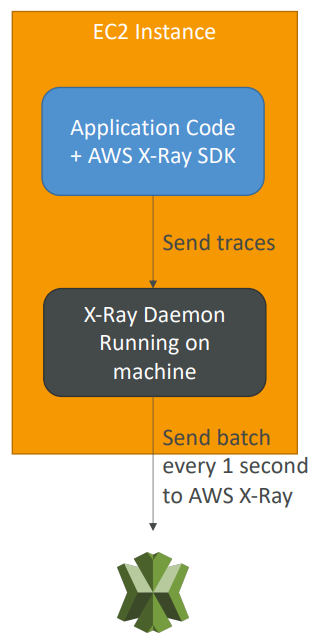
* X-Ray service collects data from all the different services
* Service map is computed from all the segments and traces
* X-Ray is graphical, so even non-technical people can help
troubleshoot
* Troubleshooting
  * If X-Ray is not working on EC2
    * Ensure the EC2 IAM role has the proper permissions
    * Ensure the EC2 instance is running the X-Ray Daemon
  * To enable on AWS Lambda:
    * Ensure it has an IAM execution role with proper policy
    (AWSX-RayWriteOnlyAccess)
    * Ensure that X-Ray is imported in the code
* X-Ray instrumentation in your code
  * Instrumentation means the measure of a product's performance,
  diagnose errors, and to write trace information. It's a field 
  in software development to do all these things.
  * To instrument your application code, you use the X-Ray SDK
  * You can modify your application code to customize and annotate
  the data that the SDK sends to X-Ray, using interceptors, filters,
  handlers, middleware etc.
* X-Ray Concepts
  * Segments - each application/service will send them
  * Subsegments - if you need more details in your segments
  * Trace - all the segments collected together to form an end-to-end trace
  * Sampling - decrease the amount of requests sent to X-Ray to reduce cost
    * With sampling rules, you control the amount of data that you record. The more
    data you send, the more you'll pay.
    * You can modify sampling rules without changing your code.
    * By default, the X-Ray SDK records the first request each second, and
    five percent of any additional requests.
    * One request per second is the reservoir, which ensures that at least one
    trace is recorded each second as long as the service is serving requests.
    * Five percent is the rate at which additional requests beyond the reservoir 
    size are sampled
    * You can create your own rules with the reservoir and rate.
    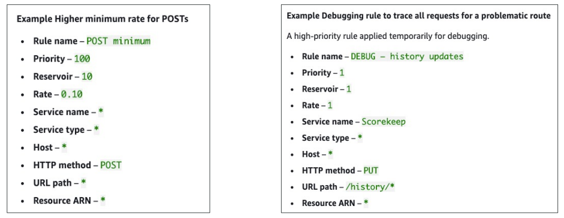
  * Annotations - key-value pairs used to index traces and use with filters
  * Metadata - key-value pairs, not indexed, not used for searching
  * The X-Ray daemon/agent has a config to send traces cross account:
    * make sure the IAM permissions are correct - the agent will assume the role
    * this allows to have a central account for all your application tracing
* Write APIs (used by the X-Ray daemon)
  * arn:aws:iam::aws:policy/AWSXrayWriteOnlyAccess
    * PutTraceSegments - uploads segment documents to AWS X-Ray
    * PutTelemetryRecords - used by the AWS X-Ray daemon to upload 
    telemetry. Helps with the metrics
      * SegmentsReceivedCount, SegmentsRejectedCounts, BackendConnectionErrors etc.
    * GetSamplingRules - retrieve all sampling rules (to know what/when to send)
    * GetSamplingTargets & GetSamplingStatisticSummaries - advanced
    * The X-Ray daemon needs to have an IAM policy authorizing the correct
    API calls to function correctly
      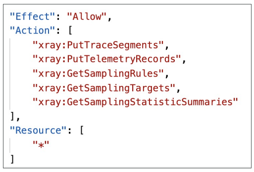
  * arn:aws:iam::aws:policy/AWSXrayReadOnlyAccess
    * GetServiceGraph - main graph
    * BatchGetTraces - retrieves a lost of traces specified by ID.
    Each trace is a collection of segment documents that originates
    from a single request.
    * GetTraceSummaries - retrieves IDs and annotations for traces 
    available for a specified time frame using an optional filter. 
    To get the full traces, pass the trace IDs to BatchGetTraces
    * GetTraceGraph - retrieves a service graph for one or more
    specific trace IDs.
    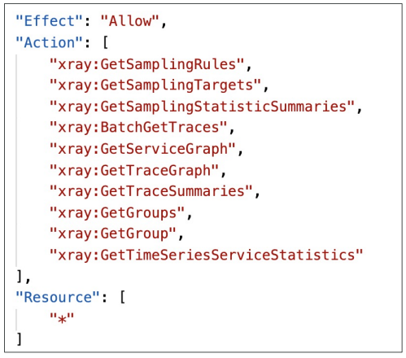
* X-Ray with elastic beanstalk
  * AWS Elastic Beanstalk platforms include the X-Ray daemon
  * You can run the daemon by setting an option in the Elastic Beanstalk
  console or with a configuration file (in .ebextensions/xray-daemon.config)
  * Make sure to give your instance profile the correct IAM permissions so that
  the X-Ray daemon can function correctly. Then make sure your application 
  code is instrumented with the X-Ray SDK. 
  * Note: The X-Ray daemon is not provided for Multicontainer Docker
* ECS + X-Ray integration options
  * ECS Cluster X-Ray container as a daemon. Run the X-Ray daemon container in each EC2 instance.
  * ECS Cluster X-Ray container as a "side car". Run one X-Ray daemon container alongside each app
  container. 
  * Fargate cluster X-Ray container as a "side car". Same as for ECS, except you don't have EC2 instances.
    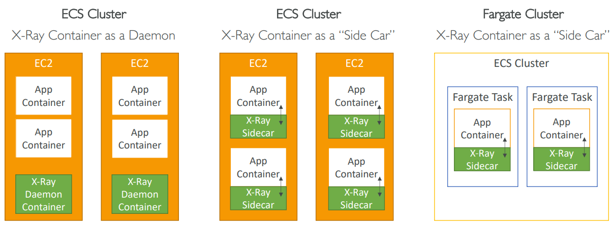

**AWS CloudTrail**
* Internal monitoring of API calls being made
* Audit changes to AWS resources by your users
* Provides governance, compliance, and audit for your AWS account
* CloudTrail is enabled by default
* Get a history of events/API calls made within your AWS account by:
  * Console
  * SDK
  * CLI
  * AWS Services
* Can put logs from CloudTrail into CloudWatch logs or S3
* A trail can be applied to all regions (default) or a single region
* If a resource is deleted in AWS, investigate CloudTrail first
* CloudTrail Events
  * Management events:
    * Operations that are performed on resources in your AWS account
    * Examples:
      * Configuring security (IAM AttachRolePolicy)
      * Configuring rules for routing data (Amazon EC2 CreateSubnet)
      * Setting up logging (AWS CloudTrail CreateTrail)
    * By default, trails are configured to log management events
    * Can separate read events (that don't modify resources) 
    from write events (that may modify resources)
  * Data events:
    * By default, data events are not logged (because of high volume operations)
    * Amazon S3 object-leve activity (ex. GetObject, DeleteObject, PutObject):
    can separate Read and Write events
    * AWS Lambda function execution activity (the Invoke API)
  * CloudTrail Insights
    * Enable CloudTrail Insights to detect unusual activity in your account:
      * inaccurate resource provisioning
      * hitting service limits
      * Bursts of AWS IAM actions
      * Gaps in periodic maintenance activity
    * CloudTrail Insights analyzes normal management events to create a baseline,
    and then continuously analyzes write events to detect unusual patterns
      * Anomalies appear in the CloudTrail console
      * Event is sent to Amazon S3
      * An EventBridge event is generated (for automation needs)
* CloudTrail Events Retention
  * Events are stored for 90 days in CloudTrail
  * To keep events beyond this period, log them to S3 and use Athena

<h2>AWS Integration & Messaging</h2>
** Amazon SNS - Simple notification service**
* What if you want to send one message to many receivers?
  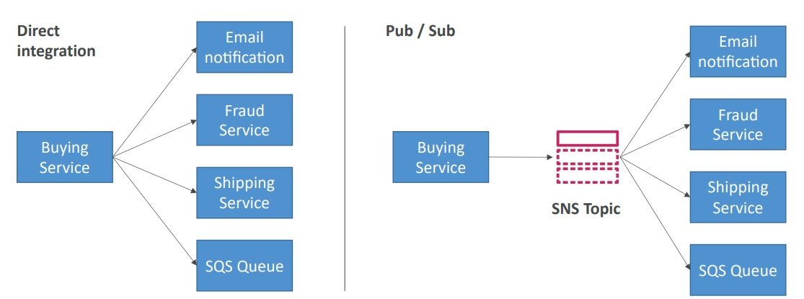
* The event producer only sends a message to one SNS topic
* As many event receivers (subscriptions) as we want to listen to the SNS
topic notifications
* Each subscriber to the topic will get all the messages (note: new 
  feature to filter messages)
* Up to 10,000,000 subscriptions per topic
* 100,000 topics limit
* Subscribers can be:
    * SQS
    * HTTP/HTTPS (with delivery retries - how many times)
    * Lambda
    * Emails
    * SMS messages
    * Mobile notifications
* Many AWS services can send data directly to SNS for notifications:
  CloudWatch (for alarms), Auto scaling groups notifications,
  Amazon S3 (on bucket events), CloudFormation (upon state changes =>
  failed to build etc.) etc.
* How to publish
    * Topic publish (using the SDK)
        * Create a topic
        * Create a subscription (or many)
        * Publish to the topic
    * Direct publish (for mobile apps SDK)
        * Create a platform application
        * Create a platform endpoint
        * Publish to the platform endpoint
        * Works with Google GCM, Apple APNS, Amazon ADM etc.
* Security
    * Encryption
        * In-flight encryption using HTTPS API
        * At-rest encryption using KMS keys
        * Client side encryption if the client wants to perform encryption/decryption
        itself
    * Access controls - IAM policies to regulate access to the SNS API
    * SNS access policies (similar to S3 bucket policies)
        * Useful for cross-account access to SNS topics
        * Useful for allowing other services (S3 etc.) to write to an SNS topic
* FIFO topic
    * First in first out (ordering of messages in the topic)
    * Similar features as SQS FIFO
        * Ordering by message group ID (all messages in the same group
          are ordered)
        * Deduplication using a deduplication ID or content based deduplication
    * Can only have SQS FIFO queues as subscribes
    * Limited throughput (same throughput as SQS FIFO)
* Message filtering
    * JSON policy used to filter messages sent to SNS topic's subscriptions
    * If a subscription doesn't have a filter policy, it receives every message
      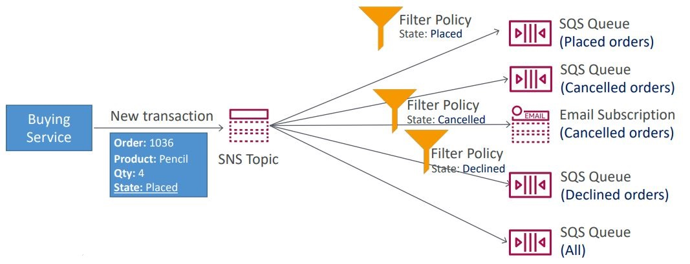

**Amazon SQS - Standard queue**
* Oldest offering (over 10 years old)
* Fully managed service, used to decouple applications
* Attributes
  * Unlimited throughput, unlimited number of messages in queue
  * Messages are short-lived - default retention of messages is 4 day,
  maximum of 14 days
  * Low latency (<10 ms on publish and receive)
  * Limitation of 256 kb per message sent
* Can have duplicate messages (at least once delivery, occasionally)
* Can have out of order messages (best effort ordering)
* Producing messages
  * Produced to SQS using the SDK (SendMessage API)
  * The message is persisted in SQS until a consumer deletes it
  * Message retention default 4 days, up to 14 days
  * Example: send an order to be processed
    * Order id
    * Customer id
    * Any attributes you want
  * SQS standard: unlimited throughput
* Consuming messages
  * Consumers (running on EC2 instances, servers, or AWS lambda etc.)
  * Poll SQS for messages (receive up to 10 messages at a time)
  * Process the messages (example: insert the message into an RDS DB)
  * Delete the messages using the DeleteMessage API
* Multiple EC2 instance consumers
  * Consumers receive and process messages in parallel
  * At least once delivery
  * Best-effort message ordering
  * Consumers delete messages after processing them
  * We can scale consumers horizontally to improve throughput of processing
* SQS with ASG
  * Use a CloudWatch Metric of queue length to decide whether new instances are needed
    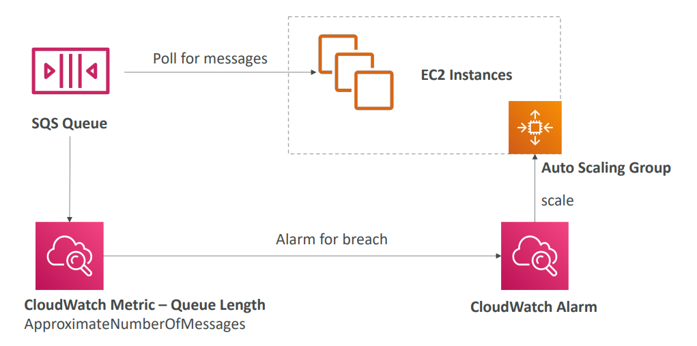
* SQS to decouple between application tiers
  * E.g. video processing might take very long, so it's easier to delegate it to
  another app that's attached to a queue.
    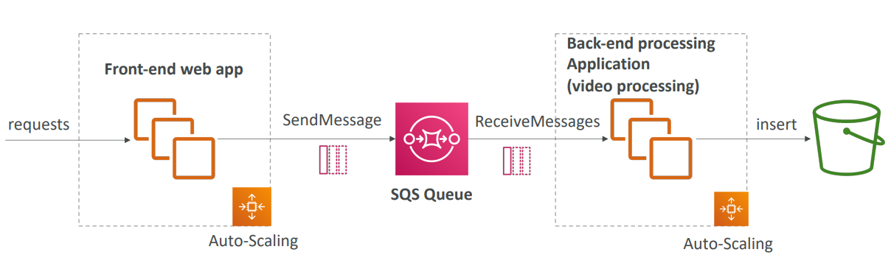
* Amazon SQS - Security
  * Encryption:
    * In-flight encryption using HTTPS API
    * At-rest encryption using KMS keys
    * Client-side encryption if the client wants to perform
    encryption/decryption itself
  * Access controls: IAM policies to regulate access to the SQS API
  * SQS access policies (similar to S3 bucket policies)
    * Useful for cross-account access to SQS queues
    * Useful for allowing other services (SNS, S3, etc.) to write 
    to an SQS queue
* SQS - Message Visibility Timeout
    * After a message is polled by a consumer, it becomes invisible
    to other consumers
    * By default, the "message visibility timeout" is 30 seconds
    * That means the message has 30 seconds to be processed
    * After the message visibility timeout is over, the message is 
    "visible" in SQS
    * If a message is not processed within the visibility timeout, it
    will be processed twice
    * If the consumer knows that the processing will take longer, then 
    it can call the ChangeMessageVisibility API to get more time
    * If visibility timeout is high (hours), and the consumer crashes,
    then re-processing will take a lot of time due to the message being
    invisible
    * If visibility timeout is too low (seconds), we may get duplicate
    processing
    * So the visibility timeout should be set to something reasonable for
    your application
* Dead Letter Queue
    * If a consumer fails to process a message within the Visibility Timeout
    then the message goes back to the queue
    * We can get a threshold of how many times a message can go back to
    the queue
    * After the MaximumReceives threshold is exceeded, the message goes into
    a dead letter queue (DLQ)
    * Useful for debugging
    * Make sure to process the messages in the DLQ before they expire:
        * Good to set a retention of 14 days in the DLQ
    * It's another queue that you create with the purpose of being a DLQ.
    You then go back to your initial queue and specify that a DLQ is enabled,
    after that you specify the dead letter queue ARN.
* Delay queue
    * Delay a message (consumers don't see it immediately) up to 15 minutes
    * Default is 0 seconds (message is available right away)
    * Can set a default at queue level
    * Can override the default on send using the DelaySeconds parameter
* Long polling
    * When a consumer requests messages from the queue, it can optionally
    "wait" for messages to arrive if there are none in the queue. This is
    called long polling.
    * Long Polling decreases the number of API calls made to SQS while 
    increasing the efficiency and latency of your application
    * The wait time can be between 1 sec to 20 sec (20 sec preferable)
    * Long polling is preferable to short polling (which is constant querying)
    * Long polling can be enabled at the queue level or at the API level
    using WaitTimeSeconds
* Extended client
    * Message size limit is 256 KB, how to send large messages, e.g. 1 GB?
    * Using the SQS Extended Client (Java library)
    * It uses an S3 bucket for large data
    * Small metadata message will be sent to the queue and the file itself
    will be uploaded to S3.
      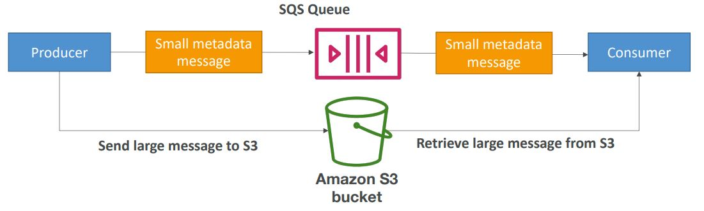
* Must know API
    * CreateQueue - creates a queue. MessageRetentionPeriod can be used to
    set how long a message should be kept in the queue
    * DeleteQueue - deletes a queue and all the messages in the queue at the
    same time
    * PurgeQueue - deletes all the messages in the queue
    * SendMessage - to send messages. Use the DelaySeconds to set a delay for
    the message.
    * ReceiveMessage - to do polling
    * DeleteMessage - to delete a message
    * MaxNumberOfMessages - how many messages a consumer can receive at one
    time. The default is set to 1. Maximum can be 10 (for ReceiveMessage API)
    * ReceiveMessageWaitTimeSeconds - for long polling. Tells the consumer how
    long to wait before getting a response from the queue.
    * ChangeMessageVisibility - change the message timeout in case you need
    more time to process the message.
    * Batch APIs can be used for SendMessage, DeleteMessage, ChangeMessageVisibility
    to help decrease the number of API calls and thus the cost.
* FIFO queue
    * FIFO - first in first out (ordering of messages in the queue)
    * Since we are guaranteeing the order, then there is limited throughput
    at 300 messages/second without batching, 3000 messages/second with
    * Exactly once send capability (by removing duplicates).
    * Messages are processed in order by the consumer
    * Deduplication
        * Deduplication interval is 5 minutes. So if you send a duplicate
        message within that window, then that duplicate message will be
        refused.
        * Two de-duplication methods:
            * Content based deduplication - will do an SHA-256 hash of the
            message body.
            * Explicitly provide a message deduplication ID.
    * Message grouping
        * If you specify the same value of MessageGroupID in an SQS FIFO
        queue, you can only have one consumer, and all the messages are
        in order for that one consumer.
        * To get ordering at the level of a subset of messages, specify 
        different values for MessageGroupID
            * Messages that share a common Message Group ID will be in 
            order within the group.
            * Each group can have a different consumer (parallel processing)
            * Ordering across groups is not guaranteed
* Ordering data in SQS
    * For SQS standard, there is no ordering.
    * For SQS FIFO, if you don't use a group ID, messages are consumed in the order
    they are sent, with only one consumer.
    * You want to scale the number of consumers, but you want messages to be "grouped"
    when they are related to each other. Then you use a Group ID (similar to partition key
      in Kinesis)

** SNS + SQS: Fan out ** 
* Push once to SNS, receive in all SQS queues that are subscribers.
  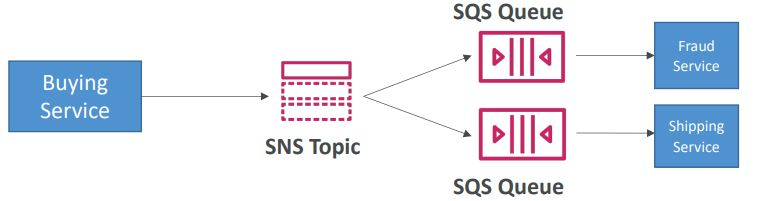
* It's a fully decoupled model and there is no data loss.
* SQS allows for data persistence, delayed processing and retries of work
* Ability to add more SQS subscribers over time
* Make sure your SQS queue access policy allows for SNS to write
* Application: S3 events to multiple queues
    * For the same combination of event type (e.g. object create) and
    prefix (e.g. images/), you can only have one S3 event rule
    * If you want to send the same S3 event to many SQS queues, use fan-out
      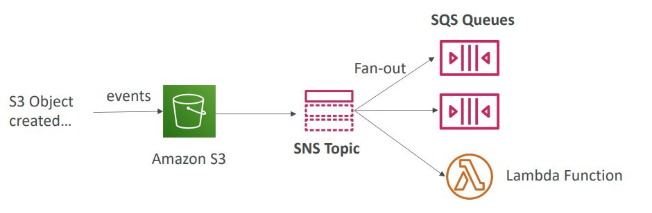
* SNS FIFO + SQS FIFO: Fan out
    * In case you need fan out + ordering + deduplication

**Kinesis**
* Makes it easy to collect, process, and analyze streaming data in real-time
* Ingest real-time data such as application logs, metrics, website clickstreams,
IoT telemetry data etc.
* Kineses data streams - capture, process, and store data streams
    * Stream big data
    * Stream consists of shards that you have to provision ahead of time. 
    Can scale the number of shards.
    * Partition key determines which shard will the data go to. Data blob
    is the data itself
    * The speed is 1 MB/sec per shard or 1000 messages/sec per shard. So 
    if you have 6 shards, then 6 MB/sec or 6000 messages/sec
    * Billing is per shard provisioned, can have as many shards as you want
    * Retention between 1 day (default) to 365 days. It's not meant to be
    a durable data store, it's just meant to have data streamed through it.
    * Ability to reprocess (replay) data
    * Once data is inserted in Kinesis, it can't be deleted (immutability)
    * Data that shares the same partition goes to the same shard (ordering)
      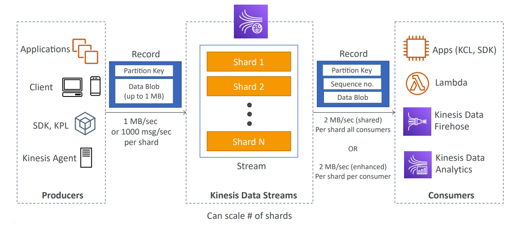
    * Producers: AWS SDK, Kinesis Producer Library (KPL), Kinesis Agent
        * Puts data records into data streams
        * Data record consist of
            * Sequence number (unique per partition-key within shard)
            * Partition key (must specify while putting records into stream)
            * Data blob (up to 1 MB)
        * Producers:
            * AWS SDK: simple producer
            * Kinesis producer library (KPL): C++, Java, batch, compression, retries
            * Kinesis agent: monitor log files
        * Write throughput: 1 MB/sec or 1000 records/sec per shard
        * PutRecord API is used to send data into Kinesis
        * Use batching with PutRecords API to reduce costs & increase throughput
        * So the way that producers work is as follows. We specify a partition key.
        The partition key is put into a hash function to determine a shard key. This
        chooses into which shard to send the data, not the producer. But all the
        data that shares the same partition key goes into the same shard, however,
        you can't specify which shard it goes into. You have to make sure that you choose
        a partition key that is distributed enough. If one device is extremely chatty, then
        it might overwhelm a shard. So use a highly distributed partition key to avoid 
        "hot partition".
          
        * ProvisionedThroughputExceeded error
            * If you go over the 1 MB/sec limit to a shard, then you'll get a
            ProvisionedThroughputExceeded error. The solution is to use a highly
            distributed partition key.
            * Implement retries with exponential backoff
            * Increase number of shards (scaling)
              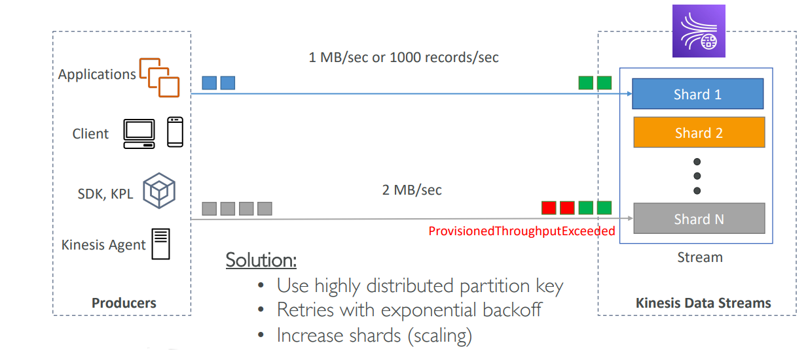
    * Consumers: Write your own with Kinesis Client Library (KCL), AWS SDK,
    or use a managed one with AWS Lambda, Kinesis Data Firehose, Kinesis Data
    Analytics.
        * Get data records from data streams and process them
        * AWS Lambda
            * Supports classic and enhanced fan-out consumers
            * Read records in batches
            * Can configure batch size and batch window
            * If error occurs, Lambda retries until succeeds or data expired
            * Can process up to 10 batches per shard simultaneously
        * Kinesis data analytics
        * Kinesis data firehose
        * Custom consumer (AWS SDK) - classic or enhanced fan-out
            * Classic
                * In shared (classic) you get 2 MB/sec per shard across all consumers.
                So what that means is that you can have multiple consumers behind one shard.
                All of those consumers will be sharing the 2 MB/sec pipe among each other.
                So if you have 3 consumers, then they'd all get ~667 KB/sec.
                * Also called the pull model.
                * Shared is good when you have a low number of consuming applications.
                * Read throughput 2 MB/sec per shard across all consumers
                * Max 5 GetRecords API calls/sec
                * Latency ~200 ms
                * Minimize cost
                * Consumers poll data from Kinesis using GetRecords API call
                * Returns up to 10 MB (then throttle for 5 seconds) or up to 10000 records
            * Enchanced 
                * Enhanced fan-out consumer allows for 2 MB/sec per consumer per shard. The
                pipe is not shared.
                * Also known as the push model.
                * Multiple consuming applications for the same stream.
                * 2 MB/sec per consumer per shard
                * Latency ~70 ms
                * Higher cost
                * Kinesis pushes data to consumers over HTTP/2 (SubscribeToShard API)
                * Soft limit of 5 consumer applications (KCL) per data stream (default).
                Can open a ticket to AWS to increase the size.
                  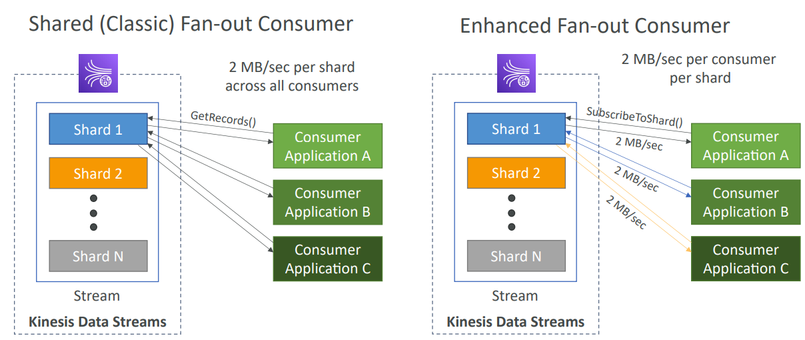
        * Kinesis client library (KCL) - library to simplify reading from data stream
            * You have to do manual name specifying for consuming and such when using the
            SDK, but KCL abstracts a lot of that away for you.
            * A Java library that helps read record s from a Kinesis Data Stream with
            distributed applications sharing the read workload
            * Each shard is to be read by only one KCL instance
                * 4 shards = max 4 KCL instances
                * 6 shards = max 6 KCL instances
            * Progress is checkpointed into DynamoDB of how far into reading the 
            data they are (needs IAM access)
            * Track other workers and share the work among shards using DynamoDB
            * KCL can run on EC2, Elastic Beanstalk, and on-premises
            * Records are read in order at the shard level
            * KCL versions:
                * KCL 1.x (supports shared consumer)
                * KCL 2.x (supports shared & enhanced fan-out consumer)
                  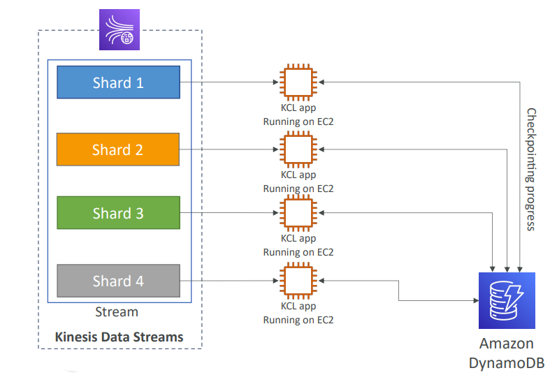
    * Control access/authorization using IAM policies
    * Encryption in flight using HTTPS endpoints
    * Encryption at rest using KMS
    * You can implement encryption/decryption of data on client side (harder)
    * VPC endpoints available for Kinesis to access within VPC to avoid going
    there through the public internet.
    * Monitor API calls using CloudTrail
    * Shard splitting
        * Used to increase the stream capacity (1 MB/s data in per shard)
        * Used to divide a "hot shard"
        * The old shard is closed and will be deleted once the data is expired
        * No automatic scaling (manually increase/decrease capacity)
        * Cannot split into more than two shards in a single operation
        * Increase capacity and cost
    * Merging shards
        * Decrease the stream capacity and save costs
        * Can be used to group two shards with low traffic (cold shards)
        * Old shards are closed and will be deleted once the data is expired
        * Can't merge more than two shards in a single operation
        * Decrease capacity and cost
* Kinesis data firehose - load data streams into AWS data stores
    * Fully managed service, no administration, automatic scaling, serverless
    * Can send data into:
        AWS: Redshift, Amazon S3, ElasticSearch
        3rd party partners: Splunk, MongoDB, DataDog, NewRelic etc.
        Custom destinations to any HTTP endpoint
    * Pay for data going through Firehose
    * Near real time
        * 60 seconds latency minimum for non-full batches
        * Or minimum 32 MB of data at a time
    * Supports many data formats, conversions, transformations, compression
    * Supports custom data transformations using AWS Lambda
    * Can send failed or all data to a backup S3 bucket
      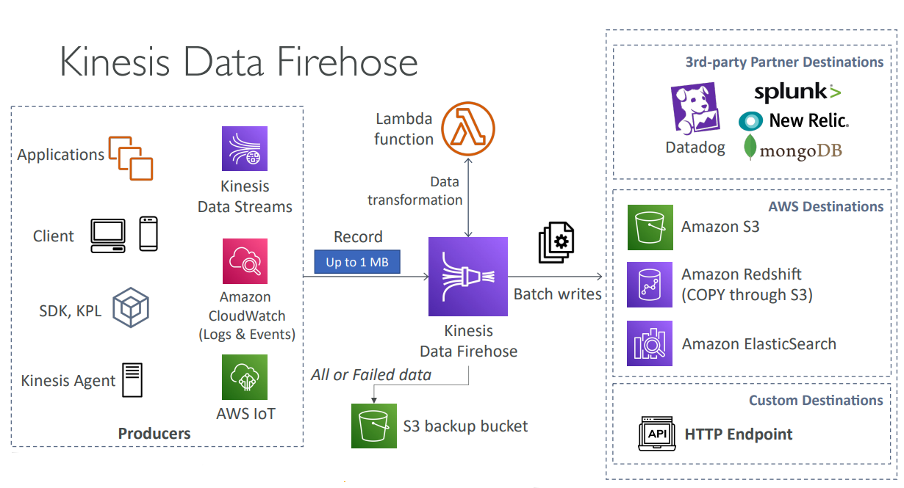
* Kinesis data analytics - analyze data streams with SQL or Apache Flink
    * The point of it is to do stream processing using SQL. 
    * Perform real-time analytics on Kinesis Streams using SQL
    * Fully managed, no servers to provision
    * Automatic scaling
    * Real-time analytics
    * Pay for actual consumption rates
    * Can create streams out of the real-time queries
    * Use cases:
        * Time-series analytics
        * Real-time dashboards
        * Real-time metrics
          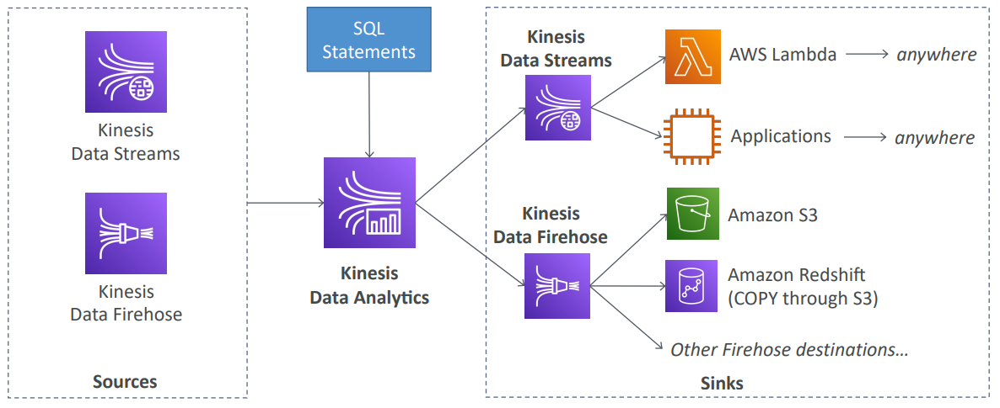
* Kinesis video streams - capture, process, and store video streams
* Ordering data into Kinesis
    * Imagine you have 100 trucks (truck_1, truck_2, ... truck_100) on the road
    sending their GPS positions regularly into AWS. You want to consume the 
    data in order for each truck, so that you can track their movement accurately.
    How should you send that data into Kinesis?
    * Answer: send using a "Partition key" value of the "truck_id". The same key
    will always go to the same shard.
      
      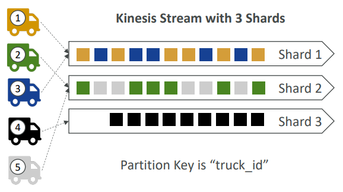
      
      
**Kinesis vs SQS ordering**
* 100 trucks, 5 kinesis shards, 1 SQS FIFO
* Kinesis data streams
    * On average you'll have 20 trucks per shard
    * Trucks will have their data ordered within each shard
    * The maximum amount of consumers in parallel we can have is 5
    * Can receive up to 5 MB/s of data
* SQS FIFO
    * You only have one SQS FIFO queue
    * You will have 100 Group IDs
    * You can have up to 100 consumers (due to the 100 group ID)
    * You can have up to 300 messages per second (or 3000 if using batching)
  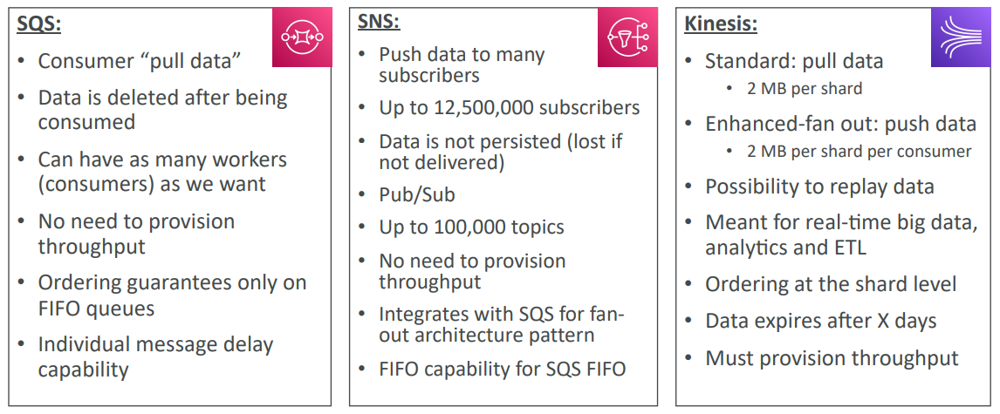

<h2>AWS Lambda</h2>
Serverless is a new paradigm in which the developers don't have to manage servers anymore. 
They just deploy code. They just deploy functions. Initially serverless meant function as a service.
Now it means a lot more. Serverless was pioneered by AWS Lambda, but now also includes anything 
that's managed. E.g. databases, messaging, storage etc. Serverless does not mean there are no 
servers. It just means that you don't manage/provision/see them.

Serverless in AWS includes:
* AWS Lambda
* DynamoDB
* AWS Cognito
* AWS API Gateway
* Amazon S3
* AWS SNS & SQS
* AWS Kinesis Data Firehose
* Aurora Serverless
* Step functions
* Fargate

**AWS Lambda**
* Virtual functions - no servers to manage
* Limited by time - short executions
* Run on demand
* Scaling is automated
* Benefits
  * Easy pricing:
    * Pay per request and compute time
    * Free tier of 1,000,000 AWS Lambda requests and 400,000 GBs of compute time
  * Integrated with the whole AWS suite of services. Some main ones are:
    * API Gateway - to create a REST API that'll invoke our lambdas
    * Kinesis - to do some data transformations on the fly
    * DynamoDB - to create some triggers, so whenever something happens in our DB a lambda function will
    be triggered
    * S3 - a lambda function will be created on file event. Ex. a new file is created
    * CloudFront
    * CloudWatch Events EventBridge - whenever events happen in our infrastructure and we want to react to it
    * CloudWatch Logs - to stream these logs to wherever we want
    * SNS - to react to notifications in our SNS topic
    * SQS - to process messages in our SQS
    * Cognito - to react to whenever a user logs into your database
  * Integrated with many programming languages
  * Easy monitoring through AWS CloudWatch
  * Easy to get more resources per function (up to 10 GB of RAM)
  * Increasing RAM will also improve CPU and network
* Language support: Node.js, Python, Java, C#, Golang, Ruby, Custom Runtime API (community supported, example Rust) 
  * Lambda container image
    * The container image must implement the Lambda runtime API
    * ECS/Fargate is preferred for running arbitrary Docker images
* Lambda is very cheap to run
  * Pay per calls:
    * First 1,000,000 requests are free
    * $0.20 per 1 million requests thereafter ($0.0000002 per request)
  * Pay per duration: (in increment of 1 ms)
    * 400,000 GB-seconds of compute time per month if FREE
    * == 400,000 seconds if function is 1 GB RAM
    * == 3,200,000 seconds if function is 128 MB RAM
    * After that $1.00 for 600,000 GB-seconds
* Synchronous invocations happen through CLI, SDK, API Gateway, Application Load Balancer
  * This means that the results are returned right away
  * Error handling must happen on the client side (retries, exponential backoff, etc.)
  * Synchronous invocation services:
    * User invoked:
      * Elastic Load Balancing (Application Load Balancer)
      * Amazon API Gateway
      * Amazon CloudFront (Lambda@Edge)
      * Amazon S3 Batch
    * Service invoked:
      * Amazon Cognito
      * AWS Step Functions
    * Other services:
      * Amazon Lex
      * Amazon Alexa
      * Amazon Kinesis Date Firehose
  * To expose a Lambda function as an HTTP(S) endpoint, you can use the Application Load
  Balance (or an API Gateway). The Lambda function must be registered in a target group.
  * ALB Multi-Header values
    * ALB can support multi header values (ALB setting)
    * When you enable multi-value headers, HTTP headers and query string parameters that are 
    sent with multiple values are shown as arrays within the AWS Lambda event and response
    objects.
* Asynchronous invocations
  * S3, SNS, CloudWatch Events etc.
  * The events are placed in an Event Queue. Lambda tries to read the events from the Event
  Queue.
  * Lambda attempts to retry on errors.
    * 3 tries total. 1 minute wait after 1st, then 2 minutes wait.
    * Make sure the processing is idempotent (in case of retries the result is the same)
    * If the function is retried, you will see duplicate log entries in CloudWatch logs
    * Can define a DLQ (dead-letter queue) - SNS or SQS - for failed processing (need correct
    IAM permissions.)
    * Asynchronous invocations allow you to speed up the processing if you don't need to wait
    for the result (ex: you need 1000 files processed)
* Event source mapping
  * Kinesis Data Streams
  * SQS & SQS FIFO queue
  * DynamoDB streams
  * Common denominator: records need to be polled from the source
  * The lambda function is invoked synchronously
  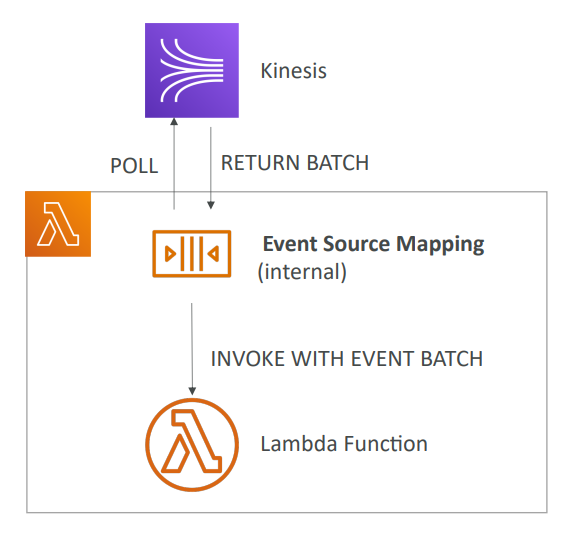
  * Streams & Lambda (Kinesis & DynamoDB)
    * An event source mapping creates an iterator for each shard, processes items in order
    * Start with new items, from the beginning or from timestamp
    * Processed items aren't removed from the stream (other consumers can read them)
    * If you have low traffic: use batch window to accumulate records before processing
    * For high traffic you can process multiple batches in parallel
      * Up to 10 batches per shard
      * In-order processing is still guaranteed for each partition key
      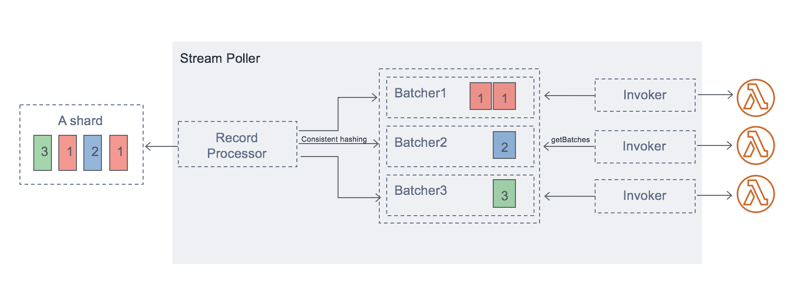
    * Error handling
      * By default, if your function returns an error, the entire batch is reprocessed until
      the function succeeds, or the items in the batch expire
      * To ensure in-order processing, processing for the affected shard is paused until the
      error is resolved
      * You can configure the event source mapping to:
        * discard old events
        * restrict the number of retries
        * split the batch on error (to work around Lambda timeout issues)
      * Discarded events can go to a Destination
  * Event source mapping SQS & SQS FIFO
    * Event source mapping will poll SQS (long polling)
    * Specify batch size (1 - 10 messages)
    * Recommended: set the queue visibility timeout to 6x the timeout of your Lambda function
    * To use a DLQ set-up on the SQS queue, not Lambda (DLQ for Lambda is only for async invocations)
    * Or use lambda destination for failures
* Queues & Lambda
  * Lambda also supports in-order processing for FIFO (first-in, first-out) queues, scaling up to the
  number of active message groups.
  * For a standard queue, items aren't necessarily processed in order.
  * Lambda scales up to process a standard queue as quickly as possible.
  * When an error occurs, batches are returned to the queue as individual items and might be processed
  in a different grouping than the original batch.
  * Occasionally, the event source mapping might receive the same item from the queue twice, even if
  no function error occurred.
  * Lambda deletes items from the queue after they're processed successfully.
  * You can configure the source queue to send items to a dead-letter queue if they can't be processed.
* Lambda event mapper scaling
  * Kinesis data streams & DynamoDB streams
    * One lambda invocation per stream shard
    * If you use parallelization, up to 10 batches processed per shard simultaneously
  * SQS standard
    * Lambda adds 60 more instances per minute to scale up
    * Up to 1000 batches of message processed simultaneously
  * SQS Fifo
    * Messages with the same GroupID will be processed in order
    * The lambda function scales to the number of active message groups
* Destinations
  * Can configure to send result to a destination
  * Asynchronous invocations - can define destinations for successful and failed event:
    * Amazon SQS
    * Amazon SNS
    * AWS Lambda
    * Amazon EventBridge bus
  * AWS recommends you use destinations instead of DLQ now (but both can be used at the same time)
  * Event source mapping for discarded event batches send to:
    * Amazon SQS
    * Amazon SNS
  * You can send events to a DLQ directly from SQS
* Lambda execution role (IAM role)
  * Grants the Lambda function permissions to AWS service/resources
  * Sample managed policies for Lambda:
    * AWSLambdaBasicExecutionRole – Upload logs to CloudWatch.
    * AWSLambdaKinesisExecutionRole – Read from Kinesis
    * AWSLambdaDynamoDBExecutionRole – Read from DynamoDB Streams
    * AWSLambdaSQSQueueExecutionRole – Read from SQS
    * AWSLambdaVPCAccessExecutionRole – Deploy Lambda function in VPC
    * AWSXRayDaemonWriteAccess – Upload trace data to X-Ray.
  * When you use an event source mapping to invoke your function, Lambda uses the execution role
  to read event data.
  * Best practice: create one Lambda execution role per function
* Lambda resource based policies
  * Use resource-based policies to give other accounts and AWS services permission to user your
  Lambda resources
  * Similar to S3 bucket policies for S3 bucket
  * An IAM principal can access Lambda:
    * if the IAM policy attached to the principal authorizes it (e.g. user access)
    * if the resource-based policy authorizes (e.g. service access)
  * When an AWS service like Amazon S3 calls your Lambda function, the resource-based policy
  gives it access.
* Lambda environment variables
  * Environment variable is a key/value pair in string form
  * Adjust the function behavior without updating code
  * The environment variables are available to your code
  * Lambda service adds its own system environment variables as well
  * Helpful to store secrets (encrypted by KMS)
  * Secrets can be encrypted by the Lambda service key, or your own CMK
* Lambda logging & monitoring
  * CloudWatch logs
    * AWS Lambda execution logs are stored in AWS CloudWatch logs
    * Make sure your AWS lambda function has an execution role with an IAM policy that authorizes
    writes to CloudWatch logs
  * CloudWatch metrics
    * AWS lambda metrics are displayed in AWS CloudWatch metrics
    * Invocations, durations, concurrent executions
    * Error count, success rates, throttles
    * Async delivery failures
    * Iterator age (Kinesis & DynamoDB Streams)
  * Lambda tracing with X-Ray
    * Enable in Lambda configuration (active tracing)
    * Runs the X-Ray daemon for you
    * Use AWS X-Ray SDK in code
    * Ensure Lambda function has a correct IAM execution role
      * The managed policy is called AWSXRayDaemonWriteAccess
    * Environment variables to communicate with X-Ray
      * _X_AMZN_TRACE_ID: contains the tracing header
      * AWS_XRAY_CONTEXT_MISSING: by default, LOG_ERROR
      * AWS_XRAY_DAEMON_ADDRESS: the X-Ray Daemon IP_ADDRESS:PORT
* VPC
  * By default, your Lambda function is launched outside your own VPC (in an AWS-owned VPC). Therefore,
  it cannot access resources in your VPC (RDS, ElastiCache, internal ELB etc.)
  * You must define the VPC ID, the subnets and the security groups for your lambda
  * Lambda will create an ENI (Elastic Network Interface) in your subnets. To create this ENI, the
  lambda needs the AWSLambdaVPCAccessExecutionRole role
  * By default a lambda function in your VPC does not have internet access
  * Deploying a lambda function in a public subnet does not give it internet access or a public IP
  * A NAT Gateway/Instance can be used to get internet access for a lambda in a private subnet
  * You can use VPC endpoints to privately access AWS services without a NAT
  * Lambda - CloudWatch logs work even without endpoint or NAT gateway
* Performance
  * RAM
    * From 128 MB to 10 GB in 1 MB increments
    * The more RAM you add, the more vCPU credits you get
    * At 1792 MB, a function has the equivalent of one full vCPU
    * After 1792 MB, you get more than one CPU, and need to use multi-threading in your code to
    benefit from it
  * If your application is CPU-bound (computation heavy), increase RAM
  * Timeout: default 3 seconds, maximum is 900 seconds (15 minutes), so anything below 15 minutes is
  a good use case for lambda.
  * Execution Context
    * The execution context is a temporary runtime environment that initializes any external dependencies
    of your lambda code
    * Great for database connections, HTTP clients, SDK clients etc.
    * The execution context is maintained for some time in anticipation of another lambda function
    invocation.
    * The next function invocation can "re-use" the context to execution time and save time in
    initializing connections objects.
    * The execution context includes the /tmp directory to which you can write files which would
    then be available across executions
      * If your lambda function needs to download a big file to work, put it there
      * If your lambda function needs disk space to perform operations, use this
      * Max size is 512 MB
      * The directory content remains when the execution context is frozen, providing transient
      cache that can be used for multiple invocations (helpful to checkpoint your work)
      * For permanent persistence of object (non temporary), use S3
    * Initialize things outside the handler. Anything that takes a lot of time to initialize, put
    it outside of your function handler.
* Concurrency
  * Concurrency limit: up to 1000 concurrent executions
    * If you need a higher limit, open a support ticket
  * Can set a "reserved concurrency" at the function level (=limit how many lambdas can execute
  concurrently)
  * Each invocation over the concurrency limit will trigger a "Throttle"
  * Throttle behavior:
    * If synchronous invocation => return ThrottleError - 429
    * If asynchronous invocation => retry automatically and then go to DLQ
  * If you don't reserve (=limit) concurrency, then one app might take away all of the pool and
  the other apps will get throttled.
  * Asynchronous invocations
    * If the function doesn't have enough concurrency available to process all events, additional
    requests are throttled.
    * For throttling errors (429) and system errors (500-series), Lambda returns the event to the
    queue and attempts to run the function again for up to 6 hours.
    * The retry interval increases exponentially from 1 second after the first attempt to a maximum
    of 5 minutes
  * Cold start:
    * New instance => code is loaded and code outside the handler run (init)
    * If the init is large (code, dependencies, SDK etc.) this process can take some time.
    * First request served by new instances has higher latency than the rest.
  * Provisioned concurrency:
    * Concurrency is allocated before the function is invoked (in advance). So the cold start never 
    happens and all invocations have low latency.
    * Application Auto Scaling can manage concurrency (schedule or target utilization)
* Dependencies
  * If your lambda function depends on external libraries: for example AWS X-Ray SDK, Database clients, etc.,
  then you need to install the packages alongside your code and zip it together.
  * Upload the zip straight to Lambda if less than 50 MB, else to S3 first
  * Native libraries work: they need to be compiled on Amazon Linux
  * AWS SDK comes by default with every Lambda function, so don't need to package it
* CloudFormation
  * Can use CloudFormation to upload a lambda function.
    * One way is to include it inline in our CloudFormation template.
      * This is for very simple functions
      * Use the Code.ZipFile property
      * You cannot include function dependencies with inline functions
    * Another is to use a zip file through S3
      * You must store the lambda zip in S3
      * You must refer to the S3 zip location in the CloudFormation code
        * S3Bucket, S3Key: full path to zip, S3ObjectVersion: if versioned bucket
      * If you update the code in S3, but don't update S3Bucket, S3Key, or S3ObjectVersion,
      CloudFormation won't update your function
      * Can use S3 zip from another account to deploy. Need to have the bucket policy in place for
      the account with the S3, and an execution role for the account that's trying to access it.
* Layers
  * Allows you to create custom runtimes for lambda
  * Allows you to externalize dependencies to re-use them
  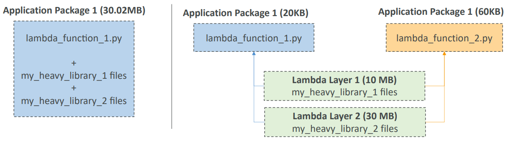
* Container images
  * Deploy Lambda function as container images of up to 10 GB from ECR
  * Pack complex dependencies, large dependencies in a container
  * Base image must implement the Lambda Runtime API
  * Base images are available for Python, Node.js, Java, .NET, Go, Ruby
  * Can create your own image as long as it implements the Lambda Runtime API
  * Test the containers locally using the Lambda Runtime Interface Emulator
  * Unified workflow to build apps. No matter if it's for ECS or Lambda, you can build and publish
  the containers the same way and send them to ECR, from where you deploy to where you need.
* Lambda versions
  * When you work on a Lambda function, we work on $LATEST, which is mutable
  * When we're ready to publish a lambda function, we create a version
  * Versions are immutable
  * Versions have increasing version numbers
  * Versions get their own ARN (Amazon Resource Name)
  * Version = code + configuration (nothing can be changed - immutable)
  * Each version of the lambda function can be accessed
  * Aliases are "pointers" to Lambda function versions
  * We can define a "dev", "test", "prod" alias and have them point to different lambda versions
  * Aliases are mutable
  * Aliases enable Blue/Green deployment by assigning weights to lambda functions
  * Aliases enable stable configuration of our event triggers/destinations
  * Aliases have their own ARNs
  * Aliases cannot reference aliases
    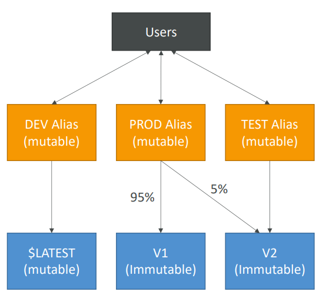
* CodeDeploy
  * CodeDeploy can help you automate traffic shift for Lambda aliases
  * Feature is integrated within the SAM framework
  * Linear: grow traffic every N minutes until 100%
    * Linear10PercentEvery3Minutes
    * Linear10PercentEvery10Minutes
  * Canary: try X percent then 100%
    * Canary10Percent5Minutes
    * Canary10Percent30Minutes
  * AllAtOnce: immediate
  * Can create Pre & Post traffic hooks to check the health of the Lambda function
* Limits
  * Execution:
    * Memory allocation: 128 MB - 10 GB (1 MB increments)
    * Maximum execution time: 900 seconds (15 minutes)
    * Environment variables (4 KB)
    * Disk capacity in the "function container" (in /tmp): 512 MB
    * Concurrency executions: 1000 (can be increased)
  * Deployment:
    * Lambda function deployment size (compressed .zip): 50 MB
    * Size of uncompressed deployment (code + dependencies): 250 MB
    * Can use the /tmp directory to load other files at startup
    * Size of the environment variables: 4 KB
* Best practices
  * Perform heavy-duty work outside your function handler
    * Connect to databases outside your function handler
    * Initialize the AWS SDK outside your function handler
    * Pull in dependencies or datasets outside your function handler
  * Use environment variables for
    * Database Connection Strings, S3 bucket, etc. don't put these values in your code
    * Passwords, sensitive values etc. they can be encrypted using KMS
  * Minimize your deployment package size to its runtime necessities
    * Break down the function if need be
    * Remember the AWS lambda limits
    * Use layers where necessary
  * Avoid using recursive code, never have a lambda function call itself

**Lambda@Edge**
* You have deployed a CDN using CloudFront. What if you wanted to run a global AWS lambda
alongside or how to implement request filtering before reaching your application? Can use
Lambda@Edge for this.
  * Deploy Lambda functions alongside your CloudFront CDN
  * Build more responsive applications
  * You don't manage servers, Lambda is deployed globally
  * Customize the CDN content
  * Pay only for what you use
* You can use Lambda to change CloudFront requests and responses
  * After CloudFront receives a request from a viewer (viewer request)
  * Before CloudFront forwards the request to the origin (origin request)
  * After CloudFront receives the response from the origin (origin response)
  * Before CloudFront forwards the response to the viewer (viewer response)
    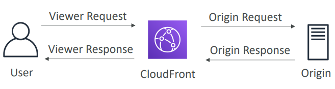
  * You can also generate responses to viewers without ever sending the request to the origin
* Use cases:
  * Website security and privacy
  * Dynamic web application at the edge
  * Search engine optimization (SEO)
  * Intelligently route across origins and data centers
  * Bot mitigation at the edge
  * Real-time image transformation
  * A/B testing
  * User authentication and authorization
  * User prioritization
  * User tracking and analytics

<h2>DynamoDB</h2>

**Intro**
* Traditional architecture
  * Traditional applications leverage RDBMS databases. These databases have the SQL query language.
  * Strong requirements about how the data should be modeled.
  * Ability to do query joins, aggregations, complex computations.
  * Vertical scaling (getting a more powerful CPU/RAM/IO)
  * Horizontal scaling (increasing reading capability by adding EC2/RDS Read Replicas)
* NoSQL
  * NoSQL databases are non-relation databases and are distributed. They include MongoDB, DynamoDB etc.
  * NoSQL databases do not support query joins (or just limited support)
  * All the data that is needed for a query is present in one row
  * NoSQL databases don't perform aggregations such as "SUM", "AVG" etc.
  * NoSQL databases scale horizontally
* There's no right or wrong for NoSQL vs SQL, they just require you to model the data differently and
think about user queries differently.

**DynamoDB**
* Fully managed NoSQL DB, highly available with replication across multiple AZ
* Scales to massive workloads, distributed database
* Millions of requests per second, trillions of rows, 100s of TB of storage
* Fast and consistent performance (low latency on retrieval)
* Integrated with IAM for security, authorization, and administration
* Enables event driven programming with DynamoDB streams
* Low cost and auto-scaling capabilities
* DynamoDB is made of tables
* Each table has a primary key (must be decided at creation time)
* Each table can have an infinite number of items (=rows)
* Each item has attributes (can be added over time - can be null)
* Maximum size of an item is 400 KB
* Data types supported are
  * Scalar types - string, number, binary, boolean, null
  * Document types - list, map
  * Set types - string set, number set, binary set
* Primary keys
  * Option 1: Partition key (HASH)
    * Partition key must be unique for each item
    * Partition key must "diverse" so that the data is distributed
    * Example: "User_ID" for a users table
  * Option 2: Partition key + Sort key (HASH + RANGE)
    * The combination must be unique for each item
    * Data is grouped by partition key
    * Example: users-games table, "User_ID" for partition key and "Game_ID" for sort key
* Read and write capacity modes
  * Control how you manage your table's capacity (read/write throughput)
  * Provisioned mode (default)
    * You specify the number of reads/writes per second
    * You need to plan capacity beforehand
    * Pay for provisioned read & write capacity units
    * Table must have provisioned read and write capacity units
    * Read capacity units (RCU) - throughput for reads
    * Write capacity units (WCU) - throughput for writes
    * Option to setup auto-scaling of through to meet demand
    * Through can be exceeded temporarily using "Burst Capacity"
    * If "Burst Capacity" has been consumed, you'll get a "ProvisionedThroughputExceededException"
    * It's then advised to do an exponential backoff retry
  * On-Demand mode
    * Read/writes automatically scale up/down with your workloads
    * No capacity planning needed (WCU/RCU)
    * Unlimited WCU & RCU, no throttle, more expensive
    * Pay for what you use, more expensive
    * You're charged for reads/writes that you use in terms of RRU and WRU
    * Read request units (RRU) - throughput for reads (same as RCU)
    * Write request units (WRU) - throughput for writes (same as WCU)
    * 2.5x more expensive than provisioned capacity (use with care)
    * Use cases: unknown workloads, unpredictable application traffic etc
  * You can switch between different modes once every 24 hours
  * Write capacity units (WCU)
    * One write capacity unit (WCU) represents one write per second for an item up to 1 KB in size
    * If the items are larger than 1 KB, more WCUs are consumed
    * The formula is `items * item size / 1 KB = WCUs`. Fractional item sizes get rounded up.
    * Example 1: we write 10 items per second with item size 2 KB `10 items * (2 KB item size / 1 KB) = 20 WCUs`
    * Example 2: we write 6 items per second, with item size 4.5 KB. The 4.5 KB item size gets rounded up.
    `6 items * (5 KB item size / 1 KB) = 30 WCUs`
    * Example 3: we write 120 items per minute, with item size 2 KB. 
    `120 items per minute / 60 seconds = 2 items per second`. `2 items * (2 KB item size / 1 KB) = 4 WCUs`
  * Eventually consistent read (default)
    * If we read just after a write, it's possible we'll get some stale data because of replication,
    as we do not know from which server we are reading.
      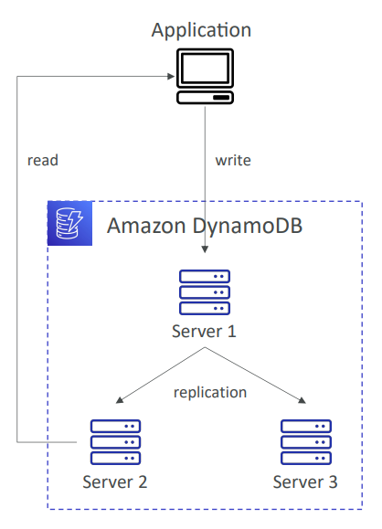
  * Strongly consistent read
    * If we read just after a write, we will get the correct data
    * Set "ConsistentRead" parameter to True in API calls (GetItem, BatchGetItem, Query, Scan)
    * Consumes twice the RCU
  * Read capacity units (RCU)
    * One read capacity unit (RCU) represents one strongly consistent read per second, or two eventually
    consistent reads per second, for an item up to 4 KB in size
    * If the items are larger than 4 KB, more RCUs are consumed and they get rounded up to the nearest upper 4 KBs.
    * The formula is `(reads per second / read mode coefficient) * (item size / 4 KB) = RCUs`
    * Example 1: 10 strongly consistent reads per second, with item size 4 KB.
    `10 reads per second / 1 read mode coefficient * 4 KB / 4 KB = 10 RCUs`
    * Example 2: 16 eventually consistent reads per second, with item size 12 KB
    `16 reads per second / 2 read mode coefficient * 12 KB / 4 KB = 25 RCUs`
    * Example 3: 10 strongly consistent reads per second, with item size 6 KB
    `6 KB gets rounded up to the nearest 4 KB multiple = 8 KB`.
    `10 reads per second / 1 read mode coefficient * 8 KB / 4 KB = 20 RCUs`
* Partitions
  * DynamoDB is made up of tables and each table has a partition. Partitions are copies of data that
  live on specific servers. Data is stored in partitions.
  * Partition keys go through a hashing algorithm to know to which partition they go to
  * WCUs and RCUs are spread evenly across partitions
    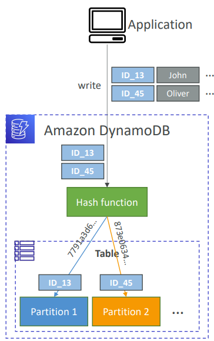
* Throttling
  * If we exceed provisioned RCUs or WCUs, we get "ProvisionedThroughputExceededException"
  * Reasons
    * Hot keys - one partition key is being read too many times (e.g. popular item)
    * Hot partitions
    * Very large items, remember RCU and WCU depends on size of items
  * Solutions
    * Exponential backoff when exception is encountered (already in SDK)
    * Distribute partition keys as much as possible
    * If RCU issue, we can use DynamoDB Accelerator (DAX)
* Writing data
  * PutItem
    * Creates a new item or fully replaces an old item (same Primary Key)
    * Consumes WCUs
  * UpdateItem
    * Exits an existing item's attributes or adds a new item if it doesn't exist
    * Can be used to implement Atomic Counters - a numeric attribute that's unconditionally incremented
  * Conditional writes
    * Accepts a write/update/delete only if conditions are met, otherwise returns an error
    * Helps with concurrent access to items
    * No performance impact
* Reading data
  * GetItem
    * Read based on primary key
    * Primary key can be hash or hash + range
    * Eventually consistent read (default)
    * Option to use strongly consistent reads (more RCU - might take longer)
    * ProjectExpression can be specified to retrieve only certain attributes
  * Query
    * Query returns items based on
      * KeyConditionExpression
        * Partition key value (must be = operator) - required
        * Sort key value (=, <, <=, >, >=, Between, Begins with) - optional
      * FilterExpression
        * Additional filtering after the query operation (before data returned to you)
        * Use only with non-key attributes (does not allow HASH or RANGE attributes)
    * Returns
      * The number of items specified in Limit or up to 1 MB of data
    * Ability to do pagination on the results
    * Can query table, a Local Secondary Index, or a Global Secondary Index
  * Scan
    * Scan the entire table and then filter out data (inefficient)
    * Returns up to 1 MB of data - use pagination to keep on reading
    * Consumes a lot of RCU
    * Limit impact using Limit or reduce the size of the results and pause
    * For faster performance, use Parallel Scan
      * Multiple workers scan multiple data segments at the same time
      * Increases the throughput and RCU consumed
      * Limit the impact of parallel scans just like you would for Scans
    * Can use ProjectionExpression & FilterExpression (no changes to RCU)
* Deleting data
  * DeleteItem
    * Delete an individual item
    * Ability to perform a conditional delete
  * DeleteTable
    * Delete a whole table and all its items
    * Much quicker deletion than calling DeleteItem on all items
* Batch operations
  * Allows you to save in latency by reducing the number of API calls
  * Operations are done in parallel for better efficiency
  * Part of a batch can fail, in which case we need to try again for failed items
  * BatchWriteItem
    * Up to 25 PutItem and/or DeleteItem in one call
    * Up to 16 MB of data written, up to 400 KB of data per item
    * Can't update items (use UpdateItem)
  * BatchGetItem
    * Return items from one or more tables
    * Up to 100 items, up to 16 MB of data
    * Items are retrieved in parallel to minimize latency
* Indexes
  * Local Secondary Index (LSI)
    * Alternative sort key for your table (same Partition Key as that of base table)
    * The sort key consists of one scalar attribute (String, Number, or Binary)
    * Up to 5 Local Secondary Indexes per table
    * Must be defined at table creation time
    * Attribute projections - can contain some or all attributes of base table (KEYS_ONLY, INCLUDE, ALL)
  * Global secondary index (GSI)
    * Alternative primary key (HASH or HASH + RANGE) from the base table
    * Speed up queries on non-key attributes
    * The index key consists of scalar attributes (String, Number, or Binary)
    * Attribute projections - some or all attributes of the base table (KEYS_ONLY, INCLUDE, ALL)
    * Must provision RCUs & WCUs for the index
    * Can be added/modified after table creation
  * Throttling
    * Global Secondary Index (GSI)
      * If the writes are throttled on the GSI, then the main table will be throttled, even if the 
      WCU on the main tables are fine
      * Choose your GSI partition key carefully
      * Assign your WCU capacity carefully
    * Local Secondary Index (LSI)
      * Uses the WCUs and RCUs of the main table
      * No special throttling considerations
* Optimistic locking
  * DynamoDB has a feature called "Conditional Writes"
  * A strategy to ensure an item hasn't changed before you update/delete it
  * Each item has an attribute that acts as a version number
    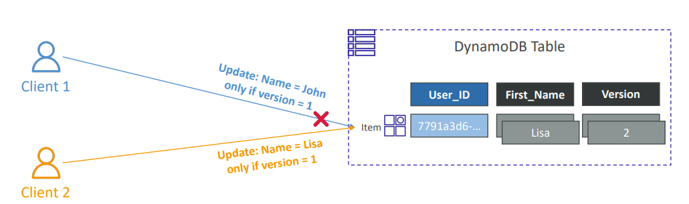
* DynamoDB accelerator (DAX)
  * Fully-managed, highly available, seamless in-memory cache for DynamoDB
  * Microseconds latency for cached reads & queries
  * Doesn't require application logic modification (compatible with existing DynamoDB APIs)
  * Solves the "Hot Key" problem (too many reads)
  * 5 minutes TTL for cache (default)
  * Up to 10 nodes in the cluster
  * Multi-AZ (3 nodes minimum recommended for production)
  * Secure (Encryption at rest with KMS, VPC, IAM, CloudTrail etc.)
  * DAX vs ElastiCache
    * Can be used at the same time
    * DAX will have individual objects cache, query & scan caching
    * When doing some logic application wise, then ElastiCache is where to keep it. So store aggregation
    result in it.
* DynamoDB Streams
  * Ordered stream of item-level modifications (create/update/delete) in a table
  * Stream records can be
    * Sent to Kinesis Data Streams
    * Read by AWS Lambda
    * Read by Kinesis Client Library applications
  * Data retention for up to 24 hours
  * Use cases
    * React to changes in real-time (welcome email to users)
    * Analytics
    * Insert into derivative tables
    * Insert into ElasticSearch
    * Implement cross-region replication
  * Ability to choose the information that will be written to the stream
    * KEYS_ONLY - only the key attributes of the modified item
    * NEW_IMAGE - the entire item, as it appears after it was modified
    * OLD_IMAGE - the entire item, as it appeared before it was modified
    * NEW_AND_OLD_IMAGES - both the new and the old images of the item
  * DynamoDB streams are made of shards, just like the Kinesis Data Streams
  * You don't provision shards, this is automated by AWS
  * Records are not retroactively populated in a stream after enabling it
    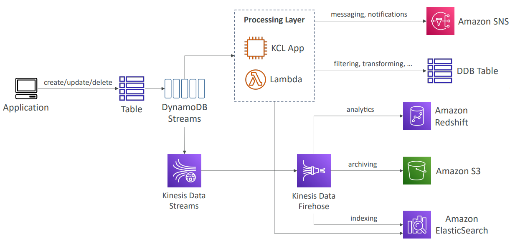
  * With AWS Lambda
    * You need to define an Event Source Mapping to read from a DynamoDB stream
    * You need to ensure the Lambda function has the appropriate permissions
    * Your lambda function is invoked synchronously
      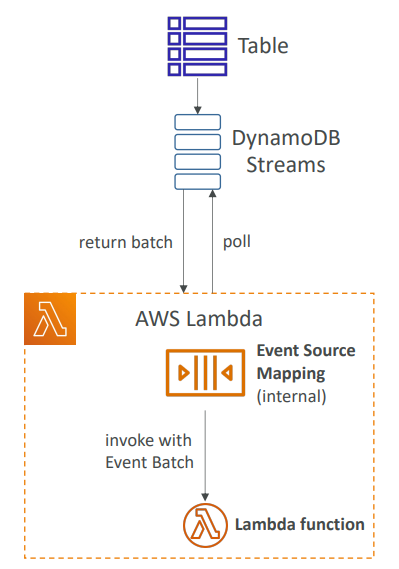
* Time to live (TTL)
  * Automatically delete items after an expiry timestamp
  * Doesn't consume any WCUs (i.e. no extra cost)
  * The TTL attribute must be a "Number" data type with a "Unix Epoch timestamp" value
  * Expired items deleted within 48 hours of expiration
  * Expired items that haven't been deleted appear in reads/queries/scans (if you don't want them,
  filter them out)
  * Expired items are deleted from both LSIs and GSIs
  * A delete operation for each expired item enters the DynamoDB streams (can help recover expired
  items)
  * Use cases: reduce stored data by keeping only current items, adhere to regulatory obligations
* CLI good to know
  * --projection-expression: one or more attributes to retrieve
  * --filter-expression: filter items before returned to you
  * General AWS CLI pagination options (e.g. DynamoDB, S3 etc.)
    * --page-size: specify that AWS CLI retrieves the full list of items but with a larger number of
    API calls instead of one API call (default: 1000 items)
    * --max-items: max number of items to show in the CLI (returns NextToken)
    * --starting-token: specify the last NextToken to retrieve the next set of items
* Transactions
  * Coordinated, all-or-nothing operations (add/update/delete) to multiple items across one or more tables
  * Provides atomicity, consistency, isolation, and durability (ACID)
  * Read modes - eventual consistency, strong consistency, transactional
  * Write modes - standard, transactional
  * Consumes 2x WCUs & RCUs
    * DynamoDB performs 2 operations for every item (prepare & commit)
  * Two operations: (up to 25 unique items or up to 4 MB of data)
    * TransactGetItems - one or more GetItem operations
    * TransactWriteItems - one or more PutItem, UpdateItem, and DeleteItem operation
  * Use cases: financial transactions, managing orders, multiplayer games etc.
  * Capacity computations:
    * Read formula: `reads per second * (item size rounded to nearest 4 KB multiple / 4 KB) * 2 (transactional cost) = RCUs` 
    * Write formula: `writes per second * (item size / 1 KB) * 2 (transactional cost) = WCUs` 
    * Example 1: 3 transactional writes per second, with item size 5 KB
      * `3 writes per second * (5 KB item size / 1KB) * 2 = 30 WCUs`
    * Example 2: 5 transactional reads per second, with item size 5 KB
      * `5 reads per second * (8 KB (nearest 4 multiple) / 4 KB) * 2 = 20 RCUs`
* As Session state cache
  * It's common to use DynamoDB to store session state
  * vs ElastiCache
    * ElastiCache is in-memory, but DynamoDB is serverless
    * Both are key/value stores
  * vs EFS
    * EFS must be attached to EC2 instances as a network drive
  * vs EBS & Instance store
    * EBS & Instance store can only be used for local caching, not shared caching
  * vs S3
    * S3 is higher latency, and not meant for small objects
* Write sharding
  * Imagine we have a voting application with two candidates, candidate A and candidate B
  * If partition key is candidate_id, this results in two partitions, which will generate issues (
  e.g. hot partition)
  * A strategy that allows for better distribution of items across partitions would be to add a
  suffix to the partition key value
  * Two methods
    * Sharding using random suffix
    * Sharding using calculated suffix
      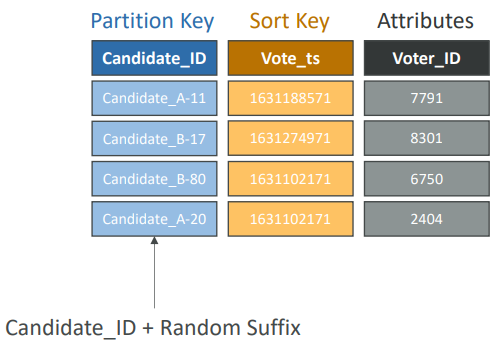
* Write types
  * Concurrent writes - at the same time, one overwrites the other depending on who gets there last.
  Not desired.
  * Conditional writes - update value only if the value is X.
  * Atomic writes - a single operation on a variable at one time
  * Batch writes - writes/updates many items at a time
    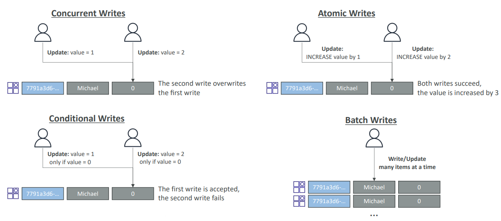
* DynamoDB patterns with S3
  * Large object pattern - upload the file to S3 and store the URL into the DB
  * Indexing S3 objects metadata - upload into S3, invoke lambda, store the upload metadata into
  DynamoDB so that you could more easily query for objects metadata
* DynamoDB operations
  * Table cleanup
    * Option 1: scan the entire table + DeleteItem - very slow, consumes RCU & WCU, expensive
    * Option 2: drop table + recreate table - fast, efficient, cheap
  * Copying a DynamoDB table
    * Option 1: using AWS data pipeline, reads from initial table, writes to S3 bucket, reads from it,
    then writes to a new table
      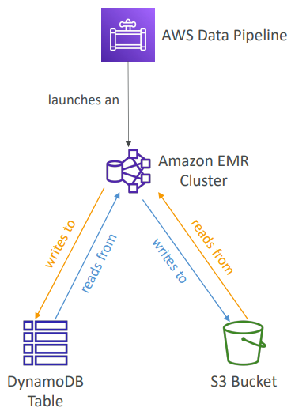
    * Option 2: backup and restore into a new table - takes some time
    * Option 3: scan + PutItem or BatchWriteItem - write your own code
* Security & Other Features
  * Security
    * VPC endpoints available to access DynamoDB without using the Internet
    * Access fully controlled by IAM
    * Encryption at rest using AWS KMS and in-transit using SSL/TLS
  * Backup and restore feature available
    * Point-in-time recovery (PITR) like RDS
    * No performance impact
  * Global tables
    * Multi-region, multi-active, fully replicated, high performance
  * DynamoDB local
    * Develop and test apps locally without accessing the DynamoDB web service (without Internet)
  * AWS database migration service (AWS DMS) can be used to migrate to DynamoDB 
  (from MongoDB, Oracle, MySQL, S3 etc)
  * Fine-grained access control (if you want users to access Dynamo directly)
    * Using Web Identity Federation or Cognito identity pools, each user gets temporary AWS credentials
    * You can assign an IAM role to these users with a condition to limit their API access to DynamoDB
    * LeadingKeys - limit row-level access for users on the primary key so that they could only modify
    their own data
    * Attributes - limit specific attributes the user can see

<h2>API Gateway</h2>
**API Gateway**
* AWS Lambda + API Gateway - no infrastructure to manage
* Support for the WebSocket protocol
* Handle API versioning (v1, v2 etc.)
* Handle different environments (dev, test, prod etc)
* Handle security (Authentication and Authorization)
* Create API keys, handle request throttling
* Swagger/Open API import to quickly define APIs
* Transform and validate requests and responses
* Generate SDK and API specifications
* Cache API responses
* Integrations
  * Lambda function
    * Invoke lambda function
    * Easy way to expose REST API backed by AWS lambda
  * HTTP 
    * Expose HTTP endpoints in the backend
    * Example: internal HTTP API on premise, Application Load Balancer etc.
    * Why add API Gateway to the endpoints? Add rate limiting, caching, user authentication, API keys etc.
  * AWS service
    * Expose any AWS API through the API Gateway
    * Example: start an AWS Step Function workflow, post a message to SQS
    * Why? Add authentication, deploy publicly, rate control etc.
* How to deploy your API Gateway, called endpoint types
  * Edge-optimized (default) - for global clients, accessible from anywhere in the world
    * Requests are routed through the CloudFront Edge locations (improves latency)
    * The API Gateway still lives in only one region
  * Regional
    * For clients within the same region
    * Could manually combine with CloudFront (more control over the caching strategies and the distribution)
  * Private
    * Can only be accessed from your VPC using an interface VPC endpoint (ENI)
    * Use a resource policy to define access
* Deployment stages
  * Making changes in the API Gateway does not mean they're effective
  * You need to make a "deployment" for them to be in effect
  * It's a common source of confusion
  * Changes are deployed to "Stages" (as many as you want)
  * Use the naming you like for stages (dev, test, prod)
  * Each stage has its own configuration parameters
  * Stages can be rolled back as a history of deployments is kept
  * With a new version of the API, you can create a new stage, which gets a new URL so you could have
  V1 and V2 endpoints
  * Stage variables
    * Stage variables are like environment variables for API Gateway
    * Use them to change often changing configuration values
    * They can be used in:
      * Lambda function ARN
      * HTTP endpoint
      * Parameter mapping templates
    * Use cases
      * Configure HTTP endpoints your stages talk to (dev, test, prod etc.)
      * Pass configuration parameters to AWS lambda through mapping templates
    * Stage variables are passed to the "context" object in AWS Lambda
    * Stage variables & Lambda aliases
      * We create a stage variable to indicate the corresponding Lambda alias
      * Our API gateway will automatically invoke the right Lambda function
* Canary deployment
  * Possibility to enable canary deployments for any stage (usually prod)
  * Choose the % of traffic the canary channel receives
  * Metrics & Logs are separate (for better monitoring)
  * Possibility to override stage variables for canary
  * This is blue/green deployment with AWS Lambda & API Gateway
* Backend integration types
  * MOCK - API Gateway returns a response without sending the request to the backend
  * HTTP/AWS (Lambda & AWS Services) 
    * you must configure both the integration request and integration response
    * Setup data mapping using mapping templates for the request & response
  * AWS_PROXY (Lambda proxy)
    * Incoming request from the client is the input to Lambda. 
    * The function is responsible for the logic of request/response
    * No mapping template. Headers, query string parameters etc. are passed as arguments
  * HTTP_PROXY
    * No mapping template
    * The HTTP request is passed to the backend
    * The HTTP response from the back is forwarded by API gateway
  * Mapping templates (AWS & HTTP integration)
    * Mapping templates can be used to modify request/response
    * Rename/modify query string parameters
    * Modify body content
    * Add headers
    * Uses Velocity template language (VTL): for loop, if etc.
    * Filter output results (remove unnecessary data)
    * Example: JSON to XML with SOAP
      * SOAP API are XML based, whereas REST API are JSON based
      * In this case, API gateway should
        * Extract data from the request: either path, payload, or header
        * Build SOAP message based on request data (mapping template)
        * Call SOAP service and receive XML response
        * Transform XML response to desired format (like JSON), and respond to the user
* API Gateway Swagger/Open API spec
  * Common way of defining REST APIs, using API definition as code
  * Import existing Swagger/OpenAPI 3.0 spec to API gateway
    * Method
    * Method request
    * Integration request
    * Method response
    * + AWS extensions for API gateway and setup every single option
  * Can export current API as Swagger/OpenAPI spec
  * Swagger can be written in YAML or JSON
  * Using swagger we can generate SDK for our applications
* Caching API responses
  * Caching reduces the number of calls made to the backend
  * Default TTL (time to live) is 300 seconds (min: 0s, max: 3600s)
  * Caches are defined per stage
  * Possible to override cache settings per method
  * Cache encryption option
  * Cache capacity between 0.5GB to 237GB
  * Cache is expensive, makes sense in production, may not make sense in dev/test
  * Cache invalidation
    * Able to flush the entire cache (invalidate it) immediately from the UI
    * Clients can invalidate the cache with header: Cache-Control: max-age=0 (with proper IAM authorization)
    * If you don't impose an InvalidateCache policy (or choose the Require authorization check box in
    the console), any client can invalidate the API cache
* Usage plans & API keys
  * If you want to make an API available as an offering ($) to your customers
  * Usage plan
    * Who can access one or more deployed API stages and methods
    * How much and how fast they can access them
    * Uses API keys to identify API clients and meter access
    * Configure throttling limits and quota limits that are enforced on individual client
  * API keys
    * Alphanumeric string values to distribute to your customers
    * Can use with usage plans to control access
    * Throttling limits are applied to the API keys
    * Quota limits is the overall number of maximum requests
  * Correct order for API keys
    * To configure a usage plan
        1. Create one or more APIs, configure the methods to require an API key, and deploy the
      APIs to stages.
        2. Generate or import API keys to distribute to application developers (your customers) who
      will be using your API
        3. Create the usage plan with the desired throttle and quota limits.
        4. Associate API stages and API keys with the usage plan.
    * Callers of the API must supply an assigned API key in the x-api-key header in requests to the API.
* Logging & Tracing
  * CloudWatch logs:
    * Enable CloudWatch logging at the stage level (with log level)
    * Can override settings on a per API basis (ex: ERROR, DEBUG, INFO)
    * Log contains information about request/response body
  * X-Ray
    * Enable tracing to get extra information about requests in API gateway
    * X-Ray API Gateway + AWS Lambda gives you the full picture
  * CloudWatch metrics
    * Metrics are by stage, possibility to enable detailed metrics
    * CacheHitCount & CacheMissCount - efficiency of the cache
    * Count - the total number of API requests in a given period
    * IntegrationLatency - the time between when API Gateway relays a request to the backend and
    when it receives a response from the backend
    * Latency - the time between when API Gateway receives a request from a client and when it returns
    a response to the client. The latency includes the integration latency and other API Gateway overhead.
    * 4XXError (client-side) & 5XXError (server-side)
* Throttling
  * Account limit
    * API Gateway throttles requests at 10000 RPS across all API
    * Soft limit that ca be increased upon request
  * In case of throttling => 429 Too Many Requests (retriable error)
  * Can set Stage limit & Method limits to improve performance, or you can define Usage Plans to throttle
  per customer
  * Just like Lambda Concurrency, one API that is overloaded, if not limited, can cause the other APIs 
  * to be throttled
* Errors
  * 4XX means client errors
    * 400 - bad request
    * 403 - access denied, WAF filtered
    * 429 - quota exceeded, throttle
  * 5XX means server errors
    * 502 - bad gateway exception, usually for an incompatible output returned from a Lambda proxy
    integration backend and occasionally for out-of-order invocations due to heavy loads
    * 503 - service unavailable exception
    * 504 - integration failure. Ex. Endpoint request timed-out exception. API Gateway requests time out
    after 29 second maximum
* CORS
  * CORS must be enabled when you receive API calls from another domain.
  * The OPTIONS pre-flight request must contain the following headers:
    * Access-Control-Allow-Methods
    * Access-Control-Allow-Headers
    * Access-Control-Allow-Origin
  * CORS can be enabled through the console
* Security
  * IAM Permissions
    * Create an IAM policy authorization and attach to User/Role
    * Authentication = IAM; Authorization = IAM policy
    * Good to provide access within AWS (EC2, Lambda, IAM users etc.)
    * Leverages "Sig V4" capability where IAM credentials are in headers
  * Resource policies
    * Similar to lambda resource policy
    * Allow for cross account access (combined with IAM security)
    * Allow for a specific source IP address
    * Allow for a VPC endpoint
  * Cognito user pools
    * Cognito fully manages user lifecycle, token expires automatically
    * API gateway verifies identity automatically from AWS Cognito
    * No custom implementation required
    * Authentication = Cognito User Pools; Authorization = API Gateway Methods
      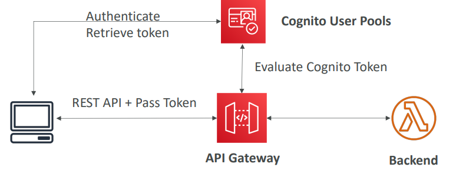
  * Lambda authorizer (formerly custom authorizer)
    * Token-based authorizer (bearer token) - ex JWT (JSON Web Token) or OAuth
    * A request parameter based Lambda authorizer (headers, query string, stage var)
    * Lambda must return an IAM policy for the user, result policy is cached
    * Authentication = External; Authorization = Lambda function
      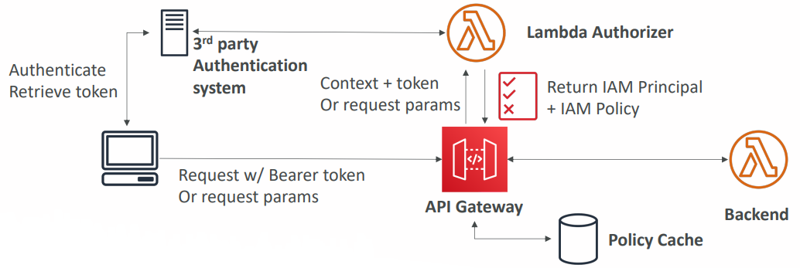
  * Summary
    * IAM
      * Great for users/roles already within your AWS account + resource policy for cross account
      * Handle authentication + authorization
      * Leverages signature V4
    * Custom authorizer
      * Great for 3rd party tokens
      * Very flexible in terms of what IAM policy is returned
      * Handle authentication verification + authorization in the lambda function
      * Pay per lambda invocation, results are cached
    * Cognito user pool
      * You manage your own user pool (can be backed by Facebook, Google login etc.)
      * No need to write any custom code
      * Must implement authorization in the backend
* HTTP API vs REST API
  * HTTP APIs
    * Low-latency, cost-effective AWS Lambda proxy, HTTP proxy APIs and private integration (no 
    data mapping)
    * Support OIDC and OAuth 2.0 authorization, and built-in support for CORS
    * No usage plans and API keys
  * REST APIs
    * All features (except native OpenID Connect/OAuth 2.0)
* Websocket API
  * What's a websocket? 
    * Two-way interactive communication between a user's browser and a server
    * Server can push information to the client
    * This enables stateful application use cases
  * WebSocket APIs are often used in real-time applications such as chat applications, collaboration
  platforms, multiplayer games, and financial trading platforms
  * Works with AWS Services (Lambda, DynamoDB) or HTTP endpoints
  * Connection to the API
    * The client connects to the gateway and establishes a persistent connection, this invokes a Lambda
    function and passes on a connectionId, the connectionId remains persistent during the connection.
    * ConnectionId could be passed and saved to DynamoDB to add some metadata to it
      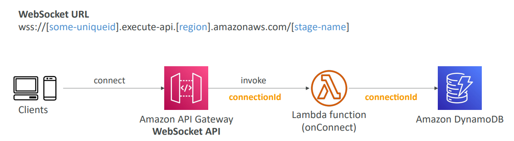
  * Client to server messaging
    * ConnectionID is re-used
    * Client sends messages to the server. The messages are called frames. It'll invoke a Lambda function
    * The Lambda can then use DynamoDB to retrieve the user info or whatever else is connected to the
    connectionId
      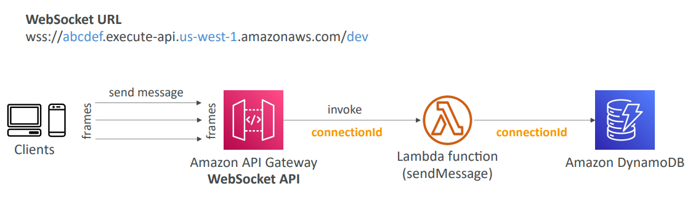
  * Server to client messaging
    * There's a connection URL callback that can be used to communicate with the client
      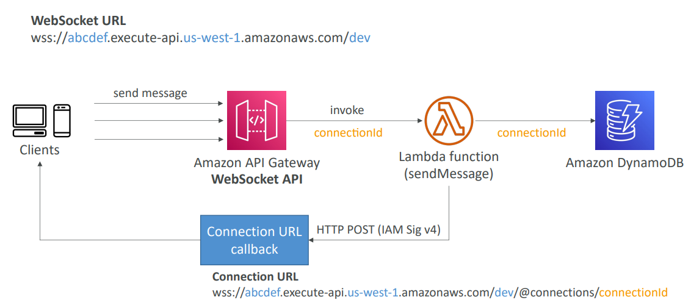
  * Routing
    * Incoming JSON messages are routed to different backend
    * If no routes, then sent to $default
    * You request a route selection expression to select the field on JSON to route from. In the example
    we tell it to look at the $request.body.action field to choose which route to go against.
    * $connect, $disconnect, $default are mandatory routes
    * The results of the defined property is evaluated against the route keys available in your API 
    gateway
    * The route is then connected to the backend you've setup through API Gateway
      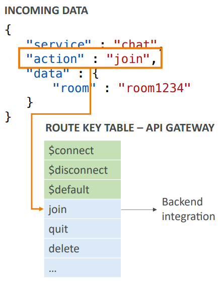
* Architecture
  * Create a single interface for all the microservices in your company
  * Use API endpoints with various resources
  * Apply a simple domain name and SSL certificates
  * Can apply forwarding and transformation rules at the API gateway level

<h2>Serverless Application Model (SAM)</h2>

**Serverless Application Model**
* Framework for developing and deploying serverless applications
* All the configuration is YAML code
* Generate complex CloudFormation from simple SAM YAML file
* Supports anything from CloudFormation: Outputs, Mappings, Parameters, Resources etc.
* Only two commands to deploy to AWS
* SAM can use CodeDeploy to deploy Lambda functions
* SAM can help you to run Lambda, API Gateway, DynamoDB locally
* AWS SAM - Recipe
  * Transform header indicates it's a SAM template
    * `Transform: 'AWS::Serverless-2016-10-31'`
  * Write code
    * `AWS::Serverless::Function` 
    * `AWS::Serverless::Api` 
    * `AWS::Serverless::SimpleTable`
  * Package and deploy
    * `aws cloudformation package / sam package`  
    * `aws cloudformation deploy / sam deploy`
      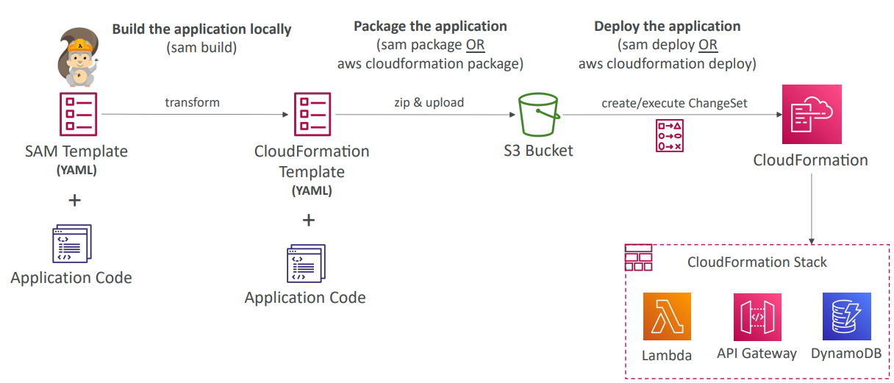
* CLI Debugging
  * Locally build, test, and debug your serverless applications that are defined using AWS SAM templates
  * Provides a lambda-like execution environment locally
  * SAM CLI + AWS Toolkits => step-through and debug your code
  * Supported IDEs: AWS Cloud9, Visual Studio Code, JetBrains etc.
  * AWS Toolkits: IDE plugins which allow you to build, test, debug, deploy, and invoke Lambda functions
  built using AWS SAM
* SAM Policy Templates
  * List of templates to apply permissions to your Lambda functions
  * Full list available here: https://docs.aws.amazon.com/serverless-application-model/latest/developerguide/serverless-policy-templates.html#serverless-policy-template-table
  * Important examples:
    * S3ReadPolicy: Gives read only permissions to objects in S3
    * SQSPollerPolicy: Allows to poll an SQS queue
    * DynamoDBCrudPolicy: CRUD = create read update delete
* SAM and CodeDeploy
  * SAM framework natively uses CodeDeploy to update Lambda functions
  * Traffic shifting feature
  * Pre and post traffic hooks features to validate deployment (before the traffic shift starts and
  after it ends)
  * Easy & automated rollback using CloudWatch alarms
  * Ex: we want to switch from v1 to v2. We run some pre-traffic hook tests to check V2, then we do 
  traffic shifting according to our strategy. It will monitor a CloudWatch alarm to ensure everything
  goes well. After the traffic shifting is done, we can run a post-traffic hook function on our alias
  and if everything goes well, we can remove v1.
   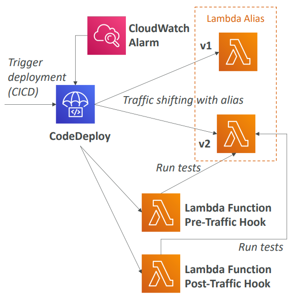
* Summary
  * SAM is built on CloudFormation
  * SAM requires the Transform (to indicate that it's a SAM template) and Resources sections
  * Commands to know:
    * `sam build` - fetch dependencies and create local deployment artifacts
    * `sam package` -  package and upload to Amazon S3, generate CF template
    * `sam deploy` - deploy to CloudFormation
  * SAM policy templates for easy IAM policy definition
  * SAM is integrated with CodeDeploy to do deploy to Lambda aliases

Serverless Application Repository (SAR)
* Managed repository for serverless applications
* The applications are packaged using SAM
* Build and publish applications that can be re-used by organizations
  * Can share publicly
  * Can share with specific AWS accounts
* This prevents duplicate work, and just go straight to publishing
* Application settings and behaviour can be customized using environment
variables
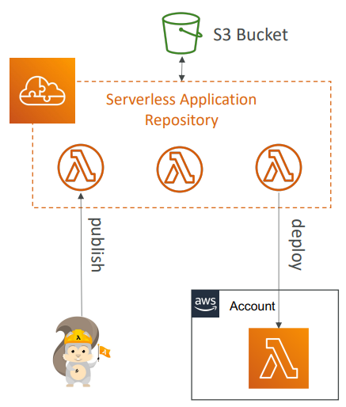

<h2>AWS Cloud Development Kid (CDK)</h2>
* Define your cloud infrastructure using a familiar language
  * JS/TS, Python, Java, and .NET
* Contains high level components called constructs
* The code is "compiled" into a CloudFormation template (JSON/YAML)
* You can therefore deploy infrastructure and application runtime code together
  * Great for Lambda functions
  * Great for Docker containers in ECS/EKS

<h2>Cognito</h2>
**Cognito**
* We want to give our users an identity so that they can interact with our application.
That is the web application we've written. So users outside of AWS, that are only
connected to our own written application.
* Cognito user pools
  * Sign in functionality for app users
  * Integrate with API gateway & Application load balancer
* Cognito identity pools (federated identity)
  * Provide AWS credentials to users, so they can access AWS resources directly
  * Integrate with Cognito User Pools as an identity provider
* Cognito sync
  * Synchronize data from device to Cognito
  * Is deprecated and replaced by AppSync
* Cognito vs IAM: think Cognito when "hundreds of users", "mobile users", 
"authenticate with SAML". IAM is for all the users that you trust within
your AWS environment.
* Cognito User Pools (CUP)
  * Create a serverless database of users for your web & mobile apps
  * Simple login: Username (or email) / password combination
  * Password reset
  * Email & Phone Number Verification
  * Multi-factor authentication (MFA)
  * Federated Identities: users from Facebook, Google, SAML...
  * Feature: block users if their credentials are compromised elsewhere
  * Login sends back a JSON Web Token (JWT)
  * CUP integrates with API Gateway and Application Load Balancer
  * With an API Gateway:
    1. The user authenticates and gets a token
    2. Then it will make a call to the REST API and pass the token
    3. The gateway will authenticate the token against the Cognito User Pools
    4. On success, it will receive access to the backend
       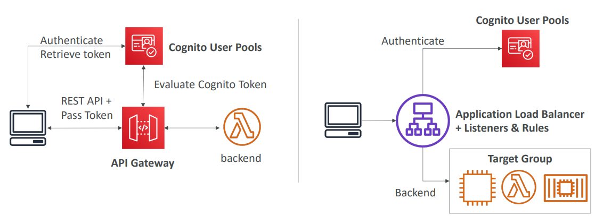
  * CUP can invoke a lambda function synchronously on these triggers
    
  * Cognito User Pools - Hosted Authentication UI
    * Cognito has a hosted authentication UI that you can add to your app to handle
    sign-up and sign-in workflows
    * Using the hosted UI, you have a foundation for integration with social 
    logins, OIDC, or SAML
    * Can customize with a custom logo and custom CSS
* Cognito Identity Pools (Federated Identities)
  * Get identities for "users" so they obtain temporary AWS credentials to get 
  access to AWS resources. E.g. a DynamoDB table or a S3 bucket.
  * Cannot do through IAM, because there are too many of them and we don't trust
  them.
  * Your identity pool (e.g. identity source) can include:
    * Public providers (Login with Amazon, Facebook, Google, Apple)
    * Users in an Amazon Cognito user pool
    * OpenID connect providers & SAML identity providers
    * Developer authenticated identities (custom login server)
    * Cognito Identity Pools allow for unauthenticated (guest) access
  * Users can then access AWS services directly or through API gateway
    * The IAM policies applied to the credentials are defined in Cognito
    * They can be customized based on the user_id for fine-grained control
  1. The user will log in and get a token
  2. The token will be exchanged for temporary AWS credentials
  3. The token will be verified with whatever provider we have defined
  4. STS will provide temporary credentials
  5. The credentials are returned to the user, and they can use these for direct
  access to AWS resources.
     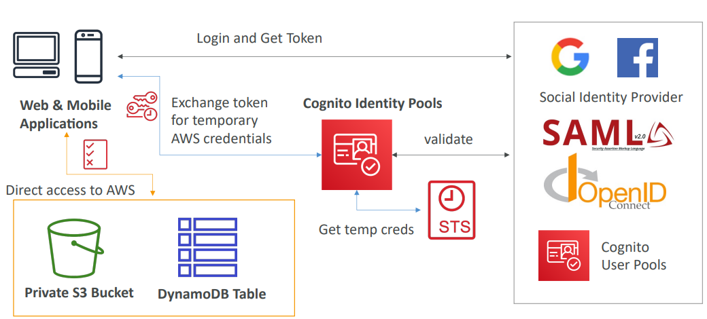
  * Cognito identity pools with CUP can be used to centralize the users. It can
  extend to an internal DB of users or federated identities.
    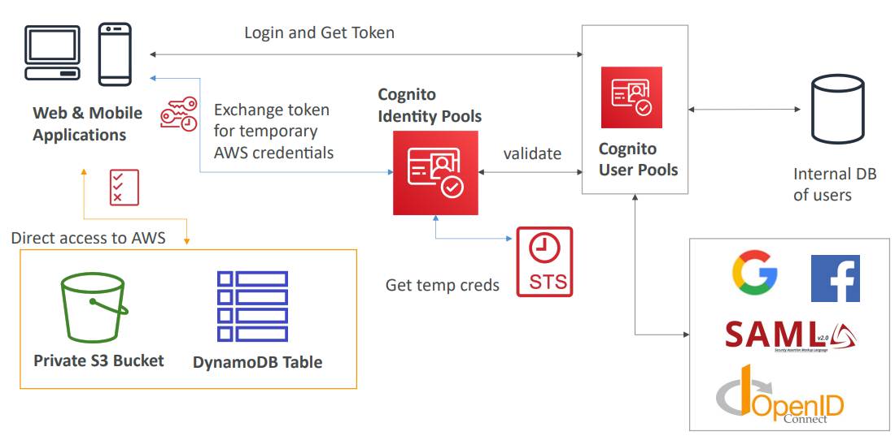
  * How to apply IAM roles
    * Default IAM roles for authenticated and guest users
    * Define rules to choose the role for each user based on the user's ID
    * You can partition your users' access using policy variables
    * IAM credentials are obtained by Cognito Identity Pools through STS
    * The roles must have a "trust" policy of Cognito Identity Pools
* Cognito User Pools vs Identity Pools
  * Cognito User Pools (Manage user/password)
    * Database of users for your web and mobile application
    * Allows federating logins through Public Social, OIDC, SAML etc.
    * Can customize the hosted UI for authentication (including the logo)
    * Has triggers with AWS Lambda during the authentication flow
  * Cognito Identity Pools (Access AWS services)
    * Obtain AWS credentials for your users
    * Users can log in through Public Social, OIDC, SAML & Cognito User Pools
    * Users can be authenticated (guests)
    * Users are mapped to IAM roles & policies, can leverage policy variables
* Cognito Sync
  * Deprecated - use AWS AppSync now
  * Store user preferences, configuration, state of app
  * Cross device synchronization (any platform - iOS, Android etc)
  * Offline capability (sync when back online)
  * Store data in datasets (up to 1MB), up to 20 datasets to synchronize
  * Push sync: silently notify across all devices when identity data changes
  * Cognito Stream: stream data from Cognito into Kinesis
  * Cognito Events: execute Lambda functions in response to events

<h2>Other Serverless</h2>
**AWS Step Functions**
* Model your workflows as state machines (one per workflow)
  * Order fulfillment, Data processing
  * Web applications, any workflow
* Written in JSON
* Visualization of the workflow and the execution of the workflow, as well as history
* Start workflow with SDK call, API Gateway, Event Bridge (CloudWatch Event)
  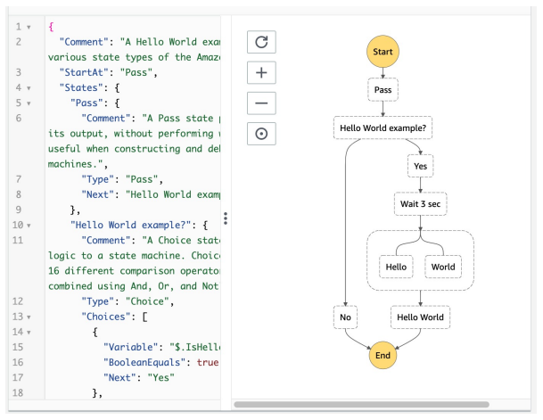
* The state machine is made up of boxes and those boxes are called task states
  * They're used to do some work in your state machine
  * Invoke one AWS service
    * Can invoke a Lambda function
    * Run an AWS batch job
    * Run ECS task and wait for it to complete
    * Insert an item from DynamoDB
    * Publish message to SNS, SQS
    * Launch another step function workflow
  * Run one activity
    * EC2, Amazon ECS, on-premises
    * Activities poll the step functions for work
    * Activities send results back to step functions
* Step Function States
  * Choice state - test for a condition to send to a branch (or default branch)
  * Fail or succeed state - stop execution with failure or success
  * Pass state - simply pass its input to its output or inject some fixed data,
  without performing work
  * Wait state - provide a delay for a certain amount of time or until a specified
  time/date
  * Map state - dynamically iterate steps.
  * Parallel state - begin parallel branches of execution
* Error handling in step functions
  * Any state can encounter runtime errors for various reasons:
    * State machine definition issues (for example, no matching rule in a Choice
    state)
    * Task failures (for example, an exception in a Lambda function)
    * Transient issues (for example, network partition events)
  * Use Retry (to retry failed state) and Catch (transition to failure path) in
  the State Machine to handle the errors instead of inside the Application Code
  * Predefined error codes:
    * States.ALL - matches any error name
    * States.Timeout - task ran longer than TimeoutSeconds or no heartbeat received
    * States.TaskFailed - execution failure
    * States.Permissions - insufficient privileges to execute code
  * The state may report its own errors
    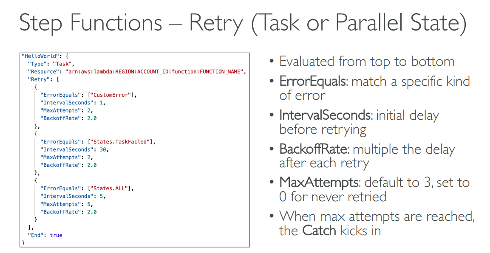
    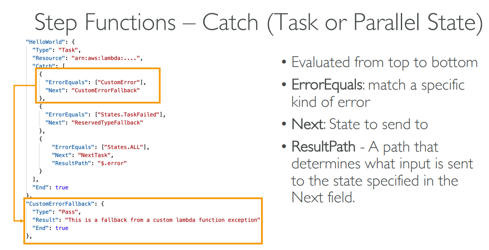
    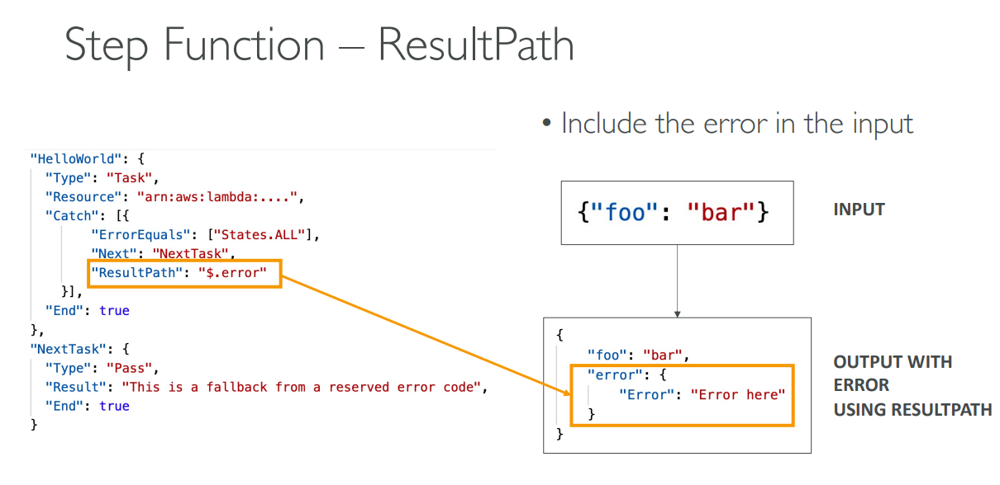
* Standard vs express step functions
 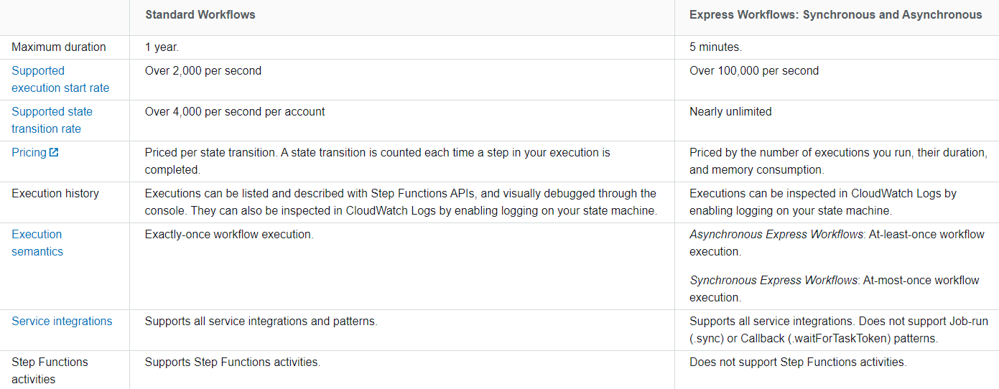
* AppSync
  * AppSync is a managed service that uses GraphQL
  * GraphQL makes it easy for applications to get exactly the data they need
  * This includes combining data from one or more sources
    * NoSQL data stores, Relational DBs, HTTP APIs etc.
    * Integrates with DynamoDB, Aurora, Elasticsearch & others
    * Custom sources with AWS Lambda
  * Retrieve data in real-time with WebSocket or MQTT on WebSocket
  * For mobile apps: local data access & data synchronization
  * It all starts with uploading one GraphQL schema
    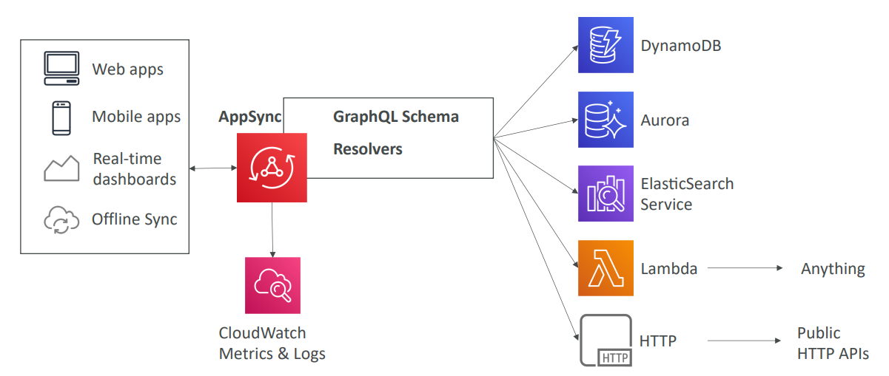
  * There are four ways you can authorize applications to interact with your AWS
  AppSync GraphQL API
    * API_KEY
    * AWS_IAM: IAM users/roles/cross-account access
    * OPENID_CONNECT: OpenID connect provider/JSON Web Token
    * AMAZON_COGNITO_USER_POOLS
    * For custom domains & HTTPS, use CloudFront in front of AppSync

<h2>Advanced Identity</h2>
* STS
  * Allows granting limited and temporary access to AWS resources (up to 1 hour)
  * AssumeRole: Assume roles within your account or cross account
  * AssumeRoleWithSAML: return credentials for users logged in with SAML
  * AssumeRoleWithWebIdentity:
    * return credentials for users logged in with an IdP (Facebook Login, Google Login,
    OIDC compatible etc.)
    * AWS recommends against using this, and using Cognito Identity Pools instead
  * GetSessionToken: for MFA, from a user or AWS account root user
  * GetFederationToken: obtain temporary credentials for a federated user
  * GetCallerIdentity: return details about the IAM user or role used in the API call
  * DecodeAuthorizationMessage: decode error message when an AWS API is denied
  * Using STS to assume a role
    * Define an IAM role within your account or cross-account
    * Define which principals can access this IAM role
    * Use AWS STS (Security Token Service) to retrieve credentials and impersonate
    the IAM role you have access to (AssumeRole API)
    * Temporary credentials can be valid between 15 minutes to 1 hour
  * STS with MFA
    * Use GetSessionToken from STS
    * Appropriate IAM policy using IAM conditions
    * aws:MultiFactorAuthPresent:true
  * Reminder - GetSessionToken returns:
    * Access ID
    * Secret key
    * Session token
    * Expiration date
* Advanced IAM - Authorization Model Evaluation of policies, simplified
  1. If there's an explicit DENY, end decision and DENY
  2. If there's an ALLOW, end decision with ALLOW
  3. Else DENY
  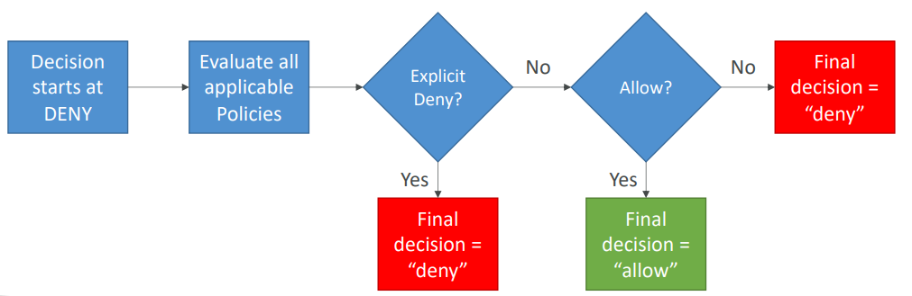
* IAM Policies & S3 Bucket Policies
  * IAM policies are attached to users, roles, groups
  * S3 bucket policies are attached to buckets
  * When evaluation if an IAM principal can perform an operation X on a bucket, the
  union of its assigned IAM policies and S3 bucket policies will be evaluated.
* Dynamic Policies with IAM
  * How do you assign each user a /home/<user> folder in a S3 bucket?
  * Create one dynamic policy with IAM and leverage the special policy variable
  ${aws:username}
* Inline vs managed policies
  * AWS managed policy
    * Maintained by AWS
    * Good for power users and administrators
    * Updated in case of new services/new APIs
  * Customer managed policy
    * Best practice, re-usable, can be applied to many principals
    * Version controlled + rollback, central change management
  * Inline
    * Strict one-to-one relationship between policy and principal
    * Policy is deleted if you delete the IAM principal
* Granting a user permissions to pass a role to an AWS service
  * To configure many AWS services, you must pass an IAM role to the service (this
  happens only once during setup)
  * The service will later assume the role and perform actions
  * Example of passing a role
    * To an EC2 instance
    * To a Lambda function
    * To an ECS task
    * To CodePipeline to allow it to invoke other services
  * For this, you need the IAM permission iam:PassRole
  * It often comes with iam:GetRole to view the role being passed
  * Can a role be passed to any service?
    * No, roles can only be passed to what their trust policy allows
* Directory services
  * What is Microsoft active directory (AD)?
    * Found on any Windows Server with AD Domain Services
    * Database of objects: User accounts, computers, printers, file shares, 
    security groups
    * Centralized security management, create account, assign permissions
    * Objects are organized in trees
    * A group of trees is a forest
  * AWS directory services
    * AWS managed Microsoft AD
      * Create your own AD in AWS, manage users locally, supports MFA
      * Establish "trust" connections with your on-premise AD
    * AD connector
      * Directory gateway (proxy) to redirect to on-premise AD
      * Users are managed on the on-premise AD
    * Simple AD
      * AD-compatible managed directory on AWS
      * Cannot be joined with on-premise AD

<h2>AWS Security</h2>
* Encryption
  * Encryption in flight (SSL)
    * Data is encrypted before sending and decrypted after receiving
    * SSL certificates help with encryption (HTTPS)
    * Encryption in flight ensures no MITM (man in the middle attack) can happen
  * Server side encryption at rest
    * Data is encrypted after being received by the server
    * Data is decrypted before being sent
    * It is stored in an encrypted form thanks to a key (usually a data key)
    * The encryption/decryption keys must be managed somewhere and the server
    must have access to it
  * Client side encryption
    * Data is encrypted by the client and never decrypted by the server
    * Data will be decrypted by a receiving client
    * The server should not be able to decrypt the data
    * Could leverage Envelope encryption
* AWS KMS (Key Management Service)
  * Anytime you hear "encryption" for an AWS service, it's most likely KMS
  * Easy way to control access to your data, AWS manages keys for us
  * Fully integrated with IAM for authorization
  * Seamlessly integrated into:
    * Amazon EBS: encrypt volumes
    * Amazon S3: Server side encryption of objects
    * Amazon Redshift: Encryption of data
    * Amazon RDS: encryption of data
    * Amazon SSM: Parameter store
    * Etc.
  * But you can also use the CLI/SDK
  * Customer Master Key (CMK) types
    * Symmetric (AES-256 keys)
      * First offering of KMS, single encryption key that is used to Encrypt 
      and Decrypt
      * AWS services that are integrated with KMS use symmetric CMKs
      * Necessary for envelope encryption
      * You never get access to the key unencrypted (must call KMS API to use)
    * Asymmetric (RSA & ECC key pairs)
      * Public (encrypt) and private key (decrypt) pair
      * Used for encrypt/decrypt or sign/verify operations
      * The public key is downloadable, but you can't access the private key 
      unencrypted
      * Use case: encryption outside of AWS by users who can't call the KMS API
  * AWS KMS (key management service)
    * Able to fully manage the keys & policies:
      * Create
      * Rotation policies
      * Disable
      * Enable
    * Able to audit key usage (using CloudTrail)
    * Three types of Customer Master Keys (CMK)
      * AWS managed service default CMK: free
      * User keys created in KMS: 1 dollar a month
      * User keys imported (must be 256-bit symmetric key): 1 dollar a month
    * Pay for API call to KMS (0.03 dollars per 10000 calls)
  * AWS KMS 101
    * Anytime you need to share sensitive information, use KMS
      * Database passwords
      * Credentials to external service
      * Private key of SSL certificates
    * The value in KMS is that the CMK used to encrypt data can never be retrieved
    by the user, and the CMK can be rotated for extra security
    * Never ever store your secrets in plaintext, especially in your code!
    * Encrypted secrets can be stored in the code/environment variables
    * KMS can only help in encrypting up to 4 KB of data per call
    * If data > 4 KB, use envelope encryption
    * To give access to KMS to someone
      * Make sure the key policy allows the user
      * Make sure the IAM policy allows the API calls
    * KMS keys are bound to a specific region
    * When you want to copy a volume/snapshot anything over to another region, then
    you'd use KMS ReEncrypt and specify a new key for the new region, so it'll get
    re-encrypted
  * KMS Key Policies
    * Control access to KMS keys, "similar" to S3 bucket policies
    * Difference: you cannot control access without them
    * Default KMS key policy:
      * Created if you don't provide a specific KMS key policy
      * Complete access to the key to the root user = entire AWS account
      * Give access to IAM policies to the KMS key
    * Custom KMS key policy:
      * Define users, roles that can access the KMS key
      * Define who can administer the key
      * Useful for cross-account access of your KMS key
    * Snapshots can be copied across accounts
      1. Create a snapshot, encrypted with your own CMK
      2. Attach a KMS key policy to authorize cross-account access
      3. Share the encrypted snapshot
      4. (in target) Create a copy of the Snapshot, encrypt it with a KMS key 
      in your account
      5. Create a volume from the snapshot
  * Envelope encryption
    * KMS encrypt API call has a limit of 4 KB
    * If you want to encrypt > 4 KB, we need to use Envelope Encryption
    * The main API that will help us is the GenerateDataKey API
    * Encryption SDK
      * The AWS Encryption SDK implements Envelope Encryption for us
      * The encryption SDK also exists as a CLI tool we can install
      * Implementations for Java, Python, C, Javascript
      * Feature - data key caching:
        * Re-use data keys instead of creating new ones for each encryption
        * Helps with reducing the number of calls to KMS with a security trade-off
        * Use LocalCryptoMaterialsCache (max age, max bytes, max number of messages)
  * KMS Symmetric - API summary
    * Encrypt: encrypt up to 4 KB of data through KMS
    * GenerateDataKey: generates a unique symmetric data key (DEK)
      * returns a plaintext copy of the data key and a copy that is encrypted under 
      the CMK that you specify
    * GenerateDataKeyWithoutPlaintext:
      * Generate a DEK to use at some point (not immediately)
      * DEK that is encrypted under the CMK that you specify (must use decrypt later)
    * Decrypt - decrypt up to 4 KB of data (including data encryption keys)
    * GenerateRandom - returns a random byte string
  * KMS Request Quotas
    * When you exceed a request quota, you get a ThrottlingException. To respond, use
    exponential backoff (backoff and retry)
    * For cryptographic operations, they share a quota. This includes requests made by 
    AWS on your behalf (ex. SSE-KMS)
    * For GenerateDataKey, consider using DEK caching from the Encryption SDK
    * You can request a Request Quotas increase through API or AWS support
    * All the following share quotas.
      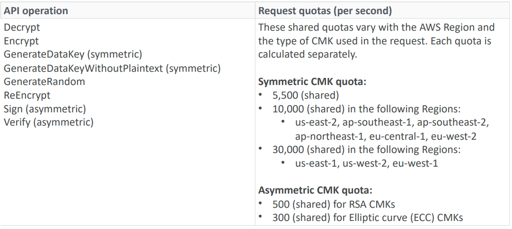
  * S3 Encryption for Objects
    * There are 4 methods of encrypting objects in S3
      * SSE-S3: encrypts S3 objects using keys handled & managed by AWS
      * SSE-KMS: leverage AWS key management service to manage encryption keys
      * SSE-C: when you want to manage your own encryption keys
      * Client side encryption
    * SSE-KMS
      * SSE-KMS: encryption using keys handled & managed by KMS
      * KMS advantages: user control + audit trail
      * Object is encrypted server side
      * Must set header: “x-amz-server-side-encryption": ”aws:kms"
        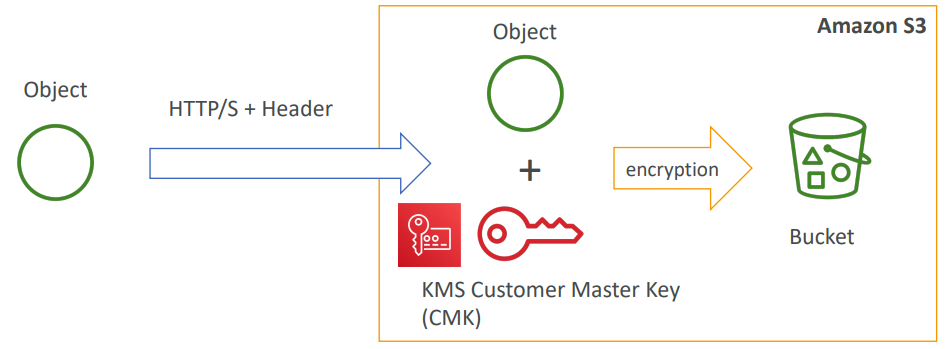
      * SSE-KMS leverages the GenerateDataKey & Decrypt KMS API calls
      * These KMS API calls will show up in CloudTrail, helpful for logging
      * To perform SSE-KMS, you need:
        * A KMS key policy that authorizes the user/role
        * An IAM policy that authorizes access to KMS
        * Otherwise you will get an access denied error
      * S3 calls to KMS for SSE-KMS count against your KMS limits
        * If throttling, try exponential backoff
        * If throttling, you can request an increase in KMS limits
        * The service throttling is KMS, not Amazon S3
      * S3 bucket policies - force SSL
        * To force SSl, create an S3 bucket policy with a DENY on the condition
        aws:SecureTransport=false
        * Note: Using allow on aws:SecureTransport=true would allow anonymous
        GetObject if using SSL
        * https://aws.amazon.com/premiumsupport/knowledge-center/s3-bucket-policy-for-config-rule/
          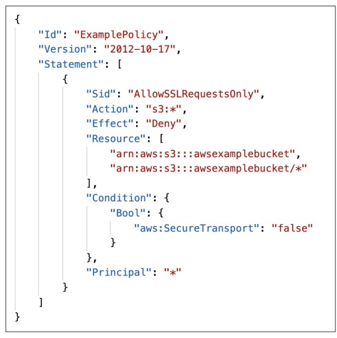
      * S3 bucket policy - force encryption of SSE-KMS
        1. Deny incorrect encryption header: make sure it includes aws:kms (===SSE-KMS)
        2. Deny no encryption header to ensure objects are not uploaded un-encrypted
        * Note: could swap 2 for S3 default encryption of SSE-KMS
          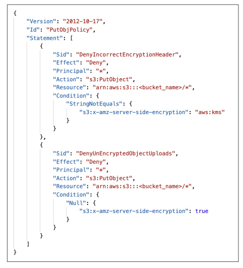
      * S3 bucket key for SSE-KMS encryption
        * New setting to decrease:
          * Number of API calls made to KMS from S3 by 99%
          * Costs of overall KMS encryption with Amazon S3 by 99%
        * This leverages data keys
          * A "S3 bucket key" is generated
          * That key is used to encrypt KMS objects with new data keys
        * You will see less KMS CloudTrail events in CloudTrail
          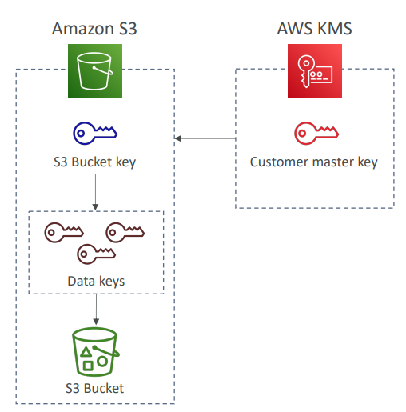
  * SSM parameter store
    * Secure storage for configuration and secrets
    * Optional seamless encryption using KMS
    * Serverless, scalable, durable, easy SDK
    * Version tracking of configurations/secrets
    * Configuration management using path & IAM
    * Notifications with CloudWatch events
    * Integration with CloudFormation
    * Storing them happens in a hierarchy like how folders are. Can reference
    them by path. Can also reference common AWS parameters by path
    * There's a standard and advanced tier
      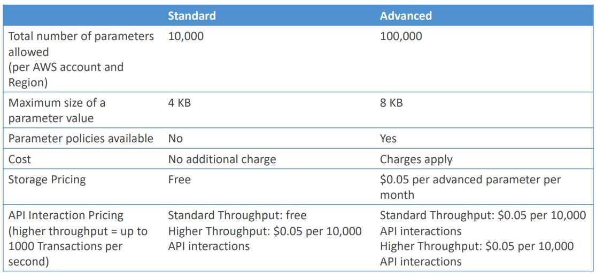
    * Parameter policies (for advanced parameters)
      * Allow to assign a TTL to a parameter (expiration date) to force updating
      or deleting sensitive data such as passwords
      * Can assign multiple policies at a time
        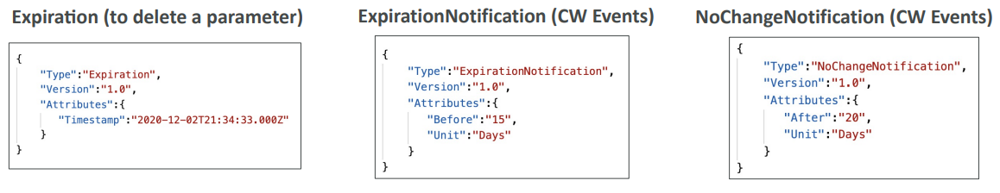
  * AWS Secrets Manager
    * Newer service, meant for storing secrets
    * Capability to force rotation of secrets every X days
    * Automate generation of secrets on rotation (uses Lambda)
    * Integration with Amazon RDS (MySQL, PostgreSQL, Aurora)
    * Secrets are encrypted using KMS
    * Mostly meant for RDS integration
  * SSM parameter store vs secrets manager
    * Secrets Manager ($$$ more expensive):
      * Automatic rotation of secrets with AWS Lambda
      * Lambda function is provided for RDS, Redshift, DocumentDB
      * KMS encryption is mandatory
      * Can integrate with CloudFormation
    * SSM parameter store ($):
      * Simple API
      * No secret rotation (can enable rotation using Lambda triggered by CW events)
      * KMS encryption is optional
      * Can integrate with CloudFormation
      * Can pull a Secrets Manager secret using the SSM parameter store API
        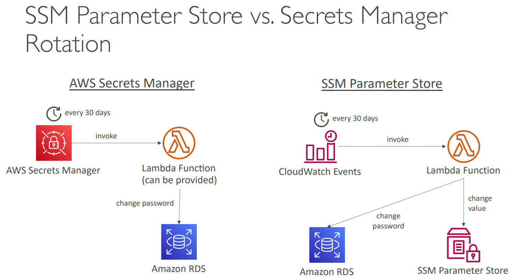
  * CloudWatch Logs - encryption
    * You can encrypt CloudWatch logs with KMS keys
    * Encryption is enabled at the log group level, by associating a CMK with a
    log group, either when you create the log group or after it exists
    * You cannot associate a CMK with a log group using the CloudWatch console
    * You must use the CloudWatch Logs API:
      * associate-kms-key: if the log group already exists
      * create-log-group: if the log group doesn't exist yet
  * CodeBuild security
    * To access resources in your VPC, make sure you specify a VPC configuration for 
    your CodeBuild
    * Secrets in CodeBuild:
      * Don't store them as plaintext in environment variables
      * Instead
        * Environment variables can reference parameter store parameters
        * Environment variables can reference secrets manager secrets

<h2>Other Services</h2>
**AWS SES - Simple Email Service**
* Send emails to people using:
  * SMTP interface
  * AWS SDK
* Ability to receive email. Integrates with:
  * S3
  * SNS
  * Lambda
* Integrated with IAM for allowing to send emails

**AWS Databases Summary**
* RDS: Relational databases, OLTP
  * PostgreSQL, MySQL, Oracle etc.
  * Aurora + Aurora Serverless
  * Provisioned database
* DynamoDB: NoSQL DB
  * Managed, Key value, Document
  * Serverless
* ElastiCache: In memory DB
  * Redis/Memcached
  * Cache capability
* Redshift: OLAP - Analytic processing
  * Data warehousing/Data lake
  * Analytics queries
* Neptune: Graph database
* DMS: Database migration service
* DocumentDB: managed MongoDB for AWS

**AWS Certificate Manager (ACM)**
* Lets you easily provision, manage, and deploy SSL/TLS certificates
* Used to provide in-flight encryption for websites (HTTPS)
* Supports both public and private TLS certificates
* Free of charge for public TLS certificates
* Automatic TLS certificate renewal
* Integrations with (load TLS certificates on)
  * Elastic load balancers
  * CloudFront distributions
  * APIs on API Gateway

**AWS Cloud Map**
* A fully managed resource discovery service
* Creates a map of the backend services/resources that your applications depend on
* You register your application components, their locations, attributes, and health
status with AWS Cloud Map
* Integrated health checking (stop sending traffic to unhealthy endpoints)
* Your applications can query AWS Cloud Map using AWS SDK, API, or DNS
  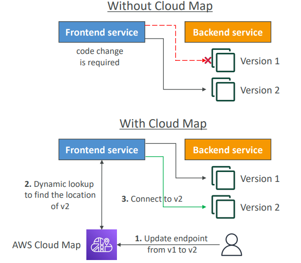

**AWS Fault Injection Simulator (FIS)**
* A fully managed service for running fault injection experiments on AWS workloads
* Based on Chaos Engineering - stressing an application by creating disruptive events
  (e.g. sudden increase in CPU or memory), observing how the system responds, and 
implementing improvements
* Helps uncover hidden bugs or performance bottlenecks
* Supports the following AWS services: EC2, ECS, EKS, RDS etc.
* Use pre-built templates that generate the desired disruptions