<h2>AWS Regions</h2>
Region (us-east-1) -> Availability Zones (us-east-1a, us-east-1b)

AWS has regions all around the world. It's just what it says, a region somewhere in the world.
Ex us-east-1. Each region has their own data. So data that's stored in one region
doesn't automatically become accessible in another region.

Each region has availability zones. Ex. us-east-1a, us-east-1b. Each availability zone represents
a physical data center in the region. But they're physically separate from one another. Try and 
minimize threat from physical damage. Ex. disasters. They are still connected
with each other with a high bandwidth, ultra-low latency network.

AWS Consoles are region scoped (except IAM, Route 53, Cloudfront, WAF). When you perform an action 
it will be performed in the specific region.

Choosing an AWS region:
* **Compliance with data governance and legal requirements**: e.g. data never leaves a region
without explicit permission
* **Proximity** to customers: reduced latency
* **Available services** within a region: new services and new features aren't available in 
every region.
* **Pricing**: pricing varies region to region and is transparent in the service pricing page

<h2>IAM (Identity and Access Management)</h2>
This is where the AWS security is.
* Users - physical people
* Groups - made up of users. Users can belong to multiple groups.
* Roles

Root account should never be used (and shared). Only use it for the very first time to
create an account and then never again.

**Users** are usually physical people. They are grouped into **groups**, usually by function, team
or something similar.

**Roles** are given to machines. They're for internal usage within AWS resources.

Policies are defined as JSON for those above entities. It defines what each of the above
can and cannot do. It's always good to give the users the minimal amount of permissions
they need to perform their job (least privilege principles). There are pre-defined
policies. But you can also define your own custom policies. Amazon has a
policy simulator service that you can use to test your policies. Could also use
the AWS CLI. Some commands have the **--dry-run** option to simulate the
running of the command.


Multi factor authentication can be setup. Additionally there are predefined policies, that 
can be used.

IAM Federation is something that big enterprises can use. It integrates their own repository
of users with IAM. This way people can use their corporate logins in AWS. It uses the SAML
standard (Active Directory).

So the basic rules are:
* One IAM User per PHYSICAL PERSON
* One IAM Role per Application
* IAM credentials should never be shared
* Never write IAM credentials in code
* Never use ROOT account except for initial setup
* Never use ROOT IAM credentials

Permissions should be applied using groups, as it's more easily manageable. 
The users are put into groups from which they extend permissions.

IAM password policy can be applied to make sure that the users create strong 
passwords.

To access AWS, you have three options:
* AWS Management Console: protected by password + MFA
* AWS Command Line Interface (CLI): protected by access keys
* AWS Software Developer Kit (SDK) - for code: protected by access keys
    * Java
    * .Net
    * Node.js
    * PHP
    * Python (language of the AWS CLI)
    * Go
    * Ruby
    * C++
    * If you don't specify or configure a default region, then us-east-1
    will be chosen by default

AWS CloudShell is a terminal inside of AWS, that's essentially CLI, but in the browser. All the files
that you create inside CloudShell will be kept between sessions.

When you run API calls from the CLI and they fail, then you get a long error
message. This message can be decoded using the STS command line 
`sts decode-authorization-message`.

If you want to register another profile, then you can do so using 
`aws configure --profile <new-profile-name>`. When running commands, you have
to include the new profile for it to be used. 
`aws s3 ls --profile <new-profile-name>`

If you need to get a MFA session token, then you can run 
`aws sts get-session-token --serial-number <arn-of-mfa> --token-code <current-code>`.
To get the `<arn-of-mfa>` you have to go to your profile on Amazon and check
the MFA device ARN. In response to the request you get a JSON, which contains
an `AccessKeyId`, `SecretAccessKey`, `SessionToken`. Then you have to configure
a profile `aws configure --profile <name>`. Could go with `mfa` for the name.
Once the profile is created, then you have to open up `~/.aws/credentials` and in
it you have to add `aws_session_token = <SessionToken value>`. So whenever
you do an API call, then you can use `--profile <MFA profile name>`

**AWS CLI Credentials Provider Chain**
* The CLI will look for credentials in this order
    1. Command line options - --region, --output, and --profile
    2. Environment variables - AWS_ACCESS_KEY_ID, AWS_SECRET_ACCESS_KEY,
    and AWS_SESSION_TOKEN
    3. CLI credentials file - aws configure ~/.aws/credentials on Linux/Mac
    & C:\Users\user\.aws\credentials on Windows
    4. CLI configuration file - aws configure ~/.aws/config on Linux/Mac &
    C:\Users\USERNAME\.aws\config on Windows
    5. Container credentials - for ECS tasks
    6. Instance profile credentials - for EC2 instance profiles
* The Java SDK (example) will look for credentials in this order
    1. Java system properties - aws.accessKeyId and aws.secretKey
    2. Environment variables - AWS_ACCESS_KEY_ID and AWS_SECRET_ACCESS_KEY
    3. The default credential profiles file - ex. at: ~/.aws/credentials,
    shared by many SDK
    4. Amazon ECS container credentials - for ECS containers
    5. Instance profile credentials - used on EC2 instances
* NEVER EVER STORE AWS CREDENTIALS IN YOUR CODE
* Best practice is for credentials to be inherited from the credentials chain
* If using working within AWS, use IAM Roles
    * => EC2 instances roles for EC2 instances
    * => ECS roles for ECS tasks
    * => Lambda roles for Lambda functions
* If working outside of AWS, use environment variables/named profiles

**Signing AWS API requests**
* When you call the AWS HTTP API, you sign the request so that AWS can 
identify you, using your AWS credentials (access key & secret key)
* Note: some requests to Amazon S3 don't need to be signed
* If you use the SDK or CLI, the HTTP requests are signed for you
* You should sign an AWS HTTP request using Signature V4 (SigV4)
    * You either put the inside of the HTTP header, or add it to the
    URL with query params

**AWS Limits (Quotas)**
* API Rate Limits - how many times you can call an AWS API in a row
    * Ex. DescribeInstances API for EC2 has a limit of 100 calls per second
    * Ex. GetObject on S3 has a limit of 5500 GET per second per prefix
    * When we go over this we get an Intermittent Error because we'll be throttled
      so we have to implement an Exponential backoff
        * If you get ThrottlingException intermittently, use exponential backoff
        * Retry mechanism already included in AWS SDK API calls
        * Must implement yourself if using the AWS API as-is or in specific cases
            * Must only implement the retries on 5XX service errors and throttling
            * Do not implement on the 4XX client errors
        * Exponential backoff keeps doubling the request time for retries. First
        1 sec, then 2, then 4, then 8, then 16 and hopefully it spreads out the
        requests.
    * If we are consistently getting these errors, then we should request for
    an API throttling limit increase to make sure we can issue more
* Service quotas (service limits) - how many resources of something we can run
    * Ex. running on-demand standard instances 1152 vCPU
    * You can request a service limit increase by opening a ticket
    * You can request a service quota increase by using the Service Quotas API
    to do it programmatically

Access Advisor can be used to check what services have been used and so it helps in deciding how many
privileges do you actually need.

**IAM Section - Summary**
* Users: mapped to a physical user, has a password for AWS console
* Groups: contains users only
* Policies: JSON document that outlines permissions for users or groups
* Roles: for EC2 instances or AWS services
* Security: MFA + Password policy
* Access keys: access AWS using the CLI or SDK
* Audi: IAM Credential reports & IAM Access advisor

<h2>EC2</h2>

It consists of:
* Renting virtual machines (EC2)
* Storing data on virtual drives (EBS)
* Distributing load across machines (ELB)
* Scaling the services using an auto-scaling group (ASG)

EC2 sizing & configuration options
* Operating system
* How much compute power & cores (CPU)
* How much random-access memory (RAM)
* How much storage space:
  * Network-attached (EBS & EFS)
  * Hardware (EC2 instance store)
* Network card: speed of the card, public IP address
* Firewall rules: security group
* Bootstrap script (only runs on first ever launch): EC2 user data

The first part of creating an image is choosing an operating system for the machine.
Amazon Linux comes with a lot of Amazon features and it's kind of the way that 
Amazon imagines you using the services, so it's a good place to start. 
Additionally, custom images can be used. AMI are built for a specific AWS
region.

Then you have to select the type, which means how powerful your machine should be.
Different instances are specialized for different things. R/C/P/G/H/X/I/F/Z/CR 
are specialized in RAM, CPU, I/O, Network, and/or GPU. M instance types are
balanced. So they do everything decently, but doesn't excel at anything.
T2/T3 instance types are "burstable". Burstable means that the instance has
OK CPU performance, but when it needs to process something unexpected (a 
spike in load for example), it can burst, and the CPU can be VERY good.
If the machine bursts, it utilizes "burst credits". If all the credits are gone,
then the CPU becomes BDA. If the machine stops bursting, credits are accumulated
over time. If your instance consistenly runs low on credit, you need to move
to a different kind of non-burstable instance. T2 unlimited can be used for 
unlimited burst credit balance, but you pay extra for going over the credit 
balance.


Tags can be added to make identifying the instance easier.

With EC2 connect behind the scenes AWS will generate a key to connect to 
it temporarily. If SSH is turned off, then it won't work. It works using
Amazon Linux 2 AMI (Amazon Machine Images).

Elastic IP can be used to give an EC2 machine a static IP. It can be attached
to a single machine at a time. By default the EC2 IP can change with each 
restart. This often reflects poor architectural decisions, so it would be
better to avoid it. Instead, use a random public IP and register a DNS name
to it. Or we can use a load balancer and not use a public IP at all.

Having an Elastic IP on your account, even if unassociated, will cost money.

<h2>Security Group</h2>
The fundamental of network security in AWS. They control how traffic is allowed 
into or out of our EC2 Machines. They are like the firewall for EC2 instances.


Inbound rules are used to control traffic coming in and outbound traffic is
used to define the traffic going out of the machine.

Security groups can be attached to multiple instances. They're locked to region
/VPC combination. It lives outside of the EC2 instance, so traffic that is blocked
is not visible in the EC2 instance.

**It's good to maintain one separate security group for SSH access.**

If you get a timeout when trying to connect, then it's a security group issue.

If you get a "connection refused" error, then it's an application error or it's
not launched.

By default all inbound traffic is blocked and all outbound traffic is allowed.

Security groups can be referenced from other security groups. This can be used
to allow other EC2 instances to connect to another EC2 instance without dealing
with IPs.


**Never enter your access keys into an EC2 instance as someone else could retrieve
them from it. Instead, use IAM roles.**


<h2>EC2 User Data</h2>
EC2 user data scripts can be used to bootstrap our instances. That is launching
commands when a machine starts. The script is run only once at the instance
first start. It runs with the sudo rights.
EC2 user data is used to automate boot tasks such as:
* Installing updates
* Installing software
* Downloading common files from the internet
* Anything you can think of

Under `Configure details` you can find `User data` under `Advanced details`.

If you want to get metadata about your EC2 instance using the command line,
then it is possible to connect to the EC2 instance using SSH and on it you 
can run a `curl http://169.254.169.254/latest/meta-data` and it'll provide
you with all sorts of different things that you might be interested in.
Example `curl http://169.254.169.254/latest/meta-data/instance-id`.

<h2>EC2 Instance Launch Types</h2>
**On demand instances - short workload, predictable pricing. Great for elastic
workloads. That is a system that's able to adapt to the required workload.**
* Pay for what you use (billing per second, after the first minute)
* Has the highest cost but no upfront payment
* No long term commitment
* Recommended for short-term and un-interrupted workloads, where you 
can't predict how the application will behave.

**Reserved (Minimum 1 year) - closer to regular IT.**

**Reserved instances - long workloads**
* Up to 75% discount compared to On-demand.
* Pay upfront for what you use with long term commitment.
* Reservation period can be 1 or 3 years.
* Reserve a specific instance type.
* Recommended for steady state usage applications (think database).

**Convertible reserved instances: long workloads with flexible instances**
* Can change the EC2 instance type
* Up to 54% discount

**Scheduled reserved instances (deprecated): example - every Thursday between 3 and 6 PM**
* launch within time window you reserve
* when you require a fraction of day / week / month

**Spot instances - short workloads, for cheap, can lose instances (less reliable)**
* Can get a discount of up to 90% compared to On-demand
* Instances that you can lose at any point of time if your max price is less
than the current spot price.
* The MOST cost-efficient instances in AWS
* Useful for workloads that are resilient to failure. Ex: batch jobs,
data analysis, image processing
* Not great for critical jobs or databases
* You specify the maximum price that you are willing to pay. When you reserve
then you'll be paying the current price and your spot will be kept as long as
the current price remains under your set maximum price.

**Great combo: Reserved instances for baseline + On-Demand & Spot
(based on failure resilience) for peaks**

**Dedicated instances - no other customers will share your hardware**
* Instances running on hardware that's dedicated to you
* May share hardware with other instances in same account
* No control over instance placement (can move hardware after Stop / Start)

**Dedicated hosts - book an entire physical server, control instance placement**
* Physical dedicated EC2 server for your use
* Full control of EC2 instance placement
* Visibility into the underlying sockets / physical cores of the hardware
* Allocated for your account for a 3 year period reservation
* More expensive
* Useful for software that have complicated licensing model.
* Or for companies that have strong regulatory or compliance needs. That is,
cannot share hardware with other customers.

**Which host is right for me?**
* On demand - coming and staying in resort whenever we like, we pay the full
price.
* Reserved - like planning ahead and if we plant to stay for a long time, we
may get a good discount.
* Spot instances - the hotel allows people to bid for the empty rooms and the
highest bidder keeps the rooms. You can get kicked out at any time.
* Dedicated hosts - we book an entire building of the resort.

You do not pay for an instance, if that instance is stopped.

Price Comparison
Example – m4.large – us-east-1

| Price Type  | Price (per hour)  |
|---|---|
|On-demand   | $0.10  |
|Spot Instance (Spot Price) | $0.032 - $0.045 (up to 90% off)|
| Spot Block (1 to 6 hours) | ~ Spot Price |
| Reserved Instance (12 months) – no upfront | $0.062 |
| Reserved Instance (12 months) – all upfront | $0.058 |
| Reserved Instance (36 months) – no upfront | $0.043 |
| Reserved Convertible Instance (12 months) – no upfront | $0.071 |
| Reserved Dedicated Instance (12 months) – all upfront | $0.064 |
| Reserved Scheduled Instance (recurring schedule on 12 months term) | $0.090 – $0.095 (5%-10% off) |
| Dedicated Host | On-demand price |
| Dedicated Host Reservation | Up to 70% off |

**Elastic Network Interfaces (ENI)**
* Logical component in a VPC (<i>Virtual Private Cloud. Just a network that 
you have on the cloud</i>) that represents a virtual network card
(<i>Network card is a piece of hardware that the computer uses to connect 
to the internet</i>). It's what gives EC2 instances access to the network.
* The ENI can have the following attributes:
    * Primary private IPv4, one or more secondary IPv4
    * One Elastic IP(IPv4) per private IPv4
    * One Public IPv4
    * One or more security groups
    * A MAC address
* ENI can be created independently and attach them on the fly on EC2 instances
for failover. That is, you can move that private IPv4 over to another EC2
instances so that the system would start using that instead of the failing one.
* They're bound to specific availability zones.

<h2> Scalability & High Availability </h2>

* Scalability means that an application / system can handle greater loads by
adapting.
* There are two kinds of scalability:
    * Vertical scalability - increasing the size of the instance. For example
    running on t2.micro and then changing to t2.large. RDS, ElastiCache are services
    that can scale vertically. There's a hardware limit how much you can 
    vertically scale. Common for a non-distributed system, ex. database.
    * Horizontal scalability (=elasticity) - increasing the number of instances
    / systems for your application. Used for distributed systems. Common for
    web applications / modern applications. 
* Scalability is linked but different to High Availability.
* High availability means running your application / system in at least 2 data 
centers (= Availability Zones). The goal is to survive a data center loss.

<h4>Load balancing</h4>
Load balances are servers that forward internet traffic to multiple servers
(EC2 Instances) downstream. It does regular health checks to your instance.
It provides high availability across zones. It cleanly separates public
traffic from private traffic.

The reasons for using an EC2 Load Balancer are:
* Spread load across multiple downstream instances
* Expose a single point of access (DNS) to your application
* Seamlessly handle failures of downstream instances
* Provide SSL termination (HTTPS) on your websites
* Separate public traffic from private traffic
* An ELB (EC2 Load Balancer) is a managed load balancer, which means
    * AWS guarantees that it will be working
    * AWS takes care of upgrades, maintenance, high availability
    * AWS provides only a few configuration knobs
* It costs less to setup your own load balancer, but it will be a lot more
effort on your end.
* It is integrated with many AWS offerings/services.

The health checks are run on a specific port and route. (/health is common)
If the response is not 200, then the instance is deemed unhealthy.

AWS has 3 kinds of managed Load Balancers
* Classic Load Balancer (v1 - old generation) - 2009
    * HTTP, HTTPS (Layer 7), TCP (Layer 4)
    * Health checks are TCP or HTTP based
    * Fixed hostname XXX.region.elb.amazonaws.com
* Application Load Balancer (v2 - new generation) - 2016
    * HTTP, HTTPS, WebSocket (Layer 7)
    * Load balancing to multiple HTTP applications across machines (target groups)
    * Load balancing to multiple applications on the same machine (ex. containers)
    * Support redirects (from HTTP to HTTPS for example)
    * Routing tables to different target groups:
        * Routing based on path in URL (example.com/**users** and example.com/**posts**)
        * Routing based on hostname in URL (**one.example.com** and **other.example.com**)
        * Routing based on query string, headers (example.com/users?**id=123&order=false**)
    * ALB is a great fit for micro services & container based applications (ex. Docker and Amazon ECS)
    * Has a port mapping feature to redirect to a dynamic port in ECS.
    * Can control where traffic goes from the `Listeners` tab.
    * Target groups
        * EC 2 instances (can be managed by an Auto Scaling Group) - HTTP
        * ECS tasks (managed by ECS itself) - HTTP
        * Lambda functions - HTTP request is translated into a JSON event
        * IP addresses - must be private IPs
        * ALB can route to multiple target groups
        * Health checks are at the target group level


* Network Load Balancer (v2 - new generation) - 2017
    * TCP, TLS (secure TCP), UDP (Layer 4)
        * Forward TCP & UDP traffic to your instances
        * Handle millions of requests per second. Higher performance than ALB.
        * Less latency ~100 ms (vs 400 ms for ALB)
    * NLB has one static IP per AZ, and supports assigning Elastic IP (helpful for 
    whitelisting specific IP). ALB and CLB do not have a static IP.
    * NLB are used for extreme performance/TCP or UDP traffic.
    * Not included in the AWS free tier
    * With NLBs, the instances do not see traffic coming from the NLB, but they see it as
    coming from the outside. Have to add a rule to allow TCP traffic from anywhere.
* Gateway load balancer - 2020 - GWLB
    * Operates at layer 3 (network layer) - IP protocol 
* Overall it's better to use V2 as they provide newer features.
* You can setup interval(private) or external(public) ELBs.


The source references the load balancer security group ID.


**Load balancer good to know**
* LBs can scale but not instantaneously - contact AWS for a "warm-up"
* Troubleshooting
    * 4xx errors are client induced errors
    * 5xx errors are application induced errors
    * Load Balancer Errors 503 means at capacity or no registered target
    * If the LB can't connect to your application, check your security groups
* Monitoring
    * ELB access logs will log all access requests
    * CloudWatch Metrics will give you aggregate statistics

With the load balancer, you'd turn off access to your EC2 access directly.
So HTTP traffic would only be allowed if it's coming from the ELB and not
directly from the client.

**Application load balance (v2) target groups**
* EC2 instances (can be managed by an Auto Scaling Group) - HTTP
* ECS tasks (managed by ECS itself) - HTTP
* Lambda functions - HTTP request is translated into a JSON event
* IP Addresses - must be private IPs
* Health checks are at the target group level

**ALB v2 good to know**
* Fixed hostname (XXX.region.elb.amazonaws.com)
* The application servers don't see the IP of the client directly
    * The true IP of the client is inserted in the header X-Forwarded-For
    * We can also get Port (X-Forwarded-Port) and protocol (X-Forwarded-Proto)

**ALB Configuring**
1) Open EC2 configuration, go into load balancers, select Application Load Balancer.
2) Configure the generic information, then select the AZs you want it to work in.
3) Check your target group after configuring to make sure instances are there. Target group
defines the instances that it applies to.
    
**Load balancer stickiness**
* It is possible to implement stickiness so that the same client is always redirected to
the same instance behind a load balancer
* Works for CLB and ALB
* Uses a cookie for this
    * Application-based cookies
        * Duration specified by the application 
        * Custom cookie
            * Generated by the target
            * Can include any custom attributes required by the application
            * Cookie name must be specified individually for each target group
        * Application cookie
            * Generated by the load balancer
            * Cookie name is AWSALBAPP
    * Duration-based cookies
        * Cookie generated by the load balancer
        * Duration specified by the load balancer
        * Cookie name is AWSALB for ALB, AWSELB for CLB 
* Use case: make sure the user doesn't lose his session data
* Enabling stickiness may bring imbalance to the load over the backend EC2 instances
* It can be set under `Load Balancing -> Target Groups -> Attributes -> Stickiness`
* When you access the site, then the first request that reaches an EC2 instance decides which
EC2 you get stuck on. It then has an expiration time, after which a new EC2 instance is chosen.

**Cross-zone load balancing**

* CLB - disabled by default via CLI/API, enabled by default via console, 
  no charges for inter AZ data if enabled
* ALB - always on (can't be disabled), no charges for inter AZ data
* NLB - disabled by default, you pay charges for inter AZ data if enabled

**SSL certificates**
* SSL/TLS basics
    * An SSL certificate allows traffic between your clients and your load balancer to be
    encrypted in transit (in-flight encryption)
    * SSL refers to Secure Sockets Layer, used to encrypt connections
    * TLS refers to Transport Layer Security, which is a newer version
    * Nowadays, TLS certificates are mainly used, but people still refer as SSL
    * Public SSL certificates are issued by Certificate Authorities (CA)
    * SSL certificates have an expiration date (you set) and must be renewed
    
    * The load balancer uses an X.509 certificate (SSL/TLS server certificate)
    * You can manage certificates using ACM (AWS Certificate Manager)
    * You can upload your own certificates to ACM alternatively
    * When you set up a HTTPS listener, then:
        * You must specify a default certificate
        * You can add an optional list of certs to support multiple domains
        * Clients can use SNI (Server Name Indication) to specify the hostname they reach.
        * Ability to specify a security policy to support older versions of SSL / TLS (legacy clients)
* SNI
    * SNI solves the problem of loading multiple SSL certificates onto one web server 
    (to serve multiple websites)    
    * It's a newer protocol, and requires the client to indicate the hostname of the target
    server in the initial SSL handshake
    * The server will then find the correct certificate, or return the default one
    * Only works for ALB & NLB (newer generation), CloudFront
    
* You can setup SSL under listeners under load balancers. You specify HTTPS, cipher, which is
the protocols we want to support, and then setup the certificate.

**ELB - Connection Draining**
* Feature naming:
    * For CLBs: Connection draining
    * For ALBs and NLBs: Target Group: Deregistration delay
* It is the time to complete 'in-flight requests' while the instance is de-registering or 
unhealthy. That is it waits for existing connections to complete. The default is 300 seconds.
* When the instance is in deregistring mode then the load balancer stops sending new requests
to the instance which is deregistring.
* Between 1 to 3600 seconds, default is 300 seconds. Can be disabled by setting it to 0.
* Set to a low value if your requests are short. E.g. you don't expect any request to last more
than 20 seconds, then set it to 20 seconds.


**Auto scaling groups (ASG)**
* In real-life, the load on your websites and applications can change.
* The goal of an Auto Scaling Group (ASG) is to:
    * Scale out (add EC2 instances) to match an increased load.
    * Scale in (remove EC2 instances) to match a decreased load.
    * Ensure we have a minimum and a maximum number of machines running. The point being that
    it wouldn't scale too high or too low, so you set an upper and lower limit to how many machines
    should/can be run.
    * Automatically register new instances to a load balancer.
    * Size parameters:
        * minimum size (the number of instances you'll have running for sure)
        * actual size / desired capacity (the number of instances running at the current moment)
        * maximum size (how many instances can be added to scale out)
* ASGs have the following attributes:
    * A launch configuration:
        * AMI + Instance type
        * EC2 User Data
        * EBS Volumes
        * Security Groups
        * SSH Key Pair
    * Min size / Max size / Initial capacity
    * Network + subnets information
    * Load balancer information
    * Scaling policies
* It is possible to scale an ASG based on CloudWatch alarms.
* An alarm monitors a metric (such as Average CPU)
* Metrics are computed for the overall ASG instances.
* Based on the alarm:
    * We can create scale-out policies (increase the number of instances)
    * We can create scale-in policies (decrease the number of instances)
* With the new ASGs you can define "better" auto scaling rules that are directly managed
by EC2. These are the new rules. They're better in the sense that they are easier to set 
up and can make more sense.
    * Target average CPU usage
    * Number of requests on the ELB per instance
    * Average network in
    * Average network out
* We can auto scale based on a custom metric (ex. number of connected users, users' schedule)
    1) We send our custom metric from application on EC2 to CloudWatch (PutMetric API)
    2) Create CloudWatch alarm to react to low/high values
    3) Use the CloudWatch alarm as the scaling policy for ASG 
* ASGs use launch configurations or launch templates (newer)
* To update an ASG, you must provide a new launch configuration/launch template
* IAM roles attached to an ASG will get assigned to EC2 instances
* ASGs are free. You pay for the underlying resources being launched
* Having instances under an ASG means that if they get terminated for whatever reason, then
the ASG will automatically create new ones for replacement, providing extra safety.
* ASG can terminate instances marked as unhealthy by a load balancer (and hence replace them)

**ASG - Scaling Policies**
* Target tracking scaling
    * Most simple and easy to set up
    * Example: I want the average ASG CPU to stay at around 40%
* Simple/Step scaling
    * When a CloudWatch alarm is triggered (example CPU > 70%), then add 2 units
    * When a CloudWatch alarm is triggered (example CPU < 30%), then remove 1 unit
* Scheduled Actions
    * Anticipate a scaling based on known usage patterns
    * Example: increase the min capacity to 10 at 5 pm on Fridays
* Predictive scaling - continuously forecast load and schedule scaling ahead using machine learning.
* Good metrics to scale on
    * CPUUtilization - average CPU utilization across your instances
    * RequestCountPerTarget - number of requests per EC2 instance is stable
    * Average network I/O
    * Any custom metric using Cloudwatch

**ASG - Scaling Cooldowns**
* The cooldown period helps to ensure that your Auto Scaling Group doesn't launch or
terminate additional instances before the previous scaling activity takes effect
* In addition to default cooldown for Auto Scaling Group, we can create cooldowns
that apply to a specific simple scaling policy
* A scaling-specific cooldown period overrides the default cooldown period.
* One common use for scaling-specific cooldowns is with a scale-in policy - a policy that
terminates instances based on a specific criteria or metric. Because this policy terminates
instances, Amazon EC2 Auto Scaling needs less time to determine whether to terminate additional
instances.
* If the default cooldown period of 300 seconds is too long - you can reduce costs by 
applying a scaling-specific cooldown period of 180 seconds to the scale-in policy
* If your application is scaling up and down multiple times each hour, modify the ASG
cooldown timers and the CloudWatch alarm period that triggers the scale in.

<h2>EC2 instance storage</h2>

**EBS(Elastic Block Store) Volume**
* An EC2 machine loses its root volume(main drive) when it is manually terminated
* Unexpected terminations might happen from time to time (AWS would email you)
* Sometimes, you need a way to store your instance data somewhere
* An EBS (Elastic Block Store) Volume is a network drive you can attach to your instances
while they run.
* It allows your instances to persist data. E.g. database data.
* It's a network drive (i.e. not a physical drive)
    * It uses the network to communicate to the instance, which means there might be a bit
    of latency
    * It can be detached from an EC2 instance and attached to another one quickly.
* It's locked to an Availability Zone(AZ)
    * An EBS Volume in us-east-1a cannot be attached to us-east-1b
    * To move a volume across, you first need to snapshot it
* Have a provisioned capacity (size in GBs, and IOPS)
    * You get billed for all the provisioned capacity, not the amount you actually use.
    * You can increase the capacity of the drive over time, so it's a good idea to start
    small and increase the capacity as you need it.
* EBS Volumes come in 6 types
    * GP2/GP3 (SSD): General purpose SSD volume that balances price and performance for a 
    wide variety of workloads.
        * Cost effective storage, low-latency
        * System boot volumes, virtual desktops, development and test environments
        * 1 GB - 16 TB
        * GP3 baseline of 3000 IOPS and throughput of 125 MB/s, can increase IOPS
        up to 16000 and throughput up to 1000 MB/s independently
        * GP2 small volumes can burst IOPS to 3000. Size of the volume and IOPS are
        linked, max IOPS is 16000. 3 IOPS per GB, so at 5334 GB we are at max IOPS.
    * IO1/IO2 (SSD): Highest-performance SSD volume for mission-critical low-latency or
    high-throughput workloads.
        * Critical business applications with sustained IOPS performance, or applications
          that need more than 16000 IOPS
        * Great for database workloads (sensitive to storage perf and consistency)
        * IO1/IO2:
          * 4 GB - 16 TB
          * Max PIOPS 64000 for Nitro EC2 instances & 32000 for other
          * Can increase PIOPS independently from storage size
          * IO2 have more durability and more IOPS per GB (at the same price as IO1, so makes
          sense to just use IO2 nowadays.)
        * IO2 block express (4 GB - 64 TB)
          * Sub-millisecond latency
          * Max PIOPS 256000 with an IOPS:GB ratio of 1000:1
        * Support EBS multi-attach
          * Attach the same EBS volume to multiple EC2 instances in the same AZ.
          * Each instance has full read & write permissions to the volume
          * Achieve higher application availability in clustered Linux applications
          * Applications must manage concurrent write operations
          * Must use a file system that's cluster-aware
    * STI (HDD): Low cost HDD volume designed for frequently accessed, throughput-intensive
    workloads.
      * Cannot be a boot volume
      * 125 MB to 16 TB
      * For big data, data warehouses, log processing
      * Max throughput 500 MB/s - max IOPS 500
    * SCI (HDD): Lowest cost HDD volume designed for less frequently accessed workloads.
      * For data that is infrequently accessed
      * Scenarios where lowest cost is important
      * Max throughput 250 MB/s - max IOPS 250
* EBS Volumes are characterized in Size | Throughput | IOPS (I/O Ops Per Sec)
* When in doubt always consult the AWS documentation.
* When you create an instance, then only GP2/GP3 and IO1/IO2 can be used as boot volumes

When you create an instance, then currently "Step 4: Add Storage" is where you can add an
EBS volume. Can select a snapshot you want to restore from.

Have to make the volume manually available. So have to mount it in the instance. AWS
has a guide on how to do that.

**EBS snapshots**
* Make a backup (snapshot) of your EBS volume at a point in time
* Not necessary to detach volume to do snapshot, but recommended
* Can copy snapshots across AZ or Region

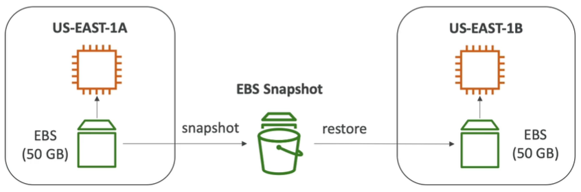

**AMI (Amazon Machine Image)**
* AMI is a customization of an EC2 instance
  * You add your own software, configuration, operating system, monitoring etc.
  * Faster boot/configuration time because all your software is pre-packaged
* AMI is built for a specific region (and can be copied across regions)
* You can launch EC2 instances from:
  * A public AMI: AWS provided
  * Your own AMI: you make and maintain them yourself
  * An AWS marketplace AMI: an AMI someone else made (and potentially sells)

**AMI process**
* Start an EC2 instance and customize it
* Stop the instance (for data integrity)
* Build an AMI - this will also create EBS snapshots
* Launch instances from other AMIs


**EC2 instance store**
* EBS volumes are network drives with good but "limited" performance
* If you need a high performance hardware disc, use an EC2 instance store
  * Better I/O performance
  * Cleared after EC2 instance stopped (ephemeral)
  * Good for buffer/cache/scratch data/temporary content
  * Risk of data loss if hardware fails

**EFS (Elastic file system)**
* Managed NFS (network file system) that can be mounted on many EC2 instances
across many AZs.
* Highly available, scalable, expensive (3x GP2), pay for what you use, so if you manage
your data well, it might be cheaper.
* Use cases: content management, web serving, data sharing, Wordpress
* Uses NFSv4.1 protocol
* Uses security group to control access to EFS. Remember to add inbound rules so that
  the EC2 instances could actually access it.
* Compatible with Linux based AMI (not Windows)
* Encryption at rest using KMS
* POSIX file system (~Linux) that has a standard file API
* File system scales automatically, pay-per-use, no capacity planning
* 1000s of concurrent NFS clients, 10 GB+/s throughput
* Grow to petabyte-scale network file system automatically
* Performance mode (set at EFS creation time)
  * General purpose (default): latency-sensitive use cases (web server, CMS, etc)
  * Max I/O - higher latency, higher throughput, highly parallel (big data, media processing)
* Throughput mode
  * Bursting (1 TB = 50 MB/s + burst of up to 100 MB/s)
  * Provisioned: set your throughput regardless of storage size, ec: 1 GB/s for 1 TB storage
* Storage tiers (lifecycle management feature - move file after N days)
  * Standard: for frequently accessed files
  * Infrequent access (EFS-IA): cost to retrieve files, lower price to store
* You attach the EFS to the EC2 instances using the command line of the instances via SSH.
Have to mount it and once you create a file into the mounted location, then it'll be shared
between the instances.
  
**EBS vs EFS**
* EBS
    * Can be attached to only one instance at a time
    * Are locked at the Availability Zone (AZ) level
    * GP2: IO increases if the disk size increases
    * IO1: can increase IO independently
    * Migrating across AZ:
        * Take a snapshot
        * Restore the snapshot to another AZ
        * EBS backups use IO and you shouldn't run them while your application is handling
        a lot of traffic
   * Root EBS volumes of instances get terminated by default if the EC2 gets terminated.
     (you can disable this)
* EFS
    * Mount to multiple instances across AZ
    * EFS share website files
    * Only for Linux Instances
    * EFS has a higher price point than EBS
    * Can leverage EFS-IA for cost saving
* Instance store can be used to get massive IO, but you need a replication mechanism if you want
  persistence. 
* The choice is: EFS vs EBS vs Instance store


<h2>Relational database service (RDS), Aurora, ElastiCache</h2>
**RDS**
* Allows you to create relational databases in the cloud that are managed by AWS
    * Postgres
    * MySQL
    * MariaDB
    * Oracle
    * Microsoft SQL Server
    * Aurora (AWS proprietary database)
* RDS advantage over deploying DB on EC2
    * RDS is a managed service, which means
        * automated provisioning, OS patching
        * Continuous backups and restore to specific timestamp (Point in time restore)
        * Monitoring dashboards
        * Read replicas for improved read performance
        * Multi AZ setup for DR (disaster recovery)
        * Maintenance windows for upgrades
        * Scaling capability (vertical and horizontal)
        * Storage backed by EBS (GP2 or IO1)
    * However, you cannot SSH into your instances
* Backups are automatically enabled in RDS
* Automated backups
    * Daily full backup of the database (during maintenance window that you specify)
    * Transaction logs are backed up bby RDS every 5 minutes
    * 7 days retention (can be increased to 35 days)
* DB snapshots
    * Manually triggered by the user
    * Retention of backup for as long as you want
* RDS storage auto scaling
    * When RDS detects you are running out of free database storage, it scales automatically
    * You have to set a maximum storage threshold (maximum limit for DB storage)
    * Automatically modify storage if:
        * Free storage is less than 10% of allocated storage
        * Low storage lasts at least 5 minutes
        * 6 hours have passed since last modification
    * Useful for applications with unpredictable workloads
    
**RDS read replicas**
* Up to 5 read replicas
* Within AZ, cross AZ or cross region
* Replication is async, so reads are eventually consistent
* Replicas can be promoted to their own DB
* Applications must update the connection string to leverage read replicas

  
* Example use case is when a reporting application wants to run, but running
it would kill the DB, thus if a read replica is present, then it can simply
run on that.
* In AWS there's a network cost when data goes from one AZ to another, but there
are exceptions, and those exceptions are usually for managed services.
* For RDS read replicas within the same region, you don't pay that fee

  
**RDS Multi AZ (disaster recovery)**
* SYNC replication
* One DNS name - automatic app failover to standby
* Increases availability
* No manual intervention in apps
* Not used for scaling, as the standby unit has no I/O happening to it from
an external source, only taking in the replication

* Going from single AZ to multi AZ
    * Zero downtime operation (no need to stop the DB)
    * Just click on "modify" for the database
    * The following happens internally:
        * A snapshot is taken
        * A new DB is restored from the snapshot in the new AZ
        * Synchronization is established between the two databases
          

**RDS security**
* At rest encryption (data that's not in movement)
    * Possibility to encrypt the master & read replicas with AWS KMS - AES 256
    encryption
    * Encryption has to be defined at launch time
    * If the master is not encrypted, then the read replicas cannot be encrypted
    * Transparent Data Encryption (TDE) available for Oracle and SQL server, which
    is an alternative way for encryption
* In-flight encryption
    * SSL certificates to encrypt data to RDS in flight
    * Provide SSL options with trust certificate when connection to DB
    * To enforce SSL:
        * PostgreSQL: rds.force_ssl = 1 in the AWS RDS Console (Parameter Groups)
        * MySQL: Within the DB: GRANT USAGE ON \*.\* TO 'mysqluser'@'%' REQUIRE SSL;
* Encrypting RDS backups
    * Snapshots of un-encrypted RDS databases are un-encrypted
    * Snapshots of an encrypted RDS databases are encrypted
    * Can copy a snapshot into an encrypted one
* To encrypt an un-encrypted RDS database:
    * Create a snapshot of the un-encrypted database
    * Copy the snapshot and enable encryption for the snapshot
    * Restore the database from the encrypted snapshot
    * Migrate applications to the new database, and delete the old database
* Network security
    * RDS databases are usually deployed within a private subnet, not in a public one
    * RDS security works by leveraging security groups (the same concept as
      for EC2 instances) - it controls which IP/security group can communicate
      with RDS
* Access management
    * IAM policies help control who can manage AWS RDS (through the RDS API)
    * Traditional username and password can be used to login into the DB
    * IAM-based authentication can be used to login into RDS MySQL & PostgresSQL
        * You don't need a password, just an authentication token obtained through
        IAM & RDS API calls
        * Auth token has a lifetime of 15 minutes
        * Benefits:
            * Network I/O must be encrypted using SSL
            * IAM to centrally manage users instead of DB
            * Can leverage IAM roles and EC2 instance profiles for easy integration
              
              
**RDS-security - summary**
* Encryption at rest:
    * Is done only when you first create the DB instance
    * or: un-encrypted DB => snapshot => copy snapshot as encrypted => create DB 
    from snapshot
* Your responsibility:
    * Check the ports/IP/security group inbound rules in DB security group
    * In-database user creation and permissions or manage through IAM
    * Creating a database with or without public access
    * Ensure parameter groups or DB is configured to only allow SSL connections
* AWS responsibility:
    * No SSH access
    * No manual DB patching
    * No manual OS patching
    * No way to audit the underlying instance
    
**Amazon Aurora**
* Aurora is a proprietary technology from AWS (not open sourced)
* Postgres and MySQL are both supported as Aurora DB (that means your
  drivers will work as if Aurora was a Postgres or MySQL DB)
* Aurora is 'AWS cloud optimized' and claims 5x performance improvement over
MySQL on RDS, over 3x the performance of postgres on RDS
* Aurora storage automatically grows in increments of 10 GB, up to 64 TB.
* Aurora can have 15 replicas while MySQL has 5, and the replication process
is faster (sub 10 ms replica lag)
* Failover in Aurora is instantaneous
* Aurora costs more than RDS (20% more) - but is more efficient
* 6 copies of your data across 3 AZ:
    * 4 copies out of 6 needed for writes
    * 3 copies out of 6 needed for reads
    * Self healing with peer-to-peer replication
    * Storage is striped across 100s of volumes
* One Aurora instance takes writes (master)
* Automated failover for master in less than 30 seconds
* Master + up to 15 Aurora read replicas serve reads
* Support for cross region replication

You have a writer endpoint to connect to the master. Your read replicas can
have auto scaling and to connect to those you have a reader endpoint.


**ElastiCache**
* Managed Redis or Memcached
* Caches are in-memory databases with really high performance, low latency
* Helps reduce load off of databases for read intensive workloads
* Helps make your application stateless, by storing the user session data
  inside of ElastiCache
  
* AWS takes care of OS maintenance/patching, optimizations, setup, configuration,
monitoring, failure recovery, and backups
* Using ElastiCache involves heavy application code changes
* Application queries ElastiCache, if not available, get from RDS and store in
ElastiCache
* Helps relieve load in RDS
* Cache must have an invalidation strategy to make sure the most current data is
used in there. Choosing a proper invalidation strategy is the most difficult part
about caches.

* Redis vs Memcached
    * Redis
      * Multi AZ with auto-failover
      * Read replicas to scale reads and have high availability
      * Data durability using AOF persistence
      * Backup and restore features
      * So closer to a database - high availability, backup, read replicas etc
    * Memcached
        * Multi-node for partitioning of data (sharding)
        * No high availability (replication)
        * Non persistent
        * No backup and restore
        * Multi-threaded architecture
        * So closer to a real cache - can afford to lose your data, no backup, no restore
* Cache eviction
    * You delete the item explicitly in the cache
    * Item is evicted because the memory is full and it's not recently used 
      (LRU - least recently used)
    * You set an item time-to-live (TTL)

We have to handle the cache querying and updating ourselves in code. So in code 
we'd have a call to the cache, check if it's empty. If it's empty, then turn to
the DB and save the data in the cache. This is called lazy-loading/cache-aside/
lazy-population. We populate the cache with a read. We could also populate the
cache as we're doing writes, which is called write through. The data would always
be up to date, but a write would be required for cache population. Can combine it
with lazy-loading.

<h2>Route 53</h2>
**Route 53**
* DNS translates human friendly hostnames into IP addresses
* Domain Registrar: Amazon Route 53, GoDaddy etc
* DNS records: A, AAAA, CNAME, NS etc
  * A - maps a hostname to IPv4
  * AAAA - maps a hostname to IPv6
  * CNAME - maps a hostname to another hostname
    * The target is a domain name which must have an A or AAAA record
    * Can't create a CNAME record for the top node of a DNS namespace (Zone Apex)
    * For example, cannot create for example.com, but can for www.example.com
  * NS - name servers (stored DNS records) for the hosted zone (private/public)
    * Public hosted zones - contains records that specify how to route traffic
    on the Internet
    * Private hosted zones - contains records that specify how to route traffic
    within one or more VPCs(private domain names)
* Zone file contains DNS records
* Name server resolves DNS queries (Authoritative vs non-authoritative)
* Top level domain (TLD): .com, .us, .in, .gov, .org etc
* Second level domain (SLD): amazon.com, google.com etc
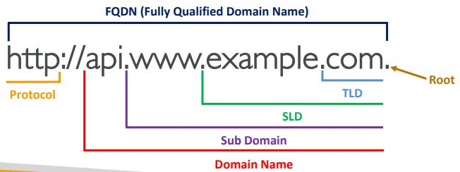
* DNS works by first turning to your local DNS server and asking if it knows
about a domain. If it's not cached, then it'll turn to the Root DNS Server 
and ask if it knows the domain. It'll say no, but that it knows about .com,
check this IP of the .com named server for more information. It'll in turn
say that it knows a second level domain server, so you should check there.
The SLD then says that yeah, I know it, here's the IP. The local DNS then
caches the result in case someone else wants it as well.

* Route 53 is a highly available, scalable, fully managed and authoritative DNS
    * Authoritative means that the customer(you) can update the DNS records
* You buy or register your domain name with a Domain Ragistrar typically by 
  paying annual charges (e.g. GoDaddy, Amazon Registrar etc)
* The Domain Registrar usually provides you with a DNS service to manage
  your DNS records
* You don't have to use Route 53 as both a registrar and DNS server. Could
  purchase a domain from GoDaddy and use Route 53 as the DNS server
    * Create a hosted zone in Route 53
    * Update NS records on 3rd party website to use Route 53 name servers
* Domain Registrar != DNS Service
* Route 53 is a domain registrar so we can register our domains there
* Ability to check the health of your resources
* The only AWS service which provides 100% availability service level agreement (SLA)
* You define records to describe how to route to your domain. It contains:
    * Domain/subdomain name - e.g. example.com
    * Record type - e.g. A or AAAA
    * Value - e.g. 123.456.789.123
    * Routing policy - how Route 53 responds to queries
    * Time to live (TTL) - amount of time the record is cached for at the 
      DNS resolvers
* Supported DNS record types on Route 53 are:
    * (must know) A, AAAA, CNAME, NS
    * (advanced) CAA, DS, MX, NAPTR, PTR, SOA, TXT, SPF, SRV
* CNAME vs Alias
    * CNAME:
        * Points a hostname to any other hostname. (app.mydomain.com => 
          blabla.anything.com)
        * Only for non-root domain (aka something.mydomain.com)
    * Alias
        * Route 53 feature
        * Points a hostname to an AWS resource (app.mydomain.com => 
          blabla.amazonaws.com)
        * Works for root domain and non-root domain (aka mydomain.com)
        * Free of charge
        * Native health check
        * Cannot set TTL, set automatically by Route 53
        * Targets:
            * Elastic load balancers
            * Cloudfront distributions
            * API gateway
            * Elastic beanstalk environments
            * S3 websites
            * VPC interface endpoints
            * Global accelerator accelerator
            * Route 53 record in the same hosted zone
            * CANNOT set an alias record for an EC2 DNS name
* Routing policies
    * Routing means that it'll tell the caller what to use when querying 
      the website
    * Types:
        * Simple
            * Typically, route traffic to a single resource
            * Can specify multiple values in the same record, causing the
            client to choose a random one from the list
            * When Alias is enabled, the can specify only one AWS resource
            * Can't be associated with health checks
        * Weighted
            * Control the % of the requests that go to each specific resource
            * Assign each record a relative weight
            * Weights don't need to sum up to 100
            * DNS records must have the same name and type
            * Can be associated with health checks
        * Latency based
            * Redirect to the resource that has the least latency for us 
              (not guaranteed to be closest)
            * Latency is based on traffic between users and AWS regions
            * When you're setting it up, then you have to specify the 
              region that the IP belongs to, because the IP can be from
              wherever so Amazon doesn't know
            * Can be associated with health checks
        * Geolocation
            * Uses the location of the user and looks at the physical location.
              So if your location is in the area defined, then it'll be used,
              otherwise falls back to the default.
            * Most precise location is selected when overlapping. You specify 
              the location when creating a record. That is, which location 
              correspond with which IP
            * Should create a default record in case there's no match on 
              location. E.g. you have the US set up, but someone comes from
              Mexico, so they'll go to the default.
            * Can be associated with health checks
        * Failover
            * If a health check fails, then go for the secondary resource. 
            So you define your primary and secondary resources.
        * Multi-value
            * Use when routing traffic to multiple resources
            * Route 53 return multiple values/resources
            * Can be associated with health checks (return only values
              for healthy resources)
            * Up to 8 healthy records are returned for each multi-value
            query
            * Simple policy doesn't have health checks, so that might
            return unhealthy resources, while multi-value does not
        * Geoproximity
            * Route traffic to your resources based on the geographic
              location of users and resources. Here it's looking at the
              distance from the point, don't have to be inside the region
            * Ability to shift more traffic to resources based on the
            defined bias
            * To change the size of the geographic region, specify bias values
                * To expand (1 to 99)
                * To shrink (-1 to -99)
            * Resources can be:
                * AWS resources (specify AWS region)
                * Non-AWS resources (specify latitude and longitude)
            * Must use Route 53 traffic flow to use this feature
        * Traffic flow provides a UI to build a more complicated routing rule 
    * Health checks
        * Associate it when setting up your route configuration
        * Only for public resources
        * About 15 global health checkers will check the endpoint health
            * Healthy/Unhealthy threshold - 3 (default)
            * Interval - 30 sec (can set to 10 sec - higher cost)
            * Supported protocol: HTTP, HTTPS, and TCP
        * Health checks pass only when the endpoint responds with the 2xx or
        3xx status codes
        * Health checks can be setup to pass/fail based on the text in the 
        first 5120 bytes of the response. Can specify the string to search
          for when setting up the health checker.
        * Configure your router/firewall to allow incoming requests from
        Route 53 health checkers
        * Can combine the results of multiple health checks into a single
        health check by running logical operations on it (OR, AND, or NOT)
            * Can monitor up to 256 child health checks
            * Specify how many of the health checks need to pass to make the parent
            pass.
        * The health checkers exist outside the VPC. They can't access private
        endpoints (private VPC or on-premise resource). However, it could be bypassed
          using a CloudWatch metric, which is associated with a CloudWatch alarm,
          which is then checked by the health checker
          
<h2>VPC</h2>
**VPC & Subnets**
* VPC - private network that deploy your resources (regional resource)
* Subnets allow you to partition your network inside your VPC (availability
  zone resource)
* A public subnet is a subnet that is accessible from the internet
* A private subnet is a subnet that is not accessible from the internet
* To define access to the internet and between subnets, we use route tables
* Internet gateways help our VPC instances connect with the internet
* Public subnets have a route to the internet gateway
* NAT gateways (AWS-managed) & NAT instances (self-managed) allow your
instances in your private subnets to access the internet while remaining
private.
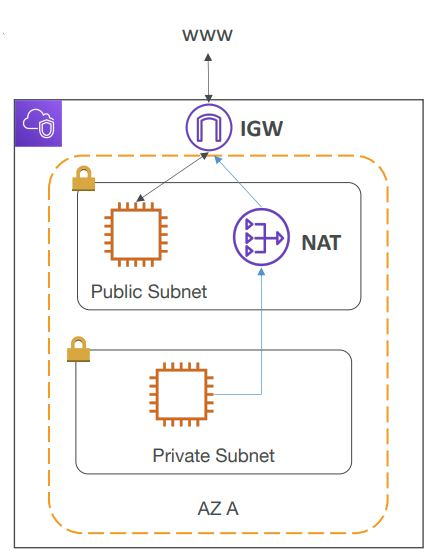
* Network ACL (NACL)
    * A firewall which controls traffic from and to subnet
    * Can have ALLOW and DENY rules
    * Are attached at the subnet level
    * Rules only include IP addresses
    * It is the first mechanism of defense
* Security groups
    * A firewall that controls traffic to and from an ENI/an EC2 instance
    * Can have only ALLOW rules
    * Rules include IP addresses and other security groups
    * It is the second mechanism of defense
* Any time you have traffic going through your VPC, it'll be logged in a flow
log
    * Captures VPC flow logs, subnet flow logs, elastic network interface flow
    logs
    * Helps monitor & troubleshoot connectivity issues
    * VPC flow logs data can go to S3/CloudWatch logs
* VPC peering allows you to connect two VPCs together, privately, using AWS' 
network. It makes them behave as if they were in the same network.
    * Must not have overlapping CIDR (IP address range)
    * VPC peering connection is not transitive (must be established for each
      VPC that need to communicate with one another. If A and B are connected
      and A gets connected to C, then B doesn't automatically get the ability
      to communicate with C.)
* VPC endpoints allow you to connect to AWS services using a private network
instead of the public network
* Site to site VPN to connect an on-premises VPN to AWS. The connection is
automatically encrypted and goes over the public internet.
* Direct Connect (DX) to establish a physical connection between on-premises
and AWS. The connection is private, secure, and fast. It goes over a private 
  network. Takes at least a month to establish.
* Site-to-site VPN and DX cannot access VPC endpoints
* Typical 3-tier solution architecture
  
  
<h2>S3</h2>
* Stores objects (files) into 'buckets' (directories)
* Buckets must have globally unique names
* Buckets are defined at the region level
* Naming convention
    * No uppercase
    * No underscore
    * 3-63 characters long
    * Not an IP
    * Must start with lowercase letter or number
* Files have keys. The key is the full path inside the bucket.
* The key is composed of a prefix + object name.
  
* There's no concept of directories within buckets, just keys with very
long names that contain slashes
* Object values are the content of the body, max object size is 5 TB
    * If uploading more than 5GB, must use 'multi-part upload'
* Each file can have metadata (list of text key/value pairs - system or
  user metadata)
* Each file can have tags (unicode key/value pair - up to 10) - useful for
security/lifecycle
* Version ID (if versioning is enabled)
    * Versioning is enabled on the bucket level
    * Best practice to version your buckets
        * Protect against unintended deletes (ability to restore a version).
          When you delete, then a delete marker will be added, but if you 
          toggle list versions, then you'll see all of the previous versions
          with the delete marker at the top. You can delete the delete marker
          to undelete the file.
        * Easy roll back to previous version
    * Notes:
        * Any file that is not versioned prior to enabling versioning will
          have version 'null'. If we upload a new one, then the 'null' version
          will still be considered the initial version.
        * Suspending versioning does not delete the previous versions
        * If you have list versions toggled and then you delete, then the
        files will be permanently deleted.
* Encryption of objects
    * Encryption can be used on a file basis or on the entire bucket
    * SSE-S3: encrypts S3 objects using keys handled & managed by AWS
        * Encryption using keys handled & managed by Amazon S3
        * Object is encrypted server side. Which is why it's called SSE,
        meaning server side encryption
        * AES-256 encryption type
        * Must set header 'x-amz-server-side-encryption': 'AES256'
    * SSE-KMS: leverage AWS key management service to manage encryption keys
        * Advantage is user control over who sees what keys + audit trail
        * Object is encrypted server side
        * Must set header 'x-amz-server-side-encryption': 'aws:kms'
    * SSE-C: when you want to manage your own encryption keys
        * You provide the keys outside of AWS
        * S3 does not store the encryption key you provide
        * HTTPS must be used
        * Encryption key must be provided in the HTTP headers, for every 
        HTTP request made
    * Client side encryption
        * You perform the encryption and then send it to S3
        * Client library such as the Amazon S3 Encryption Client can be used
        * Clients must decrypt data themselves when retrieving from S3
        * Customer fully manages the keys and encryption cycle
    * You can require encryption using either a bucket policy or default 
    encryption. Bucket policies are evaluated before default encryption,
    so it can be used for overriding.
* S3 security
    * User based - IAM policies attached to users define which API calls
    should be allowed for a specific user from the IAM console
    * Resource based
        * Bucket policies - bucket wide rules from the S3 console - allows
        cross account access
        * Object access control list (ACL) - finer grain, set on the object
        level the access rule
        * Bucket access control list (ACL) - less common
    * Note: an IAM principal (user/application) can access an S3 object if
        * the user IAM permissions allow it or the resource policy allows it
        and there is no explicit deny
    * S3 bucket policies
        * JSON based policies
          
        * Explicit DENY in an IAM policy will take precedence over a bucket
          policy permission
        * Use S3 bucket policies to
            * Grant public access to the bucket
            * Force objects to be encrypted at upload
            * Grant access to another account (Cross account)
    * Bucket settings for Block Public Access
        * Block public access to buckets and objects granted through
            * new access control lists (ACLs)
            * any access control lists (ACLs)
            * new public bucket or access point policies
        * Block public and cross-account access to buckets and objects through
        any public bucket or access point policies
        * If you know your bucket should never be public, leave these on
        * Can be set at the account level
    * Can access S3 buckets in private VPCs using VPC endpoints
    * S3 access logs can be used for logging and audit
    * API calls can be logged in AWS CloudTrail
    * MFA Delete: MFA can be required in versioned buckets to delete objects
    * Pre-signed URLs: URLs that are valid only for a limited time (ex. 
      premium video download service for logged in users)
        * Can generate pre-signed URLs using SDK or CLI
        * Easier for downloads, can use the CLI
        * Difficult for uploads, must use the SDK
        * Valid for a default of 3600 seconds, can change timeout with 
        --expires-in [TIME_BY_SECONDS] argument
        * Users given a pre-signed URL inherit the permissions of the person
        who generated the URL for GET/PUT
* S3 can host static websites and have them accessible on the WWW
* If you get a 403 (Forbidden) error, make sure the bucket policy allows
public reads!
* As of December 2020 S3 is strongly consistent. That means that whenever 
you modify the data and do a read afterwards, then you're going to see the
correct results.
* Need versioning to turn on MFA delete for a bucket. Only the root account
can enable/disable MFA-Delete
* S3 can have access logs for audit purposes.
    * Logs are sent to another bucket.
    * Any request made to S3 will be logged.
    * Do not set your logging bucket to be the same as the one you are
    monitoring, otherwise it'll create a logging loop.
    * When you turn on logging, then the permission to deliver logs is 
    automatically added to the target bucket.
* S3 replication (CRR - cross-region replication & SRR - same region replication)
    * Must enable versioning in source and destination
    * CRR must be turned on if they're in different regions
    * SRR if they're in the same region
    * Buckets can be in different accounts
    * Copying is async, but very fast
    * Must give proper IAM permissions to S3
    * CRR use cases: compliance, lower latency access, replication across 
    accounts
    * SRR use cases: log aggregation, live replication between production and
    test accounts
    * Replication is not retroactive, only new objects will be replicated
    * Can replicate delete markers from source to target optionally
    * Deletions with a version ID are not replicated to avoid malicious deletes
    * No chaining for bucket replications, only replicates to the directly connected
    bucket
* S3 storage classes
    * A storage class is specified on an object, not bucket wide
    * Amazon S3 Standard - General Purpose
        * High durability of objects across multiple AZ
        * If you store 10,000,000 objects with Amazon S3, you can on average
        expect to incur a loss of a single object once every 10,000 years
        * 99.99% availability over a given year
        * Sustain 2 concurrent facility failures
    * Amazon S3 Standard - Infrequent Access (IA)
        * Suitable for data that is less frequently accessed, but requires
        rapid access when needed
        * Stored in multiple AZ
        * High durability of objects across multiple AZ
        * 99.9% availability
        * Lower cost compared to S3 Standard
        * Sustain 2 concurrent facility failures
        * Use cases: as a data store for disaster recovery, backups etc
    * Amazon S3 One Zone-Infrequent Access
        * Same as IA, except a single AZ
        * Data lost when AZ is destroyed
        * 99.5% availability
        * Lower cost compared to IA (by 20%)
        * Use cases: storing secondary backup copies of on-premise data, or
        storing data you can recreate
    * Amazon S3 Intelligent Tiering
        * Same low latency and high throughput performance of S3 standard
        * Small monthly monitoring and auto-tiering fee
        * Automatically moves objects between two access (Standard & IA) 
        tiers based on changing access patterns
        * Designed for high durability of objects across multiple AZs
        * Resilient against events that impact an entire AZ
        * Designed for 99.9% availability over a given year
    * Amazon Glacier
        * Low cost object storage meant for archiving/backup
        * Data is retained for the long term (10s of years)
        * Alternative to on-premise magnetic tape storage
        * High durability
        * Low cost per storage per month ($0.004 / GB) + retrieval cost
        * Each item in Glacier is called "Archive" (up to 40 TB)
        * Archives are stored in "Vaults"
        * Retrieval options:
            * Expedited (1 to 5 minutes), a lot more expensive
            * Standard (3 to 5 hours)
            * Bulk (5 to 12 hours) when you require multiple files at the
            same time
            * Minimum storage duration of 90 days
    * Amazon Glacier Deep Archive
        * For even longer term storage
        * Even cheaper
        * Retrieval options:
            * Standard (12 hours)
            * Bulk (48 hours)
        * Minimum storage duration of 180 days
    * You can transition objects between storage classes
      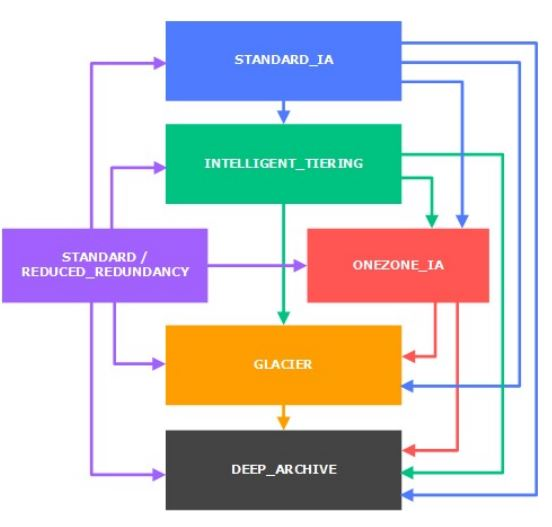
    * Transitioning objects can be done manually or automated using a 
    lifecycle configuration
        * Transition actions - defines when objects are transitioned to
        another storage class
            * Move objects to standard IA class 60 days after creation
            * Move to Glacier for archiving after 6 months
        * Expiration actions - configure objects to expire (delete) after some
        time
            * Access log files can be set to delete after 365 days
            * Can be used to delete old versions of files (if versioning is 
              enabled)
            * Can be used to delete incomplete multi-part uploads
        * Rules can be created for a certain prefix (ex. s3://mybucket/mp3/*)
        * Rules can be created for certain object tags (ex. Department: Finance)
* S3 baseline performance
    * Amazon S3 automatically scales to high request rates, latency 100 - 200 ms
    * Your application can achieve at least 3500 PUT/COPY/POST/DELETE and
    5500 GET/HEAD requests per second per prefix in a bucket
    * There are no limits to the number of prefixes in a bucket
    * Example (object path => prefix):
        * bucket/folder1/sub1/file => /folder1/sub1/
        * bucket/folder1/sub2/file => /folder1/sub2/
    * If you spread read across all N prefixes evenly, you can achieve
    N * 5500 requests per second for GET/HEAD
* S3 - KMS limitation
    * If you use SSE-KMS, you may be impacted by the KMS limits
    * When you upload, it calls the GenerateDataKey KMS API
    * When you download, it calls the Decrypt KMS API
    * Count towards the KMS quota per second (5500, 10000, 30000 req/s
      base on region)
    * You can request a quota increase using the Service Quotas Console
* S3 performance
    * Multi-part upload:
        * Recommended for files > 100 MB, must use for files > 5 GB
        * Can help parallelize uploads (speed up transfers)
    * S3 transfer acceleration
        * Have to enable it, additional pricing will occur
        * Increases transfer speed by transferring file to an AWS edge location
        which will forward the data to the S3 bucket in the target region
        * Compatible with multi-part upload
    * S3 byte-range fetches
        * Parallelize GETs by requesting specific byte ranges
        * Better resilience in case of failures
          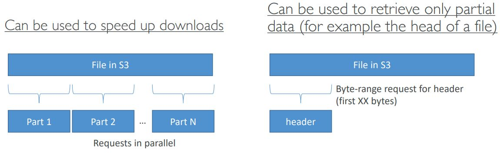
* S3 Select & Glacier select
    * Retrieve less data using SQL by performing server side filtering
    * Can filter by rows & columns (simple SQL statements)
    * Less network transfer, less CPU cost client-side
    * Ex. queries for specific lines from a CSV file, so instead of sending
    the entire thing, only specific lines are sent.
* S3 event notifications
    * S3:ObjectCreated, S3:ObjectRemoved etc
    * Object name filtering possible (ex. *.jpg)
    * Use case: generate thumbnails of images uploaded to S3
    * Targets for S3 notifications are:
        * Simple notification service (SNS) - send notifications and emails
        * Simple queue service (SQS) - add messages into a queue
        * Lambda functions - generate custom code
    * Can create as many S3 events as desired
    * S3 event notifications typically deliver events in seconds, but can 
    take a minute or longer
    * If two writes are made to a single non-versioned object at the same time,
    it is possible that only a single event notification will be sent. If you want
    to ensure that an event notification is sent for every successful write, 
    you can enable versioning on your bucket.
* S3 Athena
    * Serverless service to perform analytics directly against S3 files
    * Use SQL language to query the files
    * Has a JDBC/ODBC driver
    * Charged per query and amount of data scanned
    * Supports CSV, JSON, ORC, Avro, and Parquet (built on Presto)
    * Use cases: business intelligence/analytics/reporting, analyze & query,
    VPC flow logs, ELB logs, CloudTrail trails etc
    * Exam tip: Analyze data directly on S3 => use Athena


**CORS**
* An origin is a scheme (protocol), host (domain) and port
    * E.g. https://www.example.com (implied port is 443 for HTTPS, 80 for HTTP)
        * Scheme: HTTPS
        * Host: www.example.com
        * Port: 443
* CORS means Cross-Origin Resource sharing, so we're going to be getting
resources from a different origin
* Allows making requests only if the other origin specifically allows other
origins to make requests to it
    * Same origin: http://example.com/app1 & http://example.com/app2
    * Different origin: http://example.com & http://other.example.com
* The requests won't be fulfilled unless the other origin allows for the
requests, using CORS headers (ex: Access-Control-Allow-Origin)
* An OPTIONS request is sent to ask if CORS requests are allowed
  
* If a client does a cross-origin request on our S3 bucket, we need to 
enable the correct CORS headers
* You can allow for a specific origin or for * (all origins)
* The CORS definition is in a separate block in the bucket configuration.
Make sure that there isn't a trailing slash for the domain.
  
<h2>CloudFront</h2>
**AWS CloudFront**
* Content delivery network (CDN)
* Improves read performance, content is cached at the edge of which there
are 216 globally and more being added
* Provides DDoS protection, integration with Shield, AWS Web Application 
Firewall
* Can expose external HTTPS and can talk to internal HTTPS backends
* Origins
    * S3 bucket 
        * For distributing files and caching them at the edge
        * Enhanced security with CloudFront Origin Access Identity (OAI) to 
        allow bucket communication only from CloudFront and no one else
        * CloudFront can be used as an ingress to upload files to S3
    * Custom origin (HTTP)
        * Application load balancer
        * EC2 instance
        * S3 website (must first enable the bucket as a static S3 website)
        * Any HTTP backend you want
* How does it work at a high level
    * We have multiple edge locations all around the world and they are 
    connected to your origin. The user sends a query to our edge location
    and this gets forwarded to our origin. Our response can then be cached
    at the edge location based on our cache settings. Edge location is
    connected via the AWS private network, thus having less latency. 
    With S3 you have OAI to allow for access, but for EC2/ALB you have to
    allow public access from a list of IPs that correspond to edge locations.
    AWS has a list that you can use.
      
* Geo Restriction
    * You can restrict who can access your distribution
        * Whitelist: Allow your users to access your content only if they're
        in one of the countries on a list of approved countries.
        * Blacklist: Prevent your users from accessing your content if they're
        in one of the countries on a blacklist of banned countries.
        * The country is determined using a 3rd party Geo-IP database
    * Use case: Copyright laws to control access to content.
* Cloudfront vs S3 Cross Region Replication
    * CloudFront
        * Global edge network
        * Files are cached for a TTL 
        * Great for static content that must be available everywhere
    * S3 cross region replication
        * Must be setup for each region you want replication to happen in
        * Files are updated in near real-time
        * Read only
        * Great for dynamic content that needs to be available at low-latency 
        in few regions
* CloudFront and HTTPS
    * Viewer protocol policy (between client and edge location)
        * Redirect HTTP to HTTPS
        * Or use HTTPS only
    * Origin protocol policy (between edge location and origin)
        * HTTPS only
        * Or match viewer (HTTP => HTTP & HTTPS => HTTPS)
    * Note: S3 bucket websites don't support HTTPS
* Cache
    * Cache based on
        * Headers
        * Session cookies
        * Query String Parameters
    * The cache lives at each CloudFront edge location
    * You can also send a manual cache invalidation from AWS
    * To maximize cache hits you should separate static and dynamic content
      
* Signed URL/Signed Cookies
    * You want to distribute paid shared content to premium users over the 
    world
    * We can use CloudFront signed URL/Cookie. Attach a policy with:
        * Include URL expiration
        * Include IP ranges to allow access to the data (when possible)
        * Trusted signers (which AWS can create signed URLs)
    * How long should the URL be valid for?
        * Shared content (movie, music): make it short (a few minutes)
        * Private content (private to the user): you can make it last for 
        years
    * Signed URL = access to individual files (one signed URL per file)
    * Signed cookies = access to multiple files (one signed cookie for
      many files)
* Signed URL process
    * Trusted key group (recommended)
        * Can leverage APIs to create and rotate keys (and IAM for API 
          security)
    * An AWS account that contains a CloudFront key pair (not recommended)
        * Need to manage keys using the root account and the AWS console
        * Has no API to manage the keys
    * In your CloudFront distribution, create one or more trusted key groups
    * Generate your own public/private key manually and then add them
        * The private key is used by your application (e.g. EC2) to sign
        URLs
        * The public key (uploaded) is used by CloudFront to verify URLs
* Pricing
    * Edge locations have different costs per gigabyte
    * Pricing per gigabyte also gets lower depending on how much data is
    being transfered. As more data is transfered, the cheaper it gets. The
    price/data brackets are specified.
    * You can reduce the number of edge locations for cost reduction
    * Three price classes:
        * Price class all: all regions - best performance, highest cost
        * Price class 200: most regions - good performance, excludes the
        most expensive regions
        * Price class 100: only the least expensive regions
* Multiple Origin
    * To route to different kinds of origins based on the content type
    * Based on path pattern:
        * /images/*
        * /api/*
* Origin groups
    * To increase high-availability and do failover
    * Origin group: one primary and one secondary origin
    * If the primary origin fails, the second one is used
      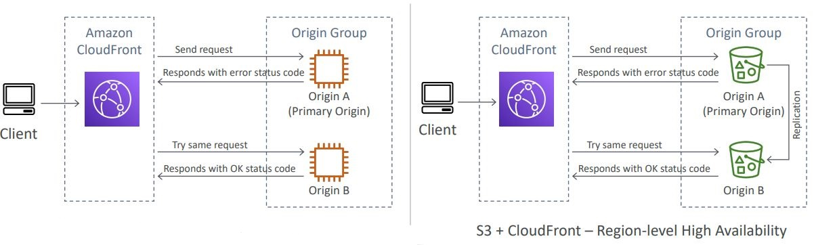
* Field level encryption
    * Protect user sensitive information through application stack
    * Adds an additional layer of security along with HTTPS
    * Sensitive information encrypted at the edge close to user
    * Uses asymmetric encryption
    * Usage:
        * Specify set of fields in POST requests that you want to be
        encrypted (up to 10 fields)
        * Specify the public key to encrypt them
          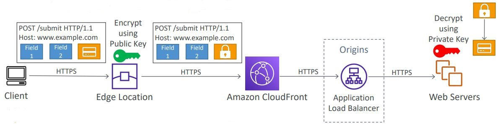
          
<h2>ECS, ECR & Fargate</h2>
There are three choices for managing Docker containers on AWS
* ECS: Amazon's own platform
* Fargate: Amazon's own serverless platform
* EKS: Amazon's managed Kubernetes

**ECS**
* ECS clusters are logical groupings of EC2 instances
* EC2 instance run the ECS agent (Docker container)
* The ECS agents register the instance to the ECS cluster
* The EC2 instances run a special AMI, made specifically for ECS
* The instances that get launched echo into a config file the
cluster name and each instance has a docker process running on it,
which uses the cluster name to register it. 
* ECS task definition
  * Metadata in JSON form to tell ECS how to run a Docker Container
  * If we don't specify a host port, then that becomes random
* ECS Service
  * ECS services help define how many ECS tasks should run 
  and how they should be run
  * They ensure that the number of tasks desired is running
  across our fleet of EC2 instances
  * They can be linked to ELB/NLB/ALB if needed
* An application load balancer can be used to pick up the 
containers with random ports by using dynamic port forwarding.
Cannot be added after the service has been created. Has to added
alongside the service.
* IAM roles
  * EC2 instance profile:
    * Used by the ECS agent
    * Makes API calls to ECS service
    * Send container logs to CloudWatch logs
    * Pull Docker image from ECR
  * ECS task role:
    * Allow each task to have a specific role
    * Use different roles for the different ECS services you run
    * Task roles is defined in the task definition
      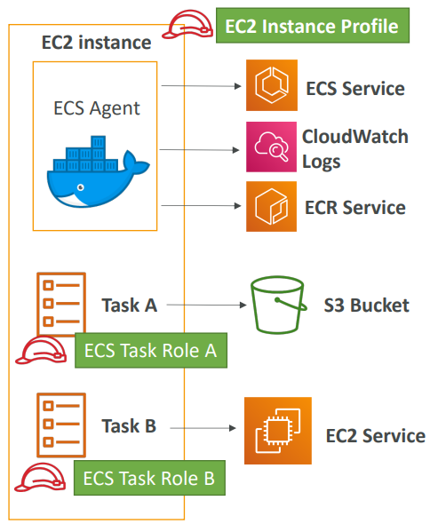
* ECS tasks placement
  * When a task of type EC2 is launched, ECS must determine 
  where to place it, with the constraints of CPU, memory, and
  available port.
  * Similarly, when a service scales in, ECS needs to determine
  which task to terminate
  * To assist with this, you can define a task placement strategy
  and task placement constraints
  * Note: only for ECS with EC2, not for Fargate (does this 
  automatically)
  * Task placement strategies are a best effort
  * When Amazon ECS places tasks, it uses the following process 
  to select container instances:
    1. Identify the instances that satisfy the CPU, memory, and 
    port requirements in the task definition.
    2. Identify the instances that satisfy the task placement
    constraints.
    3. Identify the instances that satisfy the task placement
    strategies.
    4. Select the instances for task placement.
  * Placement strategies
    * Binpack
      * Place tasks based on the least available amount of CPU
      or memory. Places as many tasks as possible into one 
      instance before creating a new instance.
      * This minimizes the number of instances in use (cost 
      savings)
    * Random
      * Place the task randomly
    * Spread
      * Place the task evenly based on the specified value
      * Example: instanceId, attribute:ecs.availability-zone.
      Places one in one AZ, the next in the other AZ, then again
      the first and so forth.
    * You can mix the strategies. E.g. binpack on memory, spread
    on availability zone
  * Placement constraints
    * distinctInstance - place each task on a different container
    instance
    * memberOf - places task on instances that satisfy an expression.
    Uses the Cluster query language. E.g. all instances that are
    of type T2.
* ECS - Service auto scaling
  * CPU and RAM are tracked in CloudWatch at the ECS service level
  * Target tracking: target a specific average CloudWatch metric
  * Step scaling - scale based on CloudWatch alarms
  * Scheduled scaling - based on predictable changes
  * ECS service scaling (task level) != EC2 auto scaling 
  (instance level)
  * Fargate auto scaling is much easier to setup (because 
  serverless)
* ECS - cluster capacity provider
  * A capacity provider is used in association with a cluster
  to determine the infrastructure that a task runs on
    * For ECS and Fargate users, the FARGATE and FARGATE_SPOT
    capacity providers are added automatically
    * For Amazon ECS on EC2, you need to associate the capacity
    provider with auto-scaling group
  * When you run a task or a service, you define a capacity 
  provider strategy, to prioritize in which provider to run
  * This allows the capacity provider to automatically provision
  infrastructure for you
* Data volumes
  * EC2 task strategies
    * The EBS volume is already mounted onto the EC2 instances
    * This allows your Docker containers to mount the EBS 
    volume and extend the storage capacity of your task
    * Problem: if your task moves from one EC2 instance to
    another one, it won't be the same EBS volume and data
    * Use cases:
      * Mount a data volume between different containers on 
      the same instance
      * Extend the temporary storage of a task
  * EFS file systems
    * Works for both EC2 tasks and Fargate tasks
    * Ability to mount EFS volumes onto tasks
    * Tasks launched in any AZ will be able to share the same
    data in the EFS volume
    * Fargate + EFS = serverless + data storage without managing
    servers
    * Use case: persistent multi-AZ shared storage for your
    containers
  * Bind mounts sharing data between containers
    * Works for both EC2 tasks (using local EC2 instance storage)
    and Fargate tasks (get 4GB for volume mounts)
    * Useful to share an ephemeral storage between multiple containers
    part of the same ECS task
    * Great for "sidecar" container pattern where the sidecar can be 
    used to send metrics/logs to other destinations (separation
    of concerns)

**ECR**
* Private docker registry - Amazon Elastic Container Registry (ECR)
* Access is controlled through IAM (permission errors => policy)
* AWS CLI v1 login command - `$(aws ecr get-login 
--no-include-email --region eu-west-1)`
* AWS CLI v2 login command - `aws ecr get-login-password --region
eu-west-1 | docker login --username AWS --password-stdin
1234567890.dkr.ecr.eu-west-1.amazonaws.com`
* Docker push & pull
  * `docker push 1234567890.dkr.ecr.eu-west-1.amazonaws.com/demo:latest`
  * `docker pull 1234567890.dkr.ecr.eu-west-1.amazonaws.com/demo:latest`

**Fargate**
* Serverless
* We don't provision EC2 instances. We just create task definitions,
and AWS will run our containers for us.
* To scale, just increase the task number

**ECS summary**
* ECS is used to run Docker containers and has 3 flavors:
  * ECS 'Classic': provision EC2 instances to run containers onto
    * EC2 instances must be created
    * We must configure the file /etc/ecs/ecs.config with the 
    cluster name for registering to the cluster
    * The EC2 instance must run an ECS agent which registers 
    to the cluster
    * EC2 instances can run multiple containers of the same type
      * You must not specify a host port (only container port)
      for dynamic port generation, otherwise there'll be port
      in use errors
      * You should use an Application Load Balancer with the 
      dynamic port mapping
      * The EC2 instance security group must allow traffic from
      the ALB on all ports
    * ECS tasks can have IAM roles to execute actions against AWS
    * Security groups operate at the instance level, not task level
  * Fargate: ECS serverless, no more EC2 to provision
    * AWS provisions containers for us and assigns them elastic
    network interfaces
    * Fargate containers are provisioned by the container spec
      (CPU/RAM)
    * Fargate tasks can have IAM roles to execute actions against
    AWS
  * EKS: managed Kubernetes by AWS
* ECR is used to store Docker images
  * ECR is tightly integrate with IAM
  * AWS CLI v1 login command - `$(aws ecr get-login
      --no-include-email --region eu-west-1)`
  * AWS CLI v2 login command - `aws ecr get-login-password --region
    eu-west-1 | docker login --username AWS --password-stdin
    1234567890.dkr.ecr.eu-west-1.amazonaws.com`
  * Docker push & pull
    * `docker push 1234567890.dkr.ecr.eu-west-1.amazonaws.com/demo:latest`
    * `docker pull 1234567890.dkr.ecr.eu-west-1.amazonaws.com/demo:latest`
  * In case an EC2 instance (or you) cannot pull a Docker image,
  check IAM
* ECS Other
  * ECS does integrate with CloudWatch logs:
    * You need to setup logging at the task definition level
    * Each container will have a different log stream
    * The EC2 instance profile needs to have the correct IAM
    permissions to send the logs
  * Use IAM task roles for your tasks
  * Task placement strategies: binpack, random, spread
  * Service auto scaling with target tracking, step scaling, or
  scheduled
  * Cluster auto scaling through capacity providers

<h2>AWS Elastic Beanstalk</h2>
**Beanstalk**
* Elastic Beanstalk is a developer centric view of deploying an
application on AWS
* It uses all the components we've seen before: EC2, ASG, ELB,
RDS etc.
* Managed service
  * Automatically handles capacity provisioning, load balancing,
  scaling, application health monitoring, instance configuration etc.
  * Just the application code is the responsibility of the 
  developer
* We still have full control over configuration
* Beanstalk is free but you pay for the underlying instances
* Components
  * Application - collection of Elastic Beanstalk components (
  environments, versions, configurations etc)
  * Application version - an iteration of your application code
  * Environment
    * Collection of AWS resources running an application version
    (only one application version at a time)
    * Tiers (which type of application you are going to be 
    creating): Web server environment tier & worker environment tier
      
    * You can create multiple environments (dev, test, prod etc)
* Supported platforms
  * Supports multiple platforms by default (Go, Java SE, Python etc)
  * If a technology isn't supported, then you can write your custom
  platform
* Deployment modes
  
* Deployment options for updates
  * All at once (deploy all in one go) - fastest, but instances aren't
  available to serve traffic for a bit (downtime)
    * First, all the applications get stopped
    * Second, everything gets redeployed with version 2
      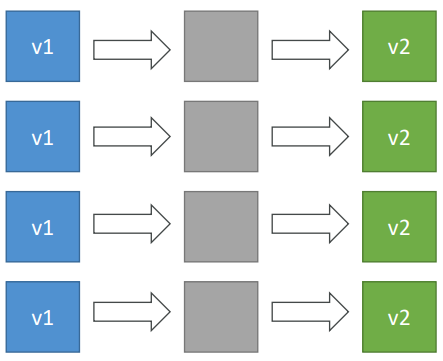
  * Rolling - update a few instances at a time (bucket), and then
  move onto the next bucket once the first bucket is healthy
    * Application is running below capacity
    * Can set the bucket size(how many instances get updated at
    once)
    * Based on the bucket size instances are stopped and then
    redeployed with V2, while the other ones are on V1
    * The bucket deployment then gets moved to the older versions
    * This is repeated until all the instances have been
    updated
    * Application is running both versions simultaneously
    * No additional cost, still the same number of instances
    * Long deployment
    
  * Rolling with additional batches - like rolling, but spins up
  new instances to move the batch (so that the old application is
  still available)
    * Application is running at capacity
    * Can set the bucket size
    * Application is running both versions simultaneously
    * Small additional cost
    * Additional batch is removed at the end of the deployment
    * Longer deployment
    * Good for prod
    * We have a number of V1 instances. Then we're going to deploy
    some additional V2 instances. Then we remove V1 instances based
    on bucket/batch size. The stopped V1s get replaced with V2 instances.
    Process gets repeated for the other V1s. Eventually the initial
    batch of instances get terminated.
    * In the example we have 4 V1s at the start. We start doing 
    batches/buckets with a size of 2. So we deploy 2 extra V2s, 
    then remove the first 2 V1s, replace them with 2 V2s, repeat,
    until all are V2s. Finally, remove the initial additional V2s.
      
  * Immutable - spins up new instances in a new ASG, deploys version
  to these instances, and then swaps all the instances when
  everything is healthy
    * Zero downtime
    * New code is deployed to new instances on a temporary ASG
    * High cost, double capacity
    * Longest deployment
    * Quick rollback in case of failures (just terminate new ASG)
    * Great for prod
    * In the example we have a current ASG with 3 v1s. Then we
    create a temporary ASG into which Beanstalk deploys a single
    instances to make sure a single instance works. Once it has 
    ensured that a single instance works, it then deploys the rest.
    When Beanstalk is happy, then the temporary ASG instances will
    be moved to the current ASG. After that is done the initial V1
    instances will be terminated and the temporary ASG will be 
    removed.
      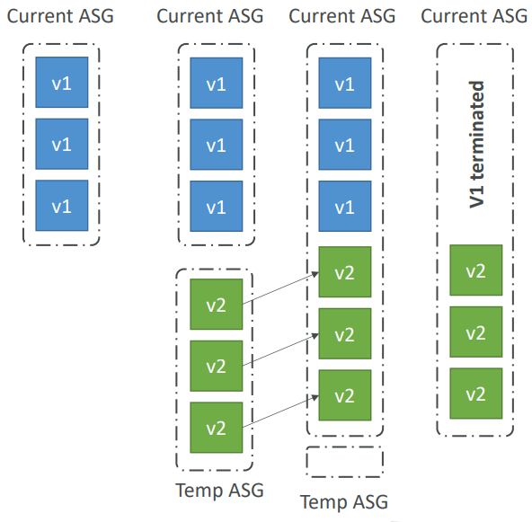
* Elastic Beanstalk CLI
  * We can install an additional CLI called the "EB CLI" which 
  makes working with Beanstalk from the CLI easier
  * Basic commands are: eb create, eb status, eb health etc
  * It's helpful for your automated deployment pipelines
  * Process
    * Describe dependencies (package.json for Node.js)
    * Package code as zip, and describe dependencies (Node.js package.json)
    * Console: upload zip file (creates new app version), and then deploy
    * CLI: create new app version using CLI (uploads zip), and then deploy
    * Elastic Beanstalk will deploy the zip on each EC2 instance, resolve
    dependencies and start the application
* Beanstalk Lifecycle Policy
  * Elastic Beanstalk can store at most 100 application versions
  * If you don't remove old versions, you won't be able to 
  deploy anymore
  * To phase out old application versions, use a lifecycle
  policy. You can either delete or retain it in S3
    * Based on time (old versions are removed)
    * Based on space (when you have too many versions)
  * Versions that are currently used won't be deleted
  * Option not to delete the source bundle in S3 to prevent
  data loss
* Elastic Beanstalk Extensions
  * A zip file containing our code must be deployed
  to Elastic Beanstalk
  * All the parameters set in the UI can be configured 
  with code using files
  * Requirements:
    * in the .ebextensions/ directory in the root of source code
    * YAML/JSON format
    * .config extensions (example: logging.config)
    * Able to modify some default settings using: option_settings
    * Ability to add resources such as RDS, ElastiCache, DynamoDb etc.
  * Resources managed by .ebextensions get deleted if the 
  environment goes away
* Elastic Beanstalk under the hood
  * Under the hood, Elastic Beanstalk relies on CloudFormation
  * CloudFormation is used to provision other AWS services
  * Use case: you can define CloudFormation resources in your
  .ebextensions to provision ElastiCache, an S3 bucket, anything
  you want
* Elastic Beanstalk cloning
  * Clone an environment with the exact same configuration
  * Useful for deploying a "test" version of your application.
  For example you have a dev environment and you want the same
  setup for prod, so you can just clone an existing one.
  * All resources and configuration are preserved:
    * Load balancer type and configuration
    * RDS database type (but the data is not preserved)
    * Environment variables
    * Etc.
  * After cloning an environment, you can change settings
* RDS with Elastic Beanstalk
    * RDS can be provisioned with Beanstalk, which is
      great for dev/test
    * This is not great for prod as the database lifecycle
      is tied to the Beanstalk environment lifecycle
    * The best for prod is to separately create an RDS
      database and provide our EB application with the connection
      string
* Elastic Beanstalk Migration
  * Load balancer
    * After creating an Elastic Beanstalk environment,
    you cannot change the Elastic Load Balancer type,
    only its configuration
    * To migrate:
      1. Create a new environment with the same 
      configuration except LB (can't clone, have to
      manually create the same environment with its
      configs, minus the LB)
      2. Deploy your application onto the new 
      environment
      3. Perform a CNAME swap or Route 53 update
  * Decouple RDS
    1. Create a snapshot of RDS DB (as a safeguard)
    2. Go to the RDS console and protect the RDS DB 
    from deletion - this will protect it no matter what
    3. Create a new Elastic Beanstalk environment, without
    RDS, point your application to existing RDS
    4. Perform a CNAME swap (blue/green) or Route 53
    update, confirm that it's working
    5. Terminate old environment (RDS won't be deleted
    as we have enabled RDS deletion protection)
* Elastic Beanstalk - Single Docker
  * Run your application as a single Docker container
  * Either provide:
    * Dockerfile - Elastic Beanstalk will build and run
    the Docker container
    * Dockerrun.aws.json (v1): Describe where already 
    built Docker image is
    * Beanstalk in single Docker container does not use 
    ECS. Just uses EC2
* Elastic Beanstalk - multi Docker container
  * Multi Docker helps run multiple containers per EC2
  instance in EB
  * This will create for you:
    * ECS cluster
    * EC2 instances, configured to use the ECS cluster
    * Load balancer (in high availability mode)
    * Task definitions and execution
  * Requires a config Dockerrun.aws.json (v2) at the 
  root of the source code
  * Dockerrun.aws.json is used to generate the ECS task
  definition
  * Your Docker images must be pre-built and stored in
  a repo (ECR or Docker hub)
  
* Elastic Beanstalk and HTTPS
  * Beanstalk with HTTPS
    * Load the SSL certificate onto the load balancer
    * Can be done from the console (EB console, load balancer
      configuration)
    * Can be done from code:.ebextensions/securelistener-alb.config
    * SSL certificate can be provisioned using ACM (AWS 
      certificate manager) or CLI
    * Must configure a security group rule to allow incoming 
      port 443 (HTTPS port)
  * Beanstalk redirect HTTP to HTTPS
    * Configure your instances to redirect HTTP to HTTPS
    * Or configure the Application Load Balancer (ALB only)
    with a rule
    * Make sure health checks are not redirected, so you 
    keep getting 200
* Web server vs worker environment
  * If your application performs tasks that are long to complete,
  offload these tasks to a dedicated worker environment
  * Decoupling your application into two tiers is common
  * Example: processing a video, generating a zip file, etc.
  * You can define period tasks in a file cron.yaml
    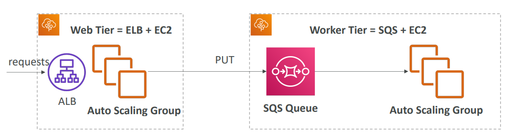
* Elastic Beanstalk - custom platform (advanced)
  * Custom platforms are very advanced, they allow to define from
  scratch:
    * The operating system (OS)
    * Additional software
    * Scripts that Beanstalk runs on these platforms
  * Use case: app language is incompatible with Beanstalk and 
  doesn't use Docker
  * To create your own platform:
    * Define an AMI using Platform.yaml files
    * Build that platform using the Packer software (open source
    tool to create AMIs)
  * Custom platform vs custom image (AMI):
    * Custom image is to tweak an existing Beanstalk Platform (
    Python, Node.js, Java etc.)
    * Custom platform is to create an entirely new Beanstalk
    Platform

**Blue/Green deployment**
* Not a 'direct feature' of Elastic Beanstalk
* Zero downtime and helps with the release facility
* Create a new stage (another Elastic Beanstalk) environment and
deploy V2 there
* The new environment (green) can be validated independently and
roll back if issues
* Route 53 can be setup using weighted policies to redirect a
little bit of traffic to the stage environment
* Using Beanstalk, 'swap URL' when done with the environment
test
* You split the traffic. In the example 90/10. You make sure that 
the green environment works. Do all of your testing, measurements.
Once you're satisfied, you swap the environment.
* You can swap the environment URLs in AWS in Elastic Beanstalk


**Traffic splitting**
* Canary testing
* New application version is deployed to a temporary ASG with
the same capacity
* A small % of traffic is sent to the temporary ASG for a
configurable amount of time. The traffic % is incrementally
increased until all the traffic has been moved to the new 
environment.
* Deployment health of the new temporary ASG is monitored
* If there's a deployment failure or some metric goes wrong,
this triggers an automated rollback (very quick)
* No application downtime
* New instances are migrated from the temporary to the 
original ASG
  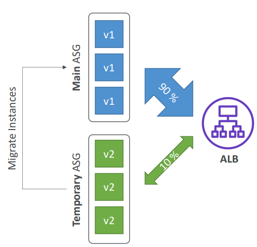
  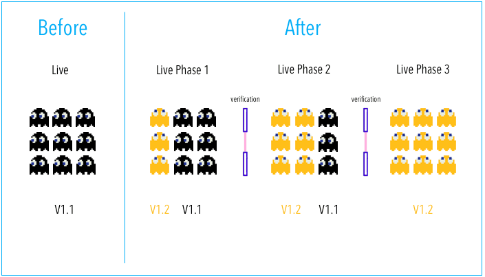

<h2>AWS CI\CD - CodeCommit, CodePipeline, CodeBuild, CodeDeploy</h2>

**AWS CodeCommit - storing our code**
* A git repository
* Private git repositories
* No size limit on repositories (scale seamlessly)
* Fully managed, highly available
* Code only in AWS Cloud account => increased security 
and compliance
* Secure (encrypted, access control, etc)
* Integrated with Jenkins/CodeBuild/other CI tools
* Authentication in Git:
  * SSH Keys: AWS Users can configure SSH keys in their IAM Console
  * HTTPS: Done through the AWS CLI Authentication helper or Generating HTTPS credentials
  * MFA (multi factor authentication) can be enabled for extra safety
* Authorization in Git:
  * IAM policies manage user/roles right to repositories
* Encryption:
  * Repositories are automatically encrypted at rest using KMS.
  Whenever AWS has encryption at rest, then think KMS.
  * Encrypted in transit (can only use HTTPS or SSH - both secure)
* Cross account access:
    * Do not sure your SSH keys
    * Do not share your AWS credentials
    * Use IAM role in your AWS account and use AWS STS (
  with AssumeRole API)
* Notifications
  * You can trigger notifications in CodeCommit using AWS SNS (
  Simple Notification Service) or AWS Lambda or AWS CloudWatch
  Event Rules
  * Use cases for SNS/AWS Lambda notifications:
    * Deletion of branches
    * Trigger for pushes that happens in master branch
    * Notify external build system
    * Trigger AWS Lambda function to perform codebase analysis
    (maybe credentials got committed in the code?)
  * Use cases for CloudWatch Event Rules:
    * Trigger for merge request updates (created/updated/
    deleted/commented)
    * CloudWatch Event Rules goes into an SNS topic
* If you are connected as root, you won't see the SSH connection steps

**AWS CodePipeline - automating our pipeline from code to 
Elastic Beanstalk**
* Continuous delivery
* Visual workflow
* Source: GitHub/CodeCommit/Amazon S3
* Build: CodeBuild, Jenkins etc
* Load testing using 3rd party tools
* Deploy: AWS CodeDeploy, Beanstalk, CloudFormation, ECS etc
* Made of stages
  * Each stage can have sequential actions and/or parallel actions
  * Actions are contained in action groups
  * You can have whatever stages you want
  * Stage examples: Build, Test, Deploy, Load Test etc
  * Manual approval can be defined at any stage
  * Each pipeline stage can create "artifacts"
  * Artifacts are stored and passed in Amazon S3 and passed on
  to the next stage
  
* CodePipeline state changes happen in AWS CloudWatch Events, 
which can in return create SNS notifications
  * Ex. you can create events for failed pipelines
  * Ex. you can create events for cancelled stages
* If CodePipeline fails a stage, your pipeline stops, and 
you can get information in the console
* AWS CloudTail can be used to audit AWS API calls
* If Pipeline can't perform an action, make sure the 
"IAM service role" attached does have enough permissions
  (IAM policy)

**AWS CodeBuild - building and testing our code**
* Fully managed build service
* Alternative to other build tools such as Jenkins
* Continuous scaling (no servers to manage or provision -
no build queue)
* Pay for usage: the time it takes to complete the builds
* Leverages Docker under the hood for reproducible builds
* Possibility to extend capabilities leveraging our own 
base Docker images. That is we could extend the Docker image
that is used for CodeBuild
* Secure: Integration with KMS for encryption of build 
artifacts, IAM for build permissions, and VPC for 
network security, CloudTrail for API calls logging
* Source code from GitHub, CodeCommit, CodePipeline, S3 etc
* Build instructions can be defined in code (buildspec.yml) file
* Output logs to Amazon S3 & AWS CloudWatch logs
* Metrics to monitor CodeBuild statistics
* Use CloudWatch Alarms to detect failed builds and trigger
notifications
* CloudWatch Events, AWS Lambda as a glue
* SNS notifications
* Ability to reproduce CodeBuild locally to troubleshoot
in case of errors
* Builds can be defined within CodePipeline or CodeBuild
itself
* Supported environments for Java, Ruby, Python, Go, Node.js,
Android, .NET Core, PHP, Docker (with which you can extend
any environment you like)
  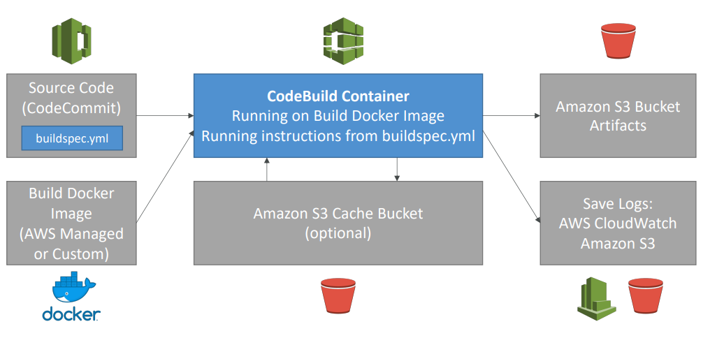
* CodeBuild BuildSpec
  * buildspec.yml file must be at the root of your code.
  Can specify a different name for it in AWS
  * Define environment variables
    * Plaintext variables
    * Secure secrets: use SSM Parameter store
  * Phases (specify commands to run):
    * Install: install dependencies you may need for your
    build
    * Pre-build: final commands to execute before build
    * Build: actual build commands
    * Post build: finishing touches (zip output for example)
  * Artifacts out: what to upload to S3 (encrypted with KMS)
  * Cache: files to cache (usually dependencies) to S3 for 
  future build speedup
* CodeBuild Local Build
  * In case you need to troubleshoot beyond logs
  * You can run CodeBuild locally on your desktop (after 
  installing Docker)
  * For this, leverage the CodeBuild Agent
* CodeBuild in VPC
  * By default, your CodeBuild containers are launched 
  outside your VPC. Therefore, by default, it cannot 
  access resources in a VPC.
  * You can specify a VPC configuration: VPC ID, subnet IDs,
  securityGroup IDs
  * Then your build can access resources in your VPC 
  (RDS, ElastiCache etc)

**AWS CodeDeploy - deploying the code to EC2 fleets (not Beanstalk)**
* We want to deploy your application automatically to
many EC2 instances
* These instances are not managed by Elastic Beanstalk
* There are several ways to handle deployments using open
source tools (Ansible, Terraform, Chef, Puppet etc)
* We can use the managed service AWS CodeDeploy
* Primary components
  * Application - unique name
  * Compute platform - EC2/On-promise or Lambda
  * Deployment configuration - deployment rules for 
  success/failure
    * EC2/On-Premise: you can specify the minimum
    number of healthy instances for the deployment
    * AWS Lambda: specify how traffic is routed to
    your updated Lambda function versions
    * Deployment group: group of tagged instances 
    (allows to deploy gradually)
    * Deployment type: in-place deployment or
    Blue/green deployment
    * IAM instance profile: need to give EC2 the 
    permissions to pull from S3/Github
    * Application revision: application code +
    appspec.yml file
    * Service role: role for CodeDeploy to perform 
    what it needs
    * Target revision: target deployment application
    version
* Steps to make it work
  * Each EC2 machine (or On Premise machine) must be
  running the CodeDeploy agent
  * The agent is continuously polling AWS CodeDeploy
  for work to do
  * CodeDeploy sends appspec.yml file for instructions
    * Has to be at the root of your app
    * File section: how to source and copy from S3/Github
    to filesystem
    * Hooks: set of instructions to do to deploy the new
    version (hooks can have timeouts if you want). Don't
    have to define all of them. The order is:
      * ApplicationStop - stop the application that is running currently
      so you could deploy the new version
      * DownloadBundle - download my new application
      * BeforeInstall - do any preparation you might need
      before installing a new application version
      * AfterInstall - do any clean up if you need after install
      * ApplicationStart - how do you start your application
      * ValidateService (really important) - how to make sure that
      the application is actually working. Essentially an initial 
      health check
  * Application is pulled from GitHub or S3
  * EC2 will run the deployment instructions
  * CodeDeploy Agent will report of success/failure
  of deployment on the instance
* EC2 instances are grouped by deployment group(dev/test/prod)
* Lots of flexibility to define any kind of deployments
* CodeDeploy can be chained into CodePipeline and use
artifacts from there
* CodeDeploy can re-use existing setup tools, works with
any application, auto-scaling integration
* Note: Blue/Green only works with EC2 instances (not
on premise)
* Support for AWS Lambda deployments
* CodeDeploy doesn't provision resources, assumes the
resources are already existing
* AWS CodeDeploy Deployment Config
  * Configs
    * One at a time: one instance at a time, one instance 
    fails => deployment stops
    * Half at a time: 50%
    * All at once: quick but no healthy host. Has downtime. Good for dev
    * Custom: ex. min healthy host = 75%
  * Failures
    * Instances stay in 'failed state'
    * New deployments will first be deployed to 'failed state' instances
    * To rollback: redeploy old deployment or enable automated
    rollback for failures
  * Deployment targets
    * Set of EC2 instances with tags
    * Directly to an ASG
    * Mix of ASG/Tags so you can build deployment segments
    * Customization in scripts with DEPLOYMENT_GROUP_NAME
    environment variables
* Rollback
  * You can specify automated rollback options
  * Rollback when a deployment fails
  * Rollback when alarm thresholds are met
  * Disable rollbacks - do not perform rollbacks for this deployment
  * If a rollback happens, CodeDeploy redeploys the last known 
  good revision as a new deployment, thus getting a new version ID

**CodeStar**
* CodeStar is an integrated solution that regroups: GitHub, CodeCommit,
CodeBuild, CodeDeploy, CloudFormation, CodePipeline, CloudWatch
* Helps quickly create 'CICD-ready' projects for EC2, Lambda, Beanstalk
* Supported languages: C#, Go, HTML5, Java, Node.js, PHP, Python, Ruby
* Issue tracking integration with JIRA/Github issues
* Ability to integrate with Cloud9 to obtain a web IDE (not all regions)
* One dashboard to view all your components
* Free service, pay only for the underlying usage of other services
* Limited customization

**Amazon CodeGuru**
* An ML-powered service for automated code reviews and application
performance recommendations
* Provides two functionalities
  * CodeGuru reviewer: automated code reviews for static code
  analysis
    * Identify critical issues, security vulnerabilities, and
    hard-to-find bugs
    * Example: common coding best practices, resource leaks,
    security detection, input validation
    * Uses ML and automated reasoning
    * Hard learned lessons across millions of code reviews on 1000s
    of open-source and Amazon repositories
    * Supports Java and Python
    * Integrates with Github, Bitbucket, and AWS CodeCommit
  * CodeGuru profiler: visibility/recommendations about application
  performance during runtime (production)
    * Helps understand the runtime behavior of your application
    * Example: identify if your application is consuming excessive
    CPU capacity on a logging routine
    * Features:
      * Identify and remove code inefficiencies 
      * Improve application performance (e.g., reduce CPU utilization)
      * Provides heap summary (identify which objects using up memory)
      * Anomaly detection
    * Support applications running on AWS or on-premise
    * Minimal overhead on application

**AWS CodeArtifact**
* Software packages depend on each other to be built (also called
code dependencies), and new ones are created
* Storing and retrieving these dependencies is called artifact
management
* Traditionally you need to setup your own artifact management
system
* CodeArtifact is a secure, scalable, and cost-effective artifact
management for software development
* Works with common dependency management tools such as Maven, 
Gradle, npm, yarn, twine, pip, and NuGet
* Developers and CodeBuild can then retrieve dependencies straight
from CodeArtifact

<h2>CloudFormation</h2>
Infrastructure as code means that code would be used to create,
update, or delete our infrastructure

**CloudFormation**
* CloudFormation is a declarative way of outlining your AWS
Infrastructure, for any resources (most of them are supported)
* For example, within a CloudFormation template, you say:
  * I want a security group
  * I want two EC2 machines using this security group
  * I want two Elastic IPs for these EC2 machines
  * I want an S3 bucket
  * I want a load balancer (ELB) in front of these machines
* Then CloudFormation creates those for you, in the right order,
with the exact configuration that you specify
* Benefits of CloudFormation
  * Infrastructure as code
    * No resources are manually created, which is excellent
    for control
    * The code can be version controlled for example using Git
    * Changes to the infrastructure are reviewed through code
  * Cost
    * Each resource within the stack is tagged with an identifier
    so you can easily see how much a stack costs you
    * You can estimate the costs of your resources using the
    CloudFormation template
    * Saving strategy: in dev, you could automate deletion of 
    templates at 5 PM and recreate at 8 AM, safely
  * Productivity
    * Ability to destroy and re-create an infrastructure on 
    the cloud on the fly
    * Automated generation of diagram for your templates
    * Declarative programming (no need to figure out ordering
    and orchestration)
  * Separation of concern - create many stacks for many apps,
  and many layers. Ex:
    * VPC stacks
    * Network stacks
    * App stacks
* How CloudFormation works
  * Templates have to be uploaded in S3 and then referenced
  in CloudFormation
  * To update a template, we can't edit previous ones. We have
  to re-upload a new version of the template to AWS. AWS will
  then do a diff on what it should create.
  * Stacks are identified by a name
  * Deleting a stack deletes every single artifact that was 
  created by CloudFormation
* Deploying CloudFormation templates
  * Manual way:
    * Editing templates in the CloudFormation designer
    * Using the console to input parameters etc
  * Automated way:
    * Editing templates in a YAML file
    * Using the AWS CLI (Command line interface) to deploy
    the templates
    * Recommended way when you fully want to automate your flow
* Building blocks
  * Templates components
    * Resources: your AWS resources declared in the template (MANDATORY)
      * They represent the different AWS Components that will be created
      and configured
      * Resources are declared and can reference each other
      * AWS figures out creation, updates, and deletes of resources
      for us
      * There are over 224 types of resources
      * Resource types identifiers are of the form 
      `AWS::aws-product-name::data-type-name`. Ex. `AWS::EC2::Instance`
      * Has all sorts of properties that can be defined
      * Can't create a dynamic amount of resources. Everything in the 
      CloudFormation template has to be declared. You can't perform
      code generation there
      * Almost all AWS services are supported
      * Those that aren't supported can be used via AWS Lambda Custom Resources
    * Parameters: the dynamic inputs for your template
      * Parameters are a way to provide inputs to your AWS CloudFormation
      template
      * They're important to know about if:
        * You want to reuse your templates across the company
        * Some inputs can not be determined ahead of time
      * Parameters are extremely powerful, controlled, and can prevent
      errors from happening in your templates thanks to types
      * Use if this CloudFormation resource configuration is likely to change
        in the future
      * The `Ref` function can be used to reference another value. E.g. `!Ref MyVPC`
      * AWS offers us pseudo parameters to create values that are predefined by 
      AWS CloudFormation. E.g. `AWS::AccountId`
      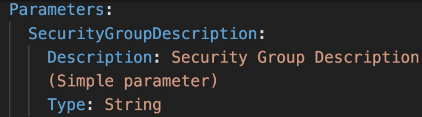
    * Mappings: the static variables for your template
      * Mappings are fixed variables within your CloudFormation template
      * They're very handy to differentiate between different environments
        (dev vs prod), regions (AWS regions), AMI types etc
      * All the values are hardcoded within the template
      * Mappings are great when you know in advance all the values that can
      be taken and that they can be deduced from variables such as Region, AZ, 
      AWS Account, Environment etc
      * They allow safer control over the template
      * Use parameters instead when the values are really user specific
      * FindInMap to return a named value from a specific key `!FindInMap [MapName, TopLevelKey, SecondLevelKey]`
        * Ex. `!FindInMap [OurCustomRegionMap, !Ref "AWS::Region", 32]`
          
    * Outputs: references to what has been created
      * The outputs section declares optional output values that we can 
      import into other stacks (if you export them first)
      * You can also view the outputs in the AWS Console or in using 
      the AWS CLI
      * They're very useful for example if you define a network CloudFormation
      and output the variables such as VPC ID and your Subnet IDs
      * It's the best way to perform some collaboration cross stack, as you 
      let experts handle their own part of the stack
      * You can't delete a CloudFormation stack if its outputs are being
      referenced by another CloudFormation stack
      * The export parameter is required, if you want to use it. It defines
      what the parameter name for the user will be
      
      * ImportValue can be used to reference the variable
        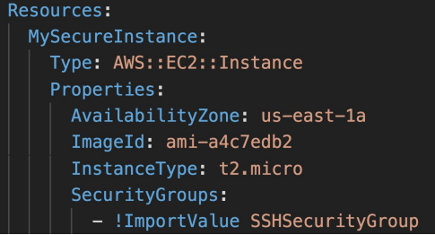
    * Conditionals: list of conditions to perform resource creation
      * Conditions are used to control the creation of resources or outputs
      based on a condition
      * Conditions can be whatever you want them to be, but common 
      ones are:
        * Environment (dev/test/prod)
        * AWS Region
        * Any parameter value
      * Each condition can reference another condition, parameter value
      or mapping
        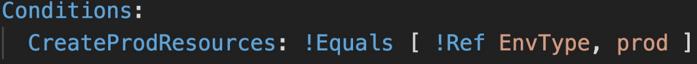
      * The intrinsic function (logical) can be any of the following:
        * And, Equals, If, Not, Or 
      * Conditions can be applied to resources, outputs etc
      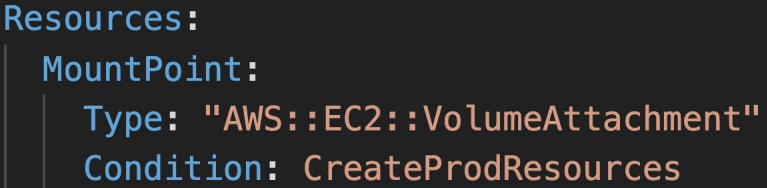
    * Metadata
  * Template helpers
    * References
    * Functions
* Must know intrinsic functions
  * Function long form is  Fn::<func>, and short form is !<func>
  * Fn::Ref - reference parameters, resources
    
  * Fn::GetAtt - attributes are attached to any resources you
    create. Check out the documentation to find out what you can get
    
  * Fn::FindInMap - return a named value from a specific key
    
  * Fn::ImportValue - import values that are exported in other
  templates
    
  * Fn::Join - join values with a delimiter. `!Join [delimiter, [list] ]`
  
  * Fn::Sub - substitute variables form a text. It's a very handy 
  function that will allow you to fully customize your templates
  * For example, you can combine Fn::Sub with references or AWS
  pseudo variables
  * ```
    Fn::Sub:
    - String
    - Var1Name: Var1Value
      Var2Name: Var2Value
    ```
  * The following example uses a mapping to substitute the ${Domain} 
  variable with the resulting value from the Ref function.
  ````
  Name: !Sub
  - www.${Domain}
  - { Domain: !Ref RootDomainName }
  ````
  * Condition functions - logical ID is for you to choose. It's
  how you name conditions. Can contain Fn::And, Fn::Equals,
  Fn::If, Fn::Not, Fn::Or
    
* CloudFormation Rollbacks
    * Stack Creation Fails:
        * Default: Everything rolls back (gets deleted). We can look
    at the log
        * Option to disable rollback and troubleshoot what happened
    * Stack update fails:
        * The stack automatically rolls back to the previous known
    working state
        * Ability to see in the log what happened and error messages
* ChangeSets
    * When you update a stack, you need to know what changes before it
    happens for greater confidence
    * ChangeSets won't say if the update will be successful
* Nested stacks
    * Nested stacks are stacks as part of other stacks
    * They allow you to isolate repeated patterns/common components
    in separate stacks and call them from other stacks
    * Example:
        * Load balancer configuration that is re-used
        * Security group that is re-used
    * Nested stacks are considered best practice
    * To update a nested stack, always update the parent (root stack)
* Cross stacks vs nested stacks
    * Helpful when stacks have different lifecycles
    * Use outputs export and Fn::ImportValue
    * When you need to pass export values to many stacks
* Nested stacks
    * Helpful when components must be re-used
    * Example: re-use how to properly configure an ALB
    * The nested stack only is important to the higher level stack (it's
      not shared)
* StackSets
    * Create, update, or delete stacks across multiple accounts and
    regions with a single operation
    * Administrator account to create StackSets
    * Trusted accounts to create, update, delete stack instances from
    StackSets
    * When you update a stack set, all associated stack instances are
    updated throughout all accounts and regions
* CloudFormation drift
    * CloudFormation allows you to create infrastructure, but it 
      doesn't protect you against manual configuration changes
    * How do we know if our resources have drifted? We can use 
      CloudFormation drift
    * Not all resources are supported yet

<h2>AWS Monitoring, Troubleshooting & Audit</h2>
**CloudWatch**
* Metrics: Collect and track key metrics
  * CloudWatch provides metrics for every service in AWS
  * Metric is a variable to monitor (CPUUtilization, NetworkIn etc.)
  * Metrics belong to namespaces
  * Dimension is an attribute of a metric (instance id, environment etc.)
  * Up to 10 dimensions per metric
  * Metrics have timestamps
  * Can create CloudWatch dashboards of metrics
  * EC2 detailed monitoring
    * EC2 instance metrics have metrics "every 5 minutes"
    * With detailed monitoring (for a cost), you get data "every 1 minute"
    * Use detailed monitoring if you want to scale faster for your ASG!
    * The AWS Free Tier allows us to have 10 detailed monitoring metrics
    * Note: EC2 memory usage is by default not pushed (must be pushed from
    inside the instance as a custom metric)
  * Custom metrics
    * Possibility to define and send your own custom metrics to CloudWatch
    * Example: memory (RAM) usage, disk space, number of logged-in users etc.
    * Use API call PutMetricData
    * Ability to use dimensions (attributes) to segment metrics
      * Instance.id
      * Environment.name
    * Metric resolution (StorageResolution API parameter - two possible values):
      * Standard: 1 minute (60 seconds)
      * Higher resolution: 1/5/10/30 seconds - higher cost
    * Important: accepts metric data points two weeks in the past and two hours
    in the future (make sure to configure your EC2 instance time correctly)
* Logs: Collect, monitor, analyze, and store log files
  * Applications can send logs to CloudWatch using the SDK
  * CloudWatch can collect logs from:
    * Elastic Beanstalk: collection of logs from application
    * ECS: collection from containers
    * AWS Lambda: collection from function logs
    * VPC flow logs: VPC specific logs
    * API Gateway
    * CloudTrail based on filter
    * CloudWatch log agents: for example on EC2 machines
    * Route 53: Log DNS queries
  * CloudWatch logs can go to:
    * Batch exporter to S3 for archival
    * Stream to ElasticSearch cluster for further analytics
  * CloudWatch logs can use filter expressions
  * Logs storage architecture:
    * Log groups: arbitrary name, usually representing an application
    * Log stream: instances within application/log files/containers
  * Can define log expiration policies (never expire, 30 days, etc.)
  * Using the AWS CLI we can tail CloudWatch logs
  * To send logs to CloudWatch, make sure IAM permissions are correct
  * Security: encryption of logs at rest using KMS at the group level
* Events: send notifications when certain events happen in your AWS
* Alarms: React in real-time to metrics/events
* CloudWatch Agent
  * By default, no logs go from your EC2 machine to CloudWatch
  * You need to run a CloudWatch agent on EC2 to push the log files
  you want
  * Make sure IAM permissions are correct
  * The CloudWatch log agent can be setup on-premises too
  * CloudWatch Logs Agent & Unified Agent
    * For virtual servers (EC2 instances, on-promise servers etc.)
    * CloudWatch Logs Agent
      * Old version of the agent
      * Can only send to CloudWatch Logs
    * CloudWatch Unified Agent
      * Collect additional system-level metrics such as RAM, processes, etc.
      * Collect logs to send to CloudWatch logs
      * Centralized configuration using SSM Parameter Store
      * Metrics
        * Collected directly on your Linux server/EC2 instance
        * CPU (active, guest, idle, system, user, steal)
        * Disk metrics (free, used, total), Disk IO (writes, reads, bytes, iops)
        * RAM (free, inactive, used, total, cached)
        * Netstat (number of TCP and UDP connections,  net packets, bytes)
        * Processes (total, dead, blocked, idle, running, sleep)
        * Swap space (free, used, used %)
* CloudWatch Logs Metric Filter
  * CloudWatch logs can use filter expressions
    * For example, find a specific IP inside a log
    * Or count occurrences of "Error" in your log
    * Metric filters can be used to trigger alarms once a certain
    threshold has been reached
  * Filters do not retroactively filter data. Filters only publish the metric
  data points for events that happen after the filter was created.
* CloudWatch Alarms
  * Alarms are used to trigger notifications for any metric
  * Various options (sampling, %, max, min, etc.)
  * Alarm states:
    * OK
    * INSUFFICIENT_DATA
    * ALARM
  * Period
    * Length of time in seconds to evaluate the metric
    * High resolution custom metrics: 10 sec, 30 sec, or multiples of 60 sec
  * Alarm targets
    * EC2 - stop, terminate, reboot, or recover an EC2 instance
    * EC2 auto scaling - trigger auto scaling action
    * SNS - send notifications to SNS (from which you can do pretty much anything)
  * Good to know:
    * Alarms can be created based on CloudWatch logs metrics filters
    * To test alarms and notifications, set the alarm state to Alarm using CLI
    `aws cloudwatch set-alarm-state --alarm-name "myalarm" --state-value
      ALARM --state-reason "testing purposes"`
* CloudWatch Events (now EventBridge)
  * Event pattern: intercept events from AWS services (Sources)
    * Example sources: EC2 instance start, CodeBuild Failure, S3, Trusted Advisor
    * Can intercept any API call with CloudTrail integration
  * Schedule or cron (example: create an event every 4 hours)
  * A JSON payload is created from the event and passed to a target, which can be:
    * Compute: Lambda, Batch, ECS task
    * Integration: SQS, SNS, Kinesis Data Streams, Kinesis Data Firehose
    * Orchestration: Step functions, CodePipeline, CodeBuild
    * Maintenance: SSM, EC2 actions
* CloudWatch EventBridge
  * EventBridge is the next evolution of CloudWatch Events
  * Amazon EventBridge vs CloudWatch Events
    * Amazon EventBridge builds upon and extends CloudWatch Events
    * It uses the same service API and endpoint, and the same 
    underlying service infrastructure
    * EventBridge allows extension to add event buses for your
    custom applications and your third-party SaaS apps
    * EventBridge has the Schema Registry capability
    * EventBridge has a different name to mark the new capabilities
    * Over time, the CloudWatch Events name will be replaced with 
    EventBridge
  * CloudWatch has a single bus, but EventBridge has multiple
  * Default event bus: generated by AWS services (CloudWatch Events)
  * Partner event bus: receive events from other SaaS service or applications
    (Zendesk, DataDog, Segment, Auth0, etc.)
  * Custom event buses: for your own applications
  * Event buses can be accessed by other AWS accounts
  * Rules: how to process the events (similar to CloudWatch Events)
  * Schema Registry
    * EventBridge can analyze the events in your bus and infer the
    schema
    * The Schema Registry allows you to generate code for your 
    application, that will know in advance how data is structured
    in the event bus
    * Schema can be versioned

**AWS X-Ray**
* Troubleshooting application performance and errors
* Distributed tracing of microservices
* Debugging in production, the good old way
  * Test locally
  * Add log statements everywhere
  * Re-deploy in production
* Log formats differ across applications using 
CloudWatch and analytics is hard
* Debugging: monolith 'easy', distributed services 'hard'
* No common views of your entire architecture
* X-Ray gives a visual analysis of your applications
* X-Ray advantages
  * Troubleshooting performance (bottlenecks)
  * Understand dependencies in a microservice architecture
  * Pinpoint service issues
  * Review request behavior
  * Find errors and exceptions
  * Are we meeting time SLA?
  * Where am I throttled?
  * Identify users that are impacted by your errors
* X-Ray compatibility
  * AWS Lambda
  * Elastic Beanstalk
  * ECS
  * ELB
  * API Gateway
  * EC2 instances or any application server (event on-promise)
* X-Ray leverages tracing
* Tracing is an end to end way of following a request
* Each component dealing with the requests adds its own trace
* Tracing is made of segments (+ subsegments)
* Annotations can be added to traces to provide extra information
* Ability to trace:
  * Every request
  * Sample request (as a % for example or a rate per minute)
* X-Ray security:
  * IAM for authorization
  * Can use KMS encryption at rest
* How to enable?
  * Your code must import the AWS X-Ray SDK
    * Very little code modification needed
    * The application SDK will the capture:
      * Calls to AWS services
      * HTTP/HTTPS requests
      * Database calls (MySQL, PostgreSQL, DynamoDB)
      * Queue calls (SQS)
  * Install the X-Ray daemon or enable X-Ray AWS integration
    * X-Ray daemon works as a low level UDP packet interceptor
      (Linux/Windows/Mac)
    * AWS Lambda/other AWS services already run the X-Ray 
    daemon for you
    * Each application must have the IAM rights to write data to
    X-Ray
      
* X-Ray service collects data from all the different services
* Service map is computed from all the segments and traces
* X-Ray is graphical, so even non-technical people can help
troubleshoot
* Troubleshooting
  * If X-Ray is not working on EC2
    * Ensure the EC2 IAM role has the proper permissions
    * Ensure the EC2 instance is running the X-Ray Daemon
  * To enable on AWS Lambda:
    * Ensure it has an IAM execution role with proper policy
    (AWSX-RayWriteOnlyAccess)
    * Ensure that X-Ray is imported in the code
* X-Ray instrumentation in your code
  * Instrumentation means the measure of a product's performance,
  diagnose errors, and to write trace information. It's a field 
  in software development to do all these things.
  * To instrument your application code, you use the X-Ray SDK
  * You can modify your application code to customize and annotate
  the data that the SDK sends to X-Ray, using interceptors, filters,
  handlers, middleware etc.
* X-Ray Concepts
  * Segments - each application/service will send them
  * Subsegments - if you need more details in your segments
  * Trace - all the segments collected together to form an end-to-end trace
  * Sampling - decrease the amount of requests sent to X-Ray to reduce cost
    * With sampling rules, you control the amount of data that you record. The more
    data you send, the more you'll pay.
    * You can modify sampling rules without changing your code.
    * By default, the X-Ray SDK records the first request each second, and
    five percent of any additional requests.
    * One request per second is the reservoir, which ensures that at least one
    trace is recorded each second as long as the service is serving requests.
    * Five percent is the rate at which additional requests beyond the reservoir 
    size are sampled
    * You can create your own rules with the reservoir and rate.
    
  * Annotations - key-value pairs used to index traces and use with filters
  * Metadata - key-value pairs, not indexed, not used for searching
  * The X-Ray daemon/agent has a config to send traces cross account:
    * make sure the IAM permissions are correct - the agent will assume the role
    * this allows to have a central account for all your application tracing
* Write APIs (used by the X-Ray daemon)
  * arn:aws:iam::aws:policy/AWSXrayWriteOnlyAccess
    * PutTraceSegments - uploads segment documents to AWS X-Ray
    * PutTelemetryRecords - used by the AWS X-Ray daemon to upload 
    telemetry. Helps with the metrics
      * SegmentsReceivedCount, SegmentsRejectedCounts, BackendConnectionErrors etc.
    * GetSamplingRules - retrieve all sampling rules (to know what/when to send)
    * GetSamplingTargets & GetSamplingStatisticSummaries - advanced
    * The X-Ray daemon needs to have an IAM policy authorizing the correct
    API calls to function correctly
      
  * arn:aws:iam::aws:policy/AWSXrayReadOnlyAccess
    * GetServiceGraph - main graph
    * BatchGetTraces - retrieves a lost of traces specified by ID.
    Each trace is a collection of segment documents that originates
    from a single request.
    * GetTraceSummaries - retrieves IDs and annotations for traces 
    available for a specified time frame using an optional filter. 
    To get the full traces, pass the trace IDs to BatchGetTraces
    * GetTraceGraph - retrieves a service graph for one or more
    specific trace IDs.
    
* X-Ray with elastic beanstalk
  * AWS Elastic Beanstalk platforms include the X-Ray daemon
  * You can run the daemon by setting an option in the Elastic Beanstalk
  console or with a configuration file (in .ebextensions/xray-daemon.config)
  * Make sure to give your instance profile the correct IAM permissions so that
  the X-Ray daemon can function correctly. Then make sure your application 
  code is instrumented with the X-Ray SDK. 
  * Note: The X-Ray daemon is not provided for Multicontainer Docker
* ECS + X-Ray integration options
  * ECS Cluster X-Ray container as a daemon. Run the X-Ray daemon container in each EC2 instance.
  * ECS Cluster X-Ray container as a "side car". Run one X-Ray daemon container alongside each app
  container. 
  * Fargate cluster X-Ray container as a "side car". Same as for ECS, except you don't have EC2 instances.
    

**AWS CloudTrail**
* Internal monitoring of API calls being made
* Audit changes to AWS resources by your users
* Provides governance, compliance, and audit for your AWS account
* CloudTrail is enabled by default
* Get a history of events/API calls made within your AWS account by:
  * Console
  * SDK
  * CLI
  * AWS Services
* Can put logs from CloudTrail into CloudWatch logs or S3
* A trail can be applied to all regions (default) or a single region
* If a resource is deleted in AWS, investigate CloudTrail first
* CloudTrail Events
  * Management events:
    * Operations that are performed on resources in your AWS account
    * Examples:
      * Configuring security (IAM AttachRolePolicy)
      * Configuring rules for routing data (Amazon EC2 CreateSubnet)
      * Setting up logging (AWS CloudTrail CreateTrail)
    * By default, trails are configured to log management events
    * Can separate read events (that don't modify resources) 
    from write events (that may modify resources)
  * Data events:
    * By default, data events are not logged (because of high volume operations)
    * Amazon S3 object-leve activity (ex. GetObject, DeleteObject, PutObject):
    can separate Read and Write events
    * AWS Lambda function execution activity (the Invoke API)
  * CloudTrail Insights
    * Enable CloudTrail Insights to detect unusual activity in your account:
      * inaccurate resource provisioning
      * hitting service limits
      * Bursts of AWS IAM actions
      * Gaps in periodic maintenance activity
    * CloudTrail Insights analyzes normal management events to create a baseline,
    and then continuously analyzes write events to detect unusual patterns
      * Anomalies appear in the CloudTrail console
      * Event is sent to Amazon S3
      * An EventBridge event is generated (for automation needs)
* CloudTrail Events Retention
  * Events are stored for 90 days in CloudTrail
  * To keep events beyond this period, log them to S3 and use Athena


<h2>AWS Integration & Messaging</h2>
** Amazon SNS - Simple notification service**
* What if you want to send one message to many receivers?
  
* The event producer only sends a message to one SNS topic
* As many event receivers (subscriptions) as we want to listen to the SNS
topic notifications
* Each subscriber to the topic will get all the messages (note: new 
  feature to filter messages)
* Up to 10,000,000 subscriptions per topic
* 100,000 topics limit
* Subscribers can be:
    * SQS
    * HTTP/HTTPS (with delivery retries - how many times)
    * Lambda
    * Emails
    * SMS messages
    * Mobile notifications
* Many AWS services can send data directly to SNS for notifications:
  CloudWatch (for alarms), Auto scaling groups notifications,
  Amazon S3 (on bucket events), CloudFormation (upon state changes =>
  failed to build etc.) etc.
* How to publish
    * Topic publish (using the SDK)
        * Create a topic
        * Create a subscription (or many)
        * Publish to the topic
    * Direct publish (for mobile apps SDK)
        * Create a platform application
        * Create a platform endpoint
        * Publish to the platform endpoint
        * Works with Google GCM, Apple APNS, Amazon ADM etc.
* Security
    * Encryption
        * In-flight encryption using HTTPS API
        * At-rest encryption using KMS keys
        * Client side encryption if the client wants to perform encryption/decryption
        itself
    * Access controls - IAM policies to regulate access to the SNS API
    * SNS access policies (similar to S3 bucket policies)
        * Useful for cross-account access to SNS topics
        * Useful for allowing other services (S3 etc.) to write to an SNS topic
* FIFO topic
    * First in first out (ordering of messages in the topic)
    * Similar features as SQS FIFO
        * Ordering by message group ID (all messages in the same group
          are ordered)
        * Deduplication using a deduplication ID or content based deduplication
    * Can only have SQS FIFO queues as subscribes
    * Limited throughput (same throughput as SQS FIFO)
* Message filtering
    * JSON policy used to filter messages sent to SNS topic's subscriptions
    * If a subscription doesn't have a filter policy, it receives every message
      

**Amazon SQS - Standard queue**
* Oldest offering (over 10 years old)
* Fully managed service, used to decouple applications
* Attributes
  * Unlimited throughput, unlimited number of messages in queue
  * Messages are short-lived - default retention of messages is 4 day,
  maximum of 14 days
  * Low latency (<10 ms on publish and receive)
  * Limitation of 256 kb per message sent
* Can have duplicate messages (at least once delivery, occasionally)
* Can have out of order messages (best effort ordering)
* Producing messages
  * Produced to SQS using the SDK (SendMessage API)
  * The message is persisted in SQS until a consumer deletes it
  * Message retention default 4 days, up to 14 days
  * Example: send an order to be processed
    * Order id
    * Customer id
    * Any attributes you want
  * SQS standard: unlimited throughput
* Consuming messages
  * Consumers (running on EC2 instances, servers, or AWS lambda etc.)
  * Poll SQS for messages (receive up to 10 messages at a time)
  * Process the messages (example: insert the message into an RDS DB)
  * Delete the messages using the DeleteMessage API
* Multiple EC2 instance consumers
  * Consumers receive and process messages in parallel
  * At least once delivery
  * Best-effort message ordering
  * Consumers delete messages after processing them
  * We can scale consumers horizontally to improve throughput of processing
* SQS with ASG
  * Use a CloudWatch Metric of queue length to decide whether new instances are needed
    
* SQS to decouple between application tiers
  * E.g. video processing might take very long, so it's easier to delegate it to
  another app that's attached to a queue.
    
* Amazon SQS - Security
  * Encryption:
    * In-flight encryption using HTTPS API
    * At-rest encryption using KMS keys
    * Client-side encryption if the client wants to perform
    encryption/decryption itself
  * Access controls: IAM policies to regulate access to the SQS API
  * SQS access policies (similar to S3 bucket policies)
    * Useful for cross-account access to SQS queues
    * Useful for allowing other services (SNS, S3, etc.) to write 
    to an SQS queue
* SQS - Message Visibility Timeout
    * After a message is polled by a consumer, it becomes invisible
    to other consumers
    * By default, the "message visibility timeout" is 30 seconds
    * That means the message has 30 seconds to be processed
    * After the message visibility timeout is over, the message is 
    "visible" in SQS
    * If a message is not processed within the visibility timeout, it
    will be processed twice
    * If the consumer knows that the processing will take longer, then 
    it can call the ChangeMessageVisibility API to get more time
    * If visibility timeout is high (hours), and the consumer crashes,
    then re-processing will take a lot of time due to the message being
    invisible
    * If visibility timeout is too low (seconds), we may get duplicate
    processing
    * So the visibility timeout should be set to something reasonable for
    your application
* Dead Letter Queue
    * If a consumer fails to process a message within the Visibility Timeout
    then the message goes back to the queue
    * We can get a threshold of how many times a message can go back to
    the queue
    * After the MaximumReceives threshold is exceeded, the message goes into
    a dead letter queue (DLQ)
    * Useful for debugging
    * Make sure to process the messages in the DLQ before they expire:
        * Good to set a retention of 14 days in the DLQ
    * It's another queue that you create with the purpose of being a DLQ.
    You then go back to your initial queue and specify that a DLQ is enabled,
    after that you specify the dead letter queue ARN.
* Delay queue
    * Delay a message (consumers don't see it immediately) up to 15 minutes
    * Default is 0 seconds (message is available right away)
    * Can set a default at queue level
    * Can override the default on send using the DelaySeconds parameter
* Long polling
    * When a consumer requests messages from the queue, it can optionally
    "wait" for messages to arrive if there are none in the queue. This is
    called long polling.
    * Long Polling decreases the number of API calls made to SQS while 
    increasing the efficiency and latency of your application
    * The wait time can be between 1 sec to 20 sec (20 sec preferable)
    * Long polling is preferable to short polling (which is constant querying)
    * Long polling can be enabled at the queue level or at the API level
    using WaitTimeSeconds
* Extended client
    * Message size limit is 256 KB, how to send large messages, e.g. 1 GB?
    * Using the SQS Extended Client (Java library)
    * It uses an S3 bucket for large data
    * Small metadata message will be sent to the queue and the file itself
    will be uploaded to S3.
      
* Must know API
    * CreateQueue - creates a queue. MessageRetentionPeriod can be used to
    set how long a message should be kept in the queue
    * DeleteQueue - deletes a queue and all the messages in the queue at the
    same time
    * PurgeQueue - deletes all the messages in the queue
    * SendMessage - to send messages. Use the DelaySeconds to set a delay for
    the message.
    * ReceiveMessage - to do polling
    * DeleteMessage - to delete a message
    * MaxNumberOfMessages - how many messages a consumer can receive at one
    time. The default is set to 1. Maximum can be 10 (for ReceiveMessage API)
    * ReceiveMessageWaitTimeSeconds - for long polling. Tells the consumer how
    long to wait before getting a response from the queue.
    * ChangeMessageVisibility - change the message timeout in case you need
    more time to process the message.
    * Batch APIs can be used for SendMessage, DeleteMessage, ChangeMessageVisibility
    to help decrease the number of API calls and thus the cost.
* FIFO queue
    * FIFO - first in first out (ordering of messages in the queue)
    * Since we are guaranteeing the order, then there is limited throughput
    at 300 messages/second without batching, 3000 messages/second with
    * Exactly once send capability (by removing duplicates).
    * Messages are processed in order by the consumer
    * Deduplication
        * Deduplication interval is 5 minutes. So if you send a duplicate
        message within that window, then that duplicate message will be
        refused.
        * Two de-duplication methods:
            * Content based deduplication - will do an SHA-256 hash of the
            message body.
            * Explicitly provide a message deduplication ID.
    * Message grouping
        * If you specify the same value of MessageGroupID in an SQS FIFO
        queue, you can only have one consumer, and all the messages are
        in order for that one consumer.
        * To get ordering at the level of a subset of messages, specify 
        different values for MessageGroupID
            * Messages that share a common Message Group ID will be in 
            order within the group.
            * Each group can have a different consumer (parallel processing)
            * Ordering across groups is not guaranteed
* Ordering data in SQS
    * For SQS standard, there is no ordering.
    * For SQS FIFO, if you don't use a group ID, messages are consumed in the order
    they are sent, with only one consumer.
    * You want to scale the number of consumers, but you want messages to be "grouped"
    when they are related to each other. Then you use a Group ID (similar to partition key
      in Kinesis)

** SNS + SQS: Fan out ** 
* Push once to SNS, receive in all SQS queues that are subscribers.
  
* It's a fully decoupled model and there is no data loss.
* SQS allows for data persistence, delayed processing and retries of work
* Ability to add more SQS subscribers over time
* Make sure your SQS queue access policy allows for SNS to write
* Application: S3 events to multiple queues
    * For the same combination of event type (e.g. object create) and
    prefix (e.g. images/), you can only have one S3 event rule
    * If you want to send the same S3 event to many SQS queues, use fan-out
      
* SNS FIFO + SQS FIFO: Fan out
    * In case you need fan out + ordering + deduplication

**Kinesis**
* Makes it easy to collect, process, and analyze streaming data in real-time
* Ingest real-time data such as application logs, metrics, website clickstreams,
IoT telemetry data etc.
* Kineses data streams - capture, process, and store data streams
    * Stream big data
    * Stream consists of shards that you have to provision ahead of time. 
    Can scale the number of shards.
    * Partition key determines which shard will the data go to. Data blob
    is the data itself
    * The speed is 1 MB/sec per shard or 1000 messages/sec per shard. So 
    if you have 6 shards, then 6 MB/sec or 6000 messages/sec
    * Billing is per shard provisioned, can have as many shards as you want
    * Retention between 1 day (default) to 365 days. It's not meant to be
    a durable data store, it's just meant to have data streamed through it.
    * Ability to reprocess (replay) data
    * Once data is inserted in Kinesis, it can't be deleted (immutability)
    * Data that shares the same partition goes to the same shard (ordering)
      
    * Producers: AWS SDK, Kinesis Producer Library (KPL), Kinesis Agent
        * Puts data records into data streams
        * Data record consist of
            * Sequence number (unique per partition-key within shard)
            * Partition key (must specify while putting records into stream)
            * Data blob (up to 1 MB)
        * Producers:
            * AWS SDK: simple producer
            * Kinesis producer library (KPL): C++, Java, batch, compression, retries
            * Kinesis agent: monitor log files
        * Write throughput: 1 MB/sec or 1000 records/sec per shard
        * PutRecord API is used to send data into Kinesis
        * Use batching with PutRecords API to reduce costs & increase throughput
        * So the way that producers work is as follows. We specify a partition key.
        The partition key is put into a hash function to determine a shard key. This
        chooses into which shard to send the data, not the producer. But all the
        data that shares the same partition key goes into the same shard, however,
        you can't specify which shard it goes into. You have to make sure that you choose
        a partition key that is distributed enough. If one device is extremely chatty, then
        it might overwhelm a shard. So use a highly distributed partition key to avoid 
        "hot partition".
          
        * ProvisionedThroughputExceeded error
            * If you go over the 1 MB/sec limit to a shard, then you'll get a
            ProvisionedThroughputExceeded error. The solution is to use a highly
            distributed partition key.
            * Implement retries with exponential backoff
            * Increase number of shards (scaling)
              
    * Consumers: Write your own with Kinesis Client Library (KCL), AWS SDK,
    or use a managed one with AWS Lambda, Kinesis Data Firehose, Kinesis Data
    Analytics.
        * Get data records from data streams and process them
        * AWS Lambda
            * Supports classic and enhanced fan-out consumers
            * Read records in batches
            * Can configure batch size and batch window
            * If error occurs, Lambda retries until succeeds or data expired
            * Can process up to 10 batches per shard simultaneously
        * Kinesis data analytics
        * Kinesis data firehose
        * Custom consumer (AWS SDK) - classic or enhanced fan-out
            * Classic
                * In shared (classic) you get 2 MB/sec per shard across all consumers.
                So what that means is that you can have multiple consumers behind one shard.
                All of those consumers will be sharing the 2 MB/sec pipe among each other.
                So if you have 3 consumers, then they'd all get ~667 KB/sec.
                * Also called the pull model.
                * Shared is good when you have a low number of consuming applications.
                * Read throughput 2 MB/sec per shard across all consumers
                * Max 5 GetRecords API calls/sec
                * Latency ~200 ms
                * Minimize cost
                * Consumers poll data from Kinesis using GetRecords API call
                * Returns up to 10 MB (then throttle for 5 seconds) or up to 10000 records
            * Enchanced 
                * Enhanced fan-out consumer allows for 2 MB/sec per consumer per shard. The
                pipe is not shared.
                * Also known as the push model.
                * Multiple consuming applications for the same stream.
                * 2 MB/sec per consumer per shard
                * Latency ~70 ms
                * Higher cost
                * Kinesis pushes data to consumers over HTTP/2 (SubscribeToShard API)
                * Soft limit of 5 consumer applications (KCL) per data stream (default).
                Can open a ticket to AWS to increase the size.
                  
        * Kinesis client library (KCL) - library to simplify reading from data stream
            * You have to do manual name specifying for consuming and such when using the
            SDK, but KCL abstracts a lot of that away for you.
            * A Java library that helps read record s from a Kinesis Data Stream with
            distributed applications sharing the read workload
            * Each shard is to be read by only one KCL instance
                * 4 shards = max 4 KCL instances
                * 6 shards = max 6 KCL instances
            * Progress is checkpointed into DynamoDB of how far into reading the 
            data they are (needs IAM access)
            * Track other workers and share the work among shards using DynamoDB
            * KCL can run on EC2, Elastic Beanstalk, and on-premises
            * Records are read in order at the shard level
            * KCL versions:
                * KCL 1.x (supports shared consumer)
                * KCL 2.x (supports shared & enhanced fan-out consumer)
                  
    * Control access/authorization using IAM policies
    * Encryption in flight using HTTPS endpoints
    * Encryption at rest using KMS
    * You can implement encryption/decryption of data on client side (harder)
    * VPC endpoints available for Kinesis to access within VPC to avoid going
    there through the public internet.
    * Monitor API calls using CloudTrail
    * Shard splitting
        * Used to increase the stream capacity (1 MB/s data in per shard)
        * Used to divide a "hot shard"
        * The old shard is closed and will be deleted once the data is expired
        * No automatic scaling (manually increase/decrease capacity)
        * Cannot split into more than two shards in a single operation
        * Increase capacity and cost
    * Merging shards
        * Decrease the stream capacity and save costs
        * Can be used to group two shards with low traffic (cold shards)
        * Old shards are closed and will be deleted once the data is expired
        * Can't merge more than two shards in a single operation
        * Decrease capacity and cost
* Kinesis data firehose - load data streams into AWS data stores
    * Fully managed service, no administration, automatic scaling, serverless
    * Can send data into:
        AWS: Redshift, Amazon S3, ElasticSearch
        3rd party partners: Splunk, MongoDB, DataDog, NewRelic etc.
        Custom destinations to any HTTP endpoint
    * Pay for data going through Firehose
    * Near real time
        * 60 seconds latency minimum for non-full batches
        * Or minimum 32 MB of data at a time
    * Supports many data formats, conversions, transformations, compression
    * Supports custom data transformations using AWS Lambda
    * Can send failed or all data to a backup S3 bucket
      
* Kinesis data analytics - analyze data streams with SQL or Apache Flink
    * The point of it is to do stream processing using SQL. 
    * Perform real-time analytics on Kinesis Streams using SQL
    * Fully managed, no servers to provision
    * Automatic scaling
    * Real-time analytics
    * Pay for actual consumption rates
    * Can create streams out of the real-time queries
    * Use cases:
        * Time-series analytics
        * Real-time dashboards
        * Real-time metrics
          
* Kinesis video streams - capture, process, and store video streams
* Ordering data into Kinesis
    * Imagine you have 100 trucks (truck_1, truck_2, ... truck_100) on the road
    sending their GPS positions regularly into AWS. You want to consume the 
    data in order for each truck, so that you can track their movement accurately.
    How should you send that data into Kinesis?
    * Answer: send using a "Partition key" value of the "truck_id". The same key
    will always go to the same shard.
      
      
      
      
**Kinesis vs SQS ordering**
* 100 trucks, 5 kinesis shards, 1 SQS FIFO
* Kinesis data streams
    * On average you'll have 20 trucks per shard
    * Trucks will have their data ordered within each shard
    * The maximum amount of consumers in parallel we can have is 5
    * Can receive up to 5 MB/s of data
* SQS FIFO
    * You only have one SQS FIFO queue
    * You will have 100 Group IDs
    * You can have up to 100 consumers (due to the 100 group ID)
    * You can have up to 300 messages per second (or 3000 if using batching)
  


<h2>AWS Lambda</h2>
Serverless is a new paradigm in which the developers don't have to manage servers anymore. 
They just deploy code. They just deploy functions. Initially serverless meant function as a service.
Now it means a lot more. Serverless was pioneered by AWS Lambda, but now also includes anything 
that's managed. E.g. databases, messaging, storage etc. Serverless does not mean there are no 
servers. It just means that you don't manage/provision/see them.

Serverless in AWS includes:
* AWS Lambda
* DynamoDB
* AWS Cognito
* AWS API Gateway
* Amazon S3
* AWS SNS & SQS
* AWS Kinesis Data Firehose
* Aurora Serverless
* Step functions
* Fargate

**AWS Lambda**
* Virtual functions - no servers to manage
* Limited by time - short executions
* Run on demand
* Scaling is automated
* Benefits
  * Easy pricing:
    * Pay per request and compute time
    * Free tier of 1,000,000 AWS Lambda requests and 400,000 GBs of compute time
  * Integrated with the whole AWS suite of services. Some main ones are:
    * API Gateway - to create a REST API that'll invoke our lambdas
    * Kinesis - to do some data transformations on the fly
    * DynamoDB - to create some triggers, so whenever something happens in our DB a lambda function will
    be triggered
    * S3 - a lambda function will be created on file event. Ex. a new file is created
    * CloudFront
    * CloudWatch Events EventBridge - whenever events happen in our infrastructure and we want to react to it
    * CloudWatch Logs - to stream these logs to wherever we want
    * SNS - to react to notifications in our SNS topic
    * SQS - to process messages in our SQS
    * Cognito - to react to whenever a user logs into your database
  * Integrated with many programming languages
  * Easy monitoring through AWS CloudWatch
  * Easy to get more resources per function (up to 10 GB of RAM)
  * Increasing RAM will also improve CPU and network
* Language support: Node.js, Python, Java, C#, Golang, Ruby, Custom Runtime API (community supported, example Rust) 
  * Lambda container image
    * The container image must implement the Lambda runtime API
    * ECS/Fargate is preferred for running arbitrary Docker images
* Lambda is very cheap to run
  * Pay per calls:
    * First 1,000,000 requests are free
    * $0.20 per 1 million requests thereafter ($0.0000002 per request)
  * Pay per duration: (in increment of 1 ms)
    * 400,000 GB-seconds of compute time per month if FREE
    * == 400,000 seconds if function is 1 GB RAM
    * == 3,200,000 seconds if function is 128 MB RAM
    * After that $1.00 for 600,000 GB-seconds
* Synchronous invocations happen through CLI, SDK, API Gateway, Application Load Balancer
  * This means that the results are returned right away
  * Error handling must happen on the client side (retries, exponential backoff, etc.)
  * Synchronous invocation services:
    * User invoked:
      * Elastic Load Balancing (Application Load Balancer)
      * Amazon API Gateway
      * Amazon CloudFront (Lambda@Edge)
      * Amazon S3 Batch
    * Service invoked:
      * Amazon Cognito
      * AWS Step Functions
    * Other services:
      * Amazon Lex
      * Amazon Alexa
      * Amazon Kinesis Date Firehose
  * To expose a Lambda function as an HTTP(S) endpoint, you can use the Application Load
  Balance (or an API Gateway). The Lambda function must be registered in a target group.
  * ALB Multi-Header values
    * ALB can support multi header values (ALB setting)
    * When you enable multi-value headers, HTTP headers and query string parameters that are 
    sent with multiple values are shown as arrays within the AWS Lambda event and response
    objects.
* Asynchronous invocations
  * S3, SNS, CloudWatch Events etc.
  * The events are placed in an Event Queue. Lambda tries to read the events from the Event
  Queue.
  * Lambda attempts to retry on errors.
    * 3 tries total. 1 minute wait after 1st, then 2 minutes wait.
    * Make sure the processing is idempotent (in case of retries the result is the same)
    * If the function is retried, you will see duplicate log entries in CloudWatch logs
    * Can define a DLQ (dead-letter queue) - SNS or SQS - for failed processing (need correct
    IAM permissions.)
    * Asynchronous invocations allow you to speed up the processing if you don't need to wait
    for the result (ex: you need 1000 files processed)
* Event source mapping
  * Kinesis Data Streams
  * SQS & SQS FIFO queue
  * DynamoDB streams
  * Common denominator: records need to be polled from the source
  * The lambda function is invoked synchronously
  
  * Streams & Lambda (Kinesis & DynamoDB)
    * An event source mapping creates an iterator for each shard, processes items in order
    * Start with new items, from the beginning or from timestamp
    * Processed items aren't removed from the stream (other consumers can read them)
    * If you have low traffic: use batch window to accumulate records before processing
    * For high traffic you can process multiple batches in parallel
      * Up to 10 batches per shard
      * In-order processing is still guaranteed for each partition key
      
    * Error handling
      * By default, if your function returns an error, the entire batch is reprocessed until
      the function succeeds, or the items in the batch expire
      * To ensure in-order processing, processing for the affected shard is paused until the
      error is resolved
      * You can configure the event source mapping to:
        * discard old events
        * restrict the number of retries
        * split the batch on error (to work around Lambda timeout issues)
      * Discarded events can go to a Destination
  * Event source mapping SQS & SQS FIFO
    * Event source mapping will poll SQS (long polling)
    * Specify batch size (1 - 10 messages)
    * Recommended: set the queue visibility timeout to 6x the timeout of your Lambda function
    * To use a DLQ set-up on the SQS queue, not Lambda (DLQ for Lambda is only for async invocations)
    * Or use lambda destination for failures
* Queues & Lambda
  * Lambda also supports in-order processing for FIFO (first-in, first-out) queues, scaling up to the
  number of active message groups.
  * For a standard queue, items aren't necessarily processed in order.
  * Lambda scales up to process a standard queue as quickly as possible.
  * When an error occurs, batches are returned to the queue as individual items and might be processed
  in a different grouping than the original batch.
  * Occasionally, the event source mapping might receive the same item from the queue twice, even if
  no function error occurred.
  * Lambda deletes items from the queue after they're processed successfully.
  * You can configure the source queue to send items to a dead-letter queue if they can't be processed.
* Lambda event mapper scaling
  * Kinesis data streams & DynamoDB streams
    * One lambda invocation per stream shard
    * If you use parallelization, up to 10 batches processed per shard simultaneously
  * SQS standard
    * Lambda adds 60 more instances per minute to scale up
    * Up to 1000 batches of message processed simultaneously
  * SQS Fifo
    * Messages with the same GroupID will be processed in order
    * The lambda function scales to the number of active message groups
* Destinations
  * Can configure to send result to a destination
  * Asynchronous invocations - can define destinations for successful and failed event:
    * Amazon SQS
    * Amazon SNS
    * AWS Lambda
    * Amazon EventBridge bus
  * AWS recommends you use destinations instead of DLQ now (but both can be used at the same time)
  * Event source mapping for discarded event batches send to:
    * Amazon SQS
    * Amazon SNS
  * You can send events to a DLQ directly from SQS
* Lambda execution role (IAM role)
  * Grants the Lambda function permissions to AWS service/resources
  * Sample managed policies for Lambda:
    * AWSLambdaBasicExecutionRole – Upload logs to CloudWatch.
    * AWSLambdaKinesisExecutionRole – Read from Kinesis
    * AWSLambdaDynamoDBExecutionRole – Read from DynamoDB Streams
    * AWSLambdaSQSQueueExecutionRole – Read from SQS
    * AWSLambdaVPCAccessExecutionRole – Deploy Lambda function in VPC
    * AWSXRayDaemonWriteAccess – Upload trace data to X-Ray.
  * When you use an event source mapping to invoke your function, Lambda uses the execution role
  to read event data.
  * Best practice: create one Lambda execution role per function
* Lambda resource based policies
  * Use resource-based policies to give other accounts and AWS services permission to user your
  Lambda resources
  * Similar to S3 bucket policies for S3 bucket
  * An IAM principal can access Lambda:
    * if the IAM policy attached to the principal authorizes it (e.g. user access)
    * if the resource-based policy authorizes (e.g. service access)
  * When an AWS service like Amazon S3 calls your Lambda function, the resource-based policy
  gives it access.
* Lambda environment variables
  * Environment variable is a key/value pair in string form
  * Adjust the function behavior without updating code
  * The environment variables are available to your code
  * Lambda service adds its own system environment variables as well
  * Helpful to store secrets (encrypted by KMS)
  * Secrets can be encrypted by the Lambda service key, or your own CMK
* Lambda logging & monitoring
  * CloudWatch logs
    * AWS Lambda execution logs are stored in AWS CloudWatch logs
    * Make sure your AWS lambda function has an execution role with an IAM policy that authorizes
    writes to CloudWatch logs
  * CloudWatch metrics
    * AWS lambda metrics are displayed in AWS CloudWatch metrics
    * Invocations, durations, concurrent executions
    * Error count, success rates, throttles
    * Async delivery failures
    * Iterator age (Kinesis & DynamoDB Streams)
  * Lambda tracing with X-Ray
    * Enable in Lambda configuration (active tracing)
    * Runs the X-Ray daemon for you
    * Use AWS X-Ray SDK in code
    * Ensure Lambda function has a correct IAM execution role
      * The managed policy is called AWSXRayDaemonWriteAccess
    * Environment variables to communicate with X-Ray
      * _X_AMZN_TRACE_ID: contains the tracing header
      * AWS_XRAY_CONTEXT_MISSING: by default, LOG_ERROR
      * AWS_XRAY_DAEMON_ADDRESS: the X-Ray Daemon IP_ADDRESS:PORT
* VPC
  * By default, your Lambda function is launched outside your own VPC (in an AWS-owned VPC). Therefore,
  it cannot access resources in your VPC (RDS, ElastiCache, internal ELB etc.)
  * You must define the VPC ID, the subnets and the security groups for your lambda
  * Lambda will create an ENI (Elastic Network Interface) in your subnets. To create this ENI, the
  lambda needs the AWSLambdaVPCAccessExecutionRole role
  * By default a lambda function in your VPC does not have internet access
  * Deploying a lambda function in a public subnet does not give it internet access or a public IP
  * A NAT Gateway/Instance can be used to get internet access for a lambda in a private subnet
  * You can use VPC endpoints to privately access AWS services without a NAT
  * Lambda - CloudWatch logs work even without endpoint or NAT gateway
* Performance
  * RAM
    * From 128 MB to 10 GB in 1 MB increments
    * The more RAM you add, the more vCPU credits you get
    * At 1792 MB, a function has the equivalent of one full vCPU
    * After 1792 MB, you get more than one CPU, and need to use multi-threading in your code to
    benefit from it
  * If your application is CPU-bound (computation heavy), increase RAM
  * Timeout: default 3 seconds, maximum is 900 seconds (15 minutes), so anything below 15 minutes is
  a good use case for lambda.
  * Execution Context
    * The execution context is a temporary runtime environment that initializes any external dependencies
    of your lambda code
    * Great for database connections, HTTP clients, SDK clients etc.
    * The execution context is maintained for some time in anticipation of another lambda function
    invocation.
    * The next function invocation can "re-use" the context to execution time and save time in
    initializing connections objects.
    * The execution context includes the /tmp directory to which you can write files which would
    then be available across executions
      * If your lambda function needs to download a big file to work, put it there
      * If your lambda function needs disk space to perform operations, use this
      * Max size is 512 MB
      * The directory content remains when the execution context is frozen, providing transient
      cache that can be used for multiple invocations (helpful to checkpoint your work)
      * For permanent persistence of object (non temporary), use S3
    * Initialize things outside the handler. Anything that takes a lot of time to initialize, put
    it outside of your function handler.
* Concurrency
  * Concurrency limit: up to 1000 concurrent executions
    * If you need a higher limit, open a support ticket
  * Can set a "reserved concurrency" at the function level (=limit how many lambdas can execute
  concurrently)
  * Each invocation over the concurrency limit will trigger a "Throttle"
  * Throttle behavior:
    * If synchronous invocation => return ThrottleError - 429
    * If asynchronous invocation => retry automatically and then go to DLQ
  * If you don't reserve (=limit) concurrency, then one app might take away all of the pool and
  the other apps will get throttled.
  * Asynchronous invocations
    * If the function doesn't have enough concurrency available to process all events, additional
    requests are throttled.
    * For throttling errors (429) and system errors (500-series), Lambda returns the event to the
    queue and attempts to run the function again for up to 6 hours.
    * The retry interval increases exponentially from 1 second after the first attempt to a maximum
    of 5 minutes
  * Cold start:
    * New instance => code is loaded and code outside the handler run (init)
    * If the init is large (code, dependencies, SDK etc.) this process can take some time.
    * First request served by new instances has higher latency than the rest.
  * Provisioned concurrency:
    * Concurrency is allocated before the function is invoked (in advance). So the cold start never 
    happens and all invocations have low latency.
    * Application Auto Scaling can manage concurrency (schedule or target utilization)
* Dependencies
  * If your lambda function depends on external libraries: for example AWS X-Ray SDK, Database clients, etc.,
  then you need to install the packages alongside your code and zip it together.
  * Upload the zip straight to Lambda if less than 50 MB, else to S3 first
  * Native libraries work: they need to be compiled on Amazon Linux
  * AWS SDK comes by default with every Lambda function, so don't need to package it
* CloudFormation
  * Can use CloudFormation to upload a lambda function.
    * One way is to include it inline in our CloudFormation template.
      * This is for very simple functions
      * Use the Code.ZipFile property
      * You cannot include function dependencies with inline functions
    * Another is to use a zip file through S3
      * You must store the lambda zip in S3
      * You must refer to the S3 zip location in the CloudFormation code
        * S3Bucket, S3Key: full path to zip, S3ObjectVersion: if versioned bucket
      * If you update the code in S3, but don't update S3Bucket, S3Key, or S3ObjectVersion,
      CloudFormation won't update your function
      * Can use S3 zip from another account to deploy. Need to have the bucket policy in place for
      the account with the S3, and an execution role for the account that's trying to access it.
* Layers
  * Allows you to create custom runtimes for lambda
  * Allows you to externalize dependencies to re-use them
  
* Container images
  * Deploy Lambda function as container images of up to 10 GB from ECR
  * Pack complex dependencies, large dependencies in a container
  * Base image must implement the Lambda Runtime API
  * Base images are available for Python, Node.js, Java, .NET, Go, Ruby
  * Can create your own image as long as it implements the Lambda Runtime API
  * Test the containers locally using the Lambda Runtime Interface Emulator
  * Unified workflow to build apps. No matter if it's for ECS or Lambda, you can build and publish
  the containers the same way and send them to ECR, from where you deploy to where you need.
* Lambda versions
  * When you work on a Lambda function, we work on $LATEST, which is mutable
  * When we're ready to publish a lambda function, we create a version
  * Versions are immutable
  * Versions have increasing version numbers
  * Versions get their own ARN (Amazon Resource Name)
  * Version = code + configuration (nothing can be changed - immutable)
  * Each version of the lambda function can be accessed
  * Aliases are "pointers" to Lambda function versions
  * We can define a "dev", "test", "prod" alias and have them point to different lambda versions
  * Aliases are mutable
  * Aliases enable Blue/Green deployment by assigning weights to lambda functions
  * Aliases enable stable configuration of our event triggers/destinations
  * Aliases have their own ARNs
  * Aliases cannot reference aliases
    
* CodeDeploy
  * CodeDeploy can help you automate traffic shift for Lambda aliases
  * Feature is integrated within the SAM framework
  * Linear: grow traffic every N minutes until 100%
    * Linear10PercentEvery3Minutes
    * Linear10PercentEvery10Minutes
  * Canary: try X percent then 100%
    * Canary10Percent5Minutes
    * Canary10Percent30Minutes
  * AllAtOnce: immediate
  * Can create Pre & Post traffic hooks to check the health of the Lambda function
* Limits
  * Execution:
    * Memory allocation: 128 MB - 10 GB (1 MB increments)
    * Maximum execution time: 900 seconds (15 minutes)
    * Environment variables (4 KB)
    * Disk capacity in the "function container" (in /tmp): 512 MB
    * Concurrency executions: 1000 (can be increased)
  * Deployment:
    * Lambda function deployment size (compressed .zip): 50 MB
    * Size of uncompressed deployment (code + dependencies): 250 MB
    * Can use the /tmp directory to load other files at startup
    * Size of the environment variables: 4 KB
* Best practices
  * Perform heavy-duty work outside your function handler
    * Connect to databases outside your function handler
    * Initialize the AWS SDK outside your function handler
    * Pull in dependencies or datasets outside your function handler
  * Use environment variables for
    * Database Connection Strings, S3 bucket, etc. don't put these values in your code
    * Passwords, sensitive values etc. they can be encrypted using KMS
  * Minimize your deployment package size to its runtime necessities
    * Break down the function if need be
    * Remember the AWS lambda limits
    * Use layers where necessary
  * Avoid using recursive code, never have a lambda function call itself

**Lambda@Edge**
* You have deployed a CDN using CloudFront. What if you wanted to run a global AWS lambda
alongside or how to implement request filtering before reaching your application? Can use
Lambda@Edge for this.
  * Deploy Lambda functions alongside your CloudFront CDN
  * Build more responsive applications
  * You don't manage servers, Lambda is deployed globally
  * Customize the CDN content
  * Pay only for what you use
* You can use Lambda to change CloudFront requests and responses
  * After CloudFront receives a request from a viewer (viewer request)
  * Before CloudFront forwards the request to the origin (origin request)
  * After CloudFront receives the response from the origin (origin response)
  * Before CloudFront forwards the response to the viewer (viewer response)
    
  * You can also generate responses to viewers without ever sending the request to the origin
* Use cases:
  * Website security and privacy
  * Dynamic web application at the edge
  * Search engine optimization (SEO)
  * Intelligently route across origins and data centers
  * Bot mitigation at the edge
  * Real-time image transformation
  * A/B testing
  * User authentication and authorization
  * User prioritization
  * User tracking and analytics

<h2>DynamoDB</h2>

**Intro**
* Traditional architecture
  * Traditional applications leverage RDBMS databases. These databases have the SQL query language.
  * Strong requirements about how the data should be modeled.
  * Ability to do query joins, aggregations, complex computations.
  * Vertical scaling (getting a more powerful CPU/RAM/IO)
  * Horizontal scaling (increasing reading capability by adding EC2/RDS Read Replicas)
* NoSQL
  * NoSQL databases are non-relation databases and are distributed. They include MongoDB, DynamoDB etc.
  * NoSQL databases do not support query joins (or just limited support)
  * All the data that is needed for a query is present in one row
  * NoSQL databases don't perform aggregations such as "SUM", "AVG" etc.
  * NoSQL databases scale horizontally
* There's no right or wrong for NoSQL vs SQL, they just require you to model the data differently and
think about user queries differently.

**DynamoDB**
* Fully managed NoSQL DB, highly available with replication across multiple AZ
* Scales to massive workloads, distributed database
* Millions of requests per second, trillions of rows, 100s of TB of storage
* Fast and consistent performance (low latency on retrieval)
* Integrated with IAM for security, authorization, and administration
* Enables event driven programming with DynamoDB streams
* Low cost and auto-scaling capabilities
* DynamoDB is made of tables
* Each table has a primary key (must be decided at creation time)
* Each table can have an infinite number of items (=rows)
* Each item has attributes (can be added over time - can be null)
* Maximum size of an item is 400 KB
* Data types supported are
  * Scalar types - string, number, binary, boolean, null
  * Document types - list, map
  * Set types - string set, number set, binary set
* Primary keys
  * Option 1: Partition key (HASH)
    * Partition key must be unique for each item
    * Partition key must "diverse" so that the data is distributed
    * Example: "User_ID" for a users table
  * Option 2: Partition key + Sort key (HASH + RANGE)
    * The combination must be unique for each item
    * Data is grouped by partition key
    * Example: users-games table, "User_ID" for partition key and "Game_ID" for sort key
* Read and write capacity modes
  * Control how you manage your table's capacity (read/write throughput)
  * Provisioned mode (default)
    * You specify the number of reads/writes per second
    * You need to plan capacity beforehand
    * Pay for provisioned read & write capacity units
    * Table must have provisioned read and write capacity units
    * Read capacity units (RCU) - throughput for reads
    * Write capacity units (WCU) - throughput for writes
    * Option to setup auto-scaling of through to meet demand
    * Through can be exceeded temporarily using "Burst Capacity"
    * If "Burst Capacity" has been consumed, you'll get a "ProvisionedThroughputExceededException"
    * It's then advised to do an exponential backoff retry
  * On-Demand mode
    * Read/writes automatically scale up/down with your workloads
    * No capacity planning needed (WCU/RCU)
    * Unlimited WCU & RCU, no throttle, more expensive
    * Pay for what you use, more expensive
    * You're charged for reads/writes that you use in terms of RRU and WRU
    * Read request units (RRU) - throughput for reads (same as RCU)
    * Write request units (WRU) - throughput for writes (same as WCU)
    * 2.5x more expensive than provisioned capacity (use with care)
    * Use cases: unknown workloads, unpredictable application traffic etc
  * You can switch between different modes once every 24 hours
  * Write capacity units (WCU)
    * One write capacity unit (WCU) represents one write per second for an item up to 1 KB in size
    * If the items are larger than 1 KB, more WCUs are consumed
    * The formula is `items * item size / 1 KB = WCUs`. Fractional item sizes get rounded up.
    * Example 1: we write 10 items per second with item size 2 KB `10 items * (2 KB item size / 1 KB) = 20 WCUs`
    * Example 2: we write 6 items per second, with item size 4.5 KB. The 4.5 KB item size gets rounded up.
    `6 items * (5 KB item size / 1 KB) = 30 WCUs`
    * Example 3: we write 120 items per minute, with item size 2 KB. 
    `120 items per minute / 60 seconds = 2 items per second`. `2 items * (2 KB item size / 1 KB) = 4 WCUs`
  * Eventually consistent read (default)
    * If we read just after a write, it's possible we'll get some stale data because of replication,
    as we do not know from which server we are reading.
      
  * Strongly consistent read
    * If we read just after a write, we will get the correct data
    * Set "ConsistentRead" parameter to True in API calls (GetItem, BatchGetItem, Query, Scan)
    * Consumes twice the RCU
  * Read capacity units (RCU)
    * One read capacity unit (RCU) represents one strongly consistent read per second, or two eventually
    consistent reads per second, for an item up to 4 KB in size
    * If the items are larger than 4 KB, more RCUs are consumed and they get rounded up to the nearest upper 4 KBs.
    * The formula is `(reads per second / read mode coefficient) * (item size / 4 KB) = RCUs`
    * Example 1: 10 strongly consistent reads per second, with item size 4 KB.
    `10 reads per second / 1 read mode coefficient * 4 KB / 4 KB = 10 RCUs`
    * Example 2: 16 eventually consistent reads per second, with item size 12 KB
    `16 reads per second / 2 read mode coefficient * 12 KB / 4 KB = 25 RCUs`
    * Example 3: 10 strongly consistent reads per second, with item size 6 KB
    `6 KB gets rounded up to the nearest 4 KB multiple = 8 KB`.
    `10 reads per second / 1 read mode coefficient * 8 KB / 4 KB = 20 RCUs`
* Partitions
  * DynamoDB is made up of tables and each table has a partition. Partitions are copies of data that
  live on specific servers. Data is stored in partitions.
  * Partition keys go through a hashing algorithm to know to which partition they go to
  * WCUs and RCUs are spread evenly across partitions
    
* Throttling
  * If we exceed provisioned RCUs or WCUs, we get "ProvisionedThroughputExceededException"
  * Reasons
    * Hot keys - one partition key is being read too many times (e.g. popular item)
    * Hot partitions
    * Very large items, remember RCU and WCU depends on size of items
  * Solutions
    * Exponential backoff when exception is encountered (already in SDK)
    * Distribute partition keys as much as possible
    * If RCU issue, we can use DynamoDB Accelerator (DAX)
* Writing data
  * PutItem
    * Creates a new item or fully replaces an old item (same Primary Key)
    * Consumes WCUs
  * UpdateItem
    * Exits an existing item's attributes or adds a new item if it doesn't exist
    * Can be used to implement Atomic Counters - a numeric attribute that's unconditionally incremented
  * Conditional writes
    * Accepts a write/update/delete only if conditions are met, otherwise returns an error
    * Helps with concurrent access to items
    * No performance impact
* Reading data
  * GetItem
    * Read based on primary key
    * Primary key can be hash or hash + range
    * Eventually consistent read (default)
    * Option to use strongly consistent reads (more RCU - might take longer)
    * ProjectExpression can be specified to retrieve only certain attributes
  * Query
    * Query returns items based on
      * KeyConditionExpression
        * Partition key value (must be = operator) - required
        * Sort key value (=, <, <=, >, >=, Between, Begins with) - optional
      * FilterExpression
        * Additional filtering after the query operation (before data returned to you)
        * Use only with non-key attributes (does not allow HASH or RANGE attributes)
    * Returns
      * The number of items specified in Limit or up to 1 MB of data
    * Ability to do pagination on the results
    * Can query table, a Local Secondary Index, or a Global Secondary Index
  * Scan
    * Scan the entire table and then filter out data (inefficient)
    * Returns up to 1 MB of data - use pagination to keep on reading
    * Consumes a lot of RCU
    * Limit impact using Limit or reduce the size of the results and pause
    * For faster performance, use Parallel Scan
      * Multiple workers scan multiple data segments at the same time
      * Increases the throughput and RCU consumed
      * Limit the impact of parallel scans just like you would for Scans
    * Can use ProjectionExpression & FilterExpression (no changes to RCU)
* Deleting data
  * DeleteItem
    * Delete an individual item
    * Ability to perform a conditional delete
  * DeleteTable
    * Delete a whole table and all its items
    * Much quicker deletion than calling DeleteItem on all items
* Batch operations
  * Allows you to save in latency by reducing the number of API calls
  * Operations are done in parallel for better efficiency
  * Part of a batch can fail, in which case we need to try again for failed items
  * BatchWriteItem
    * Up to 25 PutItem and/or DeleteItem in one call
    * Up to 16 MB of data written, up to 400 KB of data per item
    * Can't update items (use UpdateItem)
  * BatchGetItem
    * Return items from one or more tables
    * Up to 100 items, up to 16 MB of data
    * Items are retrieved in parallel to minimize latency
* Indexes
  * Local Secondary Index (LSI)
    * Alternative sort key for your table (same Partition Key as that of base table)
    * The sort key consists of one scalar attribute (String, Number, or Binary)
    * Up to 5 Local Secondary Indexes per table
    * Must be defined at table creation time
    * Attribute projections - can contain some or all attributes of base table (KEYS_ONLY, INCLUDE, ALL)
  * Global secondary index (GSI)
    * Alternative primary key (HASH or HASH + RANGE) from the base table
    * Speed up queries on non-key attributes
    * The index key consists of scalar attributes (String, Number, or Binary)
    * Attribute projections - some or all attributes of the base table (KEYS_ONLY, INCLUDE, ALL)
    * Must provision RCUs & WCUs for the index
    * Can be added/modified after table creation
  * Throttling
    * Global Secondary Index (GSI)
      * If the writes are throttled on the GSI, then the main table will be throttled, even if the 
      WCU on the main tables are fine
      * Choose your GSI partition key carefully
      * Assign your WCU capacity carefully
    * Local Secondary Index (LSI)
      * Uses the WCUs and RCUs of the main table
      * No special throttling considerations
* Optimistic locking
  * DynamoDB has a feature called "Conditional Writes"
  * A strategy to ensure an item hasn't changed before you update/delete it
  * Each item has an attribute that acts as a version number
    
* DynamoDB accelerator (DAX)
  * Fully-managed, highly available, seamless in-memory cache for DynamoDB
  * Microseconds latency for cached reads & queries
  * Doesn't require application logic modification (compatible with existing DynamoDB APIs)
  * Solves the "Hot Key" problem (too many reads)
  * 5 minutes TTL for cache (default)
  * Up to 10 nodes in the cluster
  * Multi-AZ (3 nodes minimum recommended for production)
  * Secure (Encryption at rest with KMS, VPC, IAM, CloudTrail etc.)
  * DAX vs ElastiCache
    * Can be used at the same time
    * DAX will have individual objects cache, query & scan caching
    * When doing some logic application wise, then ElastiCache is where to keep it. So store aggregation
    result in it.
* DynamoDB Streams
  * Ordered stream of item-level modifications (create/update/delete) in a table
  * Stream records can be
    * Sent to Kinesis Data Streams
    * Read by AWS Lambda
    * Read by Kinesis Client Library applications
  * Data retention for up to 24 hours
  * Use cases
    * React to changes in real-time (welcome email to users)
    * Analytics
    * Insert into derivative tables
    * Insert into ElasticSearch
    * Implement cross-region replication
  * Ability to choose the information that will be written to the stream
    * KEYS_ONLY - only the key attributes of the modified item
    * NEW_IMAGE - the entire item, as it appears after it was modified
    * OLD_IMAGE - the entire item, as it appeared before it was modified
    * NEW_AND_OLD_IMAGES - both the new and the old images of the item
  * DynamoDB streams are made of shards, just like the Kinesis Data Streams
  * You don't provision shards, this is automated by AWS
  * Records are not retroactively populated in a stream after enabling it
    
  * With AWS Lambda
    * You need to define an Event Source Mapping to read from a DynamoDB stream
    * You need to ensure the Lambda function has the appropriate permissions
    * Your lambda function is invoked synchronously
      
* Time to live (TTL)
  * Automatically delete items after an expiry timestamp
  * Doesn't consume any WCUs (i.e. no extra cost)
  * The TTL attribute must be a "Number" data type with a "Unix Epoch timestamp" value
  * Expired items deleted within 48 hours of expiration
  * Expired items that haven't been deleted appear in reads/queries/scans (if you don't want them,
  filter them out)
  * Expired items are deleted from both LSIs and GSIs
  * A delete operation for each expired item enters the DynamoDB streams (can help recover expired
  items)
  * Use cases: reduce stored data by keeping only current items, adhere to regulatory obligations
* CLI good to know
  * --projection-expression: one or more attributes to retrieve
  * --filter-expression: filter items before returned to you
  * General AWS CLI pagination options (e.g. DynamoDB, S3 etc.)
    * --page-size: specify that AWS CLI retrieves the full list of items but with a larger number of
    API calls instead of one API call (default: 1000 items)
    * --max-items: max number of items to show in the CLI (returns NextToken)
    * --starting-token: specify the last NextToken to retrieve the next set of items
* Transactions
  * Coordinated, all-or-nothing operations (add/update/delete) to multiple items across one or more tables
  * Provides atomicity, consistency, isolation, and durability (ACID)
  * Read modes - eventual consistency, strong consistency, transactional
  * Write modes - standard, transactional
  * Consumes 2x WCUs & RCUs
    * DynamoDB performs 2 operations for every item (prepare & commit)
  * Two operations: (up to 25 unique items or up to 4 MB of data)
    * TransactGetItems - one or more GetItem operations
    * TransactWriteItems - one or more PutItem, UpdateItem, and DeleteItem operation
  * Use cases: financial transactions, managing orders, multiplayer games etc.
  * Capacity computations:
    * Read formula: `reads per second * (item size rounded to nearest 4 KB multiple / 4 KB) * 2 (transactional cost) = RCUs` 
    * Write formula: `writes per second * (item size / 1 KB) * 2 (transactional cost) = WCUs` 
    * Example 1: 3 transactional writes per second, with item size 5 KB
      * `3 writes per second * (5 KB item size / 1KB) * 2 = 30 WCUs`
    * Example 2: 5 transactional reads per second, with item size 5 KB
      * `5 reads per second * (8 KB (nearest 4 multiple) / 4 KB) * 2 = 20 RCUs`
* As Session state cache
  * It's common to use DynamoDB to store session state
  * vs ElastiCache
    * ElastiCache is in-memory, but DynamoDB is serverless
    * Both are key/value stores
  * vs EFS
    * EFS must be attached to EC2 instances as a network drive
  * vs EBS & Instance store
    * EBS & Instance store can only be used for local caching, not shared caching
  * vs S3
    * S3 is higher latency, and not meant for small objects
* Write sharding
  * Imagine we have a voting application with two candidates, candidate A and candidate B
  * If partition key is candidate_id, this results in two partitions, which will generate issues (
  e.g. hot partition)
  * A strategy that allows for better distribution of items across partitions would be to add a
  suffix to the partition key value
  * Two methods
    * Sharding using random suffix
    * Sharding using calculated suffix
      
* Write types
  * Concurrent writes - at the same time, one overwrites the other depending on who gets there last.
  Not desired.
  * Conditional writes - update value only if the value is X.
  * Atomic writes - a single operation on a variable at one time
  * Batch writes - writes/updates many items at a time
    
* DynamoDB patterns with S3
  * Large object pattern - upload the file to S3 and store the URL into the DB
  * Indexing S3 objects metadata - upload into S3, invoke lambda, store the upload metadata into
  DynamoDB so that you could more easily query for objects metadata
* DynamoDB operations
  * Table cleanup
    * Option 1: scan the entire table + DeleteItem - very slow, consumes RCU & WCU, expensive
    * Option 2: drop table + recreate table - fast, efficient, cheap
  * Copying a DynamoDB table
    * Option 1: using AWS data pipeline, reads from initial table, writes to S3 bucket, reads from it,
    then writes to a new table
      
    * Option 2: backup and restore into a new table - takes some time
    * Option 3: scan + PutItem or BatchWriteItem - write your own code
* Security & Other Features
  * Security
    * VPC endpoints available to access DynamoDB without using the Internet
    * Access fully controlled by IAM
    * Encryption at rest using AWS KMS and in-transit using SSL/TLS
  * Backup and restore feature available
    * Point-in-time recovery (PITR) like RDS
    * No performance impact
  * Global tables
    * Multi-region, multi-active, fully replicated, high performance
  * DynamoDB local
    * Develop and test apps locally without accessing the DynamoDB web service (without Internet)
  * AWS database migration service (AWS DMS) can be used to migrate to DynamoDB 
  (from MongoDB, Oracle, MySQL, S3 etc)
  * Fine-grained access control (if you want users to access Dynamo directly)
    * Using Web Identity Federation or Cognito identity pools, each user gets temporary AWS credentials
    * You can assign an IAM role to these users with a condition to limit their API access to DynamoDB
    * LeadingKeys - limit row-level access for users on the primary key so that they could only modify
    their own data
    * Attributes - limit specific attributes the user can see