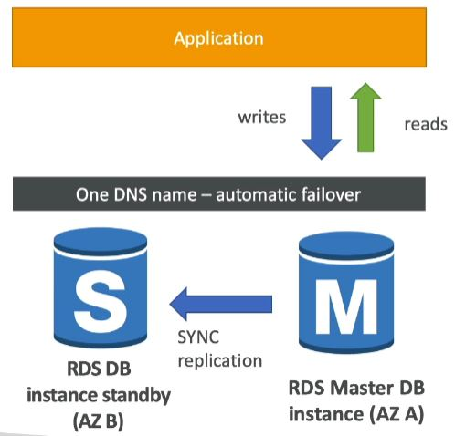

<h2>AWS Regions</h2>
Region (us-east-1) -> Availability Zones (us-east-1a, us-east-1b)

AWS has regions all around the world. It's just what it says, a region somewhere in the world.
Ex us-east-1. Each region has their own data. So data that's stored in one region
doesn't automatically become accessible in another region.

Each region has availability zones. Ex. us-east-1a, us-east-1b. Each availability zone represents
a physical data center in the region. But they're physically separate from one another. Try and 
minimize threat from physical damage. Ex. disasters. They are still connected
with each other with a high bandwidth, ultra-low latency network.

AWS Consoles are region scoped (except IAM, Route 53, Cloudfront, WAF). When you perform an action 
it will be performed in the specific region.

Choosing an AWS region:
* **Compliance with data governance and legal requirements**: e.g. data never leaves a region
without explicit permission
* **Proximity** to customers: reduced latency
* **Available services** within a region: new services and new features aren't available in 
every region.
* **Pricing**: pricing varies region to region and is transparent in the service pricing page

<h2>IAM (Identity and Access Management)</h2>
This is where the AWS security is.
* Users - physical people
* Groups - made up of users. Users can belong to multiple groups.
* Roles

Root account should never be used (and shared). Only use it for the very first time to
create an account and then never again.

**Users** are usually physical people. They are grouped into **groups**, usually by function, team
or something similar.

**Roles** are given to machines. They're for internal usage within AWS resources.

Policies are defined as JSON for those above entities. It defines what each of the above
can and cannot do. It's always good to give the users the minimal amount of permissions
they need to perform their job (least privilege principles).

Multi factor authentication can be setup. Additionally there are predefined policies, that 
can be used.

IAM Federation is something that big enterprises can use. It integrates their own repository
of users with IAM. This way people can use their corporate logins in AWS. It uses the SAML
standard (Active Directory).

So the basic rules are:
* One IAM User per PHYSICAL PERSON
* One IAM Role per Application
* IAM credentials should never be shared
* Never write IAM credentials in code
* Never use ROOT account except for initial setup
* Never use ROOT IAM credentials

Permissions should be applied using groups, as it's more easily manageable. 
The users are put into groups from which they extend permissions.

IAM password policy can be applied to make sure that the users create strong 
passwords.

To access AWS, you have three options:
* AWS Management Console: protected by password + MFA
* AWS Command Line Interface (CLI): protected by access keys
* AWS Software Developer Kit (SDK) - for code: protected by access keys

AWS CloudShell is a terminal inside of AWS, that's essentially CLI, but in the browser. All the files
that you create inside CloudShell will be kept between sessions.

Access Advisor can be used to check what services have been used and so it helps in deciding how many
privileges do you actually need.

**IAM Section - Summary**
* Users: mapped to a physical user, has a password for AWS console
* Groups: contains users only
* Policies: JSON document that outlines permissions for users or groups
* Roles: for EC2 instances or AWS services
* Security: MFA + Password policy
* Access keys: access AWS using the CLI or SDK
* Audi: IAM Credential reports & IAM Access advisor

<h2>EC2</h2>

It consists of:
* Renting virtual machines (EC2)
* Storing data on virtual drives (EBS)
* Distributing load across machines (ELB)
* Scaling the services using an auto-scaling group (ASG)

EC2 sizing & configuration options
* Operating system
* How much compute power & cores (CPU)
* How much random-access memory (RAM)
* How much storage space:
  * Network-attached (EBS & EFS)
  * Hardware (EC2 instance store)
* Network card: speed of the card, public IP address
* Firewall rules: security group
* Bootstrap script (only runs on first ever launch): EC2 user data

The first part of creating an image is choosing an operating system for the machine.
Amazon Linux comes with a lot of Amazon features and it's kind of the way that 
Amazon imagines you using the services, so it's a good place to start. 
Additionally, custom images can be used. AMI are built for a specific AWS
region.

Then you have to select the type, which means how powerful your machine should be.
Different instances are specialized for different things. R/C/P/G/H/X/I/F/Z/CR 
are specialized in RAM, CPU, I/O, Network, and/or GPU. M instance types are
balanced. So they do everything decently, but doesn't excel at anything.
T2/T3 instance types are "burstable". Burstable means that the instance has
OK CPU performance, but when it needs to process something unexpected (a 
spike in load for example), it can burst, and the CPU can be VERY good.
If the machine bursts, it utilizes "burst credits". If all the credits are gone,
then the CPU becomes BDA. If the machine stops bursting, credits are accumulated
over time. If your instance consistenly runs low on credit, you need to move
to a different kind of non-burstable instance. T2 unlimited can be used for 
unlimited burst credit balance, but you pay extra for going over the credit 
balance.

Tags can be added to make identifying the instance easier.

With EC2 connect behind the scenes AWS will generate a key to connect to 
it temporarily. If SSH is turned off, then it won't work. It works using
Amazon Linux 2 AMI (Amazon Machine Images).

Elastic IP can be used to give an EC2 machine a static IP. It can be attached
to a single machine at a time. By default the EC2 IP can change with each 
restart. This often reflects poor architectural decisions, so it would be
better to avoid it. Instead, use a random public IP and register a DNS name
to it. Or we can use a load balancer and not use a public IP at all.

Having an Elastic IP on your account, even if unassociated, will cost money.

<h2>Security Group</h2>
The fundamental of network security in AWS. They control how traffic is allowed 
into or out of our EC2 Machines. They are like the firewall for EC2 instances.

Inbound rules are used to control traffic coming in and outbound traffic is
used to define the traffic going out of the machine.

Security groups can be attached to multiple instances. They're locked to region
/VPC combination. It lives outside of the EC2 instance, so traffic that is blocked
is not visible in the EC2 instance.

**It's good to maintain one separate security group for SSH access.**

If you get a timeout when trying to connect, then it's a security group issue.

If you get a "connection refused" error, then it's an application error or it's
not launched.

By default all inbound traffic is blocked and all outbound traffic is allowed.

Security groups can be referenced from other security groups. This can be used
to allow other EC2 instances to connect to another EC2 instance without dealing
with IPs.

**Never enter your access keys into an EC2 instance as someone else could retrieve
them from it. Instead, use IAM roles.**

<h2>EC2 User Data</h2>
EC2 user data scripts can be used to bootstrap our instances. That is launching
commands when a machine starts. The script is run only once at the instance
first start. It runs with the sudo rights.
EC2 user data is used to automate boot tasks such as:
* Installing updates
* Installing software
* Downloading common files from the internet
* Anything you can think of

Under `Configure details` you can find `User data` under `Advanced details`.

<h2>EC2 Instance Launch Types</h2>
**On demand instances - short workload, predictable pricing. Great for elastic
workloads. That is a system that's able to adapt to the required workload.**
* Pay for what you use (billing per second, after the first minute)
* Has the highest cost but no upfront payment
* No long term commitment
* Recommended for short-term and un-interrupted workloads, where you 
can't predict how the application will behave.

**Reserved (Minimum 1 year) - closer to regular IT.**

**Reserved instances - long workloads**
* Up to 75% discount compared to On-demand.
* Pay upfront for what you use with long term commitment.
* Reservation period can be 1 or 3 years.
* Reserve a specific instance type.
* Recommended for steady state usage applications (think database).

**Convertible reserved instances: long workloads with flexible instances**
* Can change the EC2 instance type
* Up to 54% discount

**Scheduled reserved instances (deprecated): example - every Thursday between 3 and 6 PM**
* launch within time window you reserve
* when you require a fraction of day / week / month

**Spot instances - short workloads, for cheap, can lose instances (less reliable)**
* Can get a discount of up to 90% compared to On-demand
* Instances that you can lose at any point of time if your max price is less
than the current spot price.
* The MOST cost-efficient instances in AWS
* Useful for workloads that are resilient to failure. Ex: batch jobs,
data analysis, image processing
* Not great for critical jobs or databases
* You specify the maximum price that you are willing to pay. When you reserve
then you'll be paying the current price and your spot will be kept as long as
the current price remains under your set maximum price.

**Great combo: Reserved instances for baseline + On-Demand & Spot
(based on failure resilience) for peaks**

**Dedicated instances - no other customers will share your hardware**
* Instances running on hardware that's dedicated to you
* May share hardware with other instances in same account
* No control over instance placement (can move hardware after Stop / Start)

**Dedicated hosts - book an entire physical server, control instance placement**
* Physical dedicated EC2 server for your use
* Full control of EC2 instance placement
* Visibility into the underlying sockets / physical cores of the hardware
* Allocated for your account for a 3 year period reservation
* More expensive
* Useful for software that have complicated licensing model.
* Or for companies that have strong regulatory or compliance needs. That is,
cannot share hardware with other customers.

**Which host is right for me?**
* On demand - coming and staying in resort whenever we like, we pay the full
price.
* Reserved - like planning ahead and if we plant to stay for a long time, we
may get a good discount.
* Spot instances - the hotel allows people to bid for the empty rooms and the
highest bidder keeps the rooms. You can get kicked out at any time.
* Dedicated hosts - we book an entire building of the resort.

You do not pay for an instance, if that instance is stopped.

Price Comparison
Example – m4.large – us-east-1

| Price Type  | Price (per hour)  |
|---|---|
|On-demand   | $0.10  |
|Spot Instance (Spot Price) | $0.032 - $0.045 (up to 90% off)|
| Spot Block (1 to 6 hours) | ~ Spot Price |
| Reserved Instance (12 months) – no upfront | $0.062 |
| Reserved Instance (12 months) – all upfront | $0.058 |
| Reserved Instance (36 months) – no upfront | $0.043 |
| Reserved Convertible Instance (12 months) – no upfront | $0.071 |
| Reserved Dedicated Instance (12 months) – all upfront | $0.064 |
| Reserved Scheduled Instance (recurring schedule on 12 months term) | $0.090 – $0.095 (5%-10% off) |
| Dedicated Host | On-demand price |
| Dedicated Host Reservation | Up to 70% off |

**Elastic Network Interfaces (ENI)**
* Logical component in a VPC (<i>Virtual Private Cloud. Just a network that 
you have on the cloud</i>) that represents a virtual network card
(<i>Network card is a piece of hardware that the computer uses to connect 
to the internet</i>). It's what gives EC2 instances access to the network.
* The ENI can have the following attributes:
    * Primary private IPv4, one or more secondary IPv4
    * One Elastic IP(IPv4) per private IPv4
    * One Public IPv4
    * One or more security groups
    * A MAC address
* ENI can be created independently and attach them on the fly on EC2 instances
for failover. That is, you can move that private IPv4 over to another EC2
instances so that the system would start using that instead of the failing one.
* They're bound to specific availability zones.

<h2> Scalability & High Availability </h2>

* Scalability means that an application / system can handle greater loads by
adapting.
* There are two kinds of scalability:
    * Vertical scalability - increasing the size of the instance. For example
    running on t2.micro and then changing to t2.large. RDS, ElastiCache are services
    that can scale vertically. There's a hardware limit how much you can 
    vertically scale. Common for a non-distributed system, ex. database.
    * Horizontal scalability (=elasticity) - increasing the number of instances
    / systems for your application. Used for distributed systems. Common for
    web applications / modern applications. 
* Scalability is linked but different to High Availability.
* High availability means running your application / system in at least 2 data 
centers (= Availability Zones). The goal is to survive a data center loss.

<h4>Load balancing</h4>
Load balances are servers that forward internet traffic to multiple servers
(EC2 Instances) downstream. It does regular health checks to your instance.
It provides high availability across zones. It cleanly separates public
traffic from private traffic.

The reasons for using an EC2 Load Balancer are:
* Spread load across multiple downstream instances
* Expose a single point of access (DNS) to your application
* Seamlessly handle failures of downstream instances
* Provide SSL termination (HTTPS) on your websites
* Separate public traffic from private traffic
* An ELB (EC2 Load Balancer) is a managed load balancer, which means
    * AWS guarantees that it will be working
    * AWS takes care of upgrades, maintenance, high availability
    * AWS provides only a few configuration knobs
* It costs less to setup your own load balancer, but it will be a lot more
effort on your end.
* It is integrated with many AWS offerings/services.

The health checks are run on a specific port and route. (/health is common)
If the response is not 200, then the instance is deemed unhealthy.

AWS has 3 kinds of managed Load Balancers
* Classic Load Balancer (v1 - old generation) - 2009
    * HTTP, HTTPS (Layer 7), TCP (Layer 4)
    * Health checks are TCP or HTTP based
    * Fixed hostname XXX.region.elb.amazonaws.com
* Application Load Balancer (v2 - new generation) - 2016
    * HTTP, HTTPS, WebSocket (Layer 7)
    * Load balancing to multiple HTTP applications across machines (target groups)
    * Load balancing to multiple applications on the same machine (ex. containers)
    * Support redirects (from HTTP to HTTPS for example)
    * Routing tables to different target groups:
        * Routing based on path in URL (example.com/**users** and example.com/**posts**)
        * Routing based on hostname in URL (**one.example.com** and **other.example.com**)
        * Routing based on query string, headers (example.com/users?**id=123&order=false**)
    * ALB is a great fit for micro services & container based applications (ex. Docker and Amazon ECS)
    * Has a port mapping feature to redirect to a dynamic port in ECS.
    * Can control where traffic goes from the `Listeners` tab.
    * Target groups
        * EC 2 instances (can be managed by an Auto Scaling Group) - HTTP
        * ECS tasks (managed by ECS itself) - HTTP
        * Lambda functions - HTTP request is translated into a JSON event
        * IP addresses - must be private IPs
        * ALB can route to multiple target groups
        * Health checks are at the target group level

* Network Load Balancer (v2 - new generation) - 2017
    * TCP, TLS (secure TCP), UDP (Layer 4)
        * Forward TCP & UDP traffic to your instances
        * Handle millions of requests per second. Higher performance than ALB.
        * Less latency ~100 ms (vs 400 ms for ALB)
    * NLB has one static IP per AZ, and supports assigning Elastic IP (helpful for 
    whitelisting specific IP). ALB and CLB do not have a static IP.
    * NLB are used for extreme performance/TCP or UDP traffic.
    * Not included in the AWS free tier
    * With NLBs, the instances do not see traffic coming from the NLB, but they see it as
    coming from the outside. Have to add a rule to allow TCP traffic from anywhere.
* Gateway load balancer - 2020 - GWLB
    * Operates at layer 3 (network layer) - IP protocol 
* Overall it's better to use V2 as they provide newer features.
* You can setup interval(private) or external(public) ELBs.

The source references the load balancer security group ID.

**Load balancer good to know**
* LBs can scale but not instantaneously - contact AWS for a "warm-up"
* Troubleshooting
    * 4xx errors are client induced errors
    * 5xx errors are application induced errors
    * Load Balancer Errors 503 means at capacity or no registered target
    * If the LB can't connect to your application, check your security groups
* Monitoring
    * ELB access logs will log all access requests
    * CloudWatch Metrics will give you aggregate statistics

With the load balancer, you'd turn off access to your EC2 access directly.
So HTTP traffic would only be allowed if it's coming from the ELB and not
directly from the client.

**Application load balance (v2) target groups**
* EC2 instances (can be managed by an Auto Scaling Group) - HTTP
* ECS tasks (managed by ECS itself) - HTTP
* Lambda functions - HTTP request is translated into a JSON event
* IP Addresses - must be private IPs
* Health checks are at the target group level

**ALB v2 good to know**
* Fixed hostname (XXX.region.elb.amazonaws.com)
* The application servers don't see the IP of the client directly
    * The true IP of the client is inserted in the header X-Forwarded-For
    * We can also get Port (X-Forwarded-Port) and protocol (X-Forwarded-Proto)

**ALB Configuring**
1) Open EC2 configuration, go into load balancers, select Application Load Balancer.
2) Configure the generic information, then select the AZs you want it to work in.
3) Check your target group after configuring to make sure instances are there. Target group
defines the instances that it applies to.
    
**Load balancer stickiness**
* It is possible to implement stickiness so that the same client is always redirected to
the same instance behind a load balancer
* Works for CLB and ALB
* Uses a cookie for this
    * Application-based cookies
        * Duration specified by the application 
        * Custom cookie
            * Generated by the target
            * Can include any custom attributes required by the application
            * Cookie name must be specified individually for each target group
        * Application cookie
            * Generated by the load balancer
            * Cookie name is AWSALBAPP
    * Duration-based cookies
        * Cookie generated by the load balancer
        * Duration specified by the load balancer
        * Cookie name is AWSALB for ALB, AWSELB for CLB 
* Use case: make sure the user doesn't lose his session data
* Enabling stickiness may bring imbalance to the load over the backend EC2 instances
* It can be set under `Load Balancing -> Target Groups -> Attributes -> Stickiness`
* When you access the site, then the first request that reaches an EC2 instance decides which
EC2 you get stuck on. It then has an expiration time, after which a new EC2 instance is chosen.

**Cross-zone load balancing**

* CLB - disabled by default via CLI/API, enabled by default via console, 
  no charges for inter AZ data if enabled
* ALB - always on (can't be disabled), no charges for inter AZ data
* NLB - disabled by default, you pay charges for inter AZ data if enabled

**SSL certificates**
* SSL/TLS basics
    * An SSL certificate allows traffic between your clients and your load balancer to be
    encrypted in transit (in-flight encryption)
    * SSL refers to Secure Sockets Layer, used to encrypt connections
    * TLS refers to Transport Layer Security, which is a newer version
    * Nowadays, TLS certificates are mainly used, but people still refer as SSL
    * Public SSL certificates are issued by Certificate Authorities (CA)
    * SSL certificates have an expiration date (you set) and must be renewed
    
    * The load balancer uses an X.509 certificate (SSL/TLS server certificate)
    * You can manage certificates using ACM (AWS Certificate Manager)
    * You can upload your own certificates to ACM alternatively
    * When you set up a HTTPS listener, then:
        * You must specify a default certificate
        * You can add an optional list of certs to support multiple domains
        * Clients can use SNI (Server Name Indication) to specify the hostname they reach.
        * Ability to specify a security policy to support older versions of SSL / TLS (legacy clients)
* SNI
    * SNI solves the problem of loading multiple SSL certificates onto one web server 
    (to serve multiple websites)    
    * It's a newer protocol, and requires the client to indicate the hostname of the target
    server in the initial SSL handshake
    * The server will then find the correct certificate, or return the default one
    * Only works for ALB & NLB (newer generation), CloudFront
    
* You can setup SSL under listeners under load balancers. You specify HTTPS, cipher, which is
the protocols we want to support, and then setup the certificate.

**ELB - Connection Draining**
* Feature naming:
    * For CLBs: Connection draining
    * For ALBs and NLBs: Target Group: Deregistration delay
* It is the time to complete 'in-flight requests' while the instance is de-registering or 
unhealthy. That is it waits for existing connections to complete. The default is 300 seconds.
* When the instance is in deregistring mode then the load balancer stops sending new requests
to the instance which is deregistring.
* Between 1 to 3600 seconds, default is 300 seconds. Can be disabled by setting it to 0.
* Set to a low value if your requests are short. E.g. you don't expect any request to last more
than 20 seconds, then set it to 20 seconds.

**Auto scaling groups (ASG)**
* In real-life, the load on your websites and applications can change.
* The goal of an Auto Scaling Group (ASG) is to:
    * Scale out (add EC2 instances) to match an increased load.
    * Scale in (remove EC2 instances) to match a decreased load.
    * Ensure we have a minimum and a maximum number of machines running. The point being that
    it wouldn't scale too high or too low, so you set an upper and lower limit to how many machines
    should/can be run.
    * Automatically register new instances to a load balancer.
    * Size parameters:
        * minimum size (the number of instances you'll have running for sure)
        * actual size / desired capacity (the number of instances running at the current moment)
        * maximum size (how many instances can be added to scale out)
* ASGs have the following attributes:
    * A launch configuration:
        * AMI + Instance type
        * EC2 User Data
        * EBS Volumes
        * Security Groups
        * SSH Key Pair
    * Min size / Max size / Initial capacity
    * Network + subnets information
    * Load balancer information
    * Scaling policies
* It is possible to scale an ASG based on CloudWatch alarms.
* An alarm monitors a metric (such as Average CPU)
* Metrics are computed for the overall ASG instances.
* Based on the alarm:
    * We can create scale-out policies (increase the number of instances)
    * We can create scale-in policies (decrease the number of instances)
* With the new ASGs you can define "better" auto scaling rules that are directly managed
by EC2. These are the new rules. They're better in the sense that they are easier to set 
up and can make more sense.
    * Target average CPU usage
    * Number of requests on the ELB per instance
    * Average network in
    * Average network out
* We can auto scale based on a custom metric (ex. number of connected users, users' schedule)
    1) We send our custom metric from application on EC2 to CloudWatch (PutMetric API)
    2) Create CloudWatch alarm to react to low/high values
    3) Use the CloudWatch alarm as the scaling policy for ASG 
* ASGs use launch configurations or launch templates (newer)
* To update an ASG, you must provide a new launch configuration/launch template
* IAM roles attached to an ASG will get assigned to EC2 instances
* ASGs are free. You pay for the underlying resources being launched
* Having instances under an ASG means that if they get terminated for whatever reason, then
the ASG will automatically create new ones for replacement, providing extra safety.
* ASG can terminate instances marked as unhealthy by a load balancer (and hence replace them)

**ASG - Scaling Policies**
* Target tracking scaling
    * Most simple and easy to set up
    * Example: I want the average ASG CPU to stay at around 40%
* Simple/Step scaling
    * When a CloudWatch alarm is triggered (example CPU > 70%), then add 2 units
    * When a CloudWatch alarm is triggered (example CPU < 30%), then remove 1 unit
* Scheduled Actions
    * Anticipate a scaling based on known usage patterns
    * Example: increase the min capacity to 10 at 5 pm on Fridays
* Predictive scaling - continuously forecast load and schedule scaling ahead using machine learning.
* Good metrics to scale on
    * CPUUtilization - average CPU utilization across your instances
    * RequestCountPerTarget - number of requests per EC2 instance is stable
    * Average network I/O
    * Any custom metric using Cloudwatch

**ASG - Scaling Cooldowns**
* The cooldown period helps to ensure that your Auto Scaling Group doesn't launch or
terminate additional instances before the previous scaling activity takes effect
* In addition to default cooldown for Auto Scaling Group, we can create cooldowns
that apply to a specific simple scaling policy
* A scaling-specific cooldown period overrides the default cooldown period.
* One common use for scaling-specific cooldowns is with a scale-in policy - a policy that
terminates instances based on a specific criteria or metric. Because this policy terminates
instances, Amazon EC2 Auto Scaling needs less time to determine whether to terminate additional
instances.
* If the default cooldown period of 300 seconds is too long - you can reduce costs by 
applying a scaling-specific cooldown period of 180 seconds to the scale-in policy
* If your application is scaling up and down multiple times each hour, modify the ASG
cooldown timers and the CloudWatch alarm period that triggers the scale in.

<h2>EC2 instance storage</h2>

**EBS(Elastic Block Store) Volume**
* An EC2 machine loses its root volume(main drive) when it is manually terminated
* Unexpected terminations might happen from time to time (AWS would email you)
* Sometimes, you need a way to store your instance data somewhere
* An EBS (Elastic Block Store) Volume is a network drive you can attach to your instances
while they run.
* It allows your instances to persist data. E.g. database data.
* It's a network drive (i.e. not a physical drive)
    * It uses the network to communicate to the instance, which means there might be a bit
    of latency
    * It can be detached from an EC2 instance and attached to another one quickly.
* It's locked to an Availability Zone(AZ)
    * An EBS Volume in us-east-1a cannot be attached to us-east-1b
    * To move a volume across, you first need to snapshot it
* Have a provisioned capacity (size in GBs, and IOPS)
    * You get billed for all the provisioned capacity, not the amount you actually use.
    * You can increase the capacity of the drive over time, so it's a good idea to start
    small and increase the capacity as you need it.
* EBS Volumes come in 6 types
    * GP2/GP3 (SSD): General purpose SSD volume that balances price and performance for a 
    wide variety of workloads.
        * Cost effective storage, low-latency
        * System boot volumes, virtual desktops, development and test environments
        * 1 GB - 16 TB
        * GP3 baseline of 3000 IOPS and throughput of 125 MB/s, can increase IOPS
        up to 16000 and throughput up to 1000 MB/s independently
        * GP2 small volumes can burst IOPS to 3000. Size of the volume and IOPS are
        linked, max IOPS is 16000. 3 IOPS per GB, so at 5334 GB we are at max IOPS.
    * IO1/IO2 (SSD): Highest-performance SSD volume for mission-critical low-latency or
    high-throughput workloads.
        * Critical business applications with sustained IOPS performance, or applications
          that need more than 16000 IOPS
        * Great for database workloads (sensitive to storage perf and consistency)
        * IO1/IO2:
          * 4 GB - 16 TB
          * Max PIOPS 64000 for Nitro EC2 instances & 32000 for other
          * Can increase PIOPS independently from storage size
          * IO2 have more durability and more IOPS per GB (at the same price as IO1, so makes
          sense to just use IO2 nowadays.)
        * IO2 block express (4 GB - 64 TB)
          * Sub-millisecond latency
          * Max PIOPS 256000 with an IOPS:GB ratio of 1000:1
        * Support EBS multi-attach
          * Attach the same EBS volume to multiple EC2 instances in the same AZ.
          * Each instance has full read & write permissions to the volume
          * Achieve higher application availability in clustered Linux applications
          * Applications must manage concurrent write operations
          * Must use a file system that's cluster-aware
    * STI (HDD): Low cost HDD volume designed for frequently accessed, throughput-intensive
    workloads.
      * Cannot be a boot volume
      * 125 MB to 16 TB
      * For big data, data warehouses, log processing
      * Max throughput 500 MB/s - max IOPS 500
    * SCI (HDD): Lowest cost HDD volume designed for less frequently accessed workloads.
      * For data that is infrequently accessed
      * Scenarios where lowest cost is important
      * Max throughput 250 MB/s - max IOPS 250
* EBS Volumes are characterized in Size | Throughput | IOPS (I/O Ops Per Sec)
* When in doubt always consult the AWS documentation.
* When you create an instance, then only GP2/GP3 and IO1/IO2 can be used as boot volumes

When you create an instance, then currently "Step 4: Add Storage" is where you can add an
EBS volume. Can select a snapshot you want to restore from.

Have to make the volume manually available. So have to mount it in the instance. AWS
has a guide on how to do that.

**EBS snapshots**
* Make a backup (snapshot) of your EBS volume at a point in time
* Not necessary to detach volume to do snapshot, but recommended
* Can copy snapshots across AZ or Region

**AMI (Amazon Machine Image)**
* AMI is a customization of an EC2 instance
  * You add your own software, configuration, operating system, monitoring etc.
  * Faster boot/configuration time because all your software is pre-packaged
* AMI is built for a specific region (and can be copied across regions)
* You can launch EC2 instances from:
  * A public AMI: AWS provided
  * Your own AMI: you make and maintain them yourself
  * An AWS marketplace AMI: an AMI someone else made (and potentially sells)

**AMI process**
* Start an EC2 instance and customize it
* Stop the instance (for data integrity)
* Build an AMI - this will also create EBS snapshots
* Launch instances from other AMIs

**EC2 instance store**
* EBS volumes are network drives with good but "limited" performance
* If you need a high performance hardware disc, use an EC2 instance store
  * Better I/O performance
  * Cleared after EC2 instance stopped (ephemeral)
  * Good for buffer/cache/scratch data/temporary content
  * Risk of data loss if hardware fails

**EFS (Elastic file system)**
* Managed NFS (network file system) that can be mounted on many EC2 instances
across many AZs.
* Highly available, scalable, expensive (3x GP2), pay for what you use, so if you manage
your data well, it might be cheaper.
* Use cases: content management, web serving, data sharing, Wordpress
* Uses NFSv4.1 protocol
* Uses security group to control access to EFS. Remember to add inbound rules so that
  the EC2 instances could actually access it.
* Compatible with Linux based AMI (not Windows)
* Encryption at rest using KMS
* POSIX file system (~Linux) that has a standard file API
* File system scales automatically, pay-per-use, no capacity planning
* 1000s of concurrent NFS clients, 10 GB+/s throughput
* Grow to petabyte-scale network file system automatically
* Performance mode (set at EFS creation time)
  * General purpose (default): latency-sensitive use cases (web server, CMS, etc)
  * Max I/O - higher latency, higher throughput, highly parallel (big data, media processing)
* Throughput mode
  * Bursting (1 TB = 50 MB/s + burst of up to 100 MB/s)
  * Provisioned: set your throughput regardless of storage size, ec: 1 GB/s for 1 TB storage
* Storage tiers (lifecycle management feature - move file after N days)
  * Standard: for frequently accessed files
  * Infrequent access (EFS-IA): cost to retrieve files, lower price to store
* You attach the EFS to the EC2 instances using the command line of the instances via SSH.
Have to mount it and once you create a file into the mounted location, then it'll be shared
between the instances.
  
**EBS vs EFS**
* EBS
    * Can be attached to only one instance at a time
    * Are locked at the Availability Zone (AZ) level
    * GP2: IO increases if the disk size increases
    * IO1: can increase IO independently
    * Migrating across AZ:
        * Take a snapshot
        * Restore the snapshot to another AZ
        * EBS backups use IO and you shouldn't run them while your application is handling
        a lot of traffic
   * Root EBS volumes of instances get terminated by default if the EC2 gets terminated.
     (you can disable this)
* EFS
    * Mount to multiple instances across AZ
    * EFS share website files
    * Only for Linux Instances
    * EFS has a higher price point than EBS
    * Can leverage EFS-IA for cost saving
* Instance store can be used to get massive IO, but you need a replication mechanism if you want
  persistence. 
* The choice is: EFS vs EBS vs Instance store

<h2>Relational database service (RDS), Aurora, ElastiCache</h2>
**RDS**
* Allows you to create relational databases in the cloud that are managed by AWS
    * Postgres
    * MySQL
    * MariaDB
    * Oracle
    * Microsoft SQL Server
    * Aurora (AWS proprietary database)
* RDS advantage over deploying DB on EC2
    * RDS is a managed service, which means
        * automated provisioning, OS patching
        * Continuous backups and restore to specific timestamp (Point in time restore)
        * Monitoring dashboards
        * Read replicas for improved read performance
        * Multi AZ setup for DR (disaster recovery)
        * Maintenance windows for upgrades
        * Scaling capability (vertical and horizontal)
        * Storage backed by EBS (GP2 or IO1)
    * However, you cannot SSH into your instances
* Backups are automatically enabled in RDS
* Automated backups
    * Daily full backup of the database (during maintenance window that you specify)
    * Transaction logs are backed up bby RDS every 5 minutes
    * 7 days retention (can be increased to 35 days)
* DB snapshots
    * Manually triggered by the user
    * Retention of backup for as long as you want
* RDS storage auto scaling
    * When RDS detects you are running out of free database storage, it scales automatically
    * You have to set a maximum storage threshold (maximum limit for DB storage)
    * Automatically modify storage if:
        * Free storage is less than 10% of allocated storage
        * Low storage lasts at least 5 minutes
        * 6 hours have passed since last modification
    * Useful for applications with unpredictable workloads
    
**RDS read replicas**
* Up to 5 read replicas
* Within AZ, cross AZ or cross region
* Replication is async, so reads are eventually consistent
* Replicas can be promoted to their own DB
* Applications must update the connection string to leverage read replicas

  
* Example use case is when a reporting application wants to run, but running
it would kill the DB, thus if a read replica is present, then it can simply
run on that.
* In AWS there's a network cost when data goes from one AZ to another, but there
are exceptions, and those exceptions are usually for managed services.
* For RDS read replicas within the same region, you don't pay that fee

  
**RDS Multi AZ (disaster recovery)**
* SYNC replication
* One DNS name - automatic app failover to standby
* Increases availability
* No manual intervention in apps
* Not used for scaling, as the standby unit has no I/O happening to it from
an external source, only taking in the replication

* Going from single AZ to multi AZ
    * Zero downtime operation (no need to stop the DB)
    * Just click on "modify" for the database
    * The following happens internally:
        * A snapshot is taken
        * A new DB is restored from the snapshot in the new AZ
        * Synchronization is established between the two databases
          

**RDS security**
* At rest encryption (data that's not in movement)
    * Possibility to encrypt the master & read replicas with AWS KMS - AES 256
    encryption
    * Encryption has to be defined at launch time
    * If the master is not encrypted, then the read replicas cannot be encrypted
    * Transparent Data Encryption (TDE) available for Oracle and SQL server, which
    is an alternative way for encryption
* In-flight encryption
    * SSL certificates to encrypt data to RDS in flight
    * Provide SSL options with trust certificate when connection to DB
    * To enforce SSL:
        * PostgreSQL: rds.force_ssl = 1 in the AWS RDS Console (Parameter Groups)
        * MySQL: Within the DB: GRANT USAGE ON \*.\* TO 'mysqluser'@'%' REQUIRE SSL;
* Encrypting RDS backups
    * Snapshots of un-encrypted RDS databases are un-encrypted
    * Snapshots of an encrypted RDS databases are encrypted
    * Can copy a snapshot into an encrypted one
* To encrypt an un-encrypted RDS database:
    * Create a snapshot of the un-encrypted database
    * Copy the snapshot and enable encryption for the snapshot
    * Restore the database from the encrypted snapshot
    * Migrate applications to the new database, and delete the old database
* Network security
    * RDS databases are usually deployed within a private subnet, not in a public one
    * RDS security works by leveraging security groups (the same concept as
      for EC2 instances) - it controls which IP/security group can communicate
      with RDS
* Access management
    * IAM policies help control who can manage AWS RDS (through the RDS API)
    * Traditional username and password can be used to login into the DB
    * IAM-based authentication can be used to login into RDS MySQL & PostgresSQL
        * You don't need a password, just an authentication token obtained through
        IAM & RDS API calls
        * Auth token has a lifetime of 15 minutes
        * Benefits:
            * Network I/O must be encrypted using SSL
            * IAM to centrally manage users instead of DB
            * Can leverage IAM roles and EC2 instance profiles for easy integration
              
              
**RDS-security - summary**
* Encryption at rest:
    * Is done only when you first create the DB instance
    * or: un-encrypted DB => snapshot => copy snapshot as encrypted => create DB 
    from snapshot
* Your responsibility:
    * Check the ports/IP/security group inbound rules in DB security group
    * In-database user creation and permissions or manage through IAM
    * Creating a database with or without public access
    * Ensure parameter groups or DB is configured to only allow SSL connections
* AWS responsibility:
    * No SSH access
    * No manual DB patching
    * No manual OS patching
    * No way to audit the underlying instance
    
**Amazon Aurora**
* Aurora is a proprietary technology from AWS (not open sourced)
* Postgres and MySQL are both supported as Aurora DB (that means your
  drivers will work as if Aurora was a Postgres or MySQL DB)
* Aurora is 'AWS cloud optimized' and claims 5x performance improvement over
MySQL on RDS, over 3x the performance of postgres on RDS
* Aurora storage automatically grows in increments of 10 GB, up to 64 TB.
* Aurora can have 15 replicas while MySQL has 5, and the replication process
is faster (sub 10 ms replica lag)
* Failover in Aurora is instantaneous
* Aurora costs more than RDS (20% more) - but is more efficient
* 6 copies of your data across 3 AZ:
    * 4 copies out of 6 needed for writes
    * 3 copies out of 6 needed for reads
    * Self healing with peer-to-peer replication
    * Storage is striped across 100s of volumes
* One Aurora instance takes writes (master)
* Automated failover for master in less than 30 seconds
* Master + up to 15 Aurora read replicas serve reads
* Support for cross region replication

You have a writer endpoint to connect to the master. Your read replicas can
have auto scaling and to connect to those you have a reader endpoint.

**ElastiCache**
* Managed Redis or Memcached
* Caches are in-memory databases with really high performance, low latency
* Helps reduce load off of databases for read intensive workloads
* Helps make your application stateless, by storing the user session data
  inside of ElastiCache
  
* AWS takes care of OS maintenance/patching, optimizations, setup, configuration,
monitoring, failure recovery, and backups
* Using ElastiCache involves heavy application code changes
* Application queries ElastiCache, if not available, get from RDS and store in
ElastiCache
* Helps relieve load in RDS
* Cache must have an invalidation strategy to make sure the most current data is
used in there. Choosing a proper invalidation strategy is the most difficult part
about caches.

* Redis vs Memcached
    * Redis
      * Multi AZ with auto-failover
      * Read replicas to scale reads and have high availability
      * Data durability using AOF persistence
      * Backup and restore features
      * So closer to a database - high availability, backup, read replicas etc
    * Memcached
        * Multi-node for partitioning of data (sharding)
        * No high availability (replication)
        * Non persistent
        * No backup and restore
        * Multi-threaded architecture
        * So closer to a real cache - can afford to lose your data, no backup, no restore
* Cache eviction
    * You delete the item explicitly in the cache
    * Item is evicted because the memory is full and it's not recently used 
      (LRU - least recently used)
    * You set an item time-to-live (TTL)

We have to handle the cache querying and updating ourselves in code. So in code 
we'd have a call to the cache, check if it's empty. If it's empty, then turn to
the DB and save the data in the cache. This is called lazy-loading/cache-aside/
lazy-population. We populate the cache with a read. We could also populate the
cache as we're doing writes, which is called write through. The data would always
be up to date, but a write would be required for cache population. Can combine it
with lazy-loading.