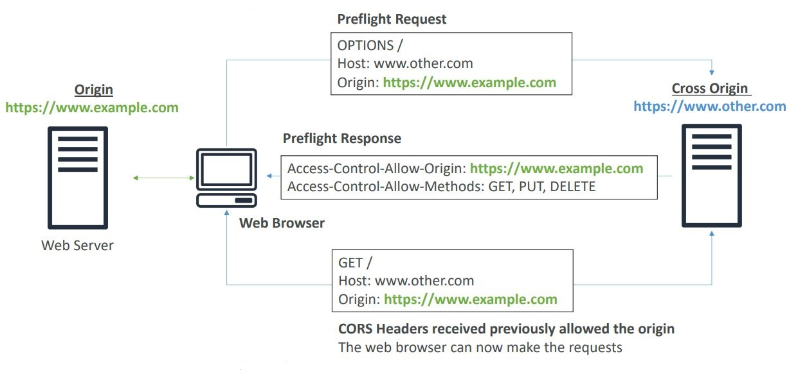

<h2>Related concepts</h2>

**CORS**
* An origin is a scheme (protocol), host (domain) and port
    * E.g. https://www.example.com (implied port is 443 for HTTPS, 80 for HTTP)
        * Scheme: HTTPS
        * Host: www.example.com
        * Port: 443
* CORS means Cross-Origin Resource sharing, so we're going to be getting
  resources from a different origin
* Allows making requests only if the other origin specifically allows other
  origins to make requests to it
    * Same origin: http://example.com/app1 & http://example.com/app2
    * Different origin: http://example.com & http://other.example.com
* The requests won't be fulfilled unless the other origin allows for the
  requests, using CORS headers (ex: Access-Control-Allow-Origin)
* An OPTIONS request is sent to ask if CORS requests are allowed
  
* If a client does a cross-origin request on our S3 bucket, we need to
  enable the correct CORS headers
* You can allow for a specific origin or for * (all origins)
* The CORS definition is in a separate block in the bucket configuration.
  Make sure that there isn't a trailing slash for the domain.