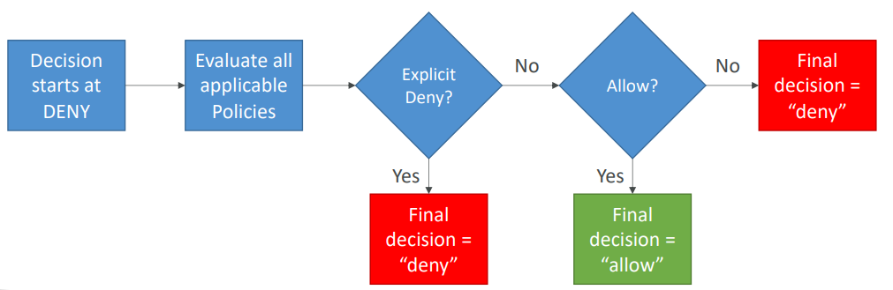

<h2>Advanced Identity</h2>
* STS
    * Allows granting limited and temporary access to AWS resources (up to 1 hour)
    * AssumeRole: Assume roles within your account or cross account
    * AssumeRoleWithSAML: return credentials for users logged in with SAML
    * AssumeRoleWithWebIdentity:
        * return credentials for users logged in with an IdP (Facebook Login, Google Login,
          OIDC compatible etc.)
        * AWS recommends against using this, and using Cognito Identity Pools instead
    * GetSessionToken: for MFA, from a user or AWS account root user
    * GetFederationToken: obtain temporary credentials for a federated user
    * GetCallerIdentity: return details about the IAM user or role used in the API call
    * DecodeAuthorizationMessage: decode error message when an AWS API is denied
    * Using STS to assume a role
        * Define an IAM role within your account or cross-account
        * Define which principals can access this IAM role
        * Use AWS STS (Security Token Service) to retrieve credentials and impersonate
          the IAM role you have access to (AssumeRole API)
        * Temporary credentials can be valid between 15 minutes to 1 hour
    * STS with MFA
        * Use GetSessionToken from STS
        * Appropriate IAM policy using IAM conditions
        * aws:MultiFactorAuthPresent:true
    * Reminder - GetSessionToken returns:
        * Access ID
        * Secret key
        * Session token
        * Expiration date
* Advanced IAM - Authorization Model Evaluation of policies, simplified
    1. If there's an explicit DENY, end decision and DENY
    2. If there's an ALLOW, end decision with ALLOW
    3. Else DENY
       
* IAM Policies & S3 Bucket Policies
    * IAM policies are attached to users, roles, groups
    * S3 bucket policies are attached to buckets
    * When evaluation if an IAM principal can perform an operation X on a bucket, the
      union of its assigned IAM policies and S3 bucket policies will be evaluated.
* Dynamic Policies with IAM
    * How do you assign each user a /home/<user> folder in a S3 bucket?
    * Create one dynamic policy with IAM and leverage the special policy variable
      ${aws:username}
* Inline vs managed policies
    * AWS managed policy
        * Maintained by AWS
        * Good for power users and administrators
        * Updated in case of new services/new APIs
    * Customer managed policy
        * Best practice, re-usable, can be applied to many principals
        * Version controlled + rollback, central change management
    * Inline
        * Strict one-to-one relationship between policy and principal
        * Policy is deleted if you delete the IAM principal
* Granting a user permissions to pass a role to an AWS service
    * To configure many AWS services, you must pass an IAM role to the service (this
      happens only once during setup)
    * The service will later assume the role and perform actions
    * Example of passing a role
        * To an EC2 instance
        * To a Lambda function
        * To an ECS task
        * To CodePipeline to allow it to invoke other services
    * For this, you need the IAM permission iam:PassRole
    * It often comes with iam:GetRole to view the role being passed
    * Can a role be passed to any service?
        * No, roles can only be passed to what their trust policy allows
* Directory services
    * What is Microsoft active directory (AD)?
        * Found on any Windows Server with AD Domain Services
        * Database of objects: User accounts, computers, printers, file shares,
          security groups
        * Centralized security management, create account, assign permissions
        * Objects are organized in trees
        * A group of trees is a forest
    * AWS directory services
        * AWS managed Microsoft AD
            * Create your own AD in AWS, manage users locally, supports MFA
            * Establish "trust" connections with your on-premise AD
        * AD connector
            * Directory gateway (proxy) to redirect to on-premise AD
            * Users are managed on the on-premise AD
        * Simple AD
            * AD-compatible managed directory on AWS
            * Cannot be joined with on-premise AD