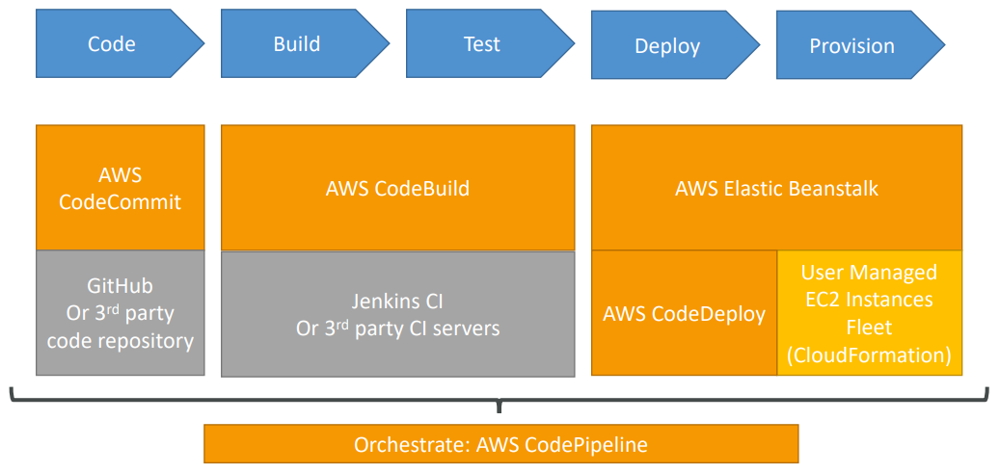
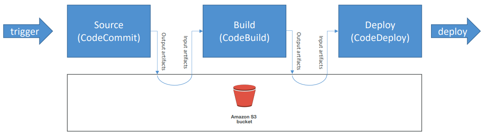
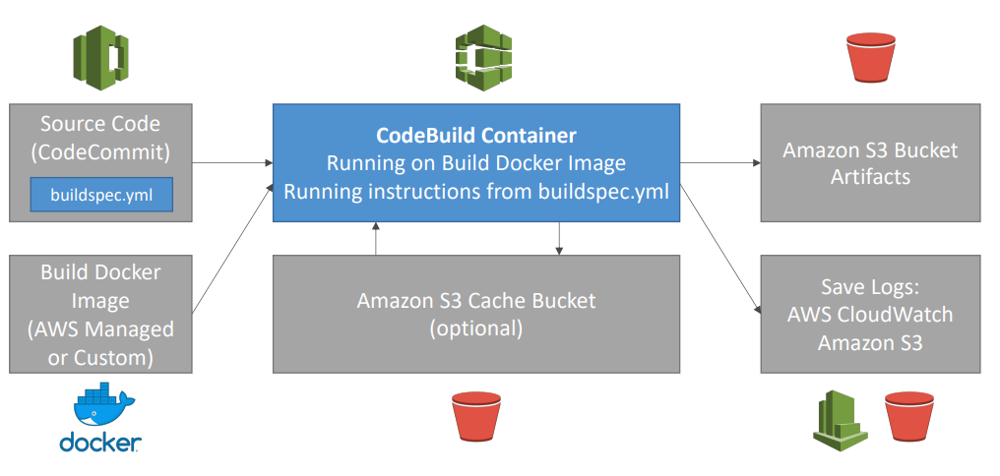

<h2>AWS CI\CD - CodeCommit, CodePipeline, CodeBuild, CodeDeploy</h2>

**AWS CodeCommit - storing our code**
* A git repository
* Private git repositories
* No size limit on repositories (scale seamlessly)
* Fully managed, highly available
* Code only in AWS Cloud account => increased security
  and compliance
* Secure (encrypted, access control, etc)
* Integrated with Jenkins/CodeBuild/other CI tools
* Authentication in Git:
    * SSH Keys: AWS Users can configure SSH keys in their IAM Console
    * HTTPS: Done through the AWS CLI Authentication helper or Generating HTTPS credentials
    * MFA (multi factor authentication) can be enabled for extra safety
* Authorization in Git:
    * IAM policies manage user/roles right to repositories
* Encryption:
    * Repositories are automatically encrypted at rest using KMS.
      Whenever AWS has encryption at rest, then think KMS.
    * Encrypted in transit (can only use HTTPS or SSH - both secure)
* Cross account access:
    * Do not sure your SSH keys
    * Do not share your AWS credentials
    * Use IAM role in your AWS account and use AWS STS (
      with AssumeRole API)
* Notifications
    * You can trigger notifications in CodeCommit using AWS SNS (
      Simple Notification Service) or AWS Lambda or AWS CloudWatch
      Event Rules
    * Use cases for SNS/AWS Lambda notifications:
        * Deletion of branches
        * Trigger for pushes that happens in master branch
        * Notify external build system
        * Trigger AWS Lambda function to perform codebase analysis
          (maybe credentials got committed in the code?)
    * Use cases for CloudWatch Event Rules:
        * Trigger for merge request updates (created/updated/
          deleted/commented)
        * CloudWatch Event Rules goes into an SNS topic
* If you are connected as root, you won't see the SSH connection steps

**AWS CodePipeline - automating our pipeline from code to
Elastic Beanstalk**
* Continuous delivery
* Visual workflow
* Source: GitHub/CodeCommit/Amazon S3
* Build: CodeBuild, Jenkins etc
* Load testing using 3rd party tools
* Deploy: AWS CodeDeploy, Beanstalk, CloudFormation, ECS etc
* Made of stages
    * Each stage can have sequential actions and/or parallel actions
    * Actions are contained in action groups
    * You can have whatever stages you want
    * Stage examples: Build, Test, Deploy, Load Test etc
    * Manual approval can be defined at any stage
    * Each pipeline stage can create "artifacts"
    * Artifacts are stored and passed in Amazon S3 and passed on
      to the next stage
      
* CodePipeline state changes happen in AWS CloudWatch Events,
  which can in return create SNS notifications
    * Ex. you can create events for failed pipelines
    * Ex. you can create events for cancelled stages
* If CodePipeline fails a stage, your pipeline stops, and
  you can get information in the console
* AWS CloudTail can be used to audit AWS API calls
* If Pipeline can't perform an action, make sure the
  "IAM service role" attached does have enough permissions
  (IAM policy)

**AWS CodeBuild - building and testing our code**
* Fully managed build service
* Alternative to other build tools such as Jenkins
* Continuous scaling (no servers to manage or provision -
  no build queue)
* Pay for usage: the time it takes to complete the builds
* Leverages Docker under the hood for reproducible builds
* Possibility to extend capabilities leveraging our own
  base Docker images. That is we could extend the Docker image
  that is used for CodeBuild
* Secure: Integration with KMS for encryption of build
  artifacts, IAM for build permissions, and VPC for
  network security, CloudTrail for API calls logging
* Source code from GitHub, CodeCommit, CodePipeline, S3 etc
* Build instructions can be defined in code (buildspec.yml) file
* Output logs to Amazon S3 & AWS CloudWatch logs
* Metrics to monitor CodeBuild statistics
* Use CloudWatch Alarms to detect failed builds and trigger
  notifications
* CloudWatch Events, AWS Lambda as a glue
* SNS notifications
* Ability to reproduce CodeBuild locally to troubleshoot
  in case of errors
* Builds can be defined within CodePipeline or CodeBuild
  itself
* Supported environments for Java, Ruby, Python, Go, Node.js,
  Android, .NET Core, PHP, Docker (with which you can extend
  any environment you like)
  
* CodeBuild BuildSpec
    * buildspec.yml file must be at the root of your code.
      Can specify a different name for it in AWS
    * Define environment variables
        * Plaintext variables
        * Secure secrets: use SSM Parameter store
    * Phases (specify commands to run):
        * Install: install dependencies you may need for your
          build
        * Pre-build: final commands to execute before build
        * Build: actual build commands
        * Post build: finishing touches (zip output for example)
    * Artifacts out: what to upload to S3 (encrypted with KMS)
    * Cache: files to cache (usually dependencies) to S3 for
      future build speedup
* CodeBuild Local Build
    * In case you need to troubleshoot beyond logs
    * You can run CodeBuild locally on your desktop (after
      installing Docker)
    * For this, leverage the CodeBuild Agent
* CodeBuild in VPC
    * By default, your CodeBuild containers are launched
      outside your VPC. Therefore, by default, it cannot
      access resources in a VPC.
    * You can specify a VPC configuration: VPC ID, subnet IDs,
      securityGroup IDs
    * Then your build can access resources in your VPC
      (RDS, ElastiCache etc)

**AWS CodeDeploy - deploying the code to EC2 fleets (not Beanstalk)**
* We want to deploy your application automatically to
  many EC2 instances
* These instances are not managed by Elastic Beanstalk
* There are several ways to handle deployments using open
  source tools (Ansible, Terraform, Chef, Puppet etc)
* We can use the managed service AWS CodeDeploy
* Primary components
    * Application - unique name
    * Compute platform - EC2/On-promise or Lambda
    * Deployment configuration - deployment rules for
      success/failure
        * EC2/On-Premise: you can specify the minimum
          number of healthy instances for the deployment
        * AWS Lambda: specify how traffic is routed to
          your updated Lambda function versions
        * Deployment group: group of tagged instances
          (allows to deploy gradually)
        * Deployment type: in-place deployment or
          Blue/green deployment
        * IAM instance profile: need to give EC2 the
          permissions to pull from S3/Github
        * Application revision: application code +
          appspec.yml file
        * Service role: role for CodeDeploy to perform
          what it needs
        * Target revision: target deployment application
          version
* Steps to make it work
    * Each EC2 machine (or On Premise machine) must be
      running the CodeDeploy agent
    * The agent is continuously polling AWS CodeDeploy
      for work to do
    * CodeDeploy sends appspec.yml file for instructions
        * Has to be at the root of your app
        * File section: how to source and copy from S3/Github
          to filesystem
        * Hooks: set of instructions to do to deploy the new
          version (hooks can have timeouts if you want). Don't
          have to define all of them. The order is:
            * ApplicationStop - stop the application that is running currently
              so you could deploy the new version
            * DownloadBundle - download my new application
            * BeforeInstall - do any preparation you might need
              before installing a new application version
            * AfterInstall - do any clean up if you need after install
            * ApplicationStart - how do you start your application
            * ValidateService (really important) - how to make sure that
              the application is actually working. Essentially an initial
              health check
    * Application is pulled from GitHub or S3
    * EC2 will run the deployment instructions
    * CodeDeploy Agent will report of success/failure
      of deployment on the instance
* EC2 instances are grouped by deployment group(dev/test/prod)
* Lots of flexibility to define any kind of deployments
* CodeDeploy can be chained into CodePipeline and use
  artifacts from there
* CodeDeploy can re-use existing setup tools, works with
  any application, auto-scaling integration
* Note: Blue/Green only works with EC2 instances (not
  on premise)
* Support for AWS Lambda deployments
* CodeDeploy doesn't provision resources, assumes the
  resources are already existing
* AWS CodeDeploy Deployment Config
    * Configs
        * One at a time: one instance at a time, one instance
          fails => deployment stops
        * Half at a time: 50%
        * All at once: quick but no healthy host. Has downtime. Good for dev
        * Custom: ex. min healthy host = 75%
    * Failures
        * Instances stay in 'failed state'
        * New deployments will first be deployed to 'failed state' instances
        * To rollback: redeploy old deployment or enable automated
          rollback for failures
    * Deployment targets
        * Set of EC2 instances with tags
        * Directly to an ASG
        * Mix of ASG/Tags so you can build deployment segments
        * Customization in scripts with DEPLOYMENT_GROUP_NAME
          environment variables
* Rollback
    * You can specify automated rollback options
    * Rollback when a deployment fails
    * Rollback when alarm thresholds are met
    * Disable rollbacks - do not perform rollbacks for this deployment
    * If a rollback happens, CodeDeploy redeploys the last known
      good revision as a new deployment, thus getting a new version ID

**CodeStar**
* CodeStar is an integrated solution that regroups: GitHub, CodeCommit,
  CodeBuild, CodeDeploy, CloudFormation, CodePipeline, CloudWatch
* Helps quickly create 'CICD-ready' projects for EC2, Lambda, Beanstalk
* Supported languages: C#, Go, HTML5, Java, Node.js, PHP, Python, Ruby
* Issue tracking integration with JIRA/Github issues
* Ability to integrate with Cloud9 to obtain a web IDE (not all regions)
* One dashboard to view all your components
* Free service, pay only for the underlying usage of other services
* Limited customization

**Amazon CodeGuru**
* An ML-powered service for automated code reviews and application
  performance recommendations
* Provides two functionalities
    * CodeGuru reviewer: automated code reviews for static code
      analysis
        * Identify critical issues, security vulnerabilities, and
          hard-to-find bugs
        * Example: common coding best practices, resource leaks,
          security detection, input validation
        * Uses ML and automated reasoning
        * Hard learned lessons across millions of code reviews on 1000s
          of open-source and Amazon repositories
        * Supports Java and Python
        * Integrates with Github, Bitbucket, and AWS CodeCommit
    * CodeGuru profiler: visibility/recommendations about application
      performance during runtime (production)
        * Helps understand the runtime behavior of your application
        * Example: identify if your application is consuming excessive
          CPU capacity on a logging routine
        * Features:
            * Identify and remove code inefficiencies
            * Improve application performance (e.g., reduce CPU utilization)
            * Provides heap summary (identify which objects using up memory)
            * Anomaly detection
        * Support applications running on AWS or on-premise
        * Minimal overhead on application

**AWS CodeArtifact**
* Software packages depend on each other to be built (also called
  code dependencies), and new ones are created
* Storing and retrieving these dependencies is called artifact
  management
* Traditionally you need to setup your own artifact management
  system
* CodeArtifact is a secure, scalable, and cost-effective artifact
  management for software development
* Works with common dependency management tools such as Maven,
  Gradle, npm, yarn, twine, pip, and NuGet
* Developers and CodeBuild can then retrieve dependencies straight
  from CodeArtifact