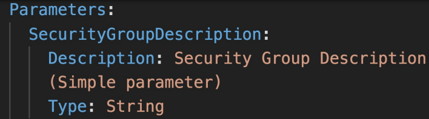
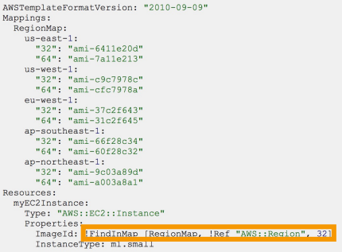
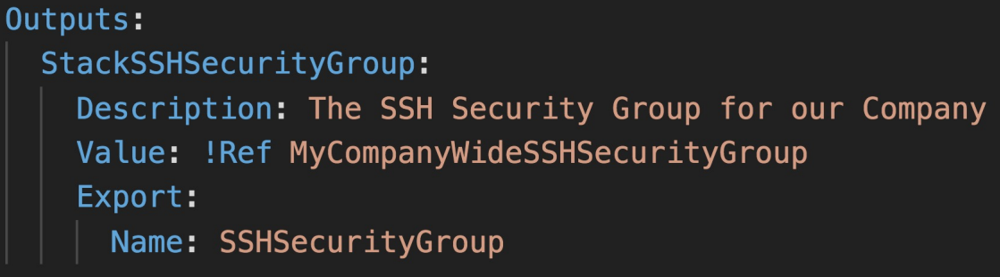
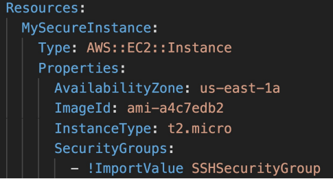
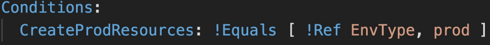
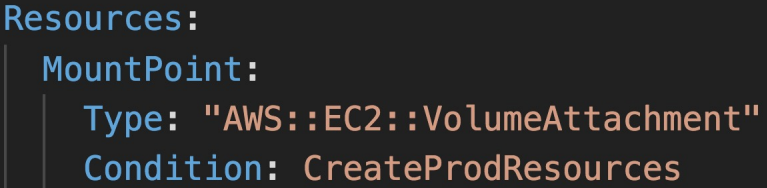
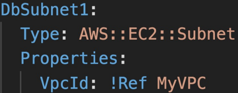
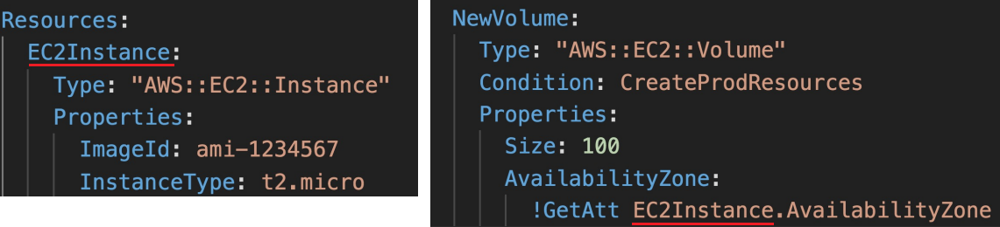
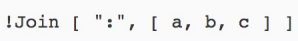

<h2>CloudFormation</h2>
Infrastructure as code means that code would be used to create,
update, or delete our infrastructure

**CloudFormation**
* CloudFormation is a declarative way of outlining your AWS
  Infrastructure, for any resources (most of them are supported)
* For example, within a CloudFormation template, you say:
    * I want a security group
    * I want two EC2 machines using this security group
    * I want two Elastic IPs for these EC2 machines
    * I want an S3 bucket
    * I want a load balancer (ELB) in front of these machines
* Then CloudFormation creates those for you, in the right order,
  with the exact configuration that you specify
* Benefits of CloudFormation
    * Infrastructure as code
        * No resources are manually created, which is excellent
          for control
        * The code can be version controlled for example using Git
        * Changes to the infrastructure are reviewed through code
    * Cost
        * Each resource within the stack is tagged with an identifier
          so you can easily see how much a stack costs you
        * You can estimate the costs of your resources using the
          CloudFormation template
        * Saving strategy: in dev, you could automate deletion of
          templates at 5 PM and recreate at 8 AM, safely
    * Productivity
        * Ability to destroy and re-create an infrastructure on
          the cloud on the fly
        * Automated generation of diagram for your templates
        * Declarative programming (no need to figure out ordering
          and orchestration)
    * Separation of concern - create many stacks for many apps,
      and many layers. Ex:
        * VPC stacks
        * Network stacks
        * App stacks
* How CloudFormation works
    * Templates have to be uploaded in S3 and then referenced
      in CloudFormation
    * To update a template, we can't edit previous ones. We have
      to re-upload a new version of the template to AWS. AWS will
      then do a diff on what it should create.
    * Stacks are identified by a name
    * Deleting a stack deletes every single artifact that was
      created by CloudFormation
* Deploying CloudFormation templates
    * Manual way:
        * Editing templates in the CloudFormation designer
        * Using the console to input parameters etc
    * Automated way:
        * Editing templates in a YAML file
        * Using the AWS CLI (Command line interface) to deploy
          the templates
        * Recommended way when you fully want to automate your flow
* Building blocks
    * Templates components
        * Resources: your AWS resources declared in the template (MANDATORY)
            * They represent the different AWS Components that will be created
              and configured
            * Resources are declared and can reference each other
            * AWS figures out creation, updates, and deletes of resources
              for us
            * There are over 224 types of resources
            * Resource types identifiers are of the form
              `AWS::aws-product-name::data-type-name`. Ex. `AWS::EC2::Instance`
            * Has all sorts of properties that can be defined
            * Can't create a dynamic amount of resources. Everything in the
              CloudFormation template has to be declared. You can't perform
              code generation there
            * Almost all AWS services are supported
            * Those that aren't supported can be used via AWS Lambda Custom Resources
        * Parameters: the dynamic inputs for your template
            * Parameters are a way to provide inputs to your AWS CloudFormation
              template
            * They're important to know about if:
                * You want to reuse your templates across the company
                * Some inputs can not be determined ahead of time
            * Parameters are extremely powerful, controlled, and can prevent
              errors from happening in your templates thanks to types
            * Use if this CloudFormation resource configuration is likely to change
              in the future
            * The `Ref` function can be used to reference another value. E.g. `!Ref MyVPC`
            * AWS offers us pseudo parameters to create values that are predefined by
              AWS CloudFormation. E.g. `AWS::AccountId`
              
        * Mappings: the static variables for your template
            * Mappings are fixed variables within your CloudFormation template
            * They're very handy to differentiate between different environments
              (dev vs prod), regions (AWS regions), AMI types etc
            * All the values are hardcoded within the template
            * Mappings are great when you know in advance all the values that can
              be taken and that they can be deduced from variables such as Region, AZ,
              AWS Account, Environment etc
            * They allow safer control over the template
            * Use parameters instead when the values are really user specific
            * FindInMap to return a named value from a specific key `!FindInMap [MapName, TopLevelKey, SecondLevelKey]`
                * Ex. `!FindInMap [OurCustomRegionMap, !Ref "AWS::Region", 32]`
                  
        * Outputs: references to what has been created
            * The outputs section declares optional output values that we can
              import into other stacks (if you export them first)
            * You can also view the outputs in the AWS Console or in using
              the AWS CLI
            * They're very useful for example if you define a network CloudFormation
              and output the variables such as VPC ID and your Subnet IDs
            * It's the best way to perform some collaboration cross stack, as you
              let experts handle their own part of the stack
            * You can't delete a CloudFormation stack if its outputs are being
              referenced by another CloudFormation stack
            * The export parameter is required, if you want to use it. It defines
              what the parameter name for the user will be
              
            * ImportValue can be used to reference the variable
              
        * Conditionals: list of conditions to perform resource creation
            * Conditions are used to control the creation of resources or outputs
              based on a condition
            * Conditions can be whatever you want them to be, but common
              ones are:
                * Environment (dev/test/prod)
                * AWS Region
                * Any parameter value
            * Each condition can reference another condition, parameter value
              or mapping
              
            * The intrinsic function (logical) can be any of the following:
                * And, Equals, If, Not, Or
            * Conditions can be applied to resources, outputs etc
              
        * Metadata
    * Template helpers
        * References
        * Functions
* Must know intrinsic functions
    * Function long form is  Fn::<func>, and short form is !<func>
    * Fn::Ref - reference parameters, resources
      
    * Fn::GetAtt - attributes are attached to any resources you
      create. Check out the documentation to find out what you can get
      
    * Fn::FindInMap - return a named value from a specific key
      
    * Fn::ImportValue - import values that are exported in other
      templates
      
    * Fn::Join - join values with a delimiter. `!Join [delimiter, [list] ]`
      
    * Fn::Sub - substitute variables form a text. It's a very handy
      function that will allow you to fully customize your templates
    * For example, you can combine Fn::Sub with references or AWS
      pseudo variables
    * ```
    Fn::Sub:
    - String
    - Var1Name: Var1Value
      Var2Name: Var2Value
    ```
    * The following example uses a mapping to substitute the ${Domain}
      variable with the resulting value from the Ref function.
  ````
  Name: !Sub
  - www.${Domain}
  - { Domain: !Ref RootDomainName }
  ````
    * Condition functions - logical ID is for you to choose. It's
      how you name conditions. Can contain Fn::And, Fn::Equals,
      Fn::If, Fn::Not, Fn::Or

* CloudFormation Rollbacks
    * Stack Creation Fails:
        * Default: Everything rolls back (gets deleted). We can look
          at the log
        * Option to disable rollback and troubleshoot what happened
    * Stack update fails:
        * The stack automatically rolls back to the previous known
          working state
        * Ability to see in the log what happened and error messages
* ChangeSets
    * When you update a stack, you need to know what changes before it
      happens for greater confidence
    * ChangeSets won't say if the update will be successful
* Nested stacks
    * Nested stacks are stacks as part of other stacks
    * They allow you to isolate repeated patterns/common components
      in separate stacks and call them from other stacks
    * Example:
        * Load balancer configuration that is re-used
        * Security group that is re-used
    * Nested stacks are considered best practice
    * To update a nested stack, always update the parent (root stack)
* Cross stacks vs nested stacks
    * Helpful when stacks have different lifecycles
    * Use outputs export and Fn::ImportValue
    * When you need to pass export values to many stacks
* Nested stacks
    * Helpful when components must be re-used
    * Example: re-use how to properly configure an ALB
    * The nested stack only is important to the higher level stack (it's
      not shared)
* StackSets
    * Create, update, or delete stacks across multiple accounts and
      regions with a single operation
    * Administrator account to create StackSets
    * Trusted accounts to create, update, delete stack instances from
      StackSets
    * When you update a stack set, all associated stack instances are
      updated throughout all accounts and regions
* CloudFormation drift
    * CloudFormation allows you to create infrastructure, but it
      doesn't protect you against manual configuration changes
    * How do we know if our resources have drifted? We can use
      CloudFormation drift
    * Not all resources are supported yet