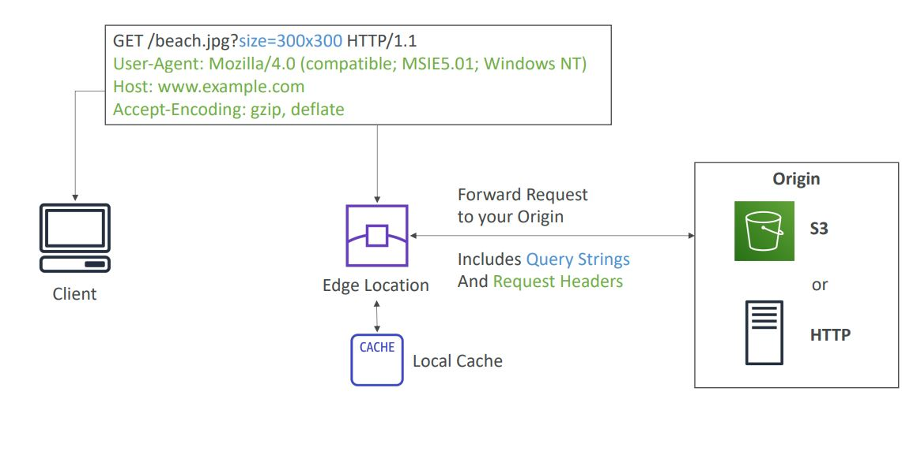
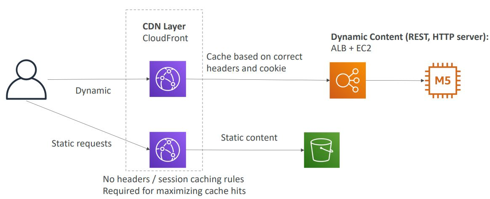
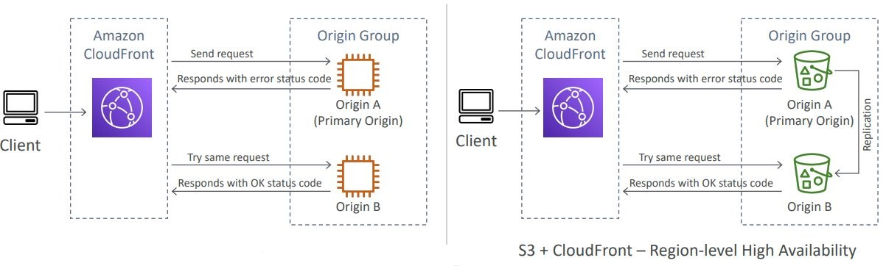
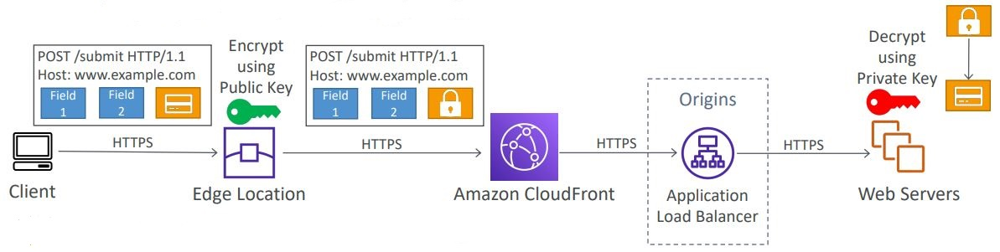

<h2>CloudFront</h2>
**AWS CloudFront**
* Content delivery network (CDN)
* Improves read performance, content is cached at the edge of which there
  are 216 globally and more being added
* Provides DDoS protection, integration with Shield, AWS Web Application
  Firewall
* Can expose external HTTPS and can talk to internal HTTPS backends
* Origins
    * S3 bucket
        * For distributing files and caching them at the edge
        * Enhanced security with CloudFront Origin Access Identity (OAI) to
          allow bucket communication only from CloudFront and no one else
        * CloudFront can be used as an ingress to upload files to S3
    * Custom origin (HTTP)
        * Application load balancer
        * EC2 instance
        * S3 website (must first enable the bucket as a static S3 website)
        * Any HTTP backend you want
* How does it work at a high level
    * We have multiple edge locations all around the world and they are
      connected to your origin. The user sends a query to our edge location
      and this gets forwarded to our origin. Our response can then be cached
      at the edge location based on our cache settings. Edge location is
      connected via the AWS private network, thus having less latency.
      With S3 you have OAI to allow for access, but for EC2/ALB you have to
      allow public access from a list of IPs that correspond to edge locations.
      AWS has a list that you can use.
      
* Geo Restriction
    * You can restrict who can access your distribution
        * Whitelist: Allow your users to access your content only if they're
          in one of the countries on a list of approved countries.
        * Blacklist: Prevent your users from accessing your content if they're
          in one of the countries on a blacklist of banned countries.
        * The country is determined using a 3rd party Geo-IP database
    * Use case: Copyright laws to control access to content.
* Cloudfront vs S3 Cross Region Replication
    * CloudFront
        * Global edge network
        * Files are cached for a TTL
        * Great for static content that must be available everywhere
    * S3 cross region replication
        * Must be setup for each region you want replication to happen in
        * Files are updated in near real-time
        * Read only
        * Great for dynamic content that needs to be available at low-latency
          in few regions
* CloudFront and HTTPS
    * Viewer protocol policy (between client and edge location)
        * Redirect HTTP to HTTPS
        * Or use HTTPS only
    * Origin protocol policy (between edge location and origin)
        * HTTPS only
        * Or match viewer (HTTP => HTTP & HTTPS => HTTPS)
    * Note: S3 bucket websites don't support HTTPS
* Cache
    * Cache based on
        * Headers
        * Session cookies
        * Query String Parameters
    * The cache lives at each CloudFront edge location
    * You can also send a manual cache invalidation from AWS
    * To maximize cache hits you should separate static and dynamic content
      
* Signed URL/Signed Cookies
    * You want to distribute paid shared content to premium users over the
      world
    * We can use CloudFront signed URL/Cookie. Attach a policy with:
        * Include URL expiration
        * Include IP ranges to allow access to the data (when possible)
        * Trusted signers (which AWS can create signed URLs)
    * How long should the URL be valid for?
        * Shared content (movie, music): make it short (a few minutes)
        * Private content (private to the user): you can make it last for
          years
    * Signed URL = access to individual files (one signed URL per file)
    * Signed cookies = access to multiple files (one signed cookie for
      many files)
* Signed URL process
    * Trusted key group (recommended)
        * Can leverage APIs to create and rotate keys (and IAM for API
          security)
    * An AWS account that contains a CloudFront key pair (not recommended)
        * Need to manage keys using the root account and the AWS console
        * Has no API to manage the keys
    * In your CloudFront distribution, create one or more trusted key groups
    * Generate your own public/private key manually and then add them
        * The private key is used by your application (e.g. EC2) to sign
          URLs
        * The public key (uploaded) is used by CloudFront to verify URLs
* Pricing
    * Edge locations have different costs per gigabyte
    * Pricing per gigabyte also gets lower depending on how much data is
      being transfered. As more data is transfered, the cheaper it gets. The
      price/data brackets are specified.
    * You can reduce the number of edge locations for cost reduction
    * Three price classes:
        * Price class all: all regions - best performance, highest cost
        * Price class 200: most regions - good performance, excludes the
          most expensive regions
        * Price class 100: only the least expensive regions
* Multiple Origin
    * To route to different kinds of origins based on the content type
    * Based on path pattern:
        * /images/*
        * /api/*
* Origin groups
    * To increase high-availability and do failover
    * Origin group: one primary and one secondary origin
    * If the primary origin fails, the second one is used
      
* Field level encryption
    * Protect user sensitive information through application stack
    * Adds an additional layer of security along with HTTPS
    * Sensitive information encrypted at the edge close to user
    * Uses asymmetric encryption
    * Usage:
        * Specify set of fields in POST requests that you want to be
          encrypted (up to 10 fields)
        * Specify the public key to encrypt them
          