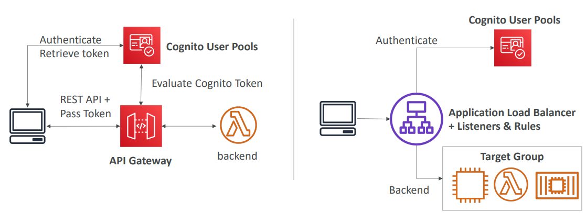
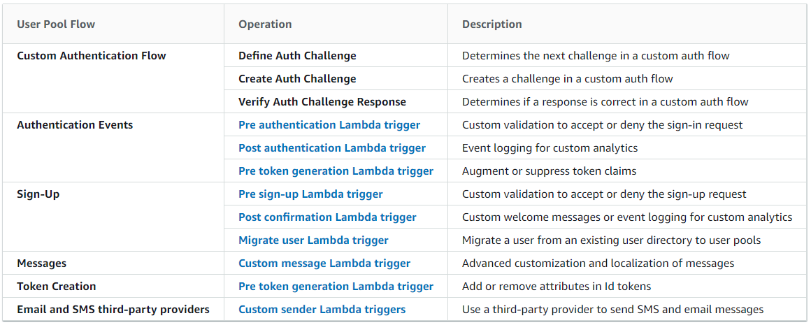
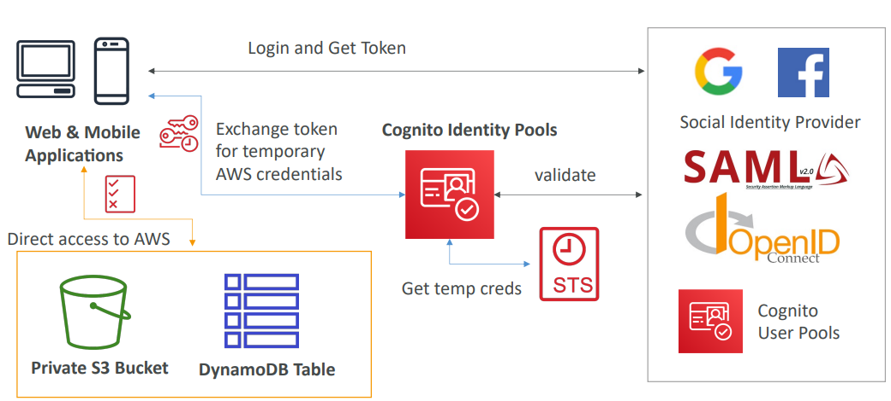
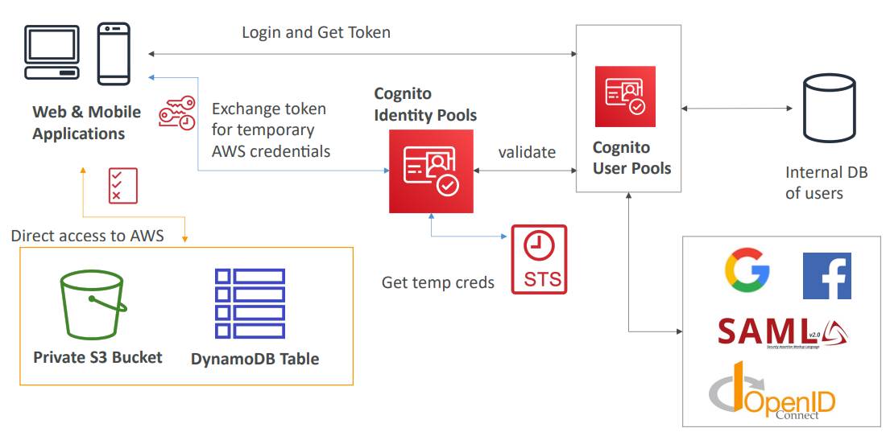

<h2>Cognito</h2>
**Cognito**
* We want to give our users an identity so that they can interact with our application.
  That is the web application we've written. So users outside of AWS, that are only
  connected to our own written application.
* Cognito user pools
    * Sign in functionality for app users
    * Integrate with API gateway & Application load balancer
* Cognito identity pools (federated identity)
    * Provide AWS credentials to users, so they can access AWS resources directly
    * Integrate with Cognito User Pools as an identity provider
* Cognito sync
    * Synchronize data from device to Cognito
    * Is deprecated and replaced by AppSync
* Cognito vs IAM: think Cognito when "hundreds of users", "mobile users",
  "authenticate with SAML". IAM is for all the users that you trust within
  your AWS environment.
* Cognito User Pools (CUP)
    * Create a serverless database of users for your web & mobile apps
    * Simple login: Username (or email) / password combination
    * Password reset
    * Email & Phone Number Verification
    * Multi-factor authentication (MFA)
    * Federated Identities: users from Facebook, Google, SAML...
    * Feature: block users if their credentials are compromised elsewhere
    * Login sends back a JSON Web Token (JWT)
    * CUP integrates with API Gateway and Application Load Balancer
    * With an API Gateway:
        1. The user authenticates and gets a token
        2. Then it will make a call to the REST API and pass the token
        3. The gateway will authenticate the token against the Cognito User Pools
        4. On success, it will receive access to the backend
           
    * CUP can invoke a lambda function synchronously on these triggers
      
    * Cognito User Pools - Hosted Authentication UI
        * Cognito has a hosted authentication UI that you can add to your app to handle
          sign-up and sign-in workflows
        * Using the hosted UI, you have a foundation for integration with social
          logins, OIDC, or SAML
        * Can customize with a custom logo and custom CSS
* Cognito Identity Pools (Federated Identities)
    * Get identities for "users" so they obtain temporary AWS credentials to get
      access to AWS resources. E.g. a DynamoDB table or a S3 bucket.
    * Cannot do through IAM, because there are too many of them and we don't trust
      them.
    * Your identity pool (e.g. identity source) can include:
        * Public providers (Login with Amazon, Facebook, Google, Apple)
        * Users in an Amazon Cognito user pool
        * OpenID connect providers & SAML identity providers
        * Developer authenticated identities (custom login server)
        * Cognito Identity Pools allow for unauthenticated (guest) access
    * Users can then access AWS services directly or through API gateway
        * The IAM policies applied to the credentials are defined in Cognito
        * They can be customized based on the user_id for fine-grained control
    1. The user will log in and get a token
    2. The token will be exchanged for temporary AWS credentials
    3. The token will be verified with whatever provider we have defined
    4. STS will provide temporary credentials
    5. The credentials are returned to the user, and they can use these for direct
       access to AWS resources.
       
    * Cognito identity pools with CUP can be used to centralize the users. It can
      extend to an internal DB of users or federated identities.
      
    * How to apply IAM roles
        * Default IAM roles for authenticated and guest users
        * Define rules to choose the role for each user based on the user's ID
        * You can partition your users' access using policy variables
        * IAM credentials are obtained by Cognito Identity Pools through STS
        * The roles must have a "trust" policy of Cognito Identity Pools
* Cognito User Pools vs Identity Pools
    * Cognito User Pools (Manage user/password)
        * Database of users for your web and mobile application
        * Allows federating logins through Public Social, OIDC, SAML etc.
        * Can customize the hosted UI for authentication (including the logo)
        * Has triggers with AWS Lambda during the authentication flow
    * Cognito Identity Pools (Access AWS services)
        * Obtain AWS credentials for your users
        * Users can log in through Public Social, OIDC, SAML & Cognito User Pools
        * Users can be authenticated (guests)
        * Users are mapped to IAM roles & policies, can leverage policy variables
* Cognito Sync
    * Deprecated - use AWS AppSync now
    * Store user preferences, configuration, state of app
    * Cross device synchronization (any platform - iOS, Android etc)
    * Offline capability (sync when back online)
    * Store data in datasets (up to 1MB), up to 20 datasets to synchronize
    * Push sync: silently notify across all devices when identity data changes
    * Cognito Stream: stream data from Cognito into Kinesis
    * Cognito Events: execute Lambda functions in response to events