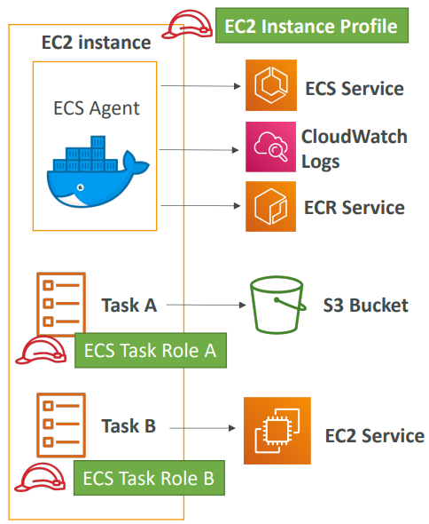

<h2>ECS, ECR & Fargate</h2>
There are three choices for managing Docker containers on AWS
* ECS: Amazon's own platform
* Fargate: Amazon's own serverless platform
* EKS: Amazon's managed Kubernetes

**ECS**
* ECS clusters are logical groupings of EC2 instances
* EC2 instance run the ECS agent (Docker container)
* The ECS agents register the instance to the ECS cluster
* The EC2 instances run a special AMI, made specifically for ECS
* The instances that get launched echo into a config file the
  cluster name and each instance has a docker process running on it,
  which uses the cluster name to register it.
* ECS task definition
    * Metadata in JSON form to tell ECS how to run a Docker Container
    * If we don't specify a host port, then that becomes random
* ECS Service
    * ECS services help define how many ECS tasks should run
      and how they should be run
    * They ensure that the number of tasks desired is running
      across our fleet of EC2 instances
    * They can be linked to ELB/NLB/ALB if needed
* An application load balancer can be used to pick up the
  containers with random ports by using dynamic port forwarding.
  Cannot be added after the service has been created. Has to added
  alongside the service.
* IAM roles
    * EC2 instance profile:
        * Used by the ECS agent
        * Makes API calls to ECS service
        * Send container logs to CloudWatch logs
        * Pull Docker image from ECR
    * ECS task role:
        * Allow each task to have a specific role
        * Use different roles for the different ECS services you run
        * Task roles is defined in the task definition
          
* ECS tasks placement
    * When a task of type EC2 is launched, ECS must determine
      where to place it, with the constraints of CPU, memory, and
      available port.
    * Similarly, when a service scales in, ECS needs to determine
      which task to terminate
    * To assist with this, you can define a task placement strategy
      and task placement constraints
    * Note: only for ECS with EC2, not for Fargate (does this
      automatically)
    * Task placement strategies are a best effort
    * When Amazon ECS places tasks, it uses the following process
      to select container instances:
        1. Identify the instances that satisfy the CPU, memory, and
           port requirements in the task definition.
        2. Identify the instances that satisfy the task placement
           constraints.
        3. Identify the instances that satisfy the task placement
           strategies.
        4. Select the instances for task placement.
    * Placement strategies
        * Binpack
            * Place tasks based on the least available amount of CPU
              or memory. Places as many tasks as possible into one
              instance before creating a new instance.
            * This minimizes the number of instances in use (cost
              savings)
        * Random
            * Place the task randomly
        * Spread
            * Place the task evenly based on the specified value
            * Example: instanceId, attribute:ecs.availability-zone.
              Places one in one AZ, the next in the other AZ, then again
              the first and so forth.
        * You can mix the strategies. E.g. binpack on memory, spread
          on availability zone
    * Placement constraints
        * distinctInstance - place each task on a different container
          instance
        * memberOf - places task on instances that satisfy an expression.
          Uses the Cluster query language. E.g. all instances that are
          of type T2.
* ECS - Service auto scaling
    * CPU and RAM are tracked in CloudWatch at the ECS service level
    * Target tracking: target a specific average CloudWatch metric
    * Step scaling - scale based on CloudWatch alarms
    * Scheduled scaling - based on predictable changes
    * ECS service scaling (task level) != EC2 auto scaling
      (instance level)
    * Fargate auto scaling is much easier to setup (because
      serverless)
* ECS - cluster capacity provider
    * A capacity provider is used in association with a cluster
      to determine the infrastructure that a task runs on
        * For ECS and Fargate users, the FARGATE and FARGATE_SPOT
          capacity providers are added automatically
        * For Amazon ECS on EC2, you need to associate the capacity
          provider with auto-scaling group
    * When you run a task or a service, you define a capacity
      provider strategy, to prioritize in which provider to run
    * This allows the capacity provider to automatically provision
      infrastructure for you
* Data volumes
    * EC2 task strategies
        * The EBS volume is already mounted onto the EC2 instances
        * This allows your Docker containers to mount the EBS
          volume and extend the storage capacity of your task
        * Problem: if your task moves from one EC2 instance to
          another one, it won't be the same EBS volume and data
        * Use cases:
            * Mount a data volume between different containers on
              the same instance
            * Extend the temporary storage of a task
    * EFS file systems
        * Works for both EC2 tasks and Fargate tasks
        * Ability to mount EFS volumes onto tasks
        * Tasks launched in any AZ will be able to share the same
          data in the EFS volume
        * Fargate + EFS = serverless + data storage without managing
          servers
        * Use case: persistent multi-AZ shared storage for your
          containers
    * Bind mounts sharing data between containers
        * Works for both EC2 tasks (using local EC2 instance storage)
          and Fargate tasks (get 4GB for volume mounts)
        * Useful to share an ephemeral storage between multiple containers
          part of the same ECS task
        * Great for "sidecar" container pattern where the sidecar can be
          used to send metrics/logs to other destinations (separation
          of concerns)

**ECR**
* Private docker registry - Amazon Elastic Container Registry (ECR)
* Access is controlled through IAM (permission errors => policy)
* AWS CLI v1 login command - `$(aws ecr get-login
  --no-include-email --region eu-west-1)`
* AWS CLI v2 login command - `aws ecr get-login-password --region
  eu-west-1 | docker login --username AWS --password-stdin
  1234567890.dkr.ecr.eu-west-1.amazonaws.com`
* Docker push & pull
    * `docker push 1234567890.dkr.ecr.eu-west-1.amazonaws.com/demo:latest`
    * `docker pull 1234567890.dkr.ecr.eu-west-1.amazonaws.com/demo:latest`

**Fargate**
* Serverless
* We don't provision EC2 instances. We just create task definitions,
  and AWS will run our containers for us.
* To scale, just increase the task number

**ECS summary**
* ECS is used to run Docker containers and has 3 flavors:
    * ECS 'Classic': provision EC2 instances to run containers onto
        * EC2 instances must be created
        * We must configure the file /etc/ecs/ecs.config with the
          cluster name for registering to the cluster
        * The EC2 instance must run an ECS agent which registers
          to the cluster
        * EC2 instances can run multiple containers of the same type
            * You must not specify a host port (only container port)
              for dynamic port generation, otherwise there'll be port
              in use errors
            * You should use an Application Load Balancer with the
              dynamic port mapping
            * The EC2 instance security group must allow traffic from
              the ALB on all ports
        * ECS tasks can have IAM roles to execute actions against AWS
        * Security groups operate at the instance level, not task level
    * Fargate: ECS serverless, no more EC2 to provision
        * AWS provisions containers for us and assigns them elastic
          network interfaces
        * Fargate containers are provisioned by the container spec
          (CPU/RAM)
        * Fargate tasks can have IAM roles to execute actions against
          AWS
    * EKS: managed Kubernetes by AWS
* ECR is used to store Docker images
    * ECR is tightly integrate with IAM
    * AWS CLI v1 login command - `$(aws ecr get-login
      --no-include-email --region eu-west-1)`
    * AWS CLI v2 login command - `aws ecr get-login-password --region
      eu-west-1 | docker login --username AWS --password-stdin
      1234567890.dkr.ecr.eu-west-1.amazonaws.com`
    * Docker push & pull
        * `docker push 1234567890.dkr.ecr.eu-west-1.amazonaws.com/demo:latest`
        * `docker pull 1234567890.dkr.ecr.eu-west-1.amazonaws.com/demo:latest`
    * In case an EC2 instance (or you) cannot pull a Docker image,
      check IAM
* ECS Other
    * ECS does integrate with CloudWatch logs:
        * You need to setup logging at the task definition level
        * Each container will have a different log stream
        * The EC2 instance profile needs to have the correct IAM
          permissions to send the logs
    * Use IAM task roles for your tasks
    * Task placement strategies: binpack, random, spread
    * Service auto scaling with target tracking, step scaling, or
      scheduled
    * Cluster auto scaling through capacity providers