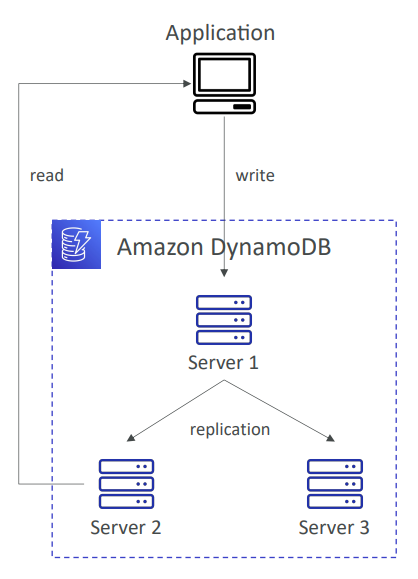
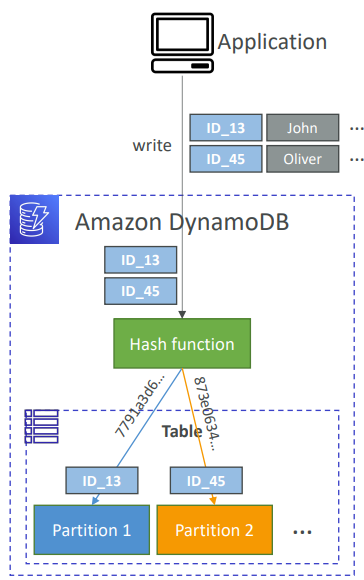
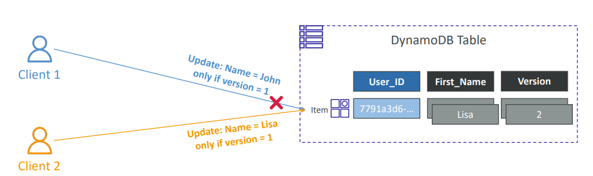
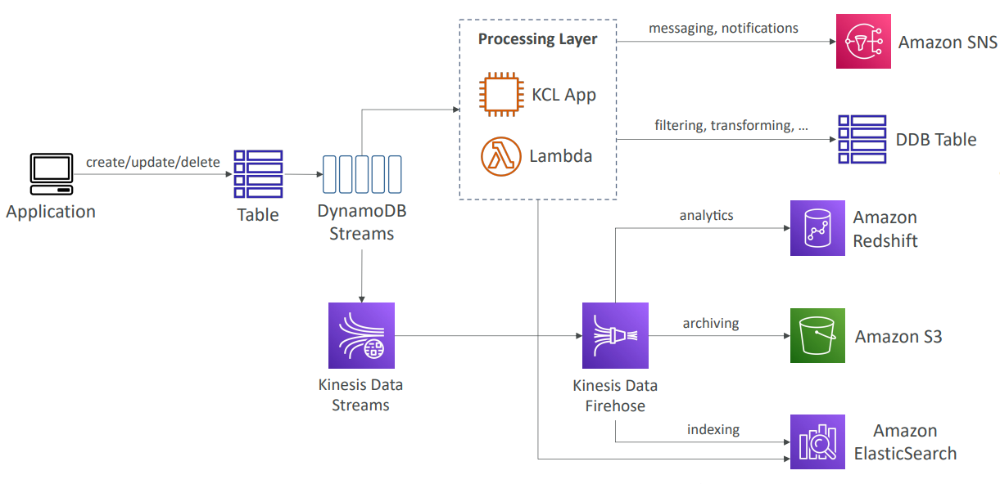
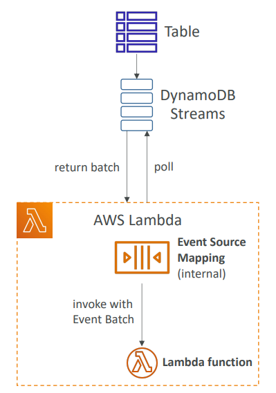
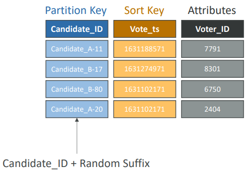
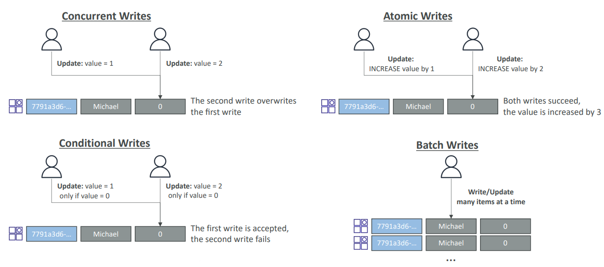
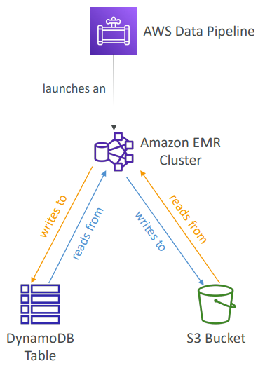

<h2>DynamoDB</h2>

**Intro**
* Traditional architecture
    * Traditional applications leverage RDBMS databases. These databases have the SQL query language.
    * Strong requirements about how the data should be modeled.
    * Ability to do query joins, aggregations, complex computations.
    * Vertical scaling (getting a more powerful CPU/RAM/IO)
    * Horizontal scaling (increasing reading capability by adding EC2/RDS Read Replicas)
* NoSQL
    * NoSQL databases are non-relation databases and are distributed. They include MongoDB, DynamoDB etc.
    * NoSQL databases do not support query joins (or just limited support)
    * All the data that is needed for a query is present in one row
    * NoSQL databases don't perform aggregations such as "SUM", "AVG" etc.
    * NoSQL databases scale horizontally
* There's no right or wrong for NoSQL vs SQL, they just require you to model the data differently and
  think about user queries differently.

**DynamoDB**
* Fully managed NoSQL DB, highly available with replication across multiple AZ
* Scales to massive workloads, distributed database
* Millions of requests per second, trillions of rows, 100s of TB of storage
* Fast and consistent performance (low latency on retrieval)
* Integrated with IAM for security, authorization, and administration
* Enables event driven programming with DynamoDB streams
* Low cost and auto-scaling capabilities
* DynamoDB is made of tables
* Each table has a primary key (must be decided at creation time)
* Each table can have an infinite number of items (=rows)
* Each item has attributes (can be added over time - can be null)
* Maximum size of an item is 400 KB
* Data types supported are
    * Scalar types - string, number, binary, boolean, null
    * Document types - list, map
    * Set types - string set, number set, binary set
* Primary keys
    * Option 1: Partition key (HASH)
        * Partition key must be unique for each item
        * Partition key must "diverse" so that the data is distributed
        * Example: "User_ID" for a users table
    * Option 2: Partition key + Sort key (HASH + RANGE)
        * The combination must be unique for each item
        * Data is grouped by partition key
        * Example: users-games table, "User_ID" for partition key and "Game_ID" for sort key
* Read and write capacity modes
    * Control how you manage your table's capacity (read/write throughput)
    * Provisioned mode (default)
        * You specify the number of reads/writes per second
        * You need to plan capacity beforehand
        * Pay for provisioned read & write capacity units
        * Table must have provisioned read and write capacity units
        * Read capacity units (RCU) - throughput for reads
        * Write capacity units (WCU) - throughput for writes
        * Option to setup auto-scaling of through to meet demand
        * Through can be exceeded temporarily using "Burst Capacity"
        * If "Burst Capacity" has been consumed, you'll get a "ProvisionedThroughputExceededException"
        * It's then advised to do an exponential backoff retry
    * On-Demand mode
        * Read/writes automatically scale up/down with your workloads
        * No capacity planning needed (WCU/RCU)
        * Unlimited WCU & RCU, no throttle, more expensive
        * Pay for what you use, more expensive
        * You're charged for reads/writes that you use in terms of RRU and WRU
        * Read request units (RRU) - throughput for reads (same as RCU)
        * Write request units (WRU) - throughput for writes (same as WCU)
        * 2.5x more expensive than provisioned capacity (use with care)
        * Use cases: unknown workloads, unpredictable application traffic etc
    * You can switch between different modes once every 24 hours
    * Write capacity units (WCU)
        * One write capacity unit (WCU) represents one write per second for an item up to 1 KB in size
        * If the items are larger than 1 KB, more WCUs are consumed
        * The formula is `items * item size / 1 KB = WCUs`. Fractional item sizes get rounded up.
        * Example 1: we write 10 items per second with item size 2 KB `10 items * (2 KB item size / 1 KB) = 20 WCUs`
        * Example 2: we write 6 items per second, with item size 4.5 KB. The 4.5 KB item size gets rounded up.
          `6 items * (5 KB item size / 1 KB) = 30 WCUs`
        * Example 3: we write 120 items per minute, with item size 2 KB.
          `120 items per minute / 60 seconds = 2 items per second`. `2 items * (2 KB item size / 1 KB) = 4 WCUs`
    * Eventually consistent read (default)
        * If we read just after a write, it's possible we'll get some stale data because of replication,
          as we do not know from which server we are reading.
          
    * Strongly consistent read
        * If we read just after a write, we will get the correct data
        * Set "ConsistentRead" parameter to True in API calls (GetItem, BatchGetItem, Query, Scan)
        * Consumes twice the RCU
    * Read capacity units (RCU)
        * One read capacity unit (RCU) represents one strongly consistent read per second, or two eventually
          consistent reads per second, for an item up to 4 KB in size
        * If the items are larger than 4 KB, more RCUs are consumed and they get rounded up to the nearest upper 4 KBs.
        * The formula is `(reads per second / read mode coefficient) * (item size / 4 KB) = RCUs`
        * Example 1: 10 strongly consistent reads per second, with item size 4 KB.
          `10 reads per second / 1 read mode coefficient * 4 KB / 4 KB = 10 RCUs`
        * Example 2: 16 eventually consistent reads per second, with item size 12 KB
          `16 reads per second / 2 read mode coefficient * 12 KB / 4 KB = 25 RCUs`
        * Example 3: 10 strongly consistent reads per second, with item size 6 KB
          `6 KB gets rounded up to the nearest 4 KB multiple = 8 KB`.
          `10 reads per second / 1 read mode coefficient * 8 KB / 4 KB = 20 RCUs`
* Partitions
    * DynamoDB is made up of tables and each table has a partition. Partitions are copies of data that
      live on specific servers. Data is stored in partitions.
    * Partition keys go through a hashing algorithm to know to which partition they go to
    * WCUs and RCUs are spread evenly across partitions
      
* Throttling
    * If we exceed provisioned RCUs or WCUs, we get "ProvisionedThroughputExceededException"
    * Reasons
        * Hot keys - one partition key is being read too many times (e.g. popular item)
        * Hot partitions
        * Very large items, remember RCU and WCU depends on size of items
    * Solutions
        * Exponential backoff when exception is encountered (already in SDK)
        * Distribute partition keys as much as possible
        * If RCU issue, we can use DynamoDB Accelerator (DAX)
* Writing data
    * PutItem
        * Creates a new item or fully replaces an old item (same Primary Key)
        * Consumes WCUs
    * UpdateItem
        * Exits an existing item's attributes or adds a new item if it doesn't exist
        * Can be used to implement Atomic Counters - a numeric attribute that's unconditionally incremented
    * Conditional writes
        * Accepts a write/update/delete only if conditions are met, otherwise returns an error
        * Helps with concurrent access to items
        * No performance impact
* Reading data
    * GetItem
        * Read based on primary key
        * Primary key can be hash or hash + range
        * Eventually consistent read (default)
        * Option to use strongly consistent reads (more RCU - might take longer)
        * ProjectExpression can be specified to retrieve only certain attributes
    * Query
        * Query returns items based on
            * KeyConditionExpression
                * Partition key value (must be = operator) - required
                * Sort key value (=, <, <=, >, >=, Between, Begins with) - optional
            * FilterExpression
                * Additional filtering after the query operation (before data returned to you)
                * Use only with non-key attributes (does not allow HASH or RANGE attributes)
        * Returns
            * The number of items specified in Limit or up to 1 MB of data
        * Ability to do pagination on the results
        * Can query table, a Local Secondary Index, or a Global Secondary Index
    * Scan
        * Scan the entire table and then filter out data (inefficient)
        * Returns up to 1 MB of data - use pagination to keep on reading
        * Consumes a lot of RCU
        * Limit impact using Limit or reduce the size of the results and pause
        * For faster performance, use Parallel Scan
            * Multiple workers scan multiple data segments at the same time
            * Increases the throughput and RCU consumed
            * Limit the impact of parallel scans just like you would for Scans
        * Can use ProjectionExpression & FilterExpression (no changes to RCU)
* Deleting data
    * DeleteItem
        * Delete an individual item
        * Ability to perform a conditional delete
    * DeleteTable
        * Delete a whole table and all its items
        * Much quicker deletion than calling DeleteItem on all items
* Batch operations
    * Allows you to save in latency by reducing the number of API calls
    * Operations are done in parallel for better efficiency
    * Part of a batch can fail, in which case we need to try again for failed items
    * BatchWriteItem
        * Up to 25 PutItem and/or DeleteItem in one call
        * Up to 16 MB of data written, up to 400 KB of data per item
        * Can't update items (use UpdateItem)
    * BatchGetItem
        * Return items from one or more tables
        * Up to 100 items, up to 16 MB of data
        * Items are retrieved in parallel to minimize latency
* Indexes
    * Local Secondary Index (LSI)
        * Alternative sort key for your table (same Partition Key as that of base table)
        * The sort key consists of one scalar attribute (String, Number, or Binary)
        * Up to 5 Local Secondary Indexes per table
        * Must be defined at table creation time
        * Attribute projections - can contain some or all attributes of base table (KEYS_ONLY, INCLUDE, ALL)
    * Global secondary index (GSI)
        * Alternative primary key (HASH or HASH + RANGE) from the base table
        * Speed up queries on non-key attributes
        * The index key consists of scalar attributes (String, Number, or Binary)
        * Attribute projections - some or all attributes of the base table (KEYS_ONLY, INCLUDE, ALL)
        * Must provision RCUs & WCUs for the index
        * Can be added/modified after table creation
    * Throttling
        * Global Secondary Index (GSI)
            * If the writes are throttled on the GSI, then the main table will be throttled, even if the
              WCU on the main tables are fine
            * Choose your GSI partition key carefully
            * Assign your WCU capacity carefully
        * Local Secondary Index (LSI)
            * Uses the WCUs and RCUs of the main table
            * No special throttling considerations
* Optimistic locking
    * DynamoDB has a feature called "Conditional Writes"
    * A strategy to ensure an item hasn't changed before you update/delete it
    * Each item has an attribute that acts as a version number
      
* DynamoDB accelerator (DAX)
    * Fully-managed, highly available, seamless in-memory cache for DynamoDB
    * Microseconds latency for cached reads & queries
    * Doesn't require application logic modification (compatible with existing DynamoDB APIs)
    * Solves the "Hot Key" problem (too many reads)
    * 5 minutes TTL for cache (default)
    * Up to 10 nodes in the cluster
    * Multi-AZ (3 nodes minimum recommended for production)
    * Secure (Encryption at rest with KMS, VPC, IAM, CloudTrail etc.)
    * DAX vs ElastiCache
        * Can be used at the same time
        * DAX will have individual objects cache, query & scan caching
        * When doing some logic application wise, then ElastiCache is where to keep it. So store aggregation
          result in it.
* DynamoDB Streams
    * Ordered stream of item-level modifications (create/update/delete) in a table
    * Stream records can be
        * Sent to Kinesis Data Streams
        * Read by AWS Lambda
        * Read by Kinesis Client Library applications
    * Data retention for up to 24 hours
    * Use cases
        * React to changes in real-time (welcome email to users)
        * Analytics
        * Insert into derivative tables
        * Insert into ElasticSearch
        * Implement cross-region replication
    * Ability to choose the information that will be written to the stream
        * KEYS_ONLY - only the key attributes of the modified item
        * NEW_IMAGE - the entire item, as it appears after it was modified
        * OLD_IMAGE - the entire item, as it appeared before it was modified
        * NEW_AND_OLD_IMAGES - both the new and the old images of the item
    * DynamoDB streams are made of shards, just like the Kinesis Data Streams
    * You don't provision shards, this is automated by AWS
    * Records are not retroactively populated in a stream after enabling it
      
    * With AWS Lambda
        * You need to define an Event Source Mapping to read from a DynamoDB stream
        * You need to ensure the Lambda function has the appropriate permissions
        * Your lambda function is invoked synchronously
          
* Time to live (TTL)
    * Automatically delete items after an expiry timestamp
    * Doesn't consume any WCUs (i.e. no extra cost)
    * The TTL attribute must be a "Number" data type with a "Unix Epoch timestamp" value
    * Expired items deleted within 48 hours of expiration
    * Expired items that haven't been deleted appear in reads/queries/scans (if you don't want them,
      filter them out)
    * Expired items are deleted from both LSIs and GSIs
    * A delete operation for each expired item enters the DynamoDB streams (can help recover expired
      items)
    * Use cases: reduce stored data by keeping only current items, adhere to regulatory obligations
* CLI good to know
    * --projection-expression: one or more attributes to retrieve
    * --filter-expression: filter items before returned to you
    * General AWS CLI pagination options (e.g. DynamoDB, S3 etc.)
        * --page-size: specify that AWS CLI retrieves the full list of items but with a larger number of
          API calls instead of one API call (default: 1000 items)
        * --max-items: max number of items to show in the CLI (returns NextToken)
        * --starting-token: specify the last NextToken to retrieve the next set of items
* Transactions
    * Coordinated, all-or-nothing operations (add/update/delete) to multiple items across one or more tables
    * Provides atomicity, consistency, isolation, and durability (ACID)
    * Read modes - eventual consistency, strong consistency, transactional
    * Write modes - standard, transactional
    * Consumes 2x WCUs & RCUs
        * DynamoDB performs 2 operations for every item (prepare & commit)
    * Two operations: (up to 25 unique items or up to 4 MB of data)
        * TransactGetItems - one or more GetItem operations
        * TransactWriteItems - one or more PutItem, UpdateItem, and DeleteItem operation
    * Use cases: financial transactions, managing orders, multiplayer games etc.
    * Capacity computations:
        * Read formula: `reads per second * (item size rounded to nearest 4 KB multiple / 4 KB) * 2 (transactional cost) = RCUs`
        * Write formula: `writes per second * (item size / 1 KB) * 2 (transactional cost) = WCUs`
        * Example 1: 3 transactional writes per second, with item size 5 KB
            * `3 writes per second * (5 KB item size / 1KB) * 2 = 30 WCUs`
        * Example 2: 5 transactional reads per second, with item size 5 KB
            * `5 reads per second * (8 KB (nearest 4 multiple) / 4 KB) * 2 = 20 RCUs`
* As Session state cache
    * It's common to use DynamoDB to store session state
    * vs ElastiCache
        * ElastiCache is in-memory, but DynamoDB is serverless
        * Both are key/value stores
    * vs EFS
        * EFS must be attached to EC2 instances as a network drive
    * vs EBS & Instance store
        * EBS & Instance store can only be used for local caching, not shared caching
    * vs S3
        * S3 is higher latency, and not meant for small objects
* Write sharding
    * Imagine we have a voting application with two candidates, candidate A and candidate B
    * If partition key is candidate_id, this results in two partitions, which will generate issues (
      e.g. hot partition)
    * A strategy that allows for better distribution of items across partitions would be to add a
      suffix to the partition key value
    * Two methods
        * Sharding using random suffix
        * Sharding using calculated suffix
          
* Write types
    * Concurrent writes - at the same time, one overwrites the other depending on who gets there last.
      Not desired.
    * Conditional writes - update value only if the value is X.
    * Atomic writes - a single operation on a variable at one time
    * Batch writes - writes/updates many items at a time
      
* DynamoDB patterns with S3
    * Large object pattern - upload the file to S3 and store the URL into the DB
    * Indexing S3 objects metadata - upload into S3, invoke lambda, store the upload metadata into
      DynamoDB so that you could more easily query for objects metadata
* DynamoDB operations
    * Table cleanup
        * Option 1: scan the entire table + DeleteItem - very slow, consumes RCU & WCU, expensive
        * Option 2: drop table + recreate table - fast, efficient, cheap
    * Copying a DynamoDB table
        * Option 1: using AWS data pipeline, reads from initial table, writes to S3 bucket, reads from it,
          then writes to a new table
          
        * Option 2: backup and restore into a new table - takes some time
        * Option 3: scan + PutItem or BatchWriteItem - write your own code
* Security & Other Features
    * Security
        * VPC endpoints available to access DynamoDB without using the Internet
        * Access fully controlled by IAM
        * Encryption at rest using AWS KMS and in-transit using SSL/TLS
    * Backup and restore feature available
        * Point-in-time recovery (PITR) like RDS
        * No performance impact
    * Global tables
        * Multi-region, multi-active, fully replicated, high performance
    * DynamoDB local
        * Develop and test apps locally without accessing the DynamoDB web service (without Internet)
    * AWS database migration service (AWS DMS) can be used to migrate to DynamoDB
      (from MongoDB, Oracle, MySQL, S3 etc)
    * Fine-grained access control (if you want users to access Dynamo directly)
        * Using Web Identity Federation or Cognito identity pools, each user gets temporary AWS credentials
        * You can assign an IAM role to these users with a condition to limit their API access to DynamoDB
        * LeadingKeys - limit row-level access for users on the primary key so that they could only modify
          their own data
        * Attributes - limit specific attributes the user can see
