<h2>AWS Elastic Beanstalk</h2>
**Beanstalk**
* Elastic Beanstalk is a developer centric view of deploying an
  application on AWS
* It uses all the components we've seen before: EC2, ASG, ELB,
  RDS etc.
* Managed service
    * Automatically handles capacity provisioning, load balancing,
      scaling, application health monitoring, instance configuration etc.
    * Just the application code is the responsibility of the
      developer
* We still have full control over configuration
* Beanstalk is free but you pay for the underlying instances
* Components
    * Application - collection of Elastic Beanstalk components (
      environments, versions, configurations etc)
    * Application version - an iteration of your application code
    * Environment
        * Collection of AWS resources running an application version
          (only one application version at a time)
        * Tiers (which type of application you are going to be
          creating): Web server environment tier & worker environment tier
          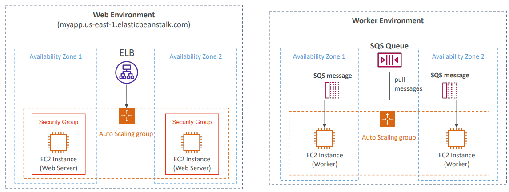
        * You can create multiple environments (dev, test, prod etc)
* Supported platforms
    * Supports multiple platforms by default (Go, Java SE, Python etc)
    * If a technology isn't supported, then you can write your custom
      platform
* Deployment modes
  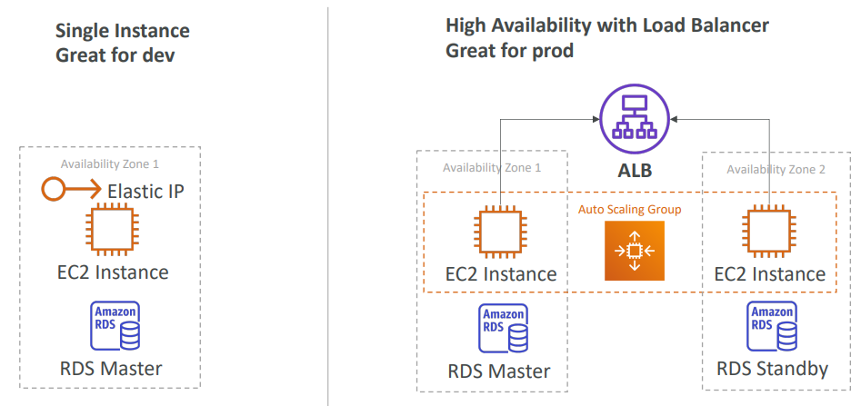
* Deployment options for updates
    * All at once (deploy all in one go) - fastest, but instances aren't
      available to serve traffic for a bit (downtime)
        * First, all the applications get stopped
        * Second, everything gets redeployed with version 2
          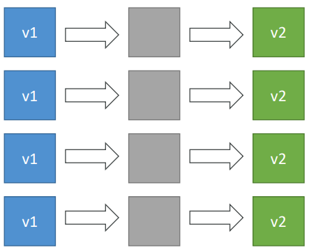
    * Rolling - update a few instances at a time (bucket), and then
      move onto the next bucket once the first bucket is healthy
        * Application is running below capacity
        * Can set the bucket size(how many instances get updated at
          once)
        * Based on the bucket size instances are stopped and then
          redeployed with V2, while the other ones are on V1
        * The bucket deployment then gets moved to the older versions
        * This is repeated until all the instances have been
          updated
        * Application is running both versions simultaneously
        * No additional cost, still the same number of instances
        * Long deployment
          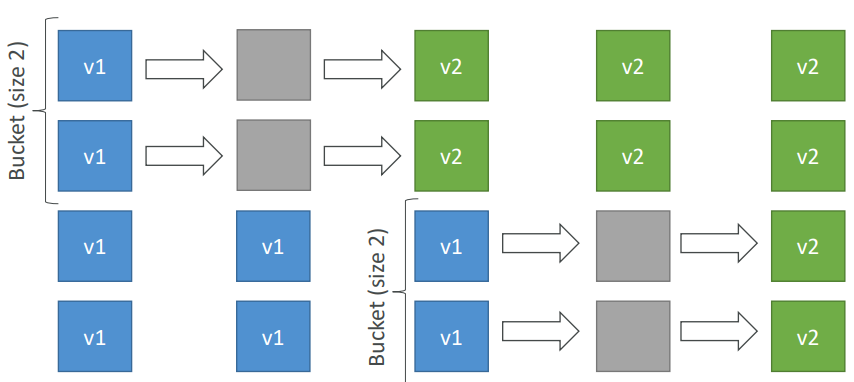
    * Rolling with additional batches - like rolling, but spins up
      new instances to move the batch (so that the old application is
      still available)
        * Application is running at capacity
        * Can set the bucket size
        * Application is running both versions simultaneously
        * Small additional cost
        * Additional batch is removed at the end of the deployment
        * Longer deployment
        * Good for prod
        * We have a number of V1 instances. Then we're going to deploy
          some additional V2 instances. Then we remove V1 instances based
          on bucket/batch size. The stopped V1s get replaced with V2 instances.
          Process gets repeated for the other V1s. Eventually the initial
          batch of instances get terminated.
        * In the example we have 4 V1s at the start. We start doing
          batches/buckets with a size of 2. So we deploy 2 extra V2s,
          then remove the first 2 V1s, replace them with 2 V2s, repeat,
          until all are V2s. Finally, remove the initial additional V2s.
          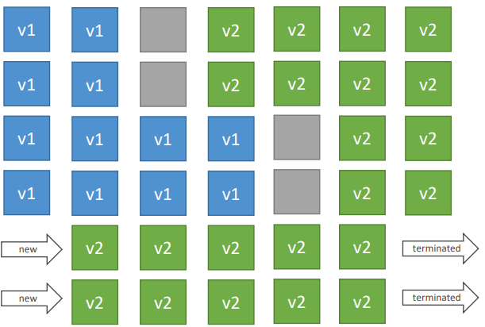
    * Immutable - spins up new instances in a new ASG, deploys version
      to these instances, and then swaps all the instances when
      everything is healthy
        * Zero downtime
        * New code is deployed to new instances on a temporary ASG
        * High cost, double capacity
        * Longest deployment
        * Quick rollback in case of failures (just terminate new ASG)
        * Great for prod
        * In the example we have a current ASG with 3 v1s. Then we
          create a temporary ASG into which Beanstalk deploys a single
          instances to make sure a single instance works. Once it has
          ensured that a single instance works, it then deploys the rest.
          When Beanstalk is happy, then the temporary ASG instances will
          be moved to the current ASG. After that is done the initial V1
          instances will be terminated and the temporary ASG will be
          removed.
          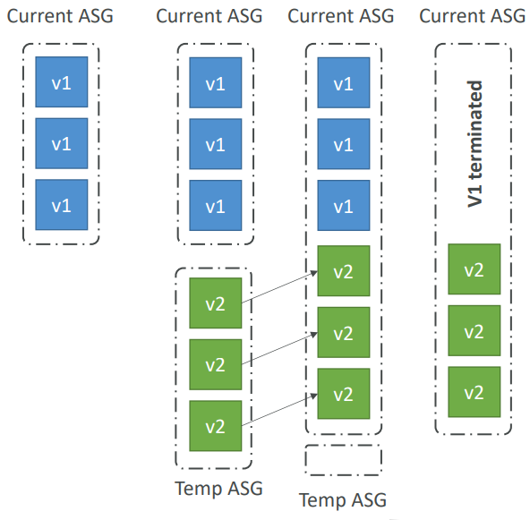
* Elastic Beanstalk CLI
    * We can install an additional CLI called the "EB CLI" which
      makes working with Beanstalk from the CLI easier
    * Basic commands are: eb create, eb status, eb health etc
    * It's helpful for your automated deployment pipelines
    * Process
        * Describe dependencies (package.json for Node.js)
        * Package code as zip, and describe dependencies (Node.js package.json)
        * Console: upload zip file (creates new app version), and then deploy
        * CLI: create new app version using CLI (uploads zip), and then deploy
        * Elastic Beanstalk will deploy the zip on each EC2 instance, resolve
          dependencies and start the application
* Beanstalk Lifecycle Policy
    * Elastic Beanstalk can store at most 100 application versions
    * If you don't remove old versions, you won't be able to
      deploy anymore
    * To phase out old application versions, use a lifecycle
      policy. You can either delete or retain it in S3
        * Based on time (old versions are removed)
        * Based on space (when you have too many versions)
    * Versions that are currently used won't be deleted
    * Option not to delete the source bundle in S3 to prevent
      data loss
* Elastic Beanstalk Extensions
    * A zip file containing our code must be deployed
      to Elastic Beanstalk
    * All the parameters set in the UI can be configured
      with code using files
    * Requirements:
        * in the .ebextensions/ directory in the root of source code
        * YAML/JSON format
        * .config extensions (example: logging.config)
        * Able to modify some default settings using: option_settings
        * Ability to add resources such as RDS, ElastiCache, DynamoDb etc.
    * Resources managed by .ebextensions get deleted if the
      environment goes away
* Elastic Beanstalk under the hood
    * Under the hood, Elastic Beanstalk relies on CloudFormation
    * CloudFormation is used to provision other AWS services
    * Use case: you can define CloudFormation resources in your
      .ebextensions to provision ElastiCache, an S3 bucket, anything
      you want
* Elastic Beanstalk cloning
    * Clone an environment with the exact same configuration
    * Useful for deploying a "test" version of your application.
      For example you have a dev environment and you want the same
      setup for prod, so you can just clone an existing one.
    * All resources and configuration are preserved:
        * Load balancer type and configuration
        * RDS database type (but the data is not preserved)
        * Environment variables
        * Etc.
    * After cloning an environment, you can change settings
* RDS with Elastic Beanstalk
    * RDS can be provisioned with Beanstalk, which is
      great for dev/test
    * This is not great for prod as the database lifecycle
      is tied to the Beanstalk environment lifecycle
    * The best for prod is to separately create an RDS
      database and provide our EB application with the connection
      string
* Elastic Beanstalk Migration
    * Load balancer
        * After creating an Elastic Beanstalk environment,
          you cannot change the Elastic Load Balancer type,
          only its configuration
        * To migrate:
            1. Create a new environment with the same
               configuration except LB (can't clone, have to
               manually create the same environment with its
               configs, minus the LB)
            2. Deploy your application onto the new
               environment
            3. Perform a CNAME swap or Route 53 update
    * Decouple RDS
        1. Create a snapshot of RDS DB (as a safeguard)
        2. Go to the RDS console and protect the RDS DB
           from deletion - this will protect it no matter what
        3. Create a new Elastic Beanstalk environment, without
           RDS, point your application to existing RDS
        4. Perform a CNAME swap (blue/green) or Route 53
           update, confirm that it's working
        5. Terminate old environment (RDS won't be deleted
           as we have enabled RDS deletion protection)
* Elastic Beanstalk - Single Docker
    * Run your application as a single Docker container
    * Either provide:
        * Dockerfile - Elastic Beanstalk will build and run
          the Docker container
        * Dockerrun.aws.json (v1): Describe where already
          built Docker image is
        * Beanstalk in single Docker container does not use
          ECS. Just uses EC2
* Elastic Beanstalk - multi Docker container
    * Multi Docker helps run multiple containers per EC2
      instance in EB
    * This will create for you:
        * ECS cluster
        * EC2 instances, configured to use the ECS cluster
        * Load balancer (in high availability mode)
        * Task definitions and execution
    * Requires a config Dockerrun.aws.json (v2) at the
      root of the source code
    * Dockerrun.aws.json is used to generate the ECS task
      definition
    * Your Docker images must be pre-built and stored in
      a repo (ECR or Docker hub)
      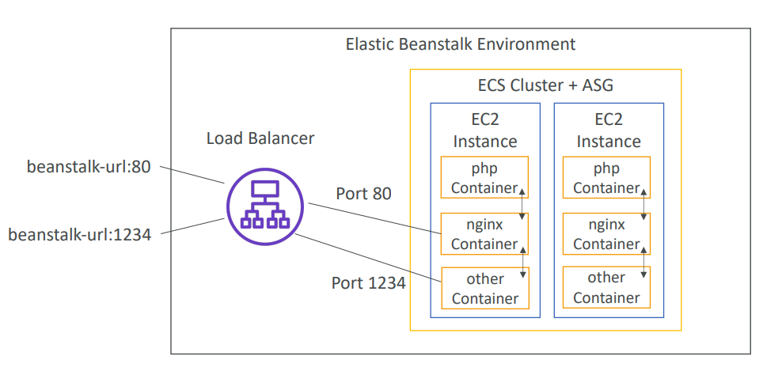
* Elastic Beanstalk and HTTPS
    * Beanstalk with HTTPS
        * Load the SSL certificate onto the load balancer
        * Can be done from the console (EB console, load balancer
          configuration)
        * Can be done from code:.ebextensions/securelistener-alb.config
        * SSL certificate can be provisioned using ACM (AWS
          certificate manager) or CLI
        * Must configure a security group rule to allow incoming
          port 443 (HTTPS port)
    * Beanstalk redirect HTTP to HTTPS
        * Configure your instances to redirect HTTP to HTTPS
        * Or configure the Application Load Balancer (ALB only)
          with a rule
        * Make sure health checks are not redirected, so you
          keep getting 200
* Web server vs worker environment
    * If your application performs tasks that are long to complete,
      offload these tasks to a dedicated worker environment
    * Decoupling your application into two tiers is common
    * Example: processing a video, generating a zip file, etc.
    * You can define period tasks in a file cron.yaml
      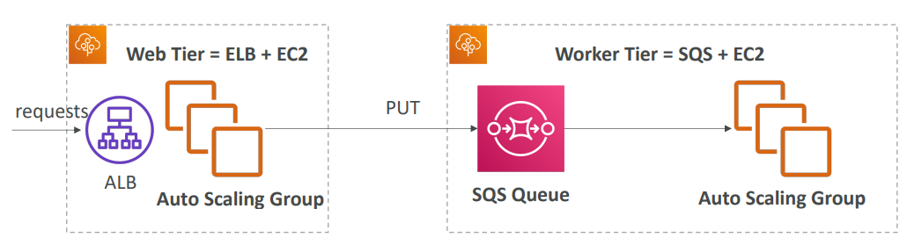
* Elastic Beanstalk - custom platform (advanced)
    * Custom platforms are very advanced, they allow to define from
      scratch:
        * The operating system (OS)
        * Additional software
        * Scripts that Beanstalk runs on these platforms
    * Use case: app language is incompatible with Beanstalk and
      doesn't use Docker
    * To create your own platform:
        * Define an AMI using Platform.yaml files
        * Build that platform using the Packer software (open source
          tool to create AMIs)
    * Custom platform vs custom image (AMI):
        * Custom image is to tweak an existing Beanstalk Platform (
          Python, Node.js, Java etc.)
        * Custom platform is to create an entirely new Beanstalk
          Platform

**Blue/Green deployment**
* Not a 'direct feature' of Elastic Beanstalk
* Zero downtime and helps with the release facility
* Create a new stage (another Elastic Beanstalk) environment and
  deploy V2 there
* The new environment (green) can be validated independently and
  roll back if issues
* Route 53 can be setup using weighted policies to redirect a
  little bit of traffic to the stage environment
* Using Beanstalk, 'swap URL' when done with the environment
  test
* You split the traffic. In the example 90/10. You make sure that
  the green environment works. Do all of your testing, measurements.
  Once you're satisfied, you swap the environment.
* You can swap the environment URLs in AWS in Elastic Beanstalk
  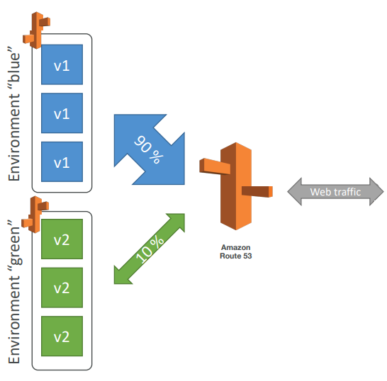

**Traffic splitting**
* Canary testing
* New application version is deployed to a temporary ASG with
  the same capacity
* A small % of traffic is sent to the temporary ASG for a
  configurable amount of time. The traffic % is incrementally
  increased until all the traffic has been moved to the new
  environment.
* Deployment health of the new temporary ASG is monitored
* If there's a deployment failure or some metric goes wrong,
  this triggers an automated rollback (very quick)
* No application downtime
* New instances are migrated from the temporary to the
  original ASG
  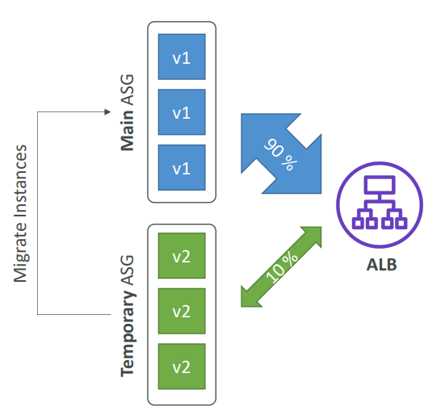
  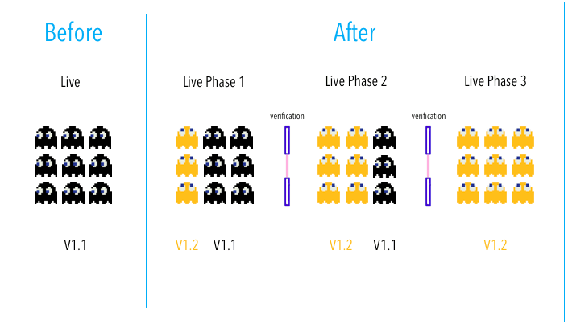
