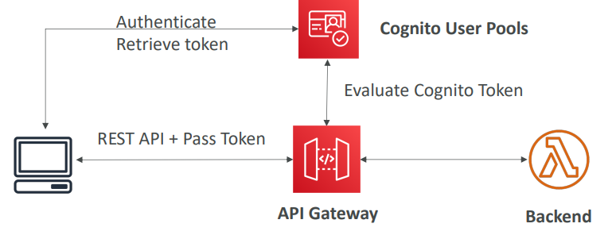
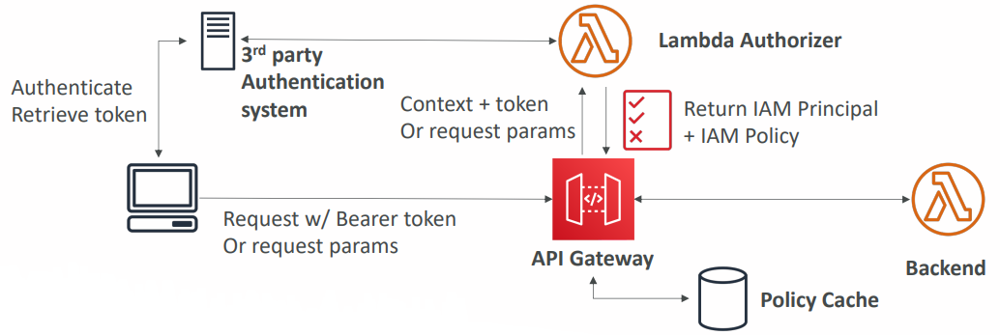
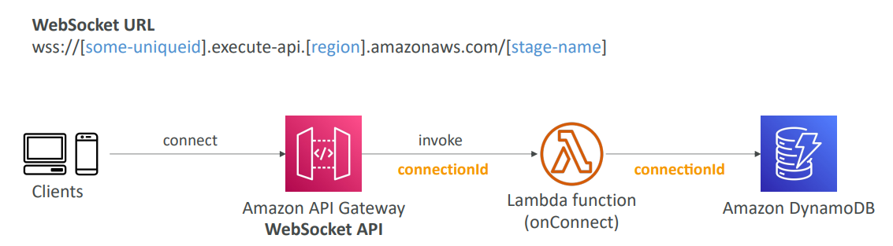
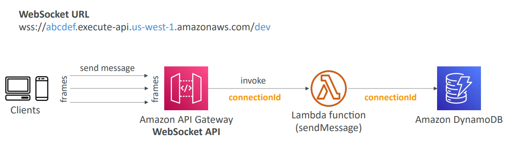
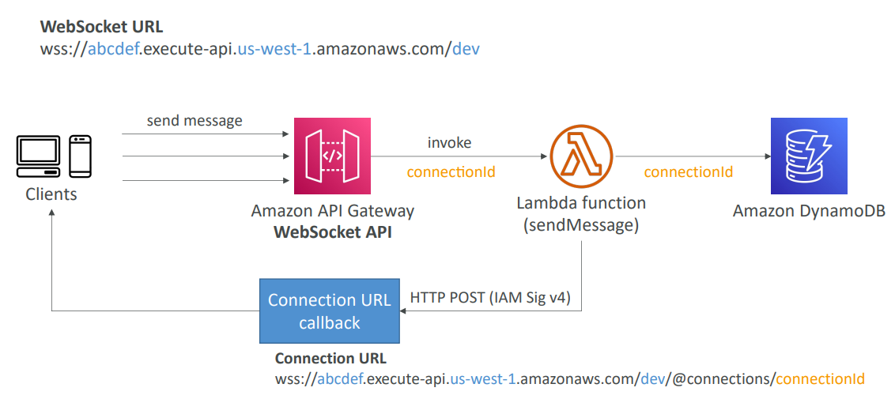
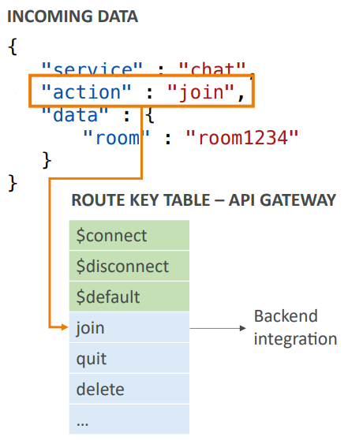

<h2>API Gateway</h2>
**API Gateway**
* AWS Lambda + API Gateway - no infrastructure to manage
* Support for the WebSocket protocol
* Handle API versioning (v1, v2 etc.)
* Handle different environments (dev, test, prod etc)
* Handle security (Authentication and Authorization)
* Create API keys, handle request throttling
* Swagger/Open API import to quickly define APIs
* Transform and validate requests and responses
* Generate SDK and API specifications
* Cache API responses
* Integrations
    * Lambda function
        * Invoke lambda function
        * Easy way to expose REST API backed by AWS lambda
    * HTTP
        * Expose HTTP endpoints in the backend
        * Example: internal HTTP API on premise, Application Load Balancer etc.
        * Why add API Gateway to the endpoints? Add rate limiting, caching, user authentication, API keys etc.
    * AWS service
        * Expose any AWS API through the API Gateway
        * Example: start an AWS Step Function workflow, post a message to SQS
        * Why? Add authentication, deploy publicly, rate control etc.
* How to deploy your API Gateway, called endpoint types
    * Edge-optimized (default) - for global clients, accessible from anywhere in the world
        * Requests are routed through the CloudFront Edge locations (improves latency)
        * The API Gateway still lives in only one region
    * Regional
        * For clients within the same region
        * Could manually combine with CloudFront (more control over the caching strategies and the distribution)
    * Private
        * Can only be accessed from your VPC using an interface VPC endpoint (ENI)
        * Use a resource policy to define access
* Deployment stages
    * Making changes in the API Gateway does not mean they're effective
    * You need to make a "deployment" for them to be in effect
    * It's a common source of confusion
    * Changes are deployed to "Stages" (as many as you want)
    * Use the naming you like for stages (dev, test, prod)
    * Each stage has its own configuration parameters
    * Stages can be rolled back as a history of deployments is kept
    * With a new version of the API, you can create a new stage, which gets a new URL so you could have
      V1 and V2 endpoints
    * Stage variables
        * Stage variables are like environment variables for API Gateway
        * Use them to change often changing configuration values
        * They can be used in:
            * Lambda function ARN
            * HTTP endpoint
            * Parameter mapping templates
        * Use cases
            * Configure HTTP endpoints your stages talk to (dev, test, prod etc.)
            * Pass configuration parameters to AWS lambda through mapping templates
        * Stage variables are passed to the "context" object in AWS Lambda
        * Stage variables & Lambda aliases
            * We create a stage variable to indicate the corresponding Lambda alias
            * Our API gateway will automatically invoke the right Lambda function
* Canary deployment
    * Possibility to enable canary deployments for any stage (usually prod)
    * Choose the % of traffic the canary channel receives
    * Metrics & Logs are separate (for better monitoring)
    * Possibility to override stage variables for canary
    * This is blue/green deployment with AWS Lambda & API Gateway
* Backend integration types
    * MOCK - API Gateway returns a response without sending the request to the backend
    * HTTP/AWS (Lambda & AWS Services)
        * you must configure both the integration request and integration response
        * Setup data mapping using mapping templates for the request & response
    * AWS_PROXY (Lambda proxy)
        * Incoming request from the client is the input to Lambda.
        * The function is responsible for the logic of request/response
        * No mapping template. Headers, query string parameters etc. are passed as arguments
    * HTTP_PROXY
        * No mapping template
        * The HTTP request is passed to the backend
        * The HTTP response from the back is forwarded by API gateway
    * Mapping templates (AWS & HTTP integration)
        * Mapping templates can be used to modify request/response
        * Rename/modify query string parameters
        * Modify body content
        * Add headers
        * Uses Velocity template language (VTL): for loop, if etc.
        * Filter output results (remove unnecessary data)
        * Example: JSON to XML with SOAP
            * SOAP API are XML based, whereas REST API are JSON based
            * In this case, API gateway should
                * Extract data from the request: either path, payload, or header
                * Build SOAP message based on request data (mapping template)
                * Call SOAP service and receive XML response
                * Transform XML response to desired format (like JSON), and respond to the user
* API Gateway Swagger/Open API spec
    * Common way of defining REST APIs, using API definition as code
    * Import existing Swagger/OpenAPI 3.0 spec to API gateway
        * Method
        * Method request
        * Integration request
        * Method response
        * + AWS extensions for API gateway and setup every single option
    * Can export current API as Swagger/OpenAPI spec
    * Swagger can be written in YAML or JSON
    * Using swagger we can generate SDK for our applications
* Caching API responses
    * Caching reduces the number of calls made to the backend
    * Default TTL (time to live) is 300 seconds (min: 0s, max: 3600s)
    * Caches are defined per stage
    * Possible to override cache settings per method
    * Cache encryption option
    * Cache capacity between 0.5GB to 237GB
    * Cache is expensive, makes sense in production, may not make sense in dev/test
    * Cache invalidation
        * Able to flush the entire cache (invalidate it) immediately from the UI
        * Clients can invalidate the cache with header: Cache-Control: max-age=0 (with proper IAM authorization)
        * If you don't impose an InvalidateCache policy (or choose the Require authorization check box in
          the console), any client can invalidate the API cache
* Usage plans & API keys
    * If you want to make an API available as an offering ($) to your customers
    * Usage plan
        * Who can access one or more deployed API stages and methods
        * How much and how fast they can access them
        * Uses API keys to identify API clients and meter access
        * Configure throttling limits and quota limits that are enforced on individual client
    * API keys
        * Alphanumeric string values to distribute to your customers
        * Can use with usage plans to control access
        * Throttling limits are applied to the API keys
        * Quota limits is the overall number of maximum requests
    * Correct order for API keys
        * To configure a usage plan
            1. Create one or more APIs, configure the methods to require an API key, and deploy the
               APIs to stages.
            2. Generate or import API keys to distribute to application developers (your customers) who
               will be using your API
            3. Create the usage plan with the desired throttle and quota limits.
            4. Associate API stages and API keys with the usage plan.
        * Callers of the API must supply an assigned API key in the x-api-key header in requests to the API.
* Logging & Tracing
    * CloudWatch logs:
        * Enable CloudWatch logging at the stage level (with log level)
        * Can override settings on a per API basis (ex: ERROR, DEBUG, INFO)
        * Log contains information about request/response body
    * X-Ray
        * Enable tracing to get extra information about requests in API gateway
        * X-Ray API Gateway + AWS Lambda gives you the full picture
    * CloudWatch metrics
        * Metrics are by stage, possibility to enable detailed metrics
        * CacheHitCount & CacheMissCount - efficiency of the cache
        * Count - the total number of API requests in a given period
        * IntegrationLatency - the time between when API Gateway relays a request to the backend and
          when it receives a response from the backend
        * Latency - the time between when API Gateway receives a request from a client and when it returns
          a response to the client. The latency includes the integration latency and other API Gateway overhead.
        * 4XXError (client-side) & 5XXError (server-side)
* Throttling
    * Account limit
        * API Gateway throttles requests at 10000 RPS across all API
        * Soft limit that ca be increased upon request
    * In case of throttling => 429 Too Many Requests (retriable error)
    * Can set Stage limit & Method limits to improve performance, or you can define Usage Plans to throttle
      per customer
    * Just like Lambda Concurrency, one API that is overloaded, if not limited, can cause the other APIs
    * to be throttled
* Errors
    * 4XX means client errors
        * 400 - bad request
        * 403 - access denied, WAF filtered
        * 429 - quota exceeded, throttle
    * 5XX means server errors
        * 502 - bad gateway exception, usually for an incompatible output returned from a Lambda proxy
          integration backend and occasionally for out-of-order invocations due to heavy loads
        * 503 - service unavailable exception
        * 504 - integration failure. Ex. Endpoint request timed-out exception. API Gateway requests time out
          after 29 second maximum
* CORS
    * CORS must be enabled when you receive API calls from another domain.
    * The OPTIONS pre-flight request must contain the following headers:
        * Access-Control-Allow-Methods
        * Access-Control-Allow-Headers
        * Access-Control-Allow-Origin
    * CORS can be enabled through the console
* Security
    * IAM Permissions
        * Create an IAM policy authorization and attach to User/Role
        * Authentication = IAM; Authorization = IAM policy
        * Good to provide access within AWS (EC2, Lambda, IAM users etc.)
        * Leverages "Sig V4" capability where IAM credentials are in headers
    * Resource policies
        * Similar to lambda resource policy
        * Allow for cross account access (combined with IAM security)
        * Allow for a specific source IP address
        * Allow for a VPC endpoint
    * Cognito user pools
        * Cognito fully manages user lifecycle, token expires automatically
        * API gateway verifies identity automatically from AWS Cognito
        * No custom implementation required
        * Authentication = Cognito User Pools; Authorization = API Gateway Methods
          
    * Lambda authorizer (formerly custom authorizer)
        * Token-based authorizer (bearer token) - ex JWT (JSON Web Token) or OAuth
        * A request parameter based Lambda authorizer (headers, query string, stage var)
        * Lambda must return an IAM policy for the user, result policy is cached
        * Authentication = External; Authorization = Lambda function
          
    * Summary
        * IAM
            * Great for users/roles already within your AWS account + resource policy for cross account
            * Handle authentication + authorization
            * Leverages signature V4
        * Custom authorizer
            * Great for 3rd party tokens
            * Very flexible in terms of what IAM policy is returned
            * Handle authentication verification + authorization in the lambda function
            * Pay per lambda invocation, results are cached
        * Cognito user pool
            * You manage your own user pool (can be backed by Facebook, Google login etc.)
            * No need to write any custom code
            * Must implement authorization in the backend
* HTTP API vs REST API
    * HTTP APIs
        * Low-latency, cost-effective AWS Lambda proxy, HTTP proxy APIs and private integration (no
          data mapping)
        * Support OIDC and OAuth 2.0 authorization, and built-in support for CORS
        * No usage plans and API keys
    * REST APIs
        * All features (except native OpenID Connect/OAuth 2.0)
* Websocket API
    * What's a websocket?
        * Two-way interactive communication between a user's browser and a server
        * Server can push information to the client
        * This enables stateful application use cases
    * WebSocket APIs are often used in real-time applications such as chat applications, collaboration
      platforms, multiplayer games, and financial trading platforms
    * Works with AWS Services (Lambda, DynamoDB) or HTTP endpoints
    * Connection to the API
        * The client connects to the gateway and establishes a persistent connection, this invokes a Lambda
          function and passes on a connectionId, the connectionId remains persistent during the connection.
        * ConnectionId could be passed and saved to DynamoDB to add some metadata to it
          
    * Client to server messaging
        * ConnectionID is re-used
        * Client sends messages to the server. The messages are called frames. It'll invoke a Lambda function
        * The Lambda can then use DynamoDB to retrieve the user info or whatever else is connected to the
          connectionId
          
    * Server to client messaging
        * There's a connection URL callback that can be used to communicate with the client
          
    * Routing
        * Incoming JSON messages are routed to different backend
        * If no routes, then sent to $default
        * You request a route selection expression to select the field on JSON to route from. In the example
          we tell it to look at the $request.body.action field to choose which route to go against.
        * $connect, $disconnect, $default are mandatory routes
        * The results of the defined property is evaluated against the route keys available in your API
          gateway
        * The route is then connected to the backend you've setup through API Gateway
          
* Architecture
    * Create a single interface for all the microservices in your company
    * Use API endpoints with various resources
    * Apply a simple domain name and SSL certificates
    * Can apply forwarding and transformation rules at the API gateway level