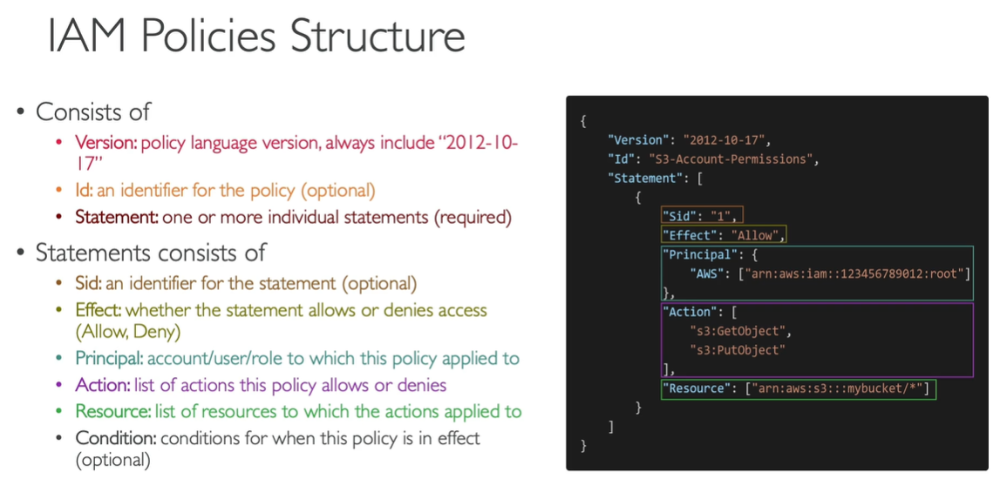

<h2>IAM (Identity and Access Management)</h2>
This is where the AWS security is.

You use IAM to control who is authenticated (signed in) and authorized (has permissions) 
to use resources.

When you create an AWS account, you begin with one sign-in identity that has complete 
access to all AWS services and resources in the account. This identity is called the 
AWS account root user and is accessed by signing in with the email address and 
password that you used to create the account.Root account should never be used 
(and shared). Only use it for the very first time to
create an account and then never again.

IAM provides the following features:
* Shared access to your AWS account - You can grant other people permission 
to administer and use resources in your AWS account without having to 
share your password or access key.
* Granular permissions - You can grant different permissions to different 
people for different resources.
* Secure access to AWS resources for applications that run on Amazon EC2 -
You can use IAM features to securely provide credentials for applications 
that run on EC2 instances. These credentials provide permissions for 
your application to access other AWS resources. Examples include 
S3 buckets and DynamoDB tables.
* Multi-factor authentication (MFA) - You can add two-factor 
authentication to your account and to individual users for extra security.
* Identity federation - You can allow users who already have passwords 
elsewhere—for example, in your corporate network or with an internet 
identity provider—to get temporary access to your AWS account.
* Identity information for assurance - If you use AWS CloudTrail, you 
receive log records that include information about those who made 
requests for resources in your account. That information is based on IAM identities.
* PCI DSS Compliance - IAM supports the processing, storage, and 
transmission of credit card data by a merchant or service provider, 
and has been validated as being compliant with Payment Card 
Industry (PCI) Data Security Standard (DSS).
* Eventually Consistent - changes have to be replicated across Amazon 
servers to guarantee high availability.
* Free to use - You are charged only when you access other AWS services 
using your IAM users.
* Integrated with many AWS services

IAM terms:
* IAM Resources - The user, group, role, policy, and identity 
provider objects that are stored in IAM.  As with other AWS services, 
you can add, edit, and remove resources from IAM.
* IAM Identities - The IAM resource objects that are used to identify 
and group. You can attach a policy to an IAM identity. These include 
users, groups, and roles.
* IAM Entities - The IAM resource objects that AWS uses for 
authentication. These include IAM users and roles.
* Principals - A person or application that uses the AWS account root 
user, an IAM user, or an IAM role to sign in and make requests to 
AWS. Principals include federated users and assumed roles.
* Human users - Also known as human identities; the people, 
administrators, developers, operators, and consumers of your applications.
* Workload - A collection of resources and code that delivers 
business value, such as an application or backend process. Can 
include applications, operational tools, and components.

A **principal** is a human user or workload that can make a request for 
an action or operation on an AWS resource. After authentication, 
the principal can be granted either permanent or temporary credentials 
to make requests to AWS, depending on the principal type. IAM users 
and root user are granted permanent credentials, while roles are 
granted temporary credentials. As a best practice, we recommend 
that you require human users and workloads to access AWS resources 
using temporary credentials.

You can use the AWS Security Token Service (AWS STS) to create and 
provide trusted users with temporary security credentials that 
can control access to your AWS resources.

When a **principal** tries to use the AWS Management Console, 
the AWS API, or the AWS CLI, that **principal** sends 
a **request** to AWS. The request includes the following information:
* Actions or operations – The actions or operations that 
the principal wants to perform. This can be an action 
in the AWS Management Console, or an operation in the AWS CLI or AWS API.
* Resources – The AWS resource object upon which 
the actions or operations are performed.
* Principal – The person or application that used an 
entity (user or role) to send the request. Information 
about the principal includes the policies that are associated 
with the entity that the principal used to sign in.
* Environment data – Information about the IP address, 
user agent, SSL enabled status, or the time of day.
* Resource data – Data related to the resource that 
is being requested. This can include information 
such as a DynamoDB table name or a tag on an Amazon EC2 instance.

AWS gathers the request information into a **request context**, 
which is used to evaluate and authorize the request.

A **principal** must be **authenticated** (signed in to AWS) 
using their credentials to send a request to AWS. Some 
services, such as Amazon S3 and AWS STS, allow a few 
requests from anonymous users. However, they are the exception to the rule.

To **authenticate** from the console as a root user, 
you must sign in with your email address and password. 
As a federated user, you are authenticated by your 
identity provider and granted access to AWS resources 
by assuming IAM roles. As an IAM user, provide your 
account ID or alias, and then your user name and 
password. To authenticate workloads from the API or 
AWS CLI, you might use temporary credentials through 
being assigned a role or you might use long-term credentials 
by providing your access key and secret key. You might also 
be required to provide additional security information. 
As a best practice, AWS recommends that you use multi-factor 
authentication (MFA) and temporary credentials to increase 
the security of your account.

You must also be **authorized** (allowed) to complete your 
request. During authorization, AWS uses values from the 
request context to check for policies that apply to the 
request. It then uses the policies to determine whether 
to allow or deny the request. Most policies are stored 
in AWS as JSON documents and specify the permissions 
for principal entities. There are several types of 
policies that can affect whether a request is 
authorized. To provide your users with permissions to 
access the AWS resources in their own account, you 
need only identity-based policies. Resource-based 
policies are popular for granting cross-account access. 
The other policy types are advanced features and should 
be used carefully.

AWS checks each policy that applies to the context of 
your request. If a single permissions policy includes 
a denied action, AWS denies the entire request and 
stops evaluating. This is called an explicit deny. 
Because requests are denied by default, AWS authorizes 
your request only if every part of your request is 
allowed by the applicable permissions policies. The
evaluation logic for a request within a single account 
follows these general rules:
* By default, all requests are denied. (In general, 
requests made using the AWS account root user 
credentials for resources in the account are always allowed.)
* An explicit allow in any permissions policy 
(identity-based or resource-based) overrides this default.
* The existence of an Organizations SCP, IAM permissions 
boundary, or a session policy overrides the allow. If 
one or more of these policy types exists, they must 
all allow the request. Otherwise, it is implicitly denied.
* An explicit deny in any policy overrides any allows.

>>>>>>>>>>>  Policy evaluation logic

After your request has been authenticated and authorized, 
AWS approves the **actions or operations** in your request. 
Operations are defined by a service, and include things 
that you can do to a resource, such as viewing, creating, 
editing, and deleting that resource.

To allow a principal to perform an operation, you must 
include the necessary actions in a policy that applies 
to the principal or the affected resource.

After AWS approves the operations in your request, they 
can be performed on the related resources within your 
account. A resource is an object that exists within a 
service. Examples include an Amazon EC2 instance, an 
IAM user, and an Amazon S3 bucket. The service defines 
a set of actions that can be performed on each 
resource. If you create a request to perform an 
unrelated action on a resource, that request is denied. 
For example, if you request to delete an IAM role but 
provide an IAM group resource, the request fails.

**Users** are usually physical people. They are grouped into **groups**, usually by function, team
or something similar.

**Roles** are given to machines. They're for internal usage within AWS resources.

Policies are defined as JSON for those above entities. It defines what each of the above
can and cannot do. It's always good to give the users the minimal amount of permissions
they need to perform their job (least privilege principles). There are pre-defined
policies. But you can also define your own custom policies. Amazon has a
policy simulator service that you can use to test your policies. Could also use
the AWS CLI. Some commands have the **--dry-run** option to simulate the
running of the command.

Multi factor authentication can be setup. Additionally there are predefined policies, that
can be used.

IAM Federation is something that big enterprises can use. It integrates their own repository
of users with IAM. This way people can use their corporate logins in AWS. It uses the SAML
standard (Active Directory).

So the basic rules are:
* One IAM User per PHYSICAL PERSON
* One IAM Role per Application
* IAM credentials should never be shared
* Never write IAM credentials in code
* Never use ROOT account except for initial setup
* Never use ROOT IAM credentials

Permissions should be applied using groups, as it's more easily manageable.
The users are put into groups from which they extend permissions.

IAM password policy can be applied to make sure that the users create strong
passwords.

To access AWS, you have three options:
* AWS Management Console: protected by password + MFA
* AWS Command Line Interface (CLI): protected by access keys
* AWS Software Developer Kit (SDK) - for code: protected by access keys
    * Java
    * .Net
    * Node.js
    * PHP
    * Python (language of the AWS CLI)
    * Go
    * Ruby
    * C++
    * If you don't specify or configure a default region, then us-east-1
      will be chosen by default

AWS CloudShell is a terminal inside of AWS, that's essentially CLI, but in the browser. All the files
that you create inside CloudShell will be kept between sessions.

When you run API calls from the CLI and they fail, then you get a long error
message. This message can be decoded using the STS command line
`sts decode-authorization-message`.

If you want to register another profile, then you can do so using
`aws configure --profile <new-profile-name>`. When running commands, you have
to include the new profile for it to be used.
`aws s3 ls --profile <new-profile-name>`

If you need to get a MFA session token, then you can run
`aws sts get-session-token --serial-number <arn-of-mfa> --token-code <current-code>`.
To get the `<arn-of-mfa>` you have to go to your profile on Amazon and check
the MFA device ARN. In response to the request you get a JSON, which contains
an `AccessKeyId`, `SecretAccessKey`, `SessionToken`. Then you have to configure
a profile `aws configure --profile <name>`. Could go with `mfa` for the name.
Once the profile is created, then you have to open up `~/.aws/credentials` and in
it you have to add `aws_session_token = <SessionToken value>`. So whenever
you do an API call, then you can use `--profile <MFA profile name>`

**AWS CLI Credentials Provider Chain**
* The CLI will look for credentials in this order
    1. Command line options - --region, --output, and --profile
    2. Environment variables - AWS_ACCESS_KEY_ID, AWS_SECRET_ACCESS_KEY,
       and AWS_SESSION_TOKEN
    3. CLI credentials file - aws configure ~/.aws/credentials on Linux/Mac
       & C:\Users\user\.aws\credentials on Windows
    4. CLI configuration file - aws configure ~/.aws/config on Linux/Mac &
       C:\Users\USERNAME\.aws\config on Windows
    5. Container credentials - for ECS tasks
    6. Instance profile credentials - for EC2 instance profiles
* The Java SDK (example) will look for credentials in this order
    1. Java system properties - aws.accessKeyId and aws.secretKey
    2. Environment variables - AWS_ACCESS_KEY_ID and AWS_SECRET_ACCESS_KEY
    3. The default credential profiles file - ex. at: ~/.aws/credentials,
       shared by many SDK
    4. Amazon ECS container credentials - for ECS containers
    5. Instance profile credentials - used on EC2 instances
* NEVER EVER STORE AWS CREDENTIALS IN YOUR CODE
* Best practice is for credentials to be inherited from the credentials chain
* If using working within AWS, use IAM Roles
    * => EC2 instances roles for EC2 instances
    * => ECS roles for ECS tasks
    * => Lambda roles for Lambda functions
* If working outside of AWS, use environment variables/named profiles

**Signing AWS API requests**
* When you call the AWS HTTP API, you sign the request so that AWS can
  identify you, using your AWS credentials (access key & secret key)
* Note: some requests to Amazon S3 don't need to be signed
* If you use the SDK or CLI, the HTTP requests are signed for you
* You should sign an AWS HTTP request using Signature V4 (SigV4)
    * You either put the inside of the HTTP header, or add it to the
      URL with query params

**AWS Limits (Quotas)**
* API Rate Limits - how many times you can call an AWS API in a row
    * Ex. DescribeInstances API for EC2 has a limit of 100 calls per second
    * Ex. GetObject on S3 has a limit of 5500 GET per second per prefix
    * When we go over this we get an Intermittent Error because we'll be throttled
      so we have to implement an Exponential backoff
        * If you get ThrottlingException intermittently, use exponential backoff
        * Retry mechanism already included in AWS SDK API calls
        * Must implement yourself if using the AWS API as-is or in specific cases
            * Must only implement the retries on 5XX service errors and throttling
            * Do not implement on the 4XX client errors
        * Exponential backoff keeps doubling the request time for retries. First
          1 sec, then 2, then 4, then 8, then 16 and hopefully it spreads out the
          requests.
    * If we are consistently getting these errors, then we should request for
      an API throttling limit increase to make sure we can issue more
* Service quotas (service limits) - how many resources of something we can run
    * Ex. running on-demand standard instances 1152 vCPU
    * You can request a service limit increase by opening a ticket
    * You can request a service quota increase by using the Service Quotas API
      to do it programmatically

Access Advisor can be used to check what services have been used and so it helps in deciding how many
privileges do you actually need.

**IAM Section - Summary**
* Users: mapped to a physical user, has a password for AWS console
* Groups: contains users only
* Policies: JSON document that outlines permissions for users or groups
* Roles: for EC2 instances or AWS services
* Security: MFA + Password policy
* Access keys: access AWS using the CLI or SDK
* Audi: IAM Credential reports & IAM Access advisor
