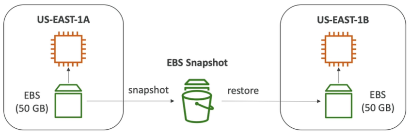
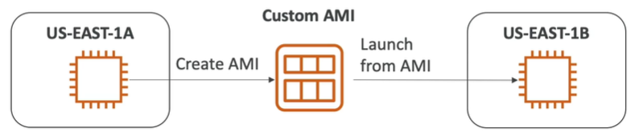

<h2>EC2 instance storage</h2>

**EBS(Elastic Block Store) Volume**
* An EC2 machine loses its root volume(main drive) when it is manually terminated
* Unexpected terminations might happen from time to time (AWS would email you)
* Sometimes, you need a way to store your instance data somewhere
* An EBS (Elastic Block Store) Volume is a network drive you can attach to your instances
  while they run.
* It allows your instances to persist data. E.g. database data.
* It's a network drive (i.e. not a physical drive)
    * It uses the network to communicate to the instance, which means there might be a bit
      of latency
    * It can be detached from an EC2 instance and attached to another one quickly.
* It's locked to an Availability Zone(AZ)
    * An EBS Volume in us-east-1a cannot be attached to us-east-1b
    * To move a volume across, you first need to snapshot it
* Have a provisioned capacity (size in GBs, and IOPS)
    * You get billed for all the provisioned capacity, not the amount you actually use.
    * You can increase the capacity of the drive over time, so it's a good idea to start
      small and increase the capacity as you need it.
* EBS Volumes come in 6 types
    * GP2/GP3 (SSD): General purpose SSD volume that balances price and performance for a
      wide variety of workloads.
        * Cost effective storage, low-latency
        * System boot volumes, virtual desktops, development and test environments
        * 1 GB - 16 TB
        * GP3 baseline of 3000 IOPS and throughput of 125 MB/s, can increase IOPS
          up to 16000 and throughput up to 1000 MB/s independently
        * GP2 small volumes can burst IOPS to 3000. Size of the volume and IOPS are
          linked, max IOPS is 16000. 3 IOPS per GB, so at 5334 GB we are at max IOPS.
    * IO1/IO2 (SSD): Highest-performance SSD volume for mission-critical low-latency or
      high-throughput workloads.
        * Critical business applications with sustained IOPS performance, or applications
          that need more than 16000 IOPS
        * Great for database workloads (sensitive to storage perf and consistency)
        * IO1/IO2:
            * 4 GB - 16 TB
            * Max PIOPS 64000 for Nitro EC2 instances & 32000 for other
            * Can increase PIOPS independently from storage size
            * IO2 have more durability and more IOPS per GB (at the same price as IO1, so makes
              sense to just use IO2 nowadays.)
        * IO2 block express (4 GB - 64 TB)
            * Sub-millisecond latency
            * Max PIOPS 256000 with an IOPS:GB ratio of 1000:1
        * Support EBS multi-attach
            * Attach the same EBS volume to multiple EC2 instances in the same AZ.
            * Each instance has full read & write permissions to the volume
            * Achieve higher application availability in clustered Linux applications
            * Applications must manage concurrent write operations
            * Must use a file system that's cluster-aware
    * STI (HDD): Low cost HDD volume designed for frequently accessed, throughput-intensive
      workloads.
        * Cannot be a boot volume
        * 125 MB to 16 TB
        * For big data, data warehouses, log processing
        * Max throughput 500 MB/s - max IOPS 500
    * SCI (HDD): Lowest cost HDD volume designed for less frequently accessed workloads.
        * For data that is infrequently accessed
        * Scenarios where lowest cost is important
        * Max throughput 250 MB/s - max IOPS 250
* EBS Volumes are characterized in Size | Throughput | IOPS (I/O Ops Per Sec)
* When in doubt always consult the AWS documentation.
* When you create an instance, then only GP2/GP3 and IO1/IO2 can be used as boot volumes

When you create an instance, then currently "Step 4: Add Storage" is where you can add an
EBS volume. Can select a snapshot you want to restore from.

Have to make the volume manually available. So have to mount it in the instance. AWS
has a guide on how to do that.

**EBS snapshots**
* Make a backup (snapshot) of your EBS volume at a point in time
* Not necessary to detach volume to do snapshot, but recommended
* Can copy snapshots across AZ or Region

**AMI (Amazon Machine Image)**
* AMI is a customization of an EC2 instance
    * You add your own software, configuration, operating system, monitoring etc.
    * Faster boot/configuration time because all your software is pre-packaged
* AMI is built for a specific region (and can be copied across regions)
* You can launch EC2 instances from:
    * A public AMI: AWS provided
    * Your own AMI: you make and maintain them yourself
    * An AWS marketplace AMI: an AMI someone else made (and potentially sells)

**AMI process**
* Start an EC2 instance and customize it
* Stop the instance (for data integrity)
* Build an AMI - this will also create EBS snapshots
* Launch instances from other AMIs

**EC2 instance store**
* EBS volumes are network drives with good but "limited" performance
* If you need a high performance hardware disc, use an EC2 instance store
    * Better I/O performance
    * Cleared after EC2 instance stopped (ephemeral)
    * Good for buffer/cache/scratch data/temporary content
    * Risk of data loss if hardware fails

**EFS (Elastic file system)**
* Managed NFS (network file system) that can be mounted on many EC2 instances
  across many AZs.
* Highly available, scalable, expensive (3x GP2), pay for what you use, so if you manage
  your data well, it might be cheaper.
* Use cases: content management, web serving, data sharing, Wordpress
* Uses NFSv4.1 protocol
* Uses security group to control access to EFS. Remember to add inbound rules so that
  the EC2 instances could actually access it.
* Compatible with Linux based AMI (not Windows)
* Encryption at rest using KMS
* POSIX file system (~Linux) that has a standard file API
* File system scales automatically, pay-per-use, no capacity planning
* 1000s of concurrent NFS clients, 10 GB+/s throughput
* Grow to petabyte-scale network file system automatically
* Performance mode (set at EFS creation time)
    * General purpose (default): latency-sensitive use cases (web server, CMS, etc)
    * Max I/O - higher latency, higher throughput, highly parallel (big data, media processing)
* Throughput mode
    * Bursting (1 TB = 50 MB/s + burst of up to 100 MB/s)
    * Provisioned: set your throughput regardless of storage size, ec: 1 GB/s for 1 TB storage
* Storage tiers (lifecycle management feature - move file after N days)
    * Standard: for frequently accessed files
    * Infrequent access (EFS-IA): cost to retrieve files, lower price to store
* You attach the EFS to the EC2 instances using the command line of the instances via SSH.
  Have to mount it and once you create a file into the mounted location, then it'll be shared
  between the instances.

**EBS vs EFS**
* EBS
    * Can be attached to only one instance at a time
    * Are locked at the Availability Zone (AZ) level
    * GP2: IO increases if the disk size increases
    * IO1: can increase IO independently
    * Migrating across AZ:
        * Take a snapshot
        * Restore the snapshot to another AZ
        * EBS backups use IO and you shouldn't run them while your application is handling
          a lot of traffic
    * Root EBS volumes of instances get terminated by default if the EC2 gets terminated.
      (you can disable this)
* EFS
    * Mount to multiple instances across AZ
    * EFS share website files
    * Only for Linux Instances
    * EFS has a higher price point than EBS
    * Can leverage EFS-IA for cost saving
* Instance store can be used to get massive IO, but you need a replication mechanism if you want
  persistence.
* The choice is: EFS vs EBS vs Instance store
