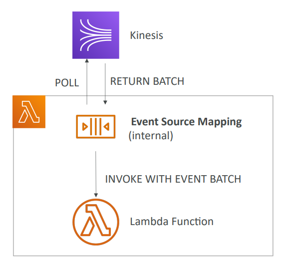
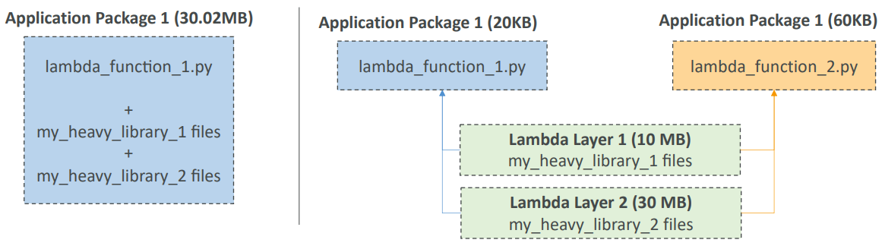
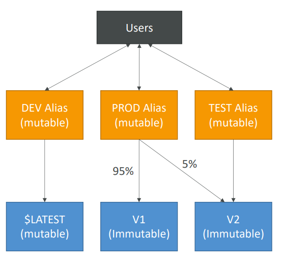
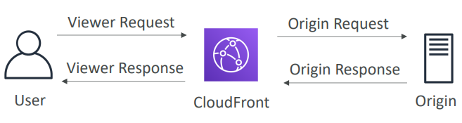

<h2>AWS Lambda</h2>
Serverless is a new paradigm in which the developers don't have to manage servers anymore.
They just deploy code. They just deploy functions. Initially serverless meant function as a service.
Now it means a lot more. Serverless was pioneered by AWS Lambda, but now also includes anything
that's managed. E.g. databases, messaging, storage etc. Serverless does not mean there are no
servers. It just means that you don't manage/provision/see them.

Serverless in AWS includes:
* AWS Lambda
* DynamoDB
* AWS Cognito
* AWS API Gateway
* Amazon S3
* AWS SNS & SQS
* AWS Kinesis Data Firehose
* Aurora Serverless
* Step functions
* Fargate

**AWS Lambda**
* Virtual functions - no servers to manage
* Limited by time - short executions
* Run on demand
* Scaling is automated
* Benefits
    * Easy pricing:
        * Pay per request and compute time
        * Free tier of 1,000,000 AWS Lambda requests and 400,000 GBs of compute time
    * Integrated with the whole AWS suite of services. Some main ones are:
        * API Gateway - to create a REST API that'll invoke our lambdas
        * Kinesis - to do some data transformations on the fly
        * DynamoDB - to create some triggers, so whenever something happens in our DB a lambda function will
          be triggered
        * S3 - a lambda function will be created on file event. Ex. a new file is created
        * CloudFront
        * CloudWatch Events EventBridge - whenever events happen in our infrastructure and we want to react to it
        * CloudWatch Logs - to stream these logs to wherever we want
        * SNS - to react to notifications in our SNS topic
        * SQS - to process messages in our SQS
        * Cognito - to react to whenever a user logs into your database
    * Integrated with many programming languages
    * Easy monitoring through AWS CloudWatch
    * Easy to get more resources per function (up to 10 GB of RAM)
    * Increasing RAM will also improve CPU and network
* Language support: Node.js, Python, Java, C#, Golang, Ruby, Custom Runtime API (community supported, example Rust)
    * Lambda container image
        * The container image must implement the Lambda runtime API
        * ECS/Fargate is preferred for running arbitrary Docker images
* Lambda is very cheap to run
    * Pay per calls:
        * First 1,000,000 requests are free
        * $0.20 per 1 million requests thereafter ($0.0000002 per request)
    * Pay per duration: (in increment of 1 ms)
        * 400,000 GB-seconds of compute time per month if FREE
        * == 400,000 seconds if function is 1 GB RAM
        * == 3,200,000 seconds if function is 128 MB RAM
        * After that $1.00 for 600,000 GB-seconds
* Synchronous invocations happen through CLI, SDK, API Gateway, Application Load Balancer
    * This means that the results are returned right away
    * Error handling must happen on the client side (retries, exponential backoff, etc.)
    * Synchronous invocation services:
        * User invoked:
            * Elastic Load Balancing (Application Load Balancer)
            * Amazon API Gateway
            * Amazon CloudFront (Lambda@Edge)
            * Amazon S3 Batch
        * Service invoked:
            * Amazon Cognito
            * AWS Step Functions
        * Other services:
            * Amazon Lex
            * Amazon Alexa
            * Amazon Kinesis Date Firehose
    * To expose a Lambda function as an HTTP(S) endpoint, you can use the Application Load
      Balance (or an API Gateway). The Lambda function must be registered in a target group.
    * ALB Multi-Header values
        * ALB can support multi header values (ALB setting)
        * When you enable multi-value headers, HTTP headers and query string parameters that are
          sent with multiple values are shown as arrays within the AWS Lambda event and response
          objects.
* Asynchronous invocations
    * S3, SNS, CloudWatch Events etc.
    * The events are placed in an Event Queue. Lambda tries to read the events from the Event
      Queue.
    * Lambda attempts to retry on errors.
        * 3 tries total. 1 minute wait after 1st, then 2 minutes wait.
        * Make sure the processing is idempotent (in case of retries the result is the same)
        * If the function is retried, you will see duplicate log entries in CloudWatch logs
        * Can define a DLQ (dead-letter queue) - SNS or SQS - for failed processing (need correct
          IAM permissions.)
        * Asynchronous invocations allow you to speed up the processing if you don't need to wait
          for the result (ex: you need 1000 files processed)
* Event source mapping
    * Kinesis Data Streams
    * SQS & SQS FIFO queue
    * DynamoDB streams
    * Common denominator: records need to be polled from the source
    * The lambda function is invoked synchronously
      
    * Streams & Lambda (Kinesis & DynamoDB)
        * An event source mapping creates an iterator for each shard, processes items in order
        * Start with new items, from the beginning or from timestamp
        * Processed items aren't removed from the stream (other consumers can read them)
        * If you have low traffic: use batch window to accumulate records before processing
        * For high traffic you can process multiple batches in parallel
            * Up to 10 batches per shard
            * In-order processing is still guaranteed for each partition key
              
        * Error handling
            * By default, if your function returns an error, the entire batch is reprocessed until
              the function succeeds, or the items in the batch expire
            * To ensure in-order processing, processing for the affected shard is paused until the
              error is resolved
            * You can configure the event source mapping to:
                * discard old events
                * restrict the number of retries
                * split the batch on error (to work around Lambda timeout issues)
            * Discarded events can go to a Destination
    * Event source mapping SQS & SQS FIFO
        * Event source mapping will poll SQS (long polling)
        * Specify batch size (1 - 10 messages)
        * Recommended: set the queue visibility timeout to 6x the timeout of your Lambda function
        * To use a DLQ set-up on the SQS queue, not Lambda (DLQ for Lambda is only for async invocations)
        * Or use lambda destination for failures
* Queues & Lambda
    * Lambda also supports in-order processing for FIFO (first-in, first-out) queues, scaling up to the
      number of active message groups.
    * For a standard queue, items aren't necessarily processed in order.
    * Lambda scales up to process a standard queue as quickly as possible.
    * When an error occurs, batches are returned to the queue as individual items and might be processed
      in a different grouping than the original batch.
    * Occasionally, the event source mapping might receive the same item from the queue twice, even if
      no function error occurred.
    * Lambda deletes items from the queue after they're processed successfully.
    * You can configure the source queue to send items to a dead-letter queue if they can't be processed.
* Lambda event mapper scaling
    * Kinesis data streams & DynamoDB streams
        * One lambda invocation per stream shard
        * If you use parallelization, up to 10 batches processed per shard simultaneously
    * SQS standard
        * Lambda adds 60 more instances per minute to scale up
        * Up to 1000 batches of message processed simultaneously
    * SQS Fifo
        * Messages with the same GroupID will be processed in order
        * The lambda function scales to the number of active message groups
* Destinations
    * Can configure to send result to a destination
    * Asynchronous invocations - can define destinations for successful and failed event:
        * Amazon SQS
        * Amazon SNS
        * AWS Lambda
        * Amazon EventBridge bus
    * AWS recommends you use destinations instead of DLQ now (but both can be used at the same time)
    * Event source mapping for discarded event batches send to:
        * Amazon SQS
        * Amazon SNS
    * You can send events to a DLQ directly from SQS
* Lambda execution role (IAM role)
    * Grants the Lambda function permissions to AWS service/resources
    * Sample managed policies for Lambda:
        * AWSLambdaBasicExecutionRole – Upload logs to CloudWatch.
        * AWSLambdaKinesisExecutionRole – Read from Kinesis
        * AWSLambdaDynamoDBExecutionRole – Read from DynamoDB Streams
        * AWSLambdaSQSQueueExecutionRole – Read from SQS
        * AWSLambdaVPCAccessExecutionRole – Deploy Lambda function in VPC
        * AWSXRayDaemonWriteAccess – Upload trace data to X-Ray.
    * When you use an event source mapping to invoke your function, Lambda uses the execution role
      to read event data.
    * Best practice: create one Lambda execution role per function
* Lambda resource based policies
    * Use resource-based policies to give other accounts and AWS services permission to user your
      Lambda resources
    * Similar to S3 bucket policies for S3 bucket
    * An IAM principal can access Lambda:
        * if the IAM policy attached to the principal authorizes it (e.g. user access)
        * if the resource-based policy authorizes (e.g. service access)
    * When an AWS service like Amazon S3 calls your Lambda function, the resource-based policy
      gives it access.
* Lambda environment variables
    * Environment variable is a key/value pair in string form
    * Adjust the function behavior without updating code
    * The environment variables are available to your code
    * Lambda service adds its own system environment variables as well
    * Helpful to store secrets (encrypted by KMS)
    * Secrets can be encrypted by the Lambda service key, or your own CMK
* Lambda logging & monitoring
    * CloudWatch logs
        * AWS Lambda execution logs are stored in AWS CloudWatch logs
        * Make sure your AWS lambda function has an execution role with an IAM policy that authorizes
          writes to CloudWatch logs
    * CloudWatch metrics
        * AWS lambda metrics are displayed in AWS CloudWatch metrics
        * Invocations, durations, concurrent executions
        * Error count, success rates, throttles
        * Async delivery failures
        * Iterator age (Kinesis & DynamoDB Streams)
    * Lambda tracing with X-Ray
        * Enable in Lambda configuration (active tracing)
        * Runs the X-Ray daemon for you
        * Use AWS X-Ray SDK in code
        * Ensure Lambda function has a correct IAM execution role
            * The managed policy is called AWSXRayDaemonWriteAccess
        * Environment variables to communicate with X-Ray
            * _X_AMZN_TRACE_ID: contains the tracing header
            * AWS_XRAY_CONTEXT_MISSING: by default, LOG_ERROR
            * AWS_XRAY_DAEMON_ADDRESS: the X-Ray Daemon IP_ADDRESS:PORT
* VPC
    * By default, your Lambda function is launched outside your own VPC (in an AWS-owned VPC). Therefore,
      it cannot access resources in your VPC (RDS, ElastiCache, internal ELB etc.)
    * You must define the VPC ID, the subnets and the security groups for your lambda
    * Lambda will create an ENI (Elastic Network Interface) in your subnets. To create this ENI, the
      lambda needs the AWSLambdaVPCAccessExecutionRole role
    * By default a lambda function in your VPC does not have internet access
    * Deploying a lambda function in a public subnet does not give it internet access or a public IP
    * A NAT Gateway/Instance can be used to get internet access for a lambda in a private subnet
    * You can use VPC endpoints to privately access AWS services without a NAT
    * Lambda - CloudWatch logs work even without endpoint or NAT gateway
* Performance
    * RAM
        * From 128 MB to 10 GB in 1 MB increments
        * The more RAM you add, the more vCPU credits you get
        * At 1792 MB, a function has the equivalent of one full vCPU
        * After 1792 MB, you get more than one CPU, and need to use multi-threading in your code to
          benefit from it
    * If your application is CPU-bound (computation heavy), increase RAM
    * Timeout: default 3 seconds, maximum is 900 seconds (15 minutes), so anything below 15 minutes is
      a good use case for lambda.
    * Execution Context
        * The execution context is a temporary runtime environment that initializes any external dependencies
          of your lambda code
        * Great for database connections, HTTP clients, SDK clients etc.
        * The execution context is maintained for some time in anticipation of another lambda function
          invocation.
        * The next function invocation can "re-use" the context to execution time and save time in
          initializing connections objects.
        * The execution context includes the /tmp directory to which you can write files which would
          then be available across executions
            * If your lambda function needs to download a big file to work, put it there
            * If your lambda function needs disk space to perform operations, use this
            * Max size is 512 MB
            * The directory content remains when the execution context is frozen, providing transient
              cache that can be used for multiple invocations (helpful to checkpoint your work)
            * For permanent persistence of object (non temporary), use S3
        * Initialize things outside the handler. Anything that takes a lot of time to initialize, put
          it outside of your function handler.
* Concurrency
    * Concurrency limit: up to 1000 concurrent executions
        * If you need a higher limit, open a support ticket
    * Can set a "reserved concurrency" at the function level (=limit how many lambdas can execute
      concurrently)
    * Each invocation over the concurrency limit will trigger a "Throttle"
    * Throttle behavior:
        * If synchronous invocation => return ThrottleError - 429
        * If asynchronous invocation => retry automatically and then go to DLQ
    * If you don't reserve (=limit) concurrency, then one app might take away all of the pool and
      the other apps will get throttled.
    * Asynchronous invocations
        * If the function doesn't have enough concurrency available to process all events, additional
          requests are throttled.
        * For throttling errors (429) and system errors (500-series), Lambda returns the event to the
          queue and attempts to run the function again for up to 6 hours.
        * The retry interval increases exponentially from 1 second after the first attempt to a maximum
          of 5 minutes
    * Cold start:
        * New instance => code is loaded and code outside the handler run (init)
        * If the init is large (code, dependencies, SDK etc.) this process can take some time.
        * First request served by new instances has higher latency than the rest.
    * Provisioned concurrency:
        * Concurrency is allocated before the function is invoked (in advance). So the cold start never
          happens and all invocations have low latency.
        * Application Auto Scaling can manage concurrency (schedule or target utilization)
* Dependencies
    * If your lambda function depends on external libraries: for example AWS X-Ray SDK, Database clients, etc.,
      then you need to install the packages alongside your code and zip it together.
    * Upload the zip straight to Lambda if less than 50 MB, else to S3 first
    * Native libraries work: they need to be compiled on Amazon Linux
    * AWS SDK comes by default with every Lambda function, so don't need to package it
* CloudFormation
    * Can use CloudFormation to upload a lambda function.
        * One way is to include it inline in our CloudFormation template.
            * This is for very simple functions
            * Use the Code.ZipFile property
            * You cannot include function dependencies with inline functions
        * Another is to use a zip file through S3
            * You must store the lambda zip in S3
            * You must refer to the S3 zip location in the CloudFormation code
                * S3Bucket, S3Key: full path to zip, S3ObjectVersion: if versioned bucket
            * If you update the code in S3, but don't update S3Bucket, S3Key, or S3ObjectVersion,
              CloudFormation won't update your function
            * Can use S3 zip from another account to deploy. Need to have the bucket policy in place for
              the account with the S3, and an execution role for the account that's trying to access it.
* Layers
    * Allows you to create custom runtimes for lambda
    * Allows you to externalize dependencies to re-use them
      
* Container images
    * Deploy Lambda function as container images of up to 10 GB from ECR
    * Pack complex dependencies, large dependencies in a container
    * Base image must implement the Lambda Runtime API
    * Base images are available for Python, Node.js, Java, .NET, Go, Ruby
    * Can create your own image as long as it implements the Lambda Runtime API
    * Test the containers locally using the Lambda Runtime Interface Emulator
    * Unified workflow to build apps. No matter if it's for ECS or Lambda, you can build and publish
      the containers the same way and send them to ECR, from where you deploy to where you need.
* Lambda versions
    * When you work on a Lambda function, we work on $LATEST, which is mutable
    * When we're ready to publish a lambda function, we create a version
    * Versions are immutable
    * Versions have increasing version numbers
    * Versions get their own ARN (Amazon Resource Name)
    * Version = code + configuration (nothing can be changed - immutable)
    * Each version of the lambda function can be accessed
    * Aliases are "pointers" to Lambda function versions
    * We can define a "dev", "test", "prod" alias and have them point to different lambda versions
    * Aliases are mutable
    * Aliases enable Blue/Green deployment by assigning weights to lambda functions
    * Aliases enable stable configuration of our event triggers/destinations
    * Aliases have their own ARNs
    * Aliases cannot reference aliases
      
* CodeDeploy
    * CodeDeploy can help you automate traffic shift for Lambda aliases
    * Feature is integrated within the SAM framework
    * Linear: grow traffic every N minutes until 100%
        * Linear10PercentEvery3Minutes
        * Linear10PercentEvery10Minutes
    * Canary: try X percent then 100%
        * Canary10Percent5Minutes
        * Canary10Percent30Minutes
    * AllAtOnce: immediate
    * Can create Pre & Post traffic hooks to check the health of the Lambda function
* Limits
    * Execution:
        * Memory allocation: 128 MB - 10 GB (1 MB increments)
        * Maximum execution time: 900 seconds (15 minutes)
        * Environment variables (4 KB)
        * Disk capacity in the "function container" (in /tmp): 512 MB
        * Concurrency executions: 1000 (can be increased)
    * Deployment:
        * Lambda function deployment size (compressed .zip): 50 MB
        * Size of uncompressed deployment (code + dependencies): 250 MB
        * Can use the /tmp directory to load other files at startup
        * Size of the environment variables: 4 KB
* Best practices
    * Perform heavy-duty work outside your function handler
        * Connect to databases outside your function handler
        * Initialize the AWS SDK outside your function handler
        * Pull in dependencies or datasets outside your function handler
    * Use environment variables for
        * Database Connection Strings, S3 bucket, etc. don't put these values in your code
        * Passwords, sensitive values etc. they can be encrypted using KMS
    * Minimize your deployment package size to its runtime necessities
        * Break down the function if need be
        * Remember the AWS lambda limits
        * Use layers where necessary
    * Avoid using recursive code, never have a lambda function call itself

**Lambda@Edge**
* You have deployed a CDN using CloudFront. What if you wanted to run a global AWS lambda
  alongside or how to implement request filtering before reaching your application? Can use
  Lambda@Edge for this.
    * Deploy Lambda functions alongside your CloudFront CDN
    * Build more responsive applications
    * You don't manage servers, Lambda is deployed globally
    * Customize the CDN content
    * Pay only for what you use
* You can use Lambda to change CloudFront requests and responses
    * After CloudFront receives a request from a viewer (viewer request)
    * Before CloudFront forwards the request to the origin (origin request)
    * After CloudFront receives the response from the origin (origin response)
    * Before CloudFront forwards the response to the viewer (viewer response)
      
    * You can also generate responses to viewers without ever sending the request to the origin
* Use cases:
    * Website security and privacy
    * Dynamic web application at the edge
    * Search engine optimization (SEO)
    * Intelligently route across origins and data centers
    * Bot mitigation at the edge
    * Real-time image transformation
    * A/B testing
    * User authentication and authorization
    * User prioritization
    * User tracking and analytics