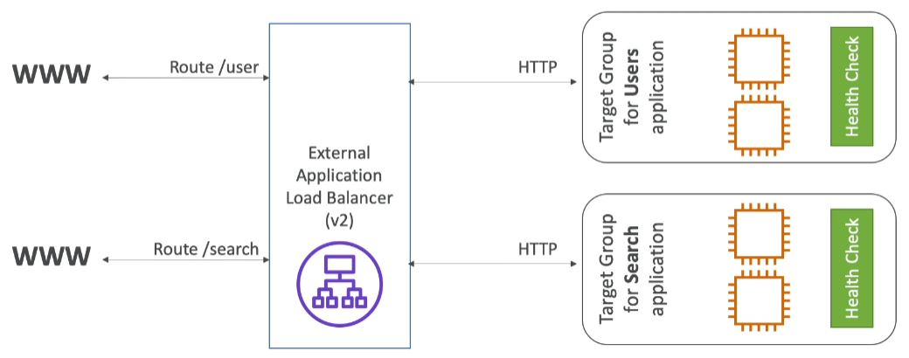
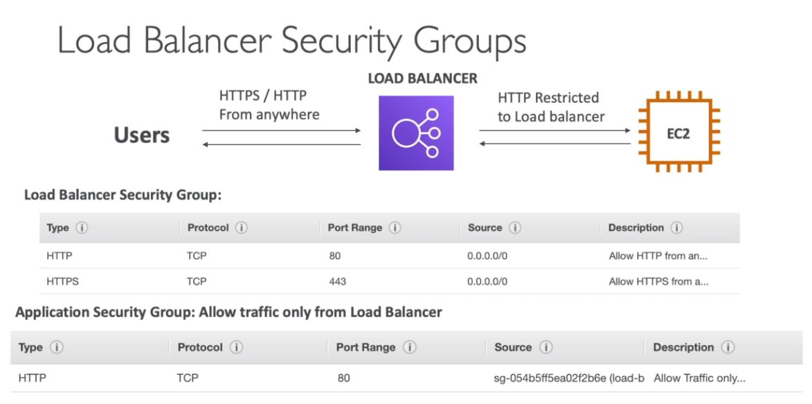
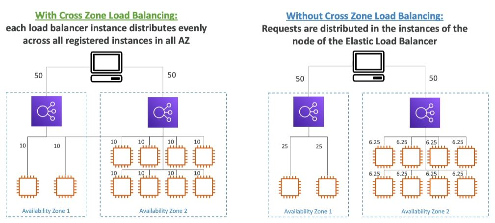
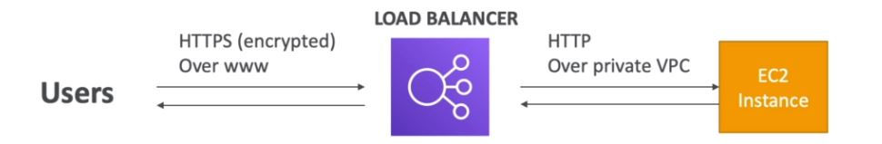
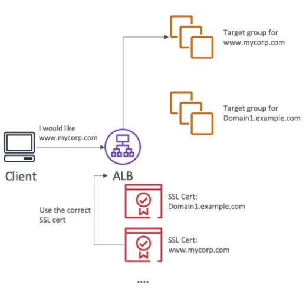
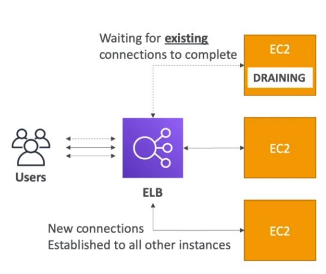

<h4>Load balancing</h4>
Load balances are servers that forward internet traffic to multiple servers
(EC2 Instances) downstream. It does regular health checks to your instance.
It provides high availability across zones. It cleanly separates public
traffic from private traffic.

The reasons for using an EC2 Load Balancer are:
* Spread load across multiple downstream instances
* Expose a single point of access (DNS) to your application
* Seamlessly handle failures of downstream instances
* Provide SSL termination (HTTPS) on your websites
* Separate public traffic from private traffic
* An ELB (EC2 Load Balancer) is a managed load balancer, which means
    * AWS guarantees that it will be working
    * AWS takes care of upgrades, maintenance, high availability
    * AWS provides only a few configuration knobs
* It costs less to setup your own load balancer, but it will be a lot more
  effort on your end.
* It is integrated with many AWS offerings/services.

The health checks are run on a specific port and route. (/health is common)
If the response is not 200, then the instance is deemed unhealthy.

AWS has 3 kinds of managed Load Balancers
* Classic Load Balancer (v1 - old generation) - 2009
    * HTTP, HTTPS (Layer 7), TCP (Layer 4)
    * Health checks are TCP or HTTP based
    * Fixed hostname XXX.region.elb.amazonaws.com
* Application Load Balancer (v2 - new generation) - 2016
    * HTTP, HTTPS, WebSocket (Layer 7)
    * Load balancing to multiple HTTP applications across machines (target groups)
    * Load balancing to multiple applications on the same machine (ex. containers)
    * Support redirects (from HTTP to HTTPS for example)
    * Routing tables to different target groups:
        * Routing based on path in URL (example.com/**users** and example.com/**posts**)
        * Routing based on hostname in URL (**one.example.com** and **other.example.com**)
        * Routing based on query string, headers (example.com/users?**id=123&order=false**)
    * ALB is a great fit for micro services & container based applications (ex. Docker and Amazon ECS)
    * Has a port mapping feature to redirect to a dynamic port in ECS.
    * Can control where traffic goes from the `Listeners` tab.
    * Target groups
        * EC 2 instances (can be managed by an Auto Scaling Group) - HTTP
        * ECS tasks (managed by ECS itself) - HTTP
        * Lambda functions - HTTP request is translated into a JSON event
        * IP addresses - must be private IPs
        * ALB can route to multiple target groups
        * Health checks are at the target group level
          

* Network Load Balancer (v2 - new generation) - 2017
    * TCP, TLS (secure TCP), UDP (Layer 4)
        * Forward TCP & UDP traffic to your instances
        * Handle millions of requests per second. Higher performance than ALB.
        * Less latency ~100 ms (vs 400 ms for ALB)
    * NLB has one static IP per AZ, and supports assigning Elastic IP (helpful for
      whitelisting specific IP). ALB and CLB do not have a static IP.
    * NLB are used for extreme performance/TCP or UDP traffic.
    * Not included in the AWS free tier
    * With NLBs, the instances do not see traffic coming from the NLB, but they see it as
      coming from the outside. Have to add a rule to allow TCP traffic from anywhere.
* Gateway load balancer - 2020 - GWLB
    * Operates at layer 3 (network layer) - IP protocol
* Overall it's better to use V2 as they provide newer features.
* You can setup interval(private) or external(public) ELBs.

The source references the load balancer security group ID.

**Load balancer good to know**
* LBs can scale but not instantaneously - contact AWS for a "warm-up"
* Troubleshooting
    * 4xx errors are client induced errors
    * 5xx errors are application induced errors
    * Load Balancer Errors 503 means at capacity or no registered target
    * If the LB can't connect to your application, check your security groups
* Monitoring
    * ELB access logs will log all access requests
    * CloudWatch Metrics will give you aggregate statistics

With the load balancer, you'd turn off access to your EC2 access directly.
So HTTP traffic would only be allowed if it's coming from the ELB and not
directly from the client.

**Application load balance (v2) target groups**
* EC2 instances (can be managed by an Auto Scaling Group) - HTTP
* ECS tasks (managed by ECS itself) - HTTP
* Lambda functions - HTTP request is translated into a JSON event
* IP Addresses - must be private IPs
* Health checks are at the target group level

**ALB v2 good to know**
* Fixed hostname (XXX.region.elb.amazonaws.com)
* The application servers don't see the IP of the client directly
    * The true IP of the client is inserted in the header X-Forwarded-For
    * We can also get Port (X-Forwarded-Port) and protocol (X-Forwarded-Proto)

**ALB Configuring**
1) Open EC2 configuration, go into load balancers, select Application Load Balancer.
2) Configure the generic information, then select the AZs you want it to work in.
3) Check your target group after configuring to make sure instances are there. Target group
   defines the instances that it applies to.

**Load balancer stickiness**
* It is possible to implement stickiness so that the same client is always redirected to
  the same instance behind a load balancer
* Works for CLB and ALB
* Uses a cookie for this
    * Application-based cookies
        * Duration specified by the application
        * Custom cookie
            * Generated by the target
            * Can include any custom attributes required by the application
            * Cookie name must be specified individually for each target group
        * Application cookie
            * Generated by the load balancer
            * Cookie name is AWSALBAPP
    * Duration-based cookies
        * Cookie generated by the load balancer
        * Duration specified by the load balancer
        * Cookie name is AWSALB for ALB, AWSELB for CLB
* Use case: make sure the user doesn't lose his session data
* Enabling stickiness may bring imbalance to the load over the backend EC2 instances
* It can be set under `Load Balancing -> Target Groups -> Attributes -> Stickiness`
* When you access the site, then the first request that reaches an EC2 instance decides which
  EC2 you get stuck on. It then has an expiration time, after which a new EC2 instance is chosen.

**Cross-zone load balancing**

* CLB - disabled by default via CLI/API, enabled by default via console,
  no charges for inter AZ data if enabled
* ALB - always on (can't be disabled), no charges for inter AZ data
* NLB - disabled by default, you pay charges for inter AZ data if enabled

**SSL certificates**
* SSL/TLS basics
    * An SSL certificate allows traffic between your clients and your load balancer to be
      encrypted in transit (in-flight encryption)
    * SSL refers to Secure Sockets Layer, used to encrypt connections
    * TLS refers to Transport Layer Security, which is a newer version
    * Nowadays, TLS certificates are mainly used, but people still refer as SSL
    * Public SSL certificates are issued by Certificate Authorities (CA)
    * SSL certificates have an expiration date (you set) and must be renewed
      
    * The load balancer uses an X.509 certificate (SSL/TLS server certificate)
    * You can manage certificates using ACM (AWS Certificate Manager)
    * You can upload your own certificates to ACM alternatively
    * When you set up a HTTPS listener, then:
        * You must specify a default certificate
        * You can add an optional list of certs to support multiple domains
        * Clients can use SNI (Server Name Indication) to specify the hostname they reach.
        * Ability to specify a security policy to support older versions of SSL / TLS (legacy clients)
* SNI
    * SNI solves the problem of loading multiple SSL certificates onto one web server
      (to serve multiple websites)
    * It's a newer protocol, and requires the client to indicate the hostname of the target
      server in the initial SSL handshake
    * The server will then find the correct certificate, or return the default one
    * Only works for ALB & NLB (newer generation), CloudFront
      
* You can setup SSL under listeners under load balancers. You specify HTTPS, cipher, which is
  the protocols we want to support, and then setup the certificate.

**ELB - Connection Draining**
* Feature naming:
    * For CLBs: Connection draining
    * For ALBs and NLBs: Target Group: Deregistration delay
* It is the time to complete 'in-flight requests' while the instance is de-registering or
  unhealthy. That is it waits for existing connections to complete. The default is 300 seconds.
* When the instance is in deregistring mode then the load balancer stops sending new requests
  to the instance which is deregistring.
* Between 1 to 3600 seconds, default is 300 seconds. Can be disabled by setting it to 0.
* Set to a low value if your requests are short. E.g. you don't expect any request to last more
  than 20 seconds, then set it to 20 seconds.
  

**Auto scaling groups (ASG)**
* In real-life, the load on your websites and applications can change.
* The goal of an Auto Scaling Group (ASG) is to:
    * Scale out (add EC2 instances) to match an increased load.
    * Scale in (remove EC2 instances) to match a decreased load.
    * Ensure we have a minimum and a maximum number of machines running. The point being that
      it wouldn't scale too high or too low, so you set an upper and lower limit to how many machines
      should/can be run.
    * Automatically register new instances to a load balancer.
    * Size parameters:
        * minimum size (the number of instances you'll have running for sure)
        * actual size / desired capacity (the number of instances running at the current moment)
        * maximum size (how many instances can be added to scale out)
* ASGs have the following attributes:
    * A launch configuration:
        * AMI + Instance type
        * EC2 User Data
        * EBS Volumes
        * Security Groups
        * SSH Key Pair
    * Min size / Max size / Initial capacity
    * Network + subnets information
    * Load balancer information
    * Scaling policies
* It is possible to scale an ASG based on CloudWatch alarms.
* An alarm monitors a metric (such as Average CPU)
* Metrics are computed for the overall ASG instances.
* Based on the alarm:
    * We can create scale-out policies (increase the number of instances)
    * We can create scale-in policies (decrease the number of instances)
* With the new ASGs you can define "better" auto scaling rules that are directly managed
  by EC2. These are the new rules. They're better in the sense that they are easier to set
  up and can make more sense.
    * Target average CPU usage
    * Number of requests on the ELB per instance
    * Average network in
    * Average network out
* We can auto scale based on a custom metric (ex. number of connected users, users' schedule)
    1) We send our custom metric from application on EC2 to CloudWatch (PutMetric API)
    2) Create CloudWatch alarm to react to low/high values
    3) Use the CloudWatch alarm as the scaling policy for ASG
* ASGs use launch configurations or launch templates (newer)
* To update an ASG, you must provide a new launch configuration/launch template
* IAM roles attached to an ASG will get assigned to EC2 instances
* ASGs are free. You pay for the underlying resources being launched
* Having instances under an ASG means that if they get terminated for whatever reason, then
  the ASG will automatically create new ones for replacement, providing extra safety.
* ASG can terminate instances marked as unhealthy by a load balancer (and hence replace them)

**ASG - Scaling Policies**
* Target tracking scaling
    * Most simple and easy to set up
    * Example: I want the average ASG CPU to stay at around 40%
* Simple/Step scaling
    * When a CloudWatch alarm is triggered (example CPU > 70%), then add 2 units
    * When a CloudWatch alarm is triggered (example CPU < 30%), then remove 1 unit
* Scheduled Actions
    * Anticipate a scaling based on known usage patterns
    * Example: increase the min capacity to 10 at 5 pm on Fridays
* Predictive scaling - continuously forecast load and schedule scaling ahead using machine learning.
* Good metrics to scale on
    * CPUUtilization - average CPU utilization across your instances
    * RequestCountPerTarget - number of requests per EC2 instance is stable
    * Average network I/O
    * Any custom metric using Cloudwatch

**ASG - Scaling Cooldowns**
* The cooldown period helps to ensure that your Auto Scaling Group doesn't launch or
  terminate additional instances before the previous scaling activity takes effect
* In addition to default cooldown for Auto Scaling Group, we can create cooldowns
  that apply to a specific simple scaling policy
* A scaling-specific cooldown period overrides the default cooldown period.
* One common use for scaling-specific cooldowns is with a scale-in policy - a policy that
  terminates instances based on a specific criteria or metric. Because this policy terminates
  instances, Amazon EC2 Auto Scaling needs less time to determine whether to terminate additional
  instances.
* If the default cooldown period of 300 seconds is too long - you can reduce costs by
  applying a scaling-specific cooldown period of 180 seconds to the scale-in policy
* If your application is scaling up and down multiple times each hour, modify the ASG
  cooldown timers and the CloudWatch alarm period that triggers the scale in.
