<h2>AWS Integration & Messaging</h2>
** Amazon SNS - Simple notification service**
* What if you want to send one message to many receivers?
  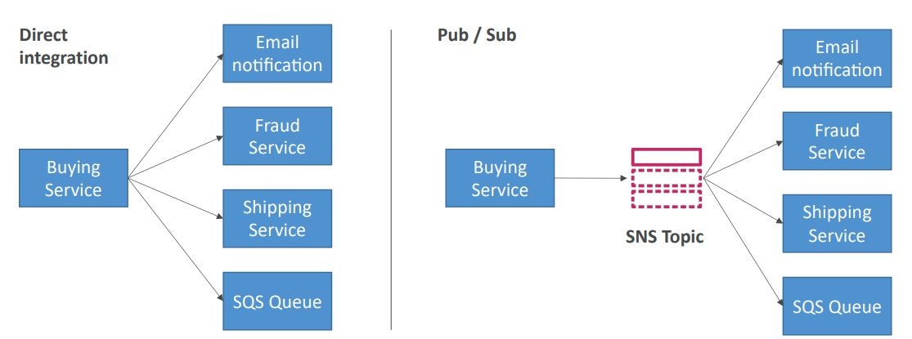
* The event producer only sends a message to one SNS topic
* As many event receivers (subscriptions) as we want to listen to the SNS
  topic notifications
* Each subscriber to the topic will get all the messages (note: new
  feature to filter messages)
* Up to 10,000,000 subscriptions per topic
* 100,000 topics limit
* Subscribers can be:
    * SQS
    * HTTP/HTTPS (with delivery retries - how many times)
    * Lambda
    * Emails
    * SMS messages
    * Mobile notifications
* Many AWS services can send data directly to SNS for notifications:
  CloudWatch (for alarms), Auto scaling groups notifications,
  Amazon S3 (on bucket events), CloudFormation (upon state changes =>
  failed to build etc.) etc.
* How to publish
    * Topic publish (using the SDK)
        * Create a topic
        * Create a subscription (or many)
        * Publish to the topic
    * Direct publish (for mobile apps SDK)
        * Create a platform application
        * Create a platform endpoint
        * Publish to the platform endpoint
        * Works with Google GCM, Apple APNS, Amazon ADM etc.
* Security
    * Encryption
        * In-flight encryption using HTTPS API
        * At-rest encryption using KMS keys
        * Client side encryption if the client wants to perform encryption/decryption
          itself
    * Access controls - IAM policies to regulate access to the SNS API
    * SNS access policies (similar to S3 bucket policies)
        * Useful for cross-account access to SNS topics
        * Useful for allowing other services (S3 etc.) to write to an SNS topic
* FIFO topic
    * First in first out (ordering of messages in the topic)
    * Similar features as SQS FIFO
        * Ordering by message group ID (all messages in the same group
          are ordered)
        * Deduplication using a deduplication ID or content based deduplication
    * Can only have SQS FIFO queues as subscribes
    * Limited throughput (same throughput as SQS FIFO)
* Message filtering
    * JSON policy used to filter messages sent to SNS topic's subscriptions
    * If a subscription doesn't have a filter policy, it receives every message
      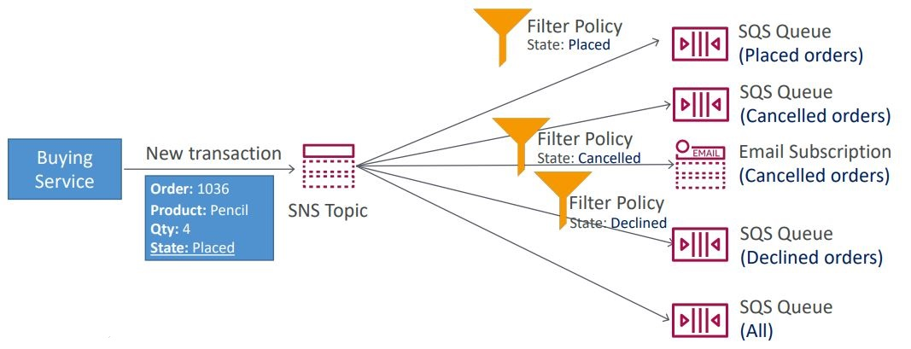

**Amazon SQS - Standard queue**
* Oldest offering (over 10 years old)
* Fully managed service, used to decouple applications
* Attributes
    * Unlimited throughput, unlimited number of messages in queue
    * Messages are short-lived - default retention of messages is 4 day,
      maximum of 14 days
    * Low latency (<10 ms on publish and receive)
    * Limitation of 256 kb per message sent
* Can have duplicate messages (at least once delivery, occasionally)
* Can have out of order messages (best effort ordering)
* Producing messages
    * Produced to SQS using the SDK (SendMessage API)
    * The message is persisted in SQS until a consumer deletes it
    * Message retention default 4 days, up to 14 days
    * Example: send an order to be processed
        * Order id
        * Customer id
        * Any attributes you want
    * SQS standard: unlimited throughput
* Consuming messages
    * Consumers (running on EC2 instances, servers, or AWS lambda etc.)
    * Poll SQS for messages (receive up to 10 messages at a time)
    * Process the messages (example: insert the message into an RDS DB)
    * Delete the messages using the DeleteMessage API
* Multiple EC2 instance consumers
    * Consumers receive and process messages in parallel
    * At least once delivery
    * Best-effort message ordering
    * Consumers delete messages after processing them
    * We can scale consumers horizontally to improve throughput of processing
* SQS with ASG
    * Use a CloudWatch Metric of queue length to decide whether new instances are needed
      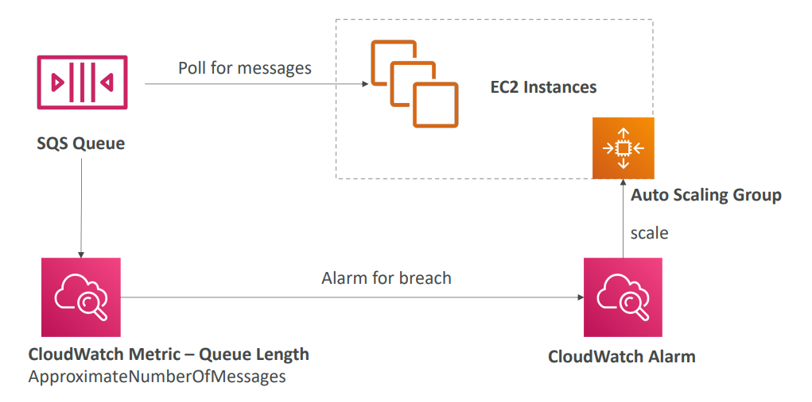
* SQS to decouple between application tiers
    * E.g. video processing might take very long, so it's easier to delegate it to
      another app that's attached to a queue.
      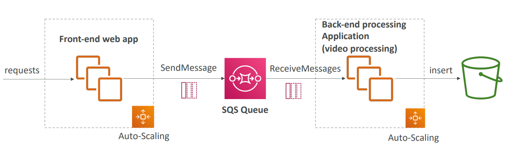
* Amazon SQS - Security
    * Encryption:
        * In-flight encryption using HTTPS API
        * At-rest encryption using KMS keys
        * Client-side encryption if the client wants to perform
          encryption/decryption itself
    * Access controls: IAM policies to regulate access to the SQS API
    * SQS access policies (similar to S3 bucket policies)
        * Useful for cross-account access to SQS queues
        * Useful for allowing other services (SNS, S3, etc.) to write
          to an SQS queue
* SQS - Message Visibility Timeout
    * After a message is polled by a consumer, it becomes invisible
      to other consumers
    * By default, the "message visibility timeout" is 30 seconds
    * That means the message has 30 seconds to be processed
    * After the message visibility timeout is over, the message is
      "visible" in SQS
    * If a message is not processed within the visibility timeout, it
      will be processed twice
    * If the consumer knows that the processing will take longer, then
      it can call the ChangeMessageVisibility API to get more time
    * If visibility timeout is high (hours), and the consumer crashes,
      then re-processing will take a lot of time due to the message being
      invisible
    * If visibility timeout is too low (seconds), we may get duplicate
      processing
    * So the visibility timeout should be set to something reasonable for
      your application
* Dead Letter Queue
    * If a consumer fails to process a message within the Visibility Timeout
      then the message goes back to the queue
    * We can get a threshold of how many times a message can go back to
      the queue
    * After the MaximumReceives threshold is exceeded, the message goes into
      a dead letter queue (DLQ)
    * Useful for debugging
    * Make sure to process the messages in the DLQ before they expire:
        * Good to set a retention of 14 days in the DLQ
    * It's another queue that you create with the purpose of being a DLQ.
      You then go back to your initial queue and specify that a DLQ is enabled,
      after that you specify the dead letter queue ARN.
* Delay queue
    * Delay a message (consumers don't see it immediately) up to 15 minutes
    * Default is 0 seconds (message is available right away)
    * Can set a default at queue level
    * Can override the default on send using the DelaySeconds parameter
* Long polling
    * When a consumer requests messages from the queue, it can optionally
      "wait" for messages to arrive if there are none in the queue. This is
      called long polling.
    * Long Polling decreases the number of API calls made to SQS while
      increasing the efficiency and latency of your application
    * The wait time can be between 1 sec to 20 sec (20 sec preferable)
    * Long polling is preferable to short polling (which is constant querying)
    * Long polling can be enabled at the queue level or at the API level
      using WaitTimeSeconds
* Extended client
    * Message size limit is 256 KB, how to send large messages, e.g. 1 GB?
    * Using the SQS Extended Client (Java library)
    * It uses an S3 bucket for large data
    * Small metadata message will be sent to the queue and the file itself
      will be uploaded to S3.
      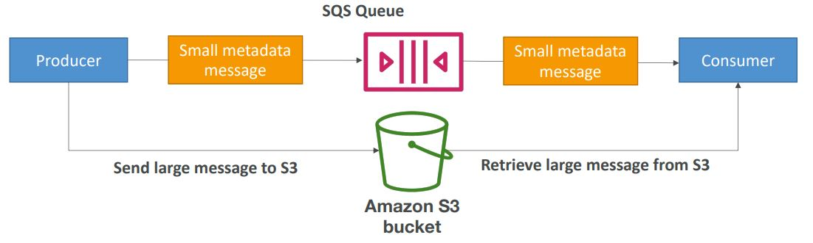
* Must know API
    * CreateQueue - creates a queue. MessageRetentionPeriod can be used to
      set how long a message should be kept in the queue
    * DeleteQueue - deletes a queue and all the messages in the queue at the
      same time
    * PurgeQueue - deletes all the messages in the queue
    * SendMessage - to send messages. Use the DelaySeconds to set a delay for
      the message.
    * ReceiveMessage - to do polling
    * DeleteMessage - to delete a message
    * MaxNumberOfMessages - how many messages a consumer can receive at one
      time. The default is set to 1. Maximum can be 10 (for ReceiveMessage API)
    * ReceiveMessageWaitTimeSeconds - for long polling. Tells the consumer how
      long to wait before getting a response from the queue.
    * ChangeMessageVisibility - change the message timeout in case you need
      more time to process the message.
    * Batch APIs can be used for SendMessage, DeleteMessage, ChangeMessageVisibility
      to help decrease the number of API calls and thus the cost.
* FIFO queue
    * FIFO - first in first out (ordering of messages in the queue)
    * Since we are guaranteeing the order, then there is limited throughput
      at 300 messages/second without batching, 3000 messages/second with
    * Exactly once send capability (by removing duplicates).
    * Messages are processed in order by the consumer
    * Deduplication
        * Deduplication interval is 5 minutes. So if you send a duplicate
          message within that window, then that duplicate message will be
          refused.
        * Two de-duplication methods:
            * Content based deduplication - will do an SHA-256 hash of the
              message body.
            * Explicitly provide a message deduplication ID.
    * Message grouping
        * If you specify the same value of MessageGroupID in an SQS FIFO
          queue, you can only have one consumer, and all the messages are
          in order for that one consumer.
        * To get ordering at the level of a subset of messages, specify
          different values for MessageGroupID
            * Messages that share a common Message Group ID will be in
              order within the group.
            * Each group can have a different consumer (parallel processing)
            * Ordering across groups is not guaranteed
* Ordering data in SQS
    * For SQS standard, there is no ordering.
    * For SQS FIFO, if you don't use a group ID, messages are consumed in the order
      they are sent, with only one consumer.
    * You want to scale the number of consumers, but you want messages to be "grouped"
      when they are related to each other. Then you use a Group ID (similar to partition key
      in Kinesis)

** SNS + SQS: Fan out **
* Push once to SNS, receive in all SQS queues that are subscribers.
  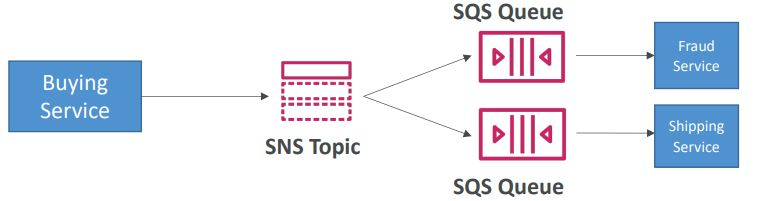
* It's a fully decoupled model and there is no data loss.
* SQS allows for data persistence, delayed processing and retries of work
* Ability to add more SQS subscribers over time
* Make sure your SQS queue access policy allows for SNS to write
* Application: S3 events to multiple queues
    * For the same combination of event type (e.g. object create) and
      prefix (e.g. images/), you can only have one S3 event rule
    * If you want to send the same S3 event to many SQS queues, use fan-out
      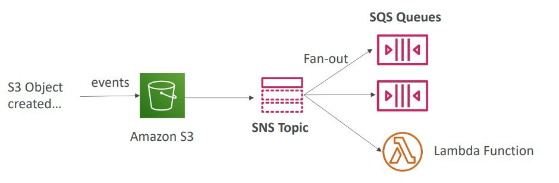
* SNS FIFO + SQS FIFO: Fan out
    * In case you need fan out + ordering + deduplication

**Kinesis**
* Makes it easy to collect, process, and analyze streaming data in real-time
* Ingest real-time data such as application logs, metrics, website clickstreams,
  IoT telemetry data etc.
* Kineses data streams - capture, process, and store data streams
    * Stream big data
    * Stream consists of shards that you have to provision ahead of time.
      Can scale the number of shards.
    * Partition key determines which shard will the data go to. Data blob
      is the data itself
    * The speed is 1 MB/sec per shard or 1000 messages/sec per shard. So
      if you have 6 shards, then 6 MB/sec or 6000 messages/sec
    * Billing is per shard provisioned, can have as many shards as you want
    * Retention between 1 day (default) to 365 days. It's not meant to be
      a durable data store, it's just meant to have data streamed through it.
    * Ability to reprocess (replay) data
    * Once data is inserted in Kinesis, it can't be deleted (immutability)
    * Data that shares the same partition goes to the same shard (ordering)
      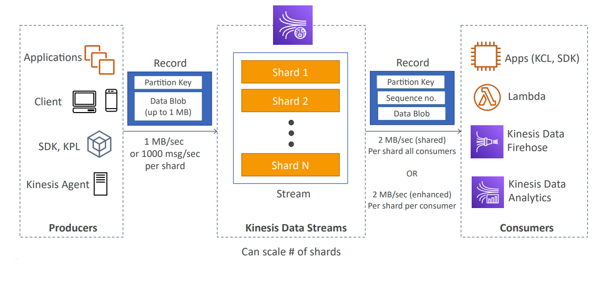
    * Producers: AWS SDK, Kinesis Producer Library (KPL), Kinesis Agent
        * Puts data records into data streams
        * Data record consist of
            * Sequence number (unique per partition-key within shard)
            * Partition key (must specify while putting records into stream)
            * Data blob (up to 1 MB)
        * Producers:
            * AWS SDK: simple producer
            * Kinesis producer library (KPL): C++, Java, batch, compression, retries
            * Kinesis agent: monitor log files
        * Write throughput: 1 MB/sec or 1000 records/sec per shard
        * PutRecord API is used to send data into Kinesis
        * Use batching with PutRecords API to reduce costs & increase throughput
        * So the way that producers work is as follows. We specify a partition key.
          The partition key is put into a hash function to determine a shard key. This
          chooses into which shard to send the data, not the producer. But all the
          data that shares the same partition key goes into the same shard, however,
          you can't specify which shard it goes into. You have to make sure that you choose
          a partition key that is distributed enough. If one device is extremely chatty, then
          it might overwhelm a shard. So use a highly distributed partition key to avoid
          "hot partition".
          
        * ProvisionedThroughputExceeded error
            * If you go over the 1 MB/sec limit to a shard, then you'll get a
              ProvisionedThroughputExceeded error. The solution is to use a highly
              distributed partition key.
            * Implement retries with exponential backoff
            * Increase number of shards (scaling)
              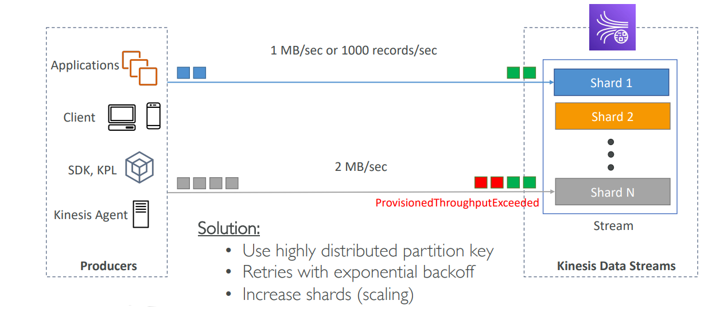
    * Consumers: Write your own with Kinesis Client Library (KCL), AWS SDK,
      or use a managed one with AWS Lambda, Kinesis Data Firehose, Kinesis Data
      Analytics.
        * Get data records from data streams and process them
        * AWS Lambda
            * Supports classic and enhanced fan-out consumers
            * Read records in batches
            * Can configure batch size and batch window
            * If error occurs, Lambda retries until succeeds or data expired
            * Can process up to 10 batches per shard simultaneously
        * Kinesis data analytics
        * Kinesis data firehose
        * Custom consumer (AWS SDK) - classic or enhanced fan-out
            * Classic
                * In shared (classic) you get 2 MB/sec per shard across all consumers.
                  So what that means is that you can have multiple consumers behind one shard.
                  All of those consumers will be sharing the 2 MB/sec pipe among each other.
                  So if you have 3 consumers, then they'd all get ~667 KB/sec.
                * Also called the pull model.
                * Shared is good when you have a low number of consuming applications.
                * Read throughput 2 MB/sec per shard across all consumers
                * Max 5 GetRecords API calls/sec
                * Latency ~200 ms
                * Minimize cost
                * Consumers poll data from Kinesis using GetRecords API call
                * Returns up to 10 MB (then throttle for 5 seconds) or up to 10000 records
            * Enchanced
                * Enhanced fan-out consumer allows for 2 MB/sec per consumer per shard. The
                  pipe is not shared.
                * Also known as the push model.
                * Multiple consuming applications for the same stream.
                * 2 MB/sec per consumer per shard
                * Latency ~70 ms
                * Higher cost
                * Kinesis pushes data to consumers over HTTP/2 (SubscribeToShard API)
                * Soft limit of 5 consumer applications (KCL) per data stream (default).
                  Can open a ticket to AWS to increase the size.
                  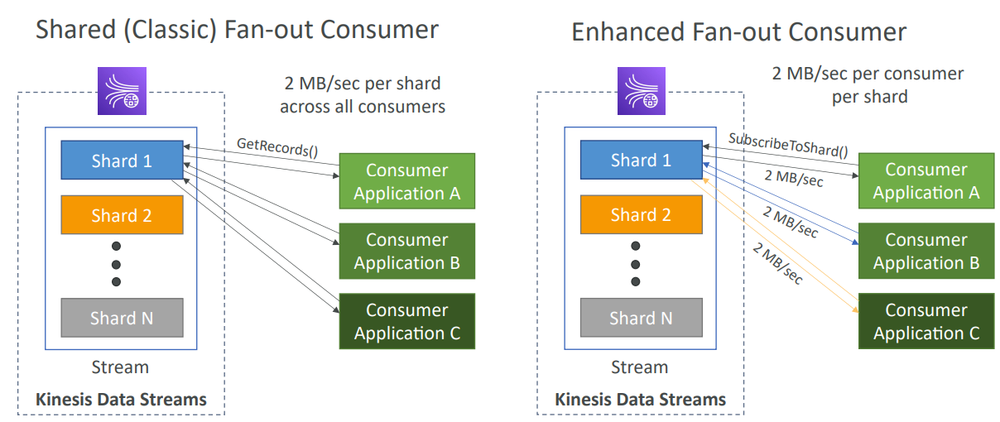
        * Kinesis client library (KCL) - library to simplify reading from data stream
            * You have to do manual name specifying for consuming and such when using the
              SDK, but KCL abstracts a lot of that away for you.
            * A Java library that helps read record s from a Kinesis Data Stream with
              distributed applications sharing the read workload
            * Each shard is to be read by only one KCL instance
                * 4 shards = max 4 KCL instances
                * 6 shards = max 6 KCL instances
            * Progress is checkpointed into DynamoDB of how far into reading the
              data they are (needs IAM access)
            * Track other workers and share the work among shards using DynamoDB
            * KCL can run on EC2, Elastic Beanstalk, and on-premises
            * Records are read in order at the shard level
            * KCL versions:
                * KCL 1.x (supports shared consumer)
                * KCL 2.x (supports shared & enhanced fan-out consumer)
                  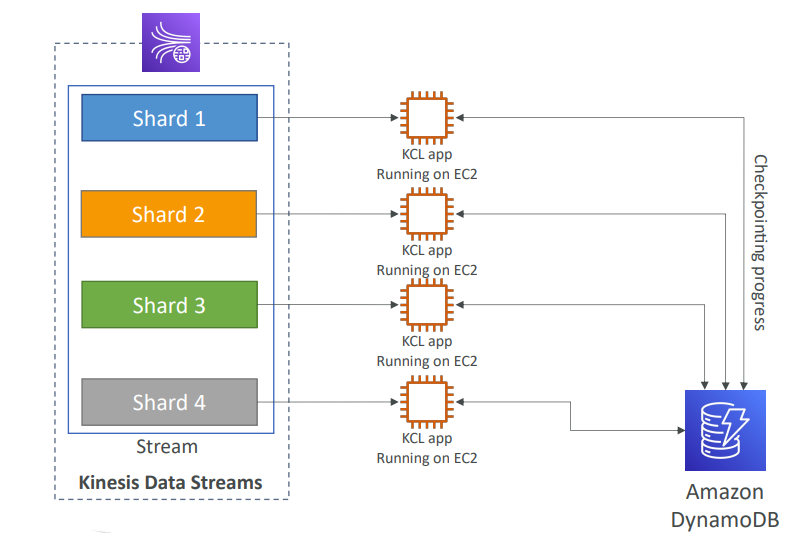
    * Control access/authorization using IAM policies
    * Encryption in flight using HTTPS endpoints
    * Encryption at rest using KMS
    * You can implement encryption/decryption of data on client side (harder)
    * VPC endpoints available for Kinesis to access within VPC to avoid going
      there through the public internet.
    * Monitor API calls using CloudTrail
    * Shard splitting
        * Used to increase the stream capacity (1 MB/s data in per shard)
        * Used to divide a "hot shard"
        * The old shard is closed and will be deleted once the data is expired
        * No automatic scaling (manually increase/decrease capacity)
        * Cannot split into more than two shards in a single operation
        * Increase capacity and cost
    * Merging shards
        * Decrease the stream capacity and save costs
        * Can be used to group two shards with low traffic (cold shards)
        * Old shards are closed and will be deleted once the data is expired
        * Can't merge more than two shards in a single operation
        * Decrease capacity and cost
* Kinesis data firehose - load data streams into AWS data stores
    * Fully managed service, no administration, automatic scaling, serverless
    * Can send data into:
      AWS: Redshift, Amazon S3, ElasticSearch
      3rd party partners: Splunk, MongoDB, DataDog, NewRelic etc.
      Custom destinations to any HTTP endpoint
    * Pay for data going through Firehose
    * Near real time
        * 60 seconds latency minimum for non-full batches
        * Or minimum 32 MB of data at a time
    * Supports many data formats, conversions, transformations, compression
    * Supports custom data transformations using AWS Lambda
    * Can send failed or all data to a backup S3 bucket
      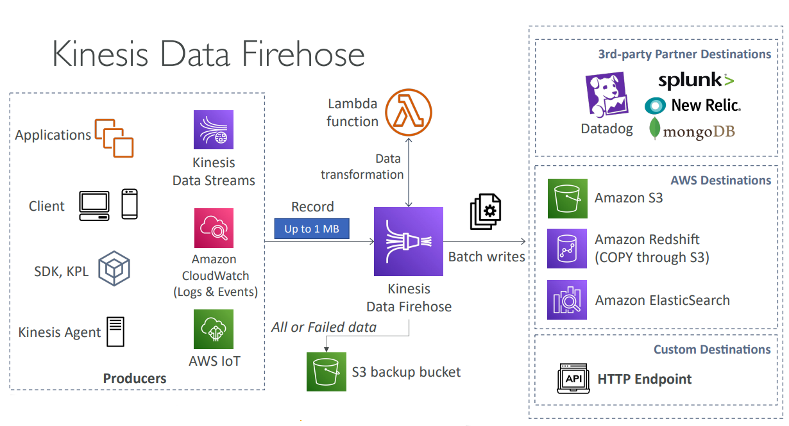
* Kinesis data analytics - analyze data streams with SQL or Apache Flink
    * The point of it is to do stream processing using SQL.
    * Perform real-time analytics on Kinesis Streams using SQL
    * Fully managed, no servers to provision
    * Automatic scaling
    * Real-time analytics
    * Pay for actual consumption rates
    * Can create streams out of the real-time queries
    * Use cases:
        * Time-series analytics
        * Real-time dashboards
        * Real-time metrics
          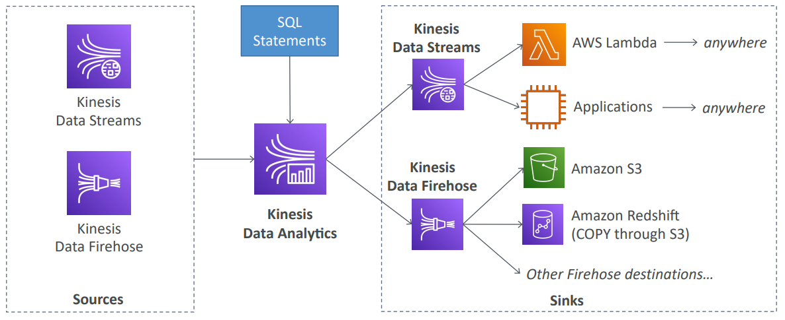
* Kinesis video streams - capture, process, and store video streams
* Ordering data into Kinesis
    * Imagine you have 100 trucks (truck_1, truck_2, ... truck_100) on the road
      sending their GPS positions regularly into AWS. You want to consume the
      data in order for each truck, so that you can track their movement accurately.
      How should you send that data into Kinesis?
    * Answer: send using a "Partition key" value of the "truck_id". The same key
      will always go to the same shard.

      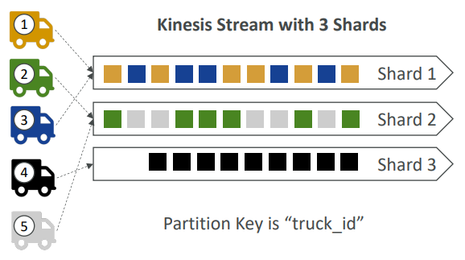

**Kinesis vs SQS ordering**
* 100 trucks, 5 kinesis shards, 1 SQS FIFO
* Kinesis data streams
    * On average you'll have 20 trucks per shard
    * Trucks will have their data ordered within each shard
    * The maximum amount of consumers in parallel we can have is 5
    * Can receive up to 5 MB/s of data
* SQS FIFO
    * You only have one SQS FIFO queue
    * You will have 100 Group IDs
    * You can have up to 100 consumers (due to the 100 group ID)
    * You can have up to 300 messages per second (or 3000 if using batching)
      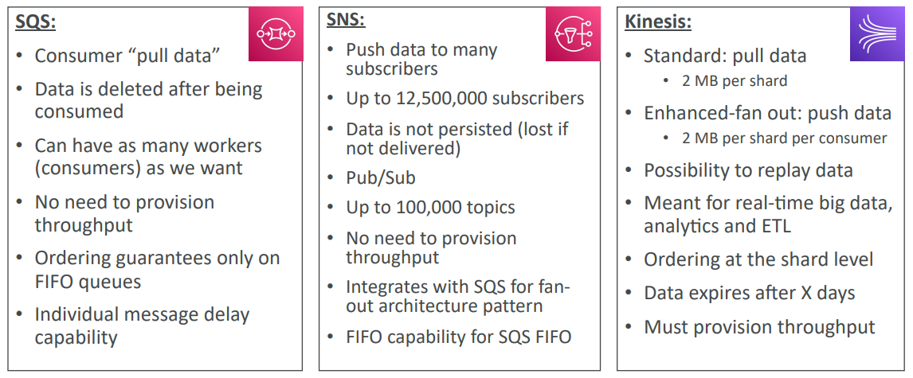
