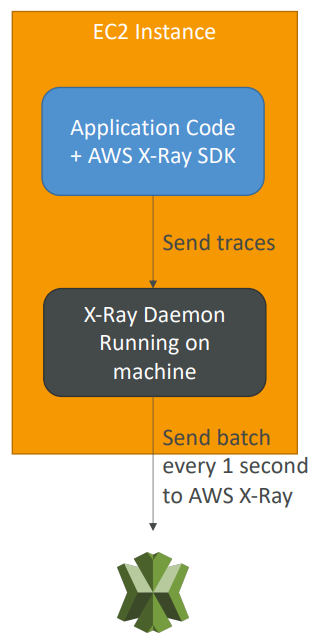
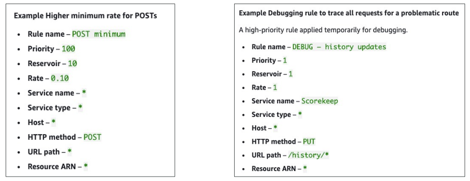
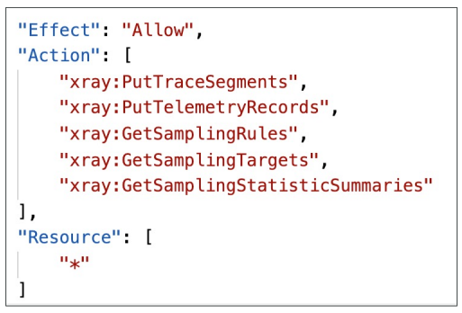
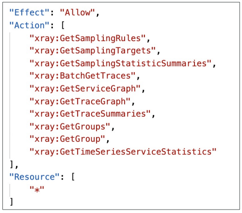
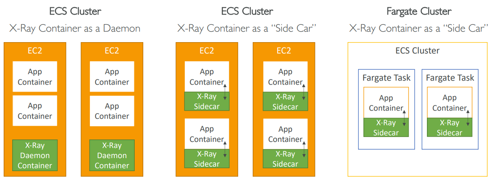

<h2>AWS Monitoring, Troubleshooting & Audit</h2>
**CloudWatch**
* Metrics: Collect and track key metrics
    * CloudWatch provides metrics for every service in AWS
    * Metric is a variable to monitor (CPUUtilization, NetworkIn etc.)
    * Metrics belong to namespaces
    * Dimension is an attribute of a metric (instance id, environment etc.)
    * Up to 10 dimensions per metric
    * Metrics have timestamps
    * Can create CloudWatch dashboards of metrics
    * EC2 detailed monitoring
        * EC2 instance metrics have metrics "every 5 minutes"
        * With detailed monitoring (for a cost), you get data "every 1 minute"
        * Use detailed monitoring if you want to scale faster for your ASG!
        * The AWS Free Tier allows us to have 10 detailed monitoring metrics
        * Note: EC2 memory usage is by default not pushed (must be pushed from
          inside the instance as a custom metric)
    * Custom metrics
        * Possibility to define and send your own custom metrics to CloudWatch
        * Example: memory (RAM) usage, disk space, number of logged-in users etc.
        * Use API call PutMetricData
        * Ability to use dimensions (attributes) to segment metrics
            * Instance.id
            * Environment.name
        * Metric resolution (StorageResolution API parameter - two possible values):
            * Standard: 1 minute (60 seconds)
            * Higher resolution: 1/5/10/30 seconds - higher cost
        * Important: accepts metric data points two weeks in the past and two hours
          in the future (make sure to configure your EC2 instance time correctly)
* Logs: Collect, monitor, analyze, and store log files
    * Applications can send logs to CloudWatch using the SDK
    * CloudWatch can collect logs from:
        * Elastic Beanstalk: collection of logs from application
        * ECS: collection from containers
        * AWS Lambda: collection from function logs
        * VPC flow logs: VPC specific logs
        * API Gateway
        * CloudTrail based on filter
        * CloudWatch log agents: for example on EC2 machines
        * Route 53: Log DNS queries
    * CloudWatch logs can go to:
        * Batch exporter to S3 for archival
        * Stream to ElasticSearch cluster for further analytics
    * CloudWatch logs can use filter expressions
    * Logs storage architecture:
        * Log groups: arbitrary name, usually representing an application
        * Log stream: instances within application/log files/containers
    * Can define log expiration policies (never expire, 30 days, etc.)
    * Using the AWS CLI we can tail CloudWatch logs
    * To send logs to CloudWatch, make sure IAM permissions are correct
    * Security: encryption of logs at rest using KMS at the group level
* Events: send notifications when certain events happen in your AWS
* Alarms: React in real-time to metrics/events
* CloudWatch Agent
    * By default, no logs go from your EC2 machine to CloudWatch
    * You need to run a CloudWatch agent on EC2 to push the log files
      you want
    * Make sure IAM permissions are correct
    * The CloudWatch log agent can be setup on-premises too
    * CloudWatch Logs Agent & Unified Agent
        * For virtual servers (EC2 instances, on-promise servers etc.)
        * CloudWatch Logs Agent
            * Old version of the agent
            * Can only send to CloudWatch Logs
        * CloudWatch Unified Agent
            * Collect additional system-level metrics such as RAM, processes, etc.
            * Collect logs to send to CloudWatch logs
            * Centralized configuration using SSM Parameter Store
            * Metrics
                * Collected directly on your Linux server/EC2 instance
                * CPU (active, guest, idle, system, user, steal)
                * Disk metrics (free, used, total), Disk IO (writes, reads, bytes, iops)
                * RAM (free, inactive, used, total, cached)
                * Netstat (number of TCP and UDP connections,  net packets, bytes)
                * Processes (total, dead, blocked, idle, running, sleep)
                * Swap space (free, used, used %)
* CloudWatch Logs Metric Filter
    * CloudWatch logs can use filter expressions
        * For example, find a specific IP inside a log
        * Or count occurrences of "Error" in your log
        * Metric filters can be used to trigger alarms once a certain
          threshold has been reached
    * Filters do not retroactively filter data. Filters only publish the metric
      data points for events that happen after the filter was created.
* CloudWatch Alarms
    * Alarms are used to trigger notifications for any metric
    * Various options (sampling, %, max, min, etc.)
    * Alarm states:
        * OK
        * INSUFFICIENT_DATA
        * ALARM
    * Period
        * Length of time in seconds to evaluate the metric
        * High resolution custom metrics: 10 sec, 30 sec, or multiples of 60 sec
    * Alarm targets
        * EC2 - stop, terminate, reboot, or recover an EC2 instance
        * EC2 auto scaling - trigger auto scaling action
        * SNS - send notifications to SNS (from which you can do pretty much anything)
    * Good to know:
        * Alarms can be created based on CloudWatch logs metrics filters
        * To test alarms and notifications, set the alarm state to Alarm using CLI
          `aws cloudwatch set-alarm-state --alarm-name "myalarm" --state-value
          ALARM --state-reason "testing purposes"`
* CloudWatch Events (now EventBridge)
    * Event pattern: intercept events from AWS services (Sources)
        * Example sources: EC2 instance start, CodeBuild Failure, S3, Trusted Advisor
        * Can intercept any API call with CloudTrail integration
    * Schedule or cron (example: create an event every 4 hours)
    * A JSON payload is created from the event and passed to a target, which can be:
        * Compute: Lambda, Batch, ECS task
        * Integration: SQS, SNS, Kinesis Data Streams, Kinesis Data Firehose
        * Orchestration: Step functions, CodePipeline, CodeBuild
        * Maintenance: SSM, EC2 actions
* CloudWatch EventBridge
    * EventBridge is the next evolution of CloudWatch Events
    * Amazon EventBridge vs CloudWatch Events
        * Amazon EventBridge builds upon and extends CloudWatch Events
        * It uses the same service API and endpoint, and the same
          underlying service infrastructure
        * EventBridge allows extension to add event buses for your
          custom applications and your third-party SaaS apps
        * EventBridge has the Schema Registry capability
        * EventBridge has a different name to mark the new capabilities
        * Over time, the CloudWatch Events name will be replaced with
          EventBridge
    * CloudWatch has a single bus, but EventBridge has multiple
    * Default event bus: generated by AWS services (CloudWatch Events)
    * Partner event bus: receive events from other SaaS service or applications
      (Zendesk, DataDog, Segment, Auth0, etc.)
    * Custom event buses: for your own applications
    * Event buses can be accessed by other AWS accounts
    * Rules: how to process the events (similar to CloudWatch Events)
    * Schema Registry
        * EventBridge can analyze the events in your bus and infer the
          schema
        * The Schema Registry allows you to generate code for your
          application, that will know in advance how data is structured
          in the event bus
        * Schema can be versioned

**AWS X-Ray**
* Troubleshooting application performance and errors
* Distributed tracing of microservices
* Debugging in production, the good old way
    * Test locally
    * Add log statements everywhere
    * Re-deploy in production
* Log formats differ across applications using
  CloudWatch and analytics is hard
* Debugging: monolith 'easy', distributed services 'hard'
* No common views of your entire architecture
* X-Ray gives a visual analysis of your applications
* X-Ray advantages
    * Troubleshooting performance (bottlenecks)
    * Understand dependencies in a microservice architecture
    * Pinpoint service issues
    * Review request behavior
    * Find errors and exceptions
    * Are we meeting time SLA?
    * Where am I throttled?
    * Identify users that are impacted by your errors
* X-Ray compatibility
    * AWS Lambda
    * Elastic Beanstalk
    * ECS
    * ELB
    * API Gateway
    * EC2 instances or any application server (event on-promise)
* X-Ray leverages tracing
* Tracing is an end to end way of following a request
* Each component dealing with the requests adds its own trace
* Tracing is made of segments (+ subsegments)
* Annotations can be added to traces to provide extra information
* Ability to trace:
    * Every request
    * Sample request (as a % for example or a rate per minute)
* X-Ray security:
    * IAM for authorization
    * Can use KMS encryption at rest
* How to enable?
    * Your code must import the AWS X-Ray SDK
        * Very little code modification needed
        * The application SDK will the capture:
            * Calls to AWS services
            * HTTP/HTTPS requests
            * Database calls (MySQL, PostgreSQL, DynamoDB)
            * Queue calls (SQS)
    * Install the X-Ray daemon or enable X-Ray AWS integration
        * X-Ray daemon works as a low level UDP packet interceptor
          (Linux/Windows/Mac)
        * AWS Lambda/other AWS services already run the X-Ray
          daemon for you
        * Each application must have the IAM rights to write data to
          X-Ray
          
* X-Ray service collects data from all the different services
* Service map is computed from all the segments and traces
* X-Ray is graphical, so even non-technical people can help
  troubleshoot
* Troubleshooting
    * If X-Ray is not working on EC2
        * Ensure the EC2 IAM role has the proper permissions
        * Ensure the EC2 instance is running the X-Ray Daemon
    * To enable on AWS Lambda:
        * Ensure it has an IAM execution role with proper policy
          (AWSX-RayWriteOnlyAccess)
        * Ensure that X-Ray is imported in the code
* X-Ray instrumentation in your code
    * Instrumentation means the measure of a product's performance,
      diagnose errors, and to write trace information. It's a field
      in software development to do all these things.
    * To instrument your application code, you use the X-Ray SDK
    * You can modify your application code to customize and annotate
      the data that the SDK sends to X-Ray, using interceptors, filters,
      handlers, middleware etc.
* X-Ray Concepts
    * Segments - each application/service will send them
    * Subsegments - if you need more details in your segments
    * Trace - all the segments collected together to form an end-to-end trace
    * Sampling - decrease the amount of requests sent to X-Ray to reduce cost
        * With sampling rules, you control the amount of data that you record. The more
          data you send, the more you'll pay.
        * You can modify sampling rules without changing your code.
        * By default, the X-Ray SDK records the first request each second, and
          five percent of any additional requests.
        * One request per second is the reservoir, which ensures that at least one
          trace is recorded each second as long as the service is serving requests.
        * Five percent is the rate at which additional requests beyond the reservoir
          size are sampled
        * You can create your own rules with the reservoir and rate.
          
    * Annotations - key-value pairs used to index traces and use with filters
    * Metadata - key-value pairs, not indexed, not used for searching
    * The X-Ray daemon/agent has a config to send traces cross account:
        * make sure the IAM permissions are correct - the agent will assume the role
        * this allows to have a central account for all your application tracing
* Write APIs (used by the X-Ray daemon)
    * arn:aws:iam::aws:policy/AWSXrayWriteOnlyAccess
        * PutTraceSegments - uploads segment documents to AWS X-Ray
        * PutTelemetryRecords - used by the AWS X-Ray daemon to upload
          telemetry. Helps with the metrics
            * SegmentsReceivedCount, SegmentsRejectedCounts, BackendConnectionErrors etc.
        * GetSamplingRules - retrieve all sampling rules (to know what/when to send)
        * GetSamplingTargets & GetSamplingStatisticSummaries - advanced
        * The X-Ray daemon needs to have an IAM policy authorizing the correct
          API calls to function correctly
          
    * arn:aws:iam::aws:policy/AWSXrayReadOnlyAccess
        * GetServiceGraph - main graph
        * BatchGetTraces - retrieves a lost of traces specified by ID.
          Each trace is a collection of segment documents that originates
          from a single request.
        * GetTraceSummaries - retrieves IDs and annotations for traces
          available for a specified time frame using an optional filter.
          To get the full traces, pass the trace IDs to BatchGetTraces
        * GetTraceGraph - retrieves a service graph for one or more
          specific trace IDs.
          
* X-Ray with elastic beanstalk
    * AWS Elastic Beanstalk platforms include the X-Ray daemon
    * You can run the daemon by setting an option in the Elastic Beanstalk
      console or with a configuration file (in .ebextensions/xray-daemon.config)
    * Make sure to give your instance profile the correct IAM permissions so that
      the X-Ray daemon can function correctly. Then make sure your application
      code is instrumented with the X-Ray SDK.
    * Note: The X-Ray daemon is not provided for Multicontainer Docker
* ECS + X-Ray integration options
    * ECS Cluster X-Ray container as a daemon. Run the X-Ray daemon container in each EC2 instance.
    * ECS Cluster X-Ray container as a "side car". Run one X-Ray daemon container alongside each app
      container.
    * Fargate cluster X-Ray container as a "side car". Same as for ECS, except you don't have EC2 instances.
      

**AWS CloudTrail**
* Internal monitoring of API calls being made
* Audit changes to AWS resources by your users
* Provides governance, compliance, and audit for your AWS account
* CloudTrail is enabled by default
* Get a history of events/API calls made within your AWS account by:
    * Console
    * SDK
    * CLI
    * AWS Services
* Can put logs from CloudTrail into CloudWatch logs or S3
* A trail can be applied to all regions (default) or a single region
* If a resource is deleted in AWS, investigate CloudTrail first
* CloudTrail Events
    * Management events:
        * Operations that are performed on resources in your AWS account
        * Examples:
            * Configuring security (IAM AttachRolePolicy)
            * Configuring rules for routing data (Amazon EC2 CreateSubnet)
            * Setting up logging (AWS CloudTrail CreateTrail)
        * By default, trails are configured to log management events
        * Can separate read events (that don't modify resources)
          from write events (that may modify resources)
    * Data events:
        * By default, data events are not logged (because of high volume operations)
        * Amazon S3 object-leve activity (ex. GetObject, DeleteObject, PutObject):
          can separate Read and Write events
        * AWS Lambda function execution activity (the Invoke API)
    * CloudTrail Insights
        * Enable CloudTrail Insights to detect unusual activity in your account:
            * inaccurate resource provisioning
            * hitting service limits
            * Bursts of AWS IAM actions
            * Gaps in periodic maintenance activity
        * CloudTrail Insights analyzes normal management events to create a baseline,
          and then continuously analyzes write events to detect unusual patterns
            * Anomalies appear in the CloudTrail console
            * Event is sent to Amazon S3
            * An EventBridge event is generated (for automation needs)
* CloudTrail Events Retention
    * Events are stored for 90 days in CloudTrail
    * To keep events beyond this period, log them to S3 and use Athena