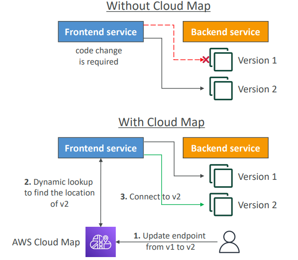

<h2>Other Services</h2>
**AWS SES - Simple Email Service**
* Send emails to people using:
    * SMTP interface
    * AWS SDK
* Ability to receive email. Integrates with:
    * S3
    * SNS
    * Lambda
* Integrated with IAM for allowing to send emails

**AWS Databases Summary**
* RDS: Relational databases, OLTP
    * PostgreSQL, MySQL, Oracle etc.
    * Aurora + Aurora Serverless
    * Provisioned database
* DynamoDB: NoSQL DB
    * Managed, Key value, Document
    * Serverless
* ElastiCache: In memory DB
    * Redis/Memcached
    * Cache capability
* Redshift: OLAP - Analytic processing
    * Data warehousing/Data lake
    * Analytics queries
* Neptune: Graph database
* DMS: Database migration service
* DocumentDB: managed MongoDB for AWS

**AWS Certificate Manager (ACM)**
* Lets you easily provision, manage, and deploy SSL/TLS certificates
* Used to provide in-flight encryption for websites (HTTPS)
* Supports both public and private TLS certificates
* Free of charge for public TLS certificates
* Automatic TLS certificate renewal
* Integrations with (load TLS certificates on)
    * Elastic load balancers
    * CloudFront distributions
    * APIs on API Gateway

**AWS Cloud Map**
* A fully managed resource discovery service
* Creates a map of the backend services/resources that your applications depend on
* You register your application components, their locations, attributes, and health
  status with AWS Cloud Map
* Integrated health checking (stop sending traffic to unhealthy endpoints)
* Your applications can query AWS Cloud Map using AWS SDK, API, or DNS
  

**AWS Fault Injection Simulator (FIS)**
* A fully managed service for running fault injection experiments on AWS workloads
* Based on Chaos Engineering - stressing an application by creating disruptive events
  (e.g. sudden increase in CPU or memory), observing how the system responds, and
  implementing improvements
* Helps uncover hidden bugs or performance bottlenecks
* Supports the following AWS services: EC2, ECS, EKS, RDS etc.
* Use pre-built templates that generate the desired disruptions