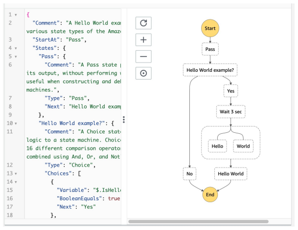
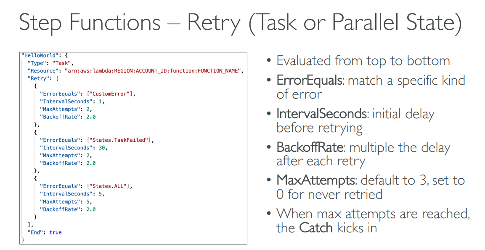
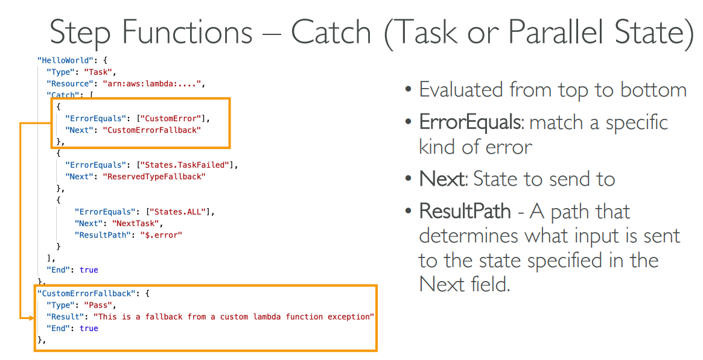
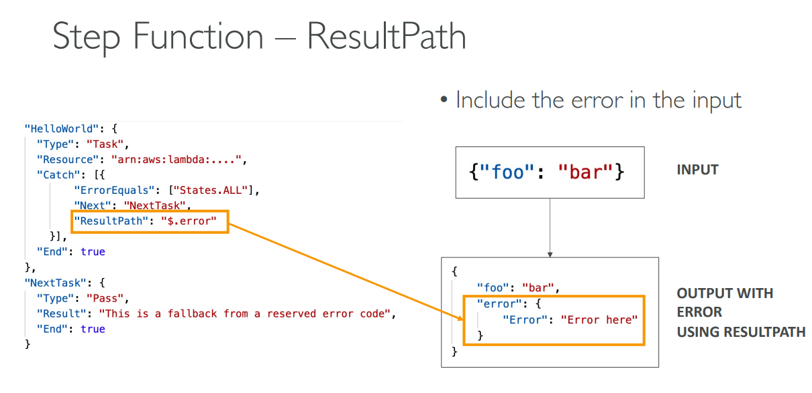
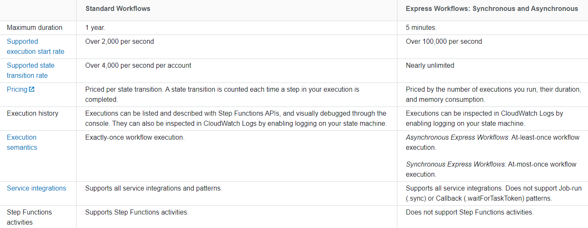
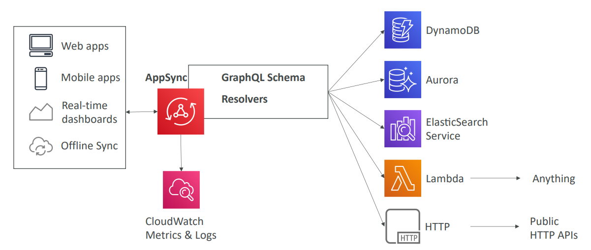

<h2>Other Serverless</h2>
**AWS Step Functions**
* Model your workflows as state machines (one per workflow)
    * Order fulfillment, Data processing
    * Web applications, any workflow
* Written in JSON
* Visualization of the workflow and the execution of the workflow, as well as history
* Start workflow with SDK call, API Gateway, Event Bridge (CloudWatch Event)
  
* The state machine is made up of boxes and those boxes are called task states
    * They're used to do some work in your state machine
    * Invoke one AWS service
        * Can invoke a Lambda function
        * Run an AWS batch job
        * Run ECS task and wait for it to complete
        * Insert an item from DynamoDB
        * Publish message to SNS, SQS
        * Launch another step function workflow
    * Run one activity
        * EC2, Amazon ECS, on-premises
        * Activities poll the step functions for work
        * Activities send results back to step functions
* Step Function States
    * Choice state - test for a condition to send to a branch (or default branch)
    * Fail or succeed state - stop execution with failure or success
    * Pass state - simply pass its input to its output or inject some fixed data,
      without performing work
    * Wait state - provide a delay for a certain amount of time or until a specified
      time/date
    * Map state - dynamically iterate steps.
    * Parallel state - begin parallel branches of execution
* Error handling in step functions
    * Any state can encounter runtime errors for various reasons:
        * State machine definition issues (for example, no matching rule in a Choice
          state)
        * Task failures (for example, an exception in a Lambda function)
        * Transient issues (for example, network partition events)
    * Use Retry (to retry failed state) and Catch (transition to failure path) in
      the State Machine to handle the errors instead of inside the Application Code
    * Predefined error codes:
        * States.ALL - matches any error name
        * States.Timeout - task ran longer than TimeoutSeconds or no heartbeat received
        * States.TaskFailed - execution failure
        * States.Permissions - insufficient privileges to execute code
    * The state may report its own errors
      
      
      
* Standard vs express step functions
  
* AppSync
    * AppSync is a managed service that uses GraphQL
    * GraphQL makes it easy for applications to get exactly the data they need
    * This includes combining data from one or more sources
        * NoSQL data stores, Relational DBs, HTTP APIs etc.
        * Integrates with DynamoDB, Aurora, Elasticsearch & others
        * Custom sources with AWS Lambda
    * Retrieve data in real-time with WebSocket or MQTT on WebSocket
    * For mobile apps: local data access & data synchronization
    * It all starts with uploading one GraphQL schema
      
    * There are four ways you can authorize applications to interact with your AWS
      AppSync GraphQL API
        * API_KEY
        * AWS_IAM: IAM users/roles/cross-account access
        * OPENID_CONNECT: OpenID connect provider/JSON Web Token
        * AMAZON_COGNITO_USER_POOLS
        * For custom domains & HTTPS, use CloudFront in front of AppSync