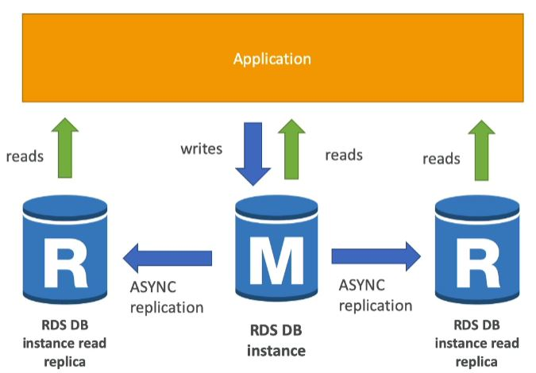
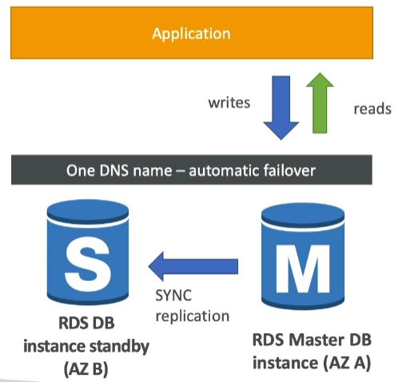
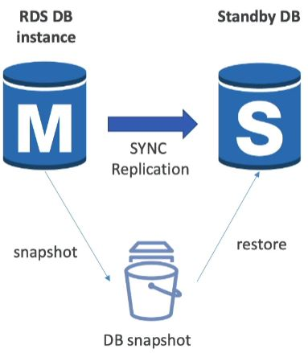
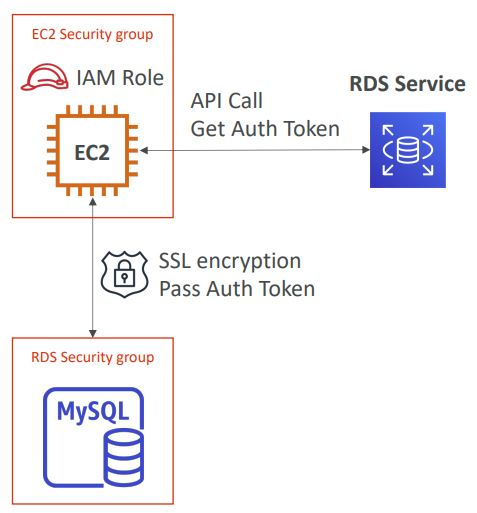
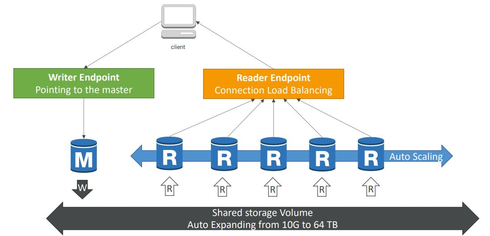
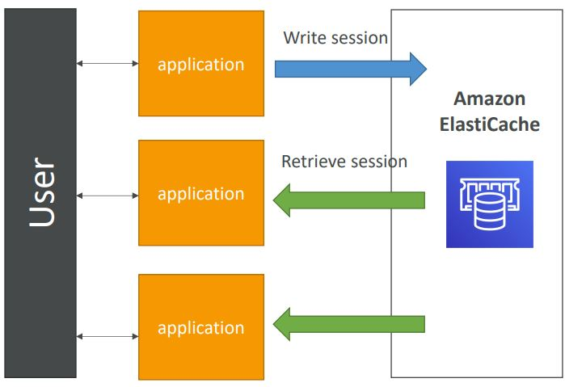
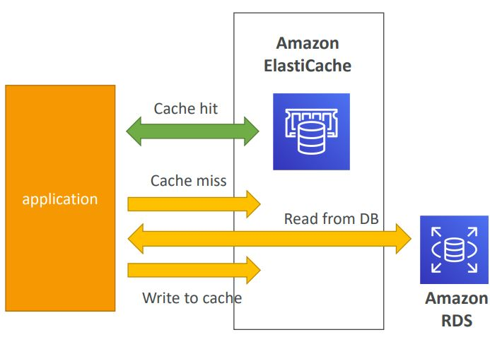

<h2>Relational database service (RDS), Aurora, ElastiCache</h2>
**RDS**
* Allows you to create relational databases in the cloud that are managed by AWS
    * Postgres
    * MySQL
    * MariaDB
    * Oracle
    * Microsoft SQL Server
    * Aurora (AWS proprietary database)
* RDS advantage over deploying DB on EC2
    * RDS is a managed service, which means
        * automated provisioning, OS patching
        * Continuous backups and restore to specific timestamp (Point in time restore)
        * Monitoring dashboards
        * Read replicas for improved read performance
        * Multi AZ setup for DR (disaster recovery)
        * Maintenance windows for upgrades
        * Scaling capability (vertical and horizontal)
        * Storage backed by EBS (GP2 or IO1)
    * However, you cannot SSH into your instances
* Backups are automatically enabled in RDS
* Automated backups
    * Daily full backup of the database (during maintenance window that you specify)
    * Transaction logs are backed up bby RDS every 5 minutes
    * 7 days retention (can be increased to 35 days)
* DB snapshots
    * Manually triggered by the user
    * Retention of backup for as long as you want
* RDS storage auto scaling
    * When RDS detects you are running out of free database storage, it scales automatically
    * You have to set a maximum storage threshold (maximum limit for DB storage)
    * Automatically modify storage if:
        * Free storage is less than 10% of allocated storage
        * Low storage lasts at least 5 minutes
        * 6 hours have passed since last modification
    * Useful for applications with unpredictable workloads

**RDS read replicas**
* Up to 5 read replicas
* Within AZ, cross AZ or cross region
* Replication is async, so reads are eventually consistent
* Replicas can be promoted to their own DB
* Applications must update the connection string to leverage read replicas
  

* Example use case is when a reporting application wants to run, but running
  it would kill the DB, thus if a read replica is present, then it can simply
  run on that.
* In AWS there's a network cost when data goes from one AZ to another, but there
  are exceptions, and those exceptions are usually for managed services.
* For RDS read replicas within the same region, you don't pay that fee
  

**RDS Multi AZ (disaster recovery)**
* SYNC replication
* One DNS name - automatic app failover to standby
* Increases availability
* No manual intervention in apps
* Not used for scaling, as the standby unit has no I/O happening to it from
  an external source, only taking in the replication
  
* Going from single AZ to multi AZ
    * Zero downtime operation (no need to stop the DB)
    * Just click on "modify" for the database
    * The following happens internally:
        * A snapshot is taken
        * A new DB is restored from the snapshot in the new AZ
        * Synchronization is established between the two databases
          

**RDS security**
* At rest encryption (data that's not in movement)
    * Possibility to encrypt the master & read replicas with AWS KMS - AES 256
      encryption
    * Encryption has to be defined at launch time
    * If the master is not encrypted, then the read replicas cannot be encrypted
    * Transparent Data Encryption (TDE) available for Oracle and SQL server, which
      is an alternative way for encryption
* In-flight encryption
    * SSL certificates to encrypt data to RDS in flight
    * Provide SSL options with trust certificate when connection to DB
    * To enforce SSL:
        * PostgreSQL: rds.force_ssl = 1 in the AWS RDS Console (Parameter Groups)
        * MySQL: Within the DB: GRANT USAGE ON \*.\* TO 'mysqluser'@'%' REQUIRE SSL;
* Encrypting RDS backups
    * Snapshots of un-encrypted RDS databases are un-encrypted
    * Snapshots of an encrypted RDS databases are encrypted
    * Can copy a snapshot into an encrypted one
* To encrypt an un-encrypted RDS database:
    * Create a snapshot of the un-encrypted database
    * Copy the snapshot and enable encryption for the snapshot
    * Restore the database from the encrypted snapshot
    * Migrate applications to the new database, and delete the old database
* Network security
    * RDS databases are usually deployed within a private subnet, not in a public one
    * RDS security works by leveraging security groups (the same concept as
      for EC2 instances) - it controls which IP/security group can communicate
      with RDS
* Access management
    * IAM policies help control who can manage AWS RDS (through the RDS API)
    * Traditional username and password can be used to login into the DB
    * IAM-based authentication can be used to login into RDS MySQL & PostgresSQL
        * You don't need a password, just an authentication token obtained through
          IAM & RDS API calls
        * Auth token has a lifetime of 15 minutes
        * Benefits:
            * Network I/O must be encrypted using SSL
            * IAM to centrally manage users instead of DB
            * Can leverage IAM roles and EC2 instance profiles for easy integration
              

**RDS-security - summary**
* Encryption at rest:
    * Is done only when you first create the DB instance
    * or: un-encrypted DB => snapshot => copy snapshot as encrypted => create DB
      from snapshot
* Your responsibility:
    * Check the ports/IP/security group inbound rules in DB security group
    * In-database user creation and permissions or manage through IAM
    * Creating a database with or without public access
    * Ensure parameter groups or DB is configured to only allow SSL connections
* AWS responsibility:
    * No SSH access
    * No manual DB patching
    * No manual OS patching
    * No way to audit the underlying instance

**Amazon Aurora**
* Aurora is a proprietary technology from AWS (not open sourced)
* Postgres and MySQL are both supported as Aurora DB (that means your
  drivers will work as if Aurora was a Postgres or MySQL DB)
* Aurora is 'AWS cloud optimized' and claims 5x performance improvement over
  MySQL on RDS, over 3x the performance of postgres on RDS
* Aurora storage automatically grows in increments of 10 GB, up to 64 TB.
* Aurora can have 15 replicas while MySQL has 5, and the replication process
  is faster (sub 10 ms replica lag)
* Failover in Aurora is instantaneous
* Aurora costs more than RDS (20% more) - but is more efficient
* 6 copies of your data across 3 AZ:
    * 4 copies out of 6 needed for writes
    * 3 copies out of 6 needed for reads
    * Self healing with peer-to-peer replication
    * Storage is striped across 100s of volumes
* One Aurora instance takes writes (master)
* Automated failover for master in less than 30 seconds
* Master + up to 15 Aurora read replicas serve reads
* Support for cross region replication

You have a writer endpoint to connect to the master. Your read replicas can
have auto scaling and to connect to those you have a reader endpoint.

**ElastiCache**
* Managed Redis or Memcached
* Caches are in-memory databases with really high performance, low latency
* Helps reduce load off of databases for read intensive workloads
* Helps make your application stateless, by storing the user session data
  inside of ElastiCache
  
* AWS takes care of OS maintenance/patching, optimizations, setup, configuration,
  monitoring, failure recovery, and backups
* Using ElastiCache involves heavy application code changes
* Application queries ElastiCache, if not available, get from RDS and store in
  ElastiCache
* Helps relieve load in RDS
* Cache must have an invalidation strategy to make sure the most current data is
  used in there. Choosing a proper invalidation strategy is the most difficult part
  about caches.
  
* Redis vs Memcached
    * Redis
        * Multi AZ with auto-failover
        * Read replicas to scale reads and have high availability
        * Data durability using AOF persistence
        * Backup and restore features
        * So closer to a database - high availability, backup, read replicas etc
    * Memcached
        * Multi-node for partitioning of data (sharding)
        * No high availability (replication)
        * Non persistent
        * No backup and restore
        * Multi-threaded architecture
        * So closer to a real cache - can afford to lose your data, no backup, no restore
* Cache eviction
    * You delete the item explicitly in the cache
    * Item is evicted because the memory is full and it's not recently used
      (LRU - least recently used)
    * You set an item time-to-live (TTL)

We have to handle the cache querying and updating ourselves in code. So in code
we'd have a call to the cache, check if it's empty. If it's empty, then turn to
the DB and save the data in the cache. This is called lazy-loading/cache-aside/
lazy-population. We populate the cache with a read. We could also populate the
cache as we're doing writes, which is called write through. The data would always
be up to date, but a write would be required for cache population. Can combine it
with lazy-loading.
