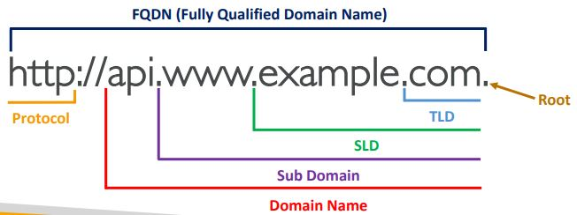
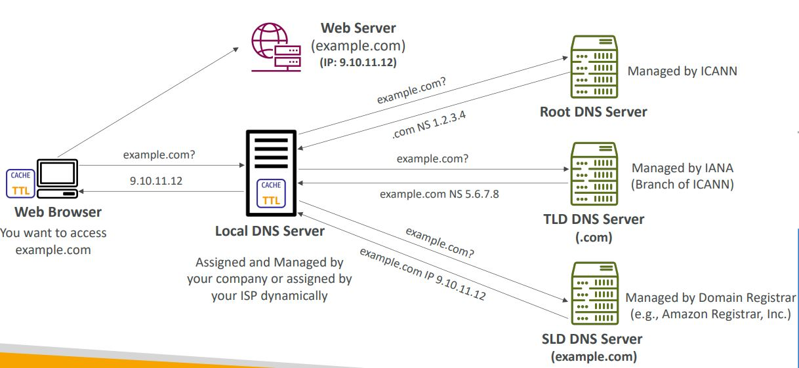

<h2>Route 53</h2>
**Route 53**
* DNS translates human friendly hostnames into IP addresses
* Domain Registrar: Amazon Route 53, GoDaddy etc
* DNS records: A, AAAA, CNAME, NS etc
    * A - maps a hostname to IPv4
    * AAAA - maps a hostname to IPv6
    * CNAME - maps a hostname to another hostname
        * The target is a domain name which must have an A or AAAA record
        * Can't create a CNAME record for the top node of a DNS namespace (Zone Apex)
        * For example, cannot create for example.com, but can for www.example.com
    * NS - name servers (stored DNS records) for the hosted zone (private/public)
        * Public hosted zones - contains records that specify how to route traffic
          on the Internet
        * Private hosted zones - contains records that specify how to route traffic
          within one or more VPCs(private domain names)
* Zone file contains DNS records
* Name server resolves DNS queries (Authoritative vs non-authoritative)
* Top level domain (TLD): .com, .us, .in, .gov, .org etc
* Second level domain (SLD): amazon.com, google.com etc
  
* DNS works by first turning to your local DNS server and asking if it knows
  about a domain. If it's not cached, then it'll turn to the Root DNS Server
  and ask if it knows the domain. It'll say no, but that it knows about .com,
  check this IP of the .com named server for more information. It'll in turn
  say that it knows a second level domain server, so you should check there.
  The SLD then says that yeah, I know it, here's the IP. The local DNS then
  caches the result in case someone else wants it as well.
  
* Route 53 is a highly available, scalable, fully managed and authoritative DNS
    * Authoritative means that the customer(you) can update the DNS records
* You buy or register your domain name with a Domain Ragistrar typically by
  paying annual charges (e.g. GoDaddy, Amazon Registrar etc)
* The Domain Registrar usually provides you with a DNS service to manage
  your DNS records
* You don't have to use Route 53 as both a registrar and DNS server. Could
  purchase a domain from GoDaddy and use Route 53 as the DNS server
    * Create a hosted zone in Route 53
    * Update NS records on 3rd party website to use Route 53 name servers
* Domain Registrar != DNS Service
* Route 53 is a domain registrar so we can register our domains there
* Ability to check the health of your resources
* The only AWS service which provides 100% availability service level agreement (SLA)
* You define records to describe how to route to your domain. It contains:
    * Domain/subdomain name - e.g. example.com
    * Record type - e.g. A or AAAA
    * Value - e.g. 123.456.789.123
    * Routing policy - how Route 53 responds to queries
    * Time to live (TTL) - amount of time the record is cached for at the
      DNS resolvers
* Supported DNS record types on Route 53 are:
    * (must know) A, AAAA, CNAME, NS
    * (advanced) CAA, DS, MX, NAPTR, PTR, SOA, TXT, SPF, SRV
* CNAME vs Alias
    * CNAME:
        * Points a hostname to any other hostname. (app.mydomain.com =>
          blabla.anything.com)
        * Only for non-root domain (aka something.mydomain.com)
    * Alias
        * Route 53 feature
        * Points a hostname to an AWS resource (app.mydomain.com =>
          blabla.amazonaws.com)
        * Works for root domain and non-root domain (aka mydomain.com)
        * Free of charge
        * Native health check
        * Cannot set TTL, set automatically by Route 53
        * Targets:
            * Elastic load balancers
            * Cloudfront distributions
            * API gateway
            * Elastic beanstalk environments
            * S3 websites
            * VPC interface endpoints
            * Global accelerator accelerator
            * Route 53 record in the same hosted zone
            * CANNOT set an alias record for an EC2 DNS name
* Routing policies
    * Routing means that it'll tell the caller what to use when querying
      the website
    * Types:
        * Simple
            * Typically, route traffic to a single resource
            * Can specify multiple values in the same record, causing the
              client to choose a random one from the list
            * When Alias is enabled, the can specify only one AWS resource
            * Can't be associated with health checks
        * Weighted
            * Control the % of the requests that go to each specific resource
            * Assign each record a relative weight
            * Weights don't need to sum up to 100
            * DNS records must have the same name and type
            * Can be associated with health checks
        * Latency based
            * Redirect to the resource that has the least latency for us
              (not guaranteed to be closest)
            * Latency is based on traffic between users and AWS regions
            * When you're setting it up, then you have to specify the
              region that the IP belongs to, because the IP can be from
              wherever so Amazon doesn't know
            * Can be associated with health checks
        * Geolocation
            * Uses the location of the user and looks at the physical location.
              So if your location is in the area defined, then it'll be used,
              otherwise falls back to the default.
            * Most precise location is selected when overlapping. You specify
              the location when creating a record. That is, which location
              correspond with which IP
            * Should create a default record in case there's no match on
              location. E.g. you have the US set up, but someone comes from
              Mexico, so they'll go to the default.
            * Can be associated with health checks
        * Failover
            * If a health check fails, then go for the secondary resource.
              So you define your primary and secondary resources.
        * Multi-value
            * Use when routing traffic to multiple resources
            * Route 53 return multiple values/resources
            * Can be associated with health checks (return only values
              for healthy resources)
            * Up to 8 healthy records are returned for each multi-value
              query
            * Simple policy doesn't have health checks, so that might
              return unhealthy resources, while multi-value does not
        * Geoproximity
            * Route traffic to your resources based on the geographic
              location of users and resources. Here it's looking at the
              distance from the point, don't have to be inside the region
            * Ability to shift more traffic to resources based on the
              defined bias
            * To change the size of the geographic region, specify bias values
                * To expand (1 to 99)
                * To shrink (-1 to -99)
            * Resources can be:
                * AWS resources (specify AWS region)
                * Non-AWS resources (specify latitude and longitude)
            * Must use Route 53 traffic flow to use this feature
        * Traffic flow provides a UI to build a more complicated routing rule
    * Health checks
        * Associate it when setting up your route configuration
        * Only for public resources
        * About 15 global health checkers will check the endpoint health
            * Healthy/Unhealthy threshold - 3 (default)
            * Interval - 30 sec (can set to 10 sec - higher cost)
            * Supported protocol: HTTP, HTTPS, and TCP
        * Health checks pass only when the endpoint responds with the 2xx or
          3xx status codes
        * Health checks can be setup to pass/fail based on the text in the
          first 5120 bytes of the response. Can specify the string to search
          for when setting up the health checker.
        * Configure your router/firewall to allow incoming requests from
          Route 53 health checkers
        * Can combine the results of multiple health checks into a single
          health check by running logical operations on it (OR, AND, or NOT)
            * Can monitor up to 256 child health checks
            * Specify how many of the health checks need to pass to make the parent
              pass.
        * The health checkers exist outside the VPC. They can't access private
          endpoints (private VPC or on-premise resource). However, it could be bypassed
          using a CloudWatch metric, which is associated with a CloudWatch alarm,
          which is then checked by the health checker
          