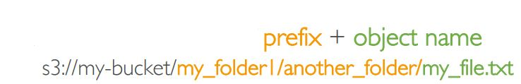
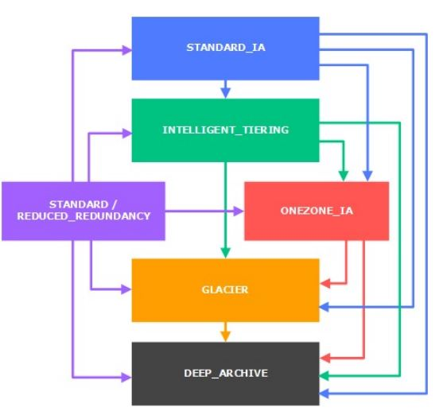
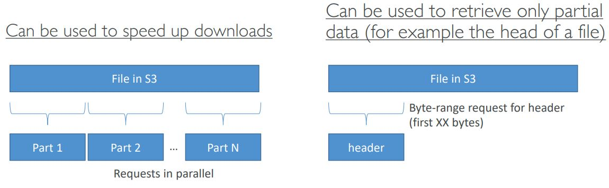

<h2>S3</h2>
* Stores objects (files) into 'buckets' (directories)
* Buckets must have globally unique names
* Buckets are defined at the region level
* Naming convention
    * No uppercase
    * No underscore
    * 3-63 characters long
    * Not an IP
    * Must start with lowercase letter or number
* Files have keys. The key is the full path inside the bucket.
* The key is composed of a prefix + object name.
  
* There's no concept of directories within buckets, just keys with very
  long names that contain slashes
* Object values are the content of the body, max object size is 5 TB
    * If uploading more than 5GB, must use 'multi-part upload'
* Each file can have metadata (list of text key/value pairs - system or
  user metadata)
* Each file can have tags (unicode key/value pair - up to 10) - useful for
  security/lifecycle
* Version ID (if versioning is enabled)
    * Versioning is enabled on the bucket level
    * Best practice to version your buckets
        * Protect against unintended deletes (ability to restore a version).
          When you delete, then a delete marker will be added, but if you
          toggle list versions, then you'll see all of the previous versions
          with the delete marker at the top. You can delete the delete marker
          to undelete the file.
        * Easy roll back to previous version
    * Notes:
        * Any file that is not versioned prior to enabling versioning will
          have version 'null'. If we upload a new one, then the 'null' version
          will still be considered the initial version.
        * Suspending versioning does not delete the previous versions
        * If you have list versions toggled and then you delete, then the
          files will be permanently deleted.
* Encryption of objects
    * Encryption can be used on a file basis or on the entire bucket
    * SSE-S3: encrypts S3 objects using keys handled & managed by AWS
        * Encryption using keys handled & managed by Amazon S3
        * Object is encrypted server side. Which is why it's called SSE,
          meaning server side encryption
        * AES-256 encryption type
        * Must set header 'x-amz-server-side-encryption': 'AES256'
    * SSE-KMS: leverage AWS key management service to manage encryption keys
        * Advantage is user control over who sees what keys + audit trail
        * Object is encrypted server side
        * Must set header 'x-amz-server-side-encryption': 'aws:kms'
    * SSE-C: when you want to manage your own encryption keys
        * You provide the keys outside of AWS
        * S3 does not store the encryption key you provide
        * HTTPS must be used
        * Encryption key must be provided in the HTTP headers, for every
          HTTP request made
    * Client side encryption
        * You perform the encryption and then send it to S3
        * Client library such as the Amazon S3 Encryption Client can be used
        * Clients must decrypt data themselves when retrieving from S3
        * Customer fully manages the keys and encryption cycle
    * You can require encryption using either a bucket policy or default
      encryption. Bucket policies are evaluated before default encryption,
      so it can be used for overriding.
* S3 security
    * User based - IAM policies attached to users define which API calls
      should be allowed for a specific user from the IAM console
    * Resource based
        * Bucket policies - bucket wide rules from the S3 console - allows
          cross account access
        * Object access control list (ACL) - finer grain, set on the object
          level the access rule
        * Bucket access control list (ACL) - less common
    * Note: an IAM principal (user/application) can access an S3 object if
        * the user IAM permissions allow it or the resource policy allows it
          and there is no explicit deny
    * S3 bucket policies
        * JSON based policies
          
        * Explicit DENY in an IAM policy will take precedence over a bucket
          policy permission
        * Use S3 bucket policies to
            * Grant public access to the bucket
            * Force objects to be encrypted at upload
            * Grant access to another account (Cross account)
    * Bucket settings for Block Public Access
        * Block public access to buckets and objects granted through
            * new access control lists (ACLs)
            * any access control lists (ACLs)
            * new public bucket or access point policies
        * Block public and cross-account access to buckets and objects through
          any public bucket or access point policies
        * If you know your bucket should never be public, leave these on
        * Can be set at the account level
    * Can access S3 buckets in private VPCs using VPC endpoints
    * S3 access logs can be used for logging and audit
    * API calls can be logged in AWS CloudTrail
    * MFA Delete: MFA can be required in versioned buckets to delete objects
    * Pre-signed URLs: URLs that are valid only for a limited time (ex.
      premium video download service for logged in users)
        * Can generate pre-signed URLs using SDK or CLI
        * Easier for downloads, can use the CLI
        * Difficult for uploads, must use the SDK
        * Valid for a default of 3600 seconds, can change timeout with
          --expires-in [TIME_BY_SECONDS] argument
        * Users given a pre-signed URL inherit the permissions of the person
          who generated the URL for GET/PUT
* S3 can host static websites and have them accessible on the WWW
* If you get a 403 (Forbidden) error, make sure the bucket policy allows
  public reads!
* As of December 2020 S3 is strongly consistent. That means that whenever
  you modify the data and do a read afterwards, then you're going to see the
  correct results.
* Need versioning to turn on MFA delete for a bucket. Only the root account
  can enable/disable MFA-Delete
* S3 can have access logs for audit purposes.
    * Logs are sent to another bucket.
    * Any request made to S3 will be logged.
    * Do not set your logging bucket to be the same as the one you are
      monitoring, otherwise it'll create a logging loop.
    * When you turn on logging, then the permission to deliver logs is
      automatically added to the target bucket.
* S3 replication (CRR - cross-region replication & SRR - same region replication)
    * Must enable versioning in source and destination
    * CRR must be turned on if they're in different regions
    * SRR if they're in the same region
    * Buckets can be in different accounts
    * Copying is async, but very fast
    * Must give proper IAM permissions to S3
    * CRR use cases: compliance, lower latency access, replication across
      accounts
    * SRR use cases: log aggregation, live replication between production and
      test accounts
    * Replication is not retroactive, only new objects will be replicated
    * Can replicate delete markers from source to target optionally
    * Deletions with a version ID are not replicated to avoid malicious deletes
    * No chaining for bucket replications, only replicates to the directly connected
      bucket
* S3 storage classes
    * A storage class is specified on an object, not bucket wide
    * Amazon S3 Standard - General Purpose
        * High durability of objects across multiple AZ
        * If you store 10,000,000 objects with Amazon S3, you can on average
          expect to incur a loss of a single object once every 10,000 years
        * 99.99% availability over a given year
        * Sustain 2 concurrent facility failures
    * Amazon S3 Standard - Infrequent Access (IA)
        * Suitable for data that is less frequently accessed, but requires
          rapid access when needed
        * Stored in multiple AZ
        * High durability of objects across multiple AZ
        * 99.9% availability
        * Lower cost compared to S3 Standard
        * Sustain 2 concurrent facility failures
        * Use cases: as a data store for disaster recovery, backups etc
    * Amazon S3 One Zone-Infrequent Access
        * Same as IA, except a single AZ
        * Data lost when AZ is destroyed
        * 99.5% availability
        * Lower cost compared to IA (by 20%)
        * Use cases: storing secondary backup copies of on-premise data, or
          storing data you can recreate
    * Amazon S3 Intelligent Tiering
        * Same low latency and high throughput performance of S3 standard
        * Small monthly monitoring and auto-tiering fee
        * Automatically moves objects between two access (Standard & IA)
          tiers based on changing access patterns
        * Designed for high durability of objects across multiple AZs
        * Resilient against events that impact an entire AZ
        * Designed for 99.9% availability over a given year
    * Amazon Glacier
        * Low cost object storage meant for archiving/backup
        * Data is retained for the long term (10s of years)
        * Alternative to on-premise magnetic tape storage
        * High durability
        * Low cost per storage per month ($0.004 / GB) + retrieval cost
        * Each item in Glacier is called "Archive" (up to 40 TB)
        * Archives are stored in "Vaults"
        * Retrieval options:
            * Expedited (1 to 5 minutes), a lot more expensive
            * Standard (3 to 5 hours)
            * Bulk (5 to 12 hours) when you require multiple files at the
              same time
            * Minimum storage duration of 90 days
    * Amazon Glacier Deep Archive
        * For even longer term storage
        * Even cheaper
        * Retrieval options:
            * Standard (12 hours)
            * Bulk (48 hours)
        * Minimum storage duration of 180 days
    * You can transition objects between storage classes
      
    * Transitioning objects can be done manually or automated using a
      lifecycle configuration
        * Transition actions - defines when objects are transitioned to
          another storage class
            * Move objects to standard IA class 60 days after creation
            * Move to Glacier for archiving after 6 months
        * Expiration actions - configure objects to expire (delete) after some
          time
            * Access log files can be set to delete after 365 days
            * Can be used to delete old versions of files (if versioning is
              enabled)
            * Can be used to delete incomplete multi-part uploads
        * Rules can be created for a certain prefix (ex. s3://mybucket/mp3/*)
        * Rules can be created for certain object tags (ex. Department: Finance)
* S3 baseline performance
    * Amazon S3 automatically scales to high request rates, latency 100 - 200 ms
    * Your application can achieve at least 3500 PUT/COPY/POST/DELETE and
      5500 GET/HEAD requests per second per prefix in a bucket
    * There are no limits to the number of prefixes in a bucket
    * Example (object path => prefix):
        * bucket/folder1/sub1/file => /folder1/sub1/
        * bucket/folder1/sub2/file => /folder1/sub2/
    * If you spread read across all N prefixes evenly, you can achieve
      N * 5500 requests per second for GET/HEAD
* S3 - KMS limitation
    * If you use SSE-KMS, you may be impacted by the KMS limits
    * When you upload, it calls the GenerateDataKey KMS API
    * When you download, it calls the Decrypt KMS API
    * Count towards the KMS quota per second (5500, 10000, 30000 req/s
      base on region)
    * You can request a quota increase using the Service Quotas Console
* S3 performance
    * Multi-part upload:
        * Recommended for files > 100 MB, must use for files > 5 GB
        * Can help parallelize uploads (speed up transfers)
    * S3 transfer acceleration
        * Have to enable it, additional pricing will occur
        * Increases transfer speed by transferring file to an AWS edge location
          which will forward the data to the S3 bucket in the target region
        * Compatible with multi-part upload
    * S3 byte-range fetches
        * Parallelize GETs by requesting specific byte ranges
        * Better resilience in case of failures
          
* S3 Select & Glacier select
    * Retrieve less data using SQL by performing server side filtering
    * Can filter by rows & columns (simple SQL statements)
    * Less network transfer, less CPU cost client-side
    * Ex. queries for specific lines from a CSV file, so instead of sending
      the entire thing, only specific lines are sent.
* S3 event notifications
    * S3:ObjectCreated, S3:ObjectRemoved etc
    * Object name filtering possible (ex. *.jpg)
    * Use case: generate thumbnails of images uploaded to S3
    * Targets for S3 notifications are:
        * Simple notification service (SNS) - send notifications and emails
        * Simple queue service (SQS) - add messages into a queue
        * Lambda functions - generate custom code
    * Can create as many S3 events as desired
    * S3 event notifications typically deliver events in seconds, but can
      take a minute or longer
    * If two writes are made to a single non-versioned object at the same time,
      it is possible that only a single event notification will be sent. If you want
      to ensure that an event notification is sent for every successful write,
      you can enable versioning on your bucket.
* S3 Athena
    * Serverless service to perform analytics directly against S3 files
    * Use SQL language to query the files
    * Has a JDBC/ODBC driver
    * Charged per query and amount of data scanned
    * Supports CSV, JSON, ORC, Avro, and Parquet (built on Presto)
    * Use cases: business intelligence/analytics/reporting, analyze & query,
      VPC flow logs, ELB logs, CloudTrail trails etc
    * Exam tip: Analyze data directly on S3 => use Athena
