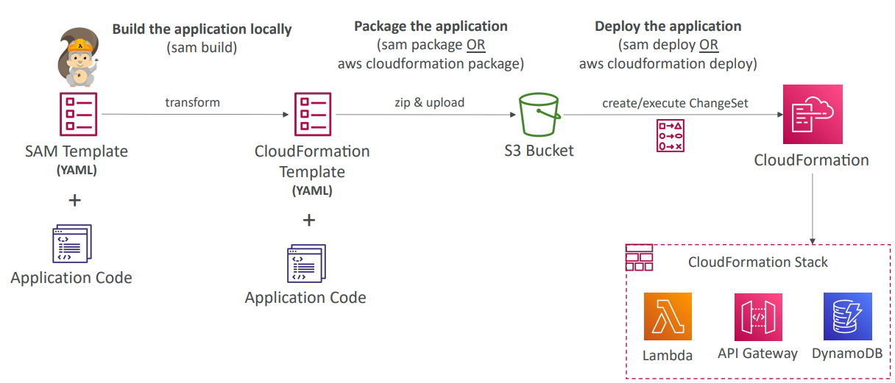
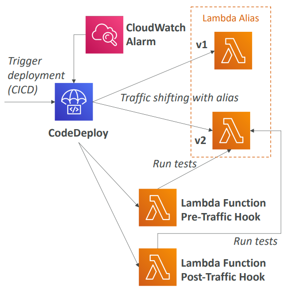
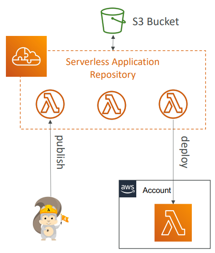

<h2>Serverless Application Model (SAM)</h2>

**Serverless Application Model**
* Framework for developing and deploying serverless applications
* All the configuration is YAML code
* Generate complex CloudFormation from simple SAM YAML file
* Supports anything from CloudFormation: Outputs, Mappings, Parameters, Resources etc.
* Only two commands to deploy to AWS
* SAM can use CodeDeploy to deploy Lambda functions
* SAM can help you to run Lambda, API Gateway, DynamoDB locally
* AWS SAM - Recipe
    * Transform header indicates it's a SAM template
        * `Transform: 'AWS::Serverless-2016-10-31'`
    * Write code
        * `AWS::Serverless::Function`
        * `AWS::Serverless::Api`
        * `AWS::Serverless::SimpleTable`
    * Package and deploy
        * `aws cloudformation package / sam package`
        * `aws cloudformation deploy / sam deploy`
          
* CLI Debugging
    * Locally build, test, and debug your serverless applications that are defined using AWS SAM templates
    * Provides a lambda-like execution environment locally
    * SAM CLI + AWS Toolkits => step-through and debug your code
    * Supported IDEs: AWS Cloud9, Visual Studio Code, JetBrains etc.
    * AWS Toolkits: IDE plugins which allow you to build, test, debug, deploy, and invoke Lambda functions
      built using AWS SAM
* SAM Policy Templates
    * List of templates to apply permissions to your Lambda functions
    * Full list available here: https://docs.aws.amazon.com/serverless-application-model/latest/developerguide/serverless-policy-templates.html#serverless-policy-template-table
    * Important examples:
        * S3ReadPolicy: Gives read only permissions to objects in S3
        * SQSPollerPolicy: Allows to poll an SQS queue
        * DynamoDBCrudPolicy: CRUD = create read update delete
* SAM and CodeDeploy
    * SAM framework natively uses CodeDeploy to update Lambda functions
    * Traffic shifting feature
    * Pre and post traffic hooks features to validate deployment (before the traffic shift starts and
      after it ends)
    * Easy & automated rollback using CloudWatch alarms
    * Ex: we want to switch from v1 to v2. We run some pre-traffic hook tests to check V2, then we do
      traffic shifting according to our strategy. It will monitor a CloudWatch alarm to ensure everything
      goes well. After the traffic shifting is done, we can run a post-traffic hook function on our alias
      and if everything goes well, we can remove v1.
      
* Summary
    * SAM is built on CloudFormation
    * SAM requires the Transform (to indicate that it's a SAM template) and Resources sections
    * Commands to know:
        * `sam build` - fetch dependencies and create local deployment artifacts
        * `sam package` -  package and upload to Amazon S3, generate CF template
        * `sam deploy` - deploy to CloudFormation
    * SAM policy templates for easy IAM policy definition
    * SAM is integrated with CodeDeploy to do deploy to Lambda aliases

Serverless Application Repository (SAR)
* Managed repository for serverless applications
* The applications are packaged using SAM
* Build and publish applications that can be re-used by organizations
    * Can share publicly
    * Can share with specific AWS accounts
* This prevents duplicate work, and just go straight to publishing
* Application settings and behaviour can be customized using environment
  variables
  