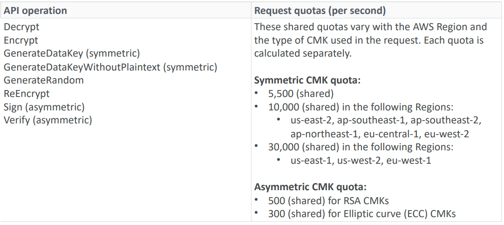
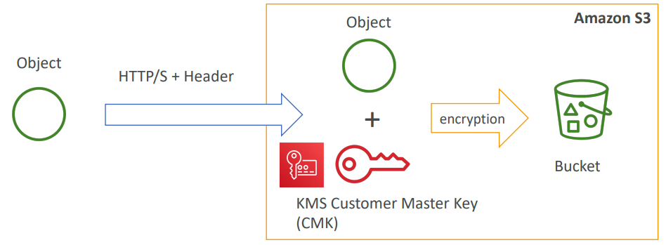
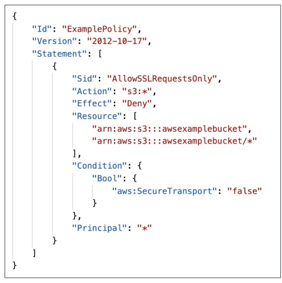
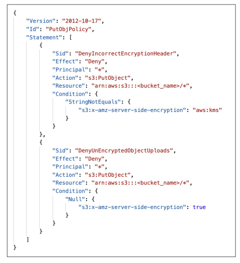
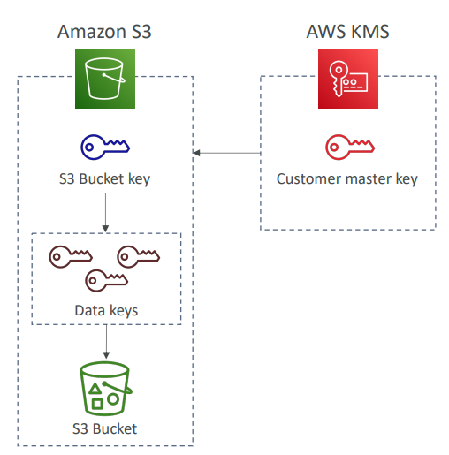
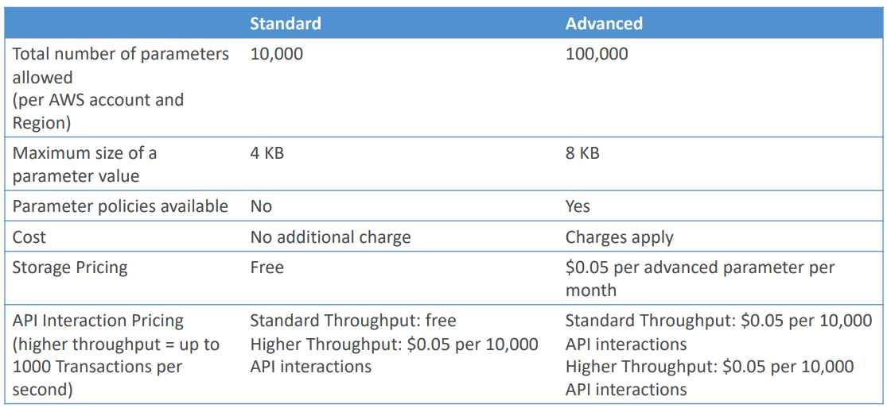
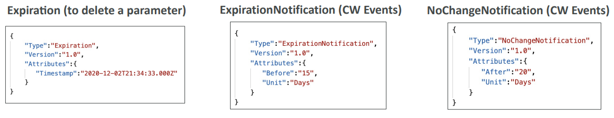
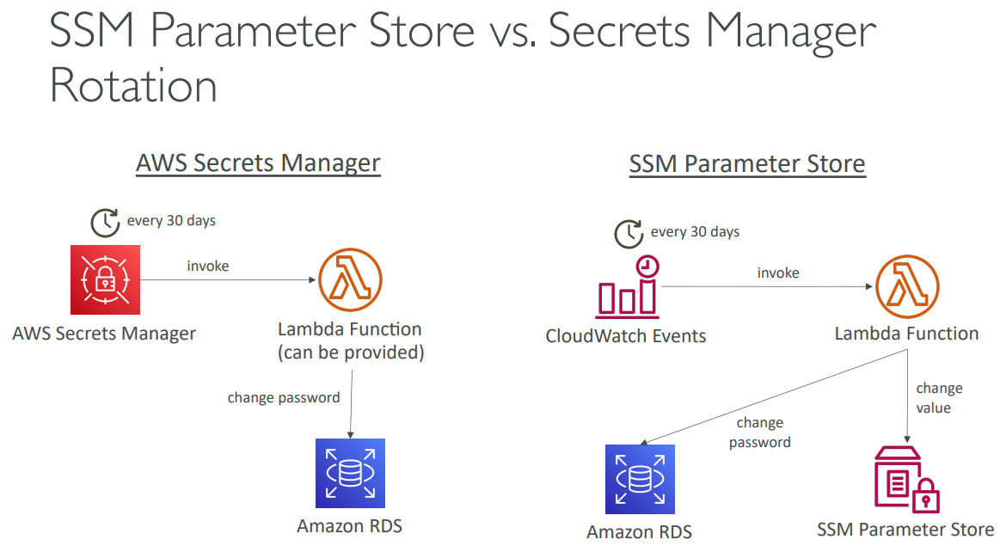

<h2>AWS Security</h2>
* Encryption
    * Encryption in flight (SSL)
        * Data is encrypted before sending and decrypted after receiving
        * SSL certificates help with encryption (HTTPS)
        * Encryption in flight ensures no MITM (man in the middle attack) can happen
    * Server side encryption at rest
        * Data is encrypted after being received by the server
        * Data is decrypted before being sent
        * It is stored in an encrypted form thanks to a key (usually a data key)
        * The encryption/decryption keys must be managed somewhere and the server
          must have access to it
    * Client side encryption
        * Data is encrypted by the client and never decrypted by the server
        * Data will be decrypted by a receiving client
        * The server should not be able to decrypt the data
        * Could leverage Envelope encryption
* AWS KMS (Key Management Service)
    * Anytime you hear "encryption" for an AWS service, it's most likely KMS
    * Easy way to control access to your data, AWS manages keys for us
    * Fully integrated with IAM for authorization
    * Seamlessly integrated into:
        * Amazon EBS: encrypt volumes
        * Amazon S3: Server side encryption of objects
        * Amazon Redshift: Encryption of data
        * Amazon RDS: encryption of data
        * Amazon SSM: Parameter store
        * Etc.
    * But you can also use the CLI/SDK
    * Customer Master Key (CMK) types
        * Symmetric (AES-256 keys)
            * First offering of KMS, single encryption key that is used to Encrypt
              and Decrypt
            * AWS services that are integrated with KMS use symmetric CMKs
            * Necessary for envelope encryption
            * You never get access to the key unencrypted (must call KMS API to use)
        * Asymmetric (RSA & ECC key pairs)
            * Public (encrypt) and private key (decrypt) pair
            * Used for encrypt/decrypt or sign/verify operations
            * The public key is downloadable, but you can't access the private key
              unencrypted
            * Use case: encryption outside of AWS by users who can't call the KMS API
    * AWS KMS (key management service)
        * Able to fully manage the keys & policies:
            * Create
            * Rotation policies
            * Disable
            * Enable
        * Able to audit key usage (using CloudTrail)
        * Three types of Customer Master Keys (CMK)
            * AWS managed service default CMK: free
            * User keys created in KMS: 1 dollar a month
            * User keys imported (must be 256-bit symmetric key): 1 dollar a month
        * Pay for API call to KMS (0.03 dollars per 10000 calls)
    * AWS KMS 101
        * Anytime you need to share sensitive information, use KMS
            * Database passwords
            * Credentials to external service
            * Private key of SSL certificates
        * The value in KMS is that the CMK used to encrypt data can never be retrieved
          by the user, and the CMK can be rotated for extra security
        * Never ever store your secrets in plaintext, especially in your code!
        * Encrypted secrets can be stored in the code/environment variables
        * KMS can only help in encrypting up to 4 KB of data per call
        * If data > 4 KB, use envelope encryption
        * To give access to KMS to someone
            * Make sure the key policy allows the user
            * Make sure the IAM policy allows the API calls
        * KMS keys are bound to a specific region
        * When you want to copy a volume/snapshot anything over to another region, then
          you'd use KMS ReEncrypt and specify a new key for the new region, so it'll get
          re-encrypted
    * KMS Key Policies
        * Control access to KMS keys, "similar" to S3 bucket policies
        * Difference: you cannot control access without them
        * Default KMS key policy:
            * Created if you don't provide a specific KMS key policy
            * Complete access to the key to the root user = entire AWS account
            * Give access to IAM policies to the KMS key
        * Custom KMS key policy:
            * Define users, roles that can access the KMS key
            * Define who can administer the key
            * Useful for cross-account access of your KMS key
        * Snapshots can be copied across accounts
            1. Create a snapshot, encrypted with your own CMK
            2. Attach a KMS key policy to authorize cross-account access
            3. Share the encrypted snapshot
            4. (in target) Create a copy of the Snapshot, encrypt it with a KMS key
               in your account
            5. Create a volume from the snapshot
    * Envelope encryption
        * KMS encrypt API call has a limit of 4 KB
        * If you want to encrypt > 4 KB, we need to use Envelope Encryption
        * The main API that will help us is the GenerateDataKey API
        * Encryption SDK
            * The AWS Encryption SDK implements Envelope Encryption for us
            * The encryption SDK also exists as a CLI tool we can install
            * Implementations for Java, Python, C, Javascript
            * Feature - data key caching:
                * Re-use data keys instead of creating new ones for each encryption
                * Helps with reducing the number of calls to KMS with a security trade-off
                * Use LocalCryptoMaterialsCache (max age, max bytes, max number of messages)
    * KMS Symmetric - API summary
        * Encrypt: encrypt up to 4 KB of data through KMS
        * GenerateDataKey: generates a unique symmetric data key (DEK)
            * returns a plaintext copy of the data key and a copy that is encrypted under
              the CMK that you specify
        * GenerateDataKeyWithoutPlaintext:
            * Generate a DEK to use at some point (not immediately)
            * DEK that is encrypted under the CMK that you specify (must use decrypt later)
        * Decrypt - decrypt up to 4 KB of data (including data encryption keys)
        * GenerateRandom - returns a random byte string
    * KMS Request Quotas
        * When you exceed a request quota, you get a ThrottlingException. To respond, use
          exponential backoff (backoff and retry)
        * For cryptographic operations, they share a quota. This includes requests made by
          AWS on your behalf (ex. SSE-KMS)
        * For GenerateDataKey, consider using DEK caching from the Encryption SDK
        * You can request a Request Quotas increase through API or AWS support
        * All the following share quotas.
          
    * S3 Encryption for Objects
        * There are 4 methods of encrypting objects in S3
            * SSE-S3: encrypts S3 objects using keys handled & managed by AWS
            * SSE-KMS: leverage AWS key management service to manage encryption keys
            * SSE-C: when you want to manage your own encryption keys
            * Client side encryption
        * SSE-KMS
            * SSE-KMS: encryption using keys handled & managed by KMS
            * KMS advantages: user control + audit trail
            * Object is encrypted server side
            * Must set header: “x-amz-server-side-encryption": ”aws:kms"
              
            * SSE-KMS leverages the GenerateDataKey & Decrypt KMS API calls
            * These KMS API calls will show up in CloudTrail, helpful for logging
            * To perform SSE-KMS, you need:
                * A KMS key policy that authorizes the user/role
                * An IAM policy that authorizes access to KMS
                * Otherwise you will get an access denied error
            * S3 calls to KMS for SSE-KMS count against your KMS limits
                * If throttling, try exponential backoff
                * If throttling, you can request an increase in KMS limits
                * The service throttling is KMS, not Amazon S3
            * S3 bucket policies - force SSL
                * To force SSl, create an S3 bucket policy with a DENY on the condition
                  aws:SecureTransport=false
                * Note: Using allow on aws:SecureTransport=true would allow anonymous
                  GetObject if using SSL
                * https://aws.amazon.com/premiumsupport/knowledge-center/s3-bucket-policy-for-config-rule/
                  
            * S3 bucket policy - force encryption of SSE-KMS
                1. Deny incorrect encryption header: make sure it includes aws:kms (===SSE-KMS)
                2. Deny no encryption header to ensure objects are not uploaded un-encrypted
                * Note: could swap 2 for S3 default encryption of SSE-KMS
                  
            * S3 bucket key for SSE-KMS encryption
                * New setting to decrease:
                    * Number of API calls made to KMS from S3 by 99%
                    * Costs of overall KMS encryption with Amazon S3 by 99%
                * This leverages data keys
                    * A "S3 bucket key" is generated
                    * That key is used to encrypt KMS objects with new data keys
                * You will see less KMS CloudTrail events in CloudTrail
                  
    * SSM parameter store
        * Secure storage for configuration and secrets
        * Optional seamless encryption using KMS
        * Serverless, scalable, durable, easy SDK
        * Version tracking of configurations/secrets
        * Configuration management using path & IAM
        * Notifications with CloudWatch events
        * Integration with CloudFormation
        * Storing them happens in a hierarchy like how folders are. Can reference
          them by path. Can also reference common AWS parameters by path
        * There's a standard and advanced tier
          
        * Parameter policies (for advanced parameters)
            * Allow to assign a TTL to a parameter (expiration date) to force updating
              or deleting sensitive data such as passwords
            * Can assign multiple policies at a time
              
    * AWS Secrets Manager
        * Newer service, meant for storing secrets
        * Capability to force rotation of secrets every X days
        * Automate generation of secrets on rotation (uses Lambda)
        * Integration with Amazon RDS (MySQL, PostgreSQL, Aurora)
        * Secrets are encrypted using KMS
        * Mostly meant for RDS integration
    * SSM parameter store vs secrets manager
        * Secrets Manager ($$$ more expensive):
            * Automatic rotation of secrets with AWS Lambda
            * Lambda function is provided for RDS, Redshift, DocumentDB
            * KMS encryption is mandatory
            * Can integrate with CloudFormation
        * SSM parameter store ($):
            * Simple API
            * No secret rotation (can enable rotation using Lambda triggered by CW events)
            * KMS encryption is optional
            * Can integrate with CloudFormation
            * Can pull a Secrets Manager secret using the SSM parameter store API
              
    * CloudWatch Logs - encryption
        * You can encrypt CloudWatch logs with KMS keys
        * Encryption is enabled at the log group level, by associating a CMK with a
          log group, either when you create the log group or after it exists
        * You cannot associate a CMK with a log group using the CloudWatch console
        * You must use the CloudWatch Logs API:
            * associate-kms-key: if the log group already exists
            * create-log-group: if the log group doesn't exist yet
    * CodeBuild security
        * To access resources in your VPC, make sure you specify a VPC configuration for
          your CodeBuild
        * Secrets in CodeBuild:
            * Don't store them as plaintext in environment variables
            * Instead
                * Environment variables can reference parameter store parameters
                * Environment variables can reference secrets manager secrets