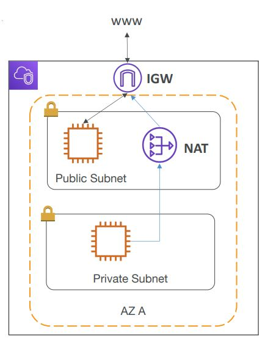
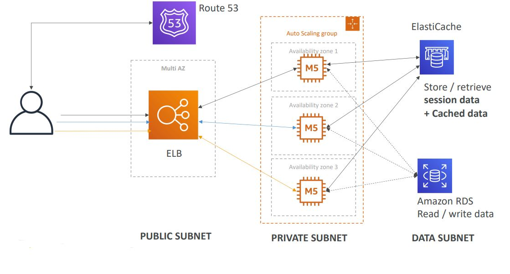

<h2>VPC</h2>
**VPC & Subnets**
* VPC - private network that deploy your resources (regional resource)
* Subnets allow you to partition your network inside your VPC (availability
  zone resource)
* A public subnet is a subnet that is accessible from the internet
* A private subnet is a subnet that is not accessible from the internet
* To define access to the internet and between subnets, we use route tables
* Internet gateways help our VPC instances connect with the internet
* Public subnets have a route to the internet gateway
* NAT gateways (AWS-managed) & NAT instances (self-managed) allow your
  instances in your private subnets to access the internet while remaining
  private.
  
* Network ACL (NACL)
    * A firewall which controls traffic from and to subnet
    * Can have ALLOW and DENY rules
    * Are attached at the subnet level
    * Rules only include IP addresses
    * It is the first mechanism of defense
* Security groups
    * A firewall that controls traffic to and from an ENI/an EC2 instance
    * Can have only ALLOW rules
    * Rules include IP addresses and other security groups
    * It is the second mechanism of defense
* Any time you have traffic going through your VPC, it'll be logged in a flow
  log
    * Captures VPC flow logs, subnet flow logs, elastic network interface flow
      logs
    * Helps monitor & troubleshoot connectivity issues
    * VPC flow logs data can go to S3/CloudWatch logs
* VPC peering allows you to connect two VPCs together, privately, using AWS'
  network. It makes them behave as if they were in the same network.
    * Must not have overlapping CIDR (IP address range)
    * VPC peering connection is not transitive (must be established for each
      VPC that need to communicate with one another. If A and B are connected
      and A gets connected to C, then B doesn't automatically get the ability
      to communicate with C.)
* VPC endpoints allow you to connect to AWS services using a private network
  instead of the public network
* Site to site VPN to connect an on-premises VPN to AWS. The connection is
  automatically encrypted and goes over the public internet.
* Direct Connect (DX) to establish a physical connection between on-premises
  and AWS. The connection is private, secure, and fast. It goes over a private
  network. Takes at least a month to establish.
* Site-to-site VPN and DX cannot access VPC endpoints
* Typical 3-tier solution architecture
  